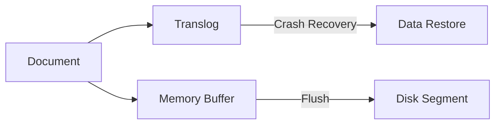


Before reading this document, understand these concepts first:
- [Core Components]() - Shard, Segment concepts
- [Data Modeling]() - Mapping, Analyzer basics


Learn Bulk indexing, Refresh, and Index Lifecycle Management for efficiently storing large volumes of data.

Elasticsearch indexing goes beyond simply storing data. When a document is indexed, it goes through a complex process including text analysis, inverted index creation, and segment management. Understanding this process reveals **why Bulk indexing is 10x faster than single-document indexing**, **why documents aren't immediately searchable after indexing**, and **why Refresh should be disabled during bulk indexing**. The right indexing strategy directly impacts system performance and operational costs.

## Indexing Basics

### Indexing Process


| Stage | Description |
|-------|-------------|
| Analyze | Split text into tokens |
| Memory Buffer | Temporary storage in memory |
| Refresh | Make searchable (default 1 second) |
| Segment | Immutable index piece |
| Flush | Permanent storage to disk |

---

## Single vs Bulk Indexing

### Single Document Indexing

```json
PUT /products/_doc/1
{
  "name": "MacBook Pro",
  "price": 2390000
}
```

### Bulk Indexing

Process multiple documents at once:

```json
POST /_bulk
{"index": {"_index": "products", "_id": "1"}}
{"name": "MacBook Pro", "price": 2390000}
{"index": {"_index": "products", "_id": "2"}}
{"name": "MacBook Air", "price": 1390000}
{"index": {"_index": "products", "_id": "3"}}
{"name": "iPad", "price": 1499000}
```

> **NDJSON format**: Each line separated by newline (`\n`), including the last line

### Performance Comparison

| Method | Time for 10K docs | Network Requests |
|--------|-------------------|------------------|
| Single | ~30 seconds | 10,000 |
| Bulk (1000 per batch) | ~3 seconds | 10 |

### Recommended Bulk Settings

```json
POST /_bulk
// Recommended size: 5-15MB per request
// Recommended doc count: 1,000-5,000
```

### Bulk Indexing in Spring

```java
@Service
public class ProductBulkService {

    private final ElasticsearchOperations operations;

    public void bulkIndex(List<Product> products) {
        List<IndexQuery> queries = products.stream()
            .map(product -> new IndexQueryBuilder()
                .withId(product.getId())
                .withObject(product)
                .build())
            .toList();

        operations.bulkIndex(queries, Product.class);
    }
}
```

---

## Refresh

### What is Refresh?

Operation that makes Memory Buffer data **searchable**.


### Refresh Interval

```json
PUT /products/_settings
{
  "index": {
    "refresh_interval": "30s"    // Default: 1s
  }
}
```

| Setting | Meaning | Use Case |
|---------|---------|----------|
| `1s` | Every 1 second (default) | Real-time search |
| `30s` | Every 30 seconds | Typical service |
| `-1` | Disabled | During bulk indexing |

### Optimization for Bulk Indexing

```json
// 1. Disable Refresh
PUT /products/_settings
{ "refresh_interval": "-1" }

// 2. Perform Bulk indexing
POST /_bulk
...

// 3. Manual Refresh
POST /products/_refresh

// 4. Restore Refresh
PUT /products/_settings
{ "refresh_interval": "1s" }
```

---

## Flush and Translog

### Translog

Write-Ahead Log to prevent data loss. Plays an important role in Lucene internals.
→ [Lucene Internals Details]()



### Flush

Persist Memory Buffer + Translog → Disk Segment:

```json
POST /products/_flush
```

> **Note:** Manual Flush is usually unnecessary. Elasticsearch manages it automatically.

### Flush Settings

```json
PUT /products/_settings
{
  "index": {
    "translog": {
      "durability": "async",        // async: performance, request: stability
      "sync_interval": "5s",
      "flush_threshold_size": "512mb"
    }
  }
}
```

---

## Index Template

Settings automatically applied when creating new indices:

```json
PUT /_index_template/products_template
{
  "index_patterns": ["products-*"],
  "priority": 1,
  "template": {
    "settings": {
      "number_of_shards": 3,
      "number_of_replicas": 1,
      "refresh_interval": "5s"
    },
    "mappings": {
      "properties": {
        "name": { "type": "text" },
        "price": { "type": "integer" },
        "created_at": { "type": "date" }
      }
    }
  }
}
```

Now automatically applied when creating `products-2024`, `products-2025`, etc.

---

## Index Lifecycle Management (ILM)

Automatically manage the lifecycle of time-series data. Especially useful for managing log data.
→ [ILM Practical Example]()

### Lifecycle Phases


### Creating ILM Policy

```json
PUT /_ilm/policy/logs_policy
{
  "policy": {
    "phases": {
      "hot": {
        "min_age": "0ms",
        "actions": {
          "rollover": {
            "max_size": "50gb",
            "max_age": "7d"
          },
          "set_priority": { "priority": 100 }
        }
      },
      "warm": {
        "min_age": "7d",
        "actions": {
          "shrink": { "number_of_shards": 1 },
          "forcemerge": { "max_num_segments": 1 },
          "set_priority": { "priority": 50 }
        }
      },
      "cold": {
        "min_age": "30d",
        "actions": {
          "set_priority": { "priority": 0 }
        }
      },
      "delete": {
        "min_age": "90d",
        "actions": {
          "delete": {}
        }
      }
    }
  }
}
```

### Applying ILM Policy

```json
PUT /_index_template/logs_template
{
  "index_patterns": ["logs-*"],
  "template": {
    "settings": {
      "index.lifecycle.name": "logs_policy",
      "index.lifecycle.rollover_alias": "logs"
    }
  }
}
```

---

## Reindex

Copy/transform existing index to new index:

### Basic Reindex

```json
POST /_reindex
{
  "source": { "index": "products-old" },
  "dest": { "index": "products-new" }
}
```

### Filtered Reindex

```json
POST /_reindex
{
  "source": {
    "index": "products-old",
    "query": {
      "term": { "in_stock": true }
    }
  },
  "dest": { "index": "products-active" }
}
```

### Field Transformation

```json
POST /_reindex
{
  "source": { "index": "products-old" },
  "dest": { "index": "products-new" },
  "script": {
    "source": "ctx._source.price_krw = ctx._source.price * 1000"
  }
}
```

### Async Reindex

```json
POST /_reindex?wait_for_completion=false
{
  "source": { "index": "large-index" },
  "dest": { "index": "large-index-new" }
}
```

Check progress:
```json
GET /_tasks?actions=*reindex&detailed
```

---

## Alias

Give indices alternative names for flexible management:

### Create Alias

```json
POST /_aliases
{
  "actions": [
    { "add": { "index": "products-v1", "alias": "products" } }
  ]
}
```

### Zero Downtime Reindexing

```json
// 1. Create new index and copy data
PUT /products-v2
POST /_reindex
{
  "source": { "index": "products-v1" },
  "dest": { "index": "products-v2" }
}

// 2. Switch Alias (atomic)
POST /_aliases
{
  "actions": [
    { "remove": { "index": "products-v1", "alias": "products" } },
    { "add": { "index": "products-v2", "alias": "products" } }
  ]
}
```

Application uses only `products` alias → Zero-downtime switch

---

## Indexing Performance Optimization

### Bulk Indexing Checklist

```json
// 1. Disable Replicas
PUT /products/_settings
{ "number_of_replicas": 0 }

// 2. Disable Refresh
PUT /products/_settings
{ "refresh_interval": "-1" }

// 3. Perform Bulk indexing
POST /_bulk
...

// 4. Refresh
POST /products/_refresh

// 5. Restore settings
PUT /products/_settings
{
  "number_of_replicas": 1,
  "refresh_interval": "1s"
}
```

### Optimal Bulk Size

| Item | Recommended |
|------|-------------|
| Request size | 5-15 MB |
| Document count | 1,000-5,000 |
| Concurrent requests | 2-3 (per node) |

### Indexing Threads

```json
PUT /products/_settings
{
  "index": {
    "indexing": {
      "slowlog": {
        "threshold": {
          "index": {
            "warn": "10s",
            "info": "5s"
          }
        }
      }
    }
  }
}
```

---

## Next Steps

| Goal | Recommended Document |
|------|---------------------|
| Cluster configuration | [Cluster Management]() |
| Search optimization | [Performance Tuning]() |
| Failure response | [High Availability]() |
