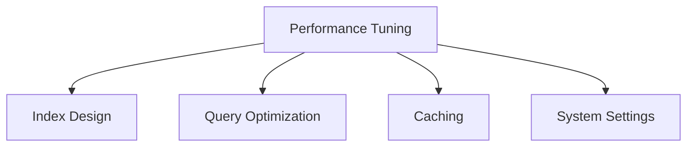

Learn how to optimize Elasticsearch search and indexing performance.

While Elasticsearch provides fast search with default settings, production environments require tuning based on data scale and usage patterns. Default values are "generally acceptable," not "optimal for all situations."

Performance tuning can be divided into four areas: **Index Design**, **Query Optimization**, **Caching**, and **System Settings**. Each area affects the others. For example, poor shard design cannot be solved by query optimization, and caching strategy depends on query patterns. Therefore, it's effective to **first identify where bottlenecks occur**, then focus on improving that specific area. This document covers key tuning points and practical considerations for each area.

## Performance Optimization Areas



---

## Index Design Optimization

### Appropriate Shard Count

| Data Size | Recommended Primary Shards |
|-----------|---------------------------|
| < 10GB | 1 |
| 10-50GB | 2-3 |
| 50-200GB | 3-5 |
| > 200GB | 1-2 per node |

**Rule of Thumb:** 20-40GB per shard

```json
PUT /products
{
  "settings": {
    "number_of_shards": 3,
    "number_of_replicas": 1
  }
}
```

### Exclude Unnecessary Fields

```json
{
  "mappings": {
    "properties": {
      "raw_data": {
        "type": "object",
        "enabled": false    // Not indexed, stored only
      },
      "internal_id": {
        "type": "keyword",
        "index": false      // Not searchable
      },
      "description": {
        "type": "text",
        "norms": false      // Disable length normalization (not used in scoring)
      }
    }
  }
}
```

### Appropriate Field Types

```json
{
  "properties": {
    // For searching: text
    "title": { "type": "text" },

    // For filtering/sorting: keyword
    "status": { "type": "keyword" },

    // Numeric IDs: keyword (if no range queries)
    "user_id": { "type": "keyword" },

    // Range queries needed: numeric
    "price": { "type": "integer" }
  }
}
```

---

## Query Optimization

### Use Filter Context

Use `filter` for conditions that don't need score calculation:

```json
// ❌ Inefficient - all conditions calculate score
{
  "query": {
    "bool": {
      "must": [
        { "match": { "name": "MacBook" } },
        { "term": { "category": "laptop" } },
        { "range": { "price": { "gte": 1000000 } } }
      ]
    }
  }
}

// ✅ Efficient - filter is cached
{
  "query": {
    "bool": {
      "must": [
        { "match": { "name": "MacBook" } }
      ],
      "filter": [
        { "term": { "category": "laptop" } },
        { "range": { "price": { "gte": 1000000 } } }
      ]
    }
  }
}
```

### Return Only Needed Fields

```json
{
  "_source": ["name", "price"],  // Only needed fields
  "query": { ... }
}

// Or
{
  "_source": false,              // Disable _source
  "stored_fields": ["name"],     // Only stored fields
  "query": { ... }
}
```

### Pagination Optimization

```json
// ❌ Deep pagination
{ "from": 10000, "size": 10 }  // Skip 10,000 documents

// ✅ Use search_after
{
  "size": 10,
  "sort": [
    { "created_at": "desc" },
    { "_id": "asc" }
  ],
  "search_after": ["2024-01-15T10:00:00", "abc123"]
}
```

### Avoid Wildcard Queries

```json
// ❌ Very slow
{ "wildcard": { "name": "*book*" } }

// ✅ Use N-gram or Edge N-gram
PUT /products
{
  "settings": {
    "analysis": {
      "analyzer": {
        "ngram_analyzer": {
          "tokenizer": "ngram_tokenizer"
        }
      },
      "tokenizer": {
        "ngram_tokenizer": {
          "type": "ngram",
          "min_gram": 2,
          "max_gram": 3
        }
      }
    }
  }
}
```

### Aggregation Optimization

```json
// size: 0 to skip search results
{
  "size": 0,
  "aggs": {
    "categories": {
      "terms": {
        "field": "category",
        "size": 10,
        "shard_size": 25  // Accuracy vs performance
      }
    }
  }
}
```

---

## Caching

### Cache Types

| Cache | Target | Invalidation |
|-------|--------|--------------|
| **Node Query Cache** | Filter results | On Refresh |
| **Shard Request Cache** | Aggregation results | On data change |
| **Field Data Cache** | Text field sorting/aggregation | On memory pressure |

### Filter Cache Usage

```json
// Automatically cached
{
  "query": {
    "bool": {
      "filter": [
        { "term": { "status": "active" } }
      ]
    }
  }
}
```

### Force Request Cache

```json
GET /products/_search?request_cache=true
{
  "size": 0,
  "aggs": { ... }
}
```

### Check Cache Status

```json
GET /_nodes/stats/indices/query_cache,request_cache
```

### Clear Cache

```json
POST /products/_cache/clear
```

---

## JVM Settings

### Heap Memory

```bash
# jvm.options
-Xms8g
-Xmx8g
```

**Recommendations:**
- 50% of total memory (max 30-31GB)
- Set min/max to same value
- Leave remaining memory for filesystem cache

### GC Settings

```bash
# Elasticsearch 8.x default G1GC
-XX:+UseG1GC
-XX:G1HeapRegionSize=16m
-XX:InitiatingHeapOccupancyPercent=75
```

### Heap Usage Monitoring

```json
GET /_nodes/stats/jvm
```

**Warning Signs:**
- Heap usage > 75% sustained
- Frequent Old GC
- GC time > 500ms

---

## System Settings

### Linux Kernel

```bash
# /etc/sysctl.conf
vm.max_map_count=262144
vm.swappiness=1

# Apply
sudo sysctl -p
```

### File Descriptors

```bash
# /etc/security/limits.conf
elasticsearch  -  nofile  65535
elasticsearch  -  nproc   4096
```

### Disk I/O

- **SSD required** (production)
- RAID 0 or RAID 10 recommended
- Keep disk usage < 80%

---

## Slow Query Analysis

### Slow Log Configuration

```json
PUT /products/_settings
{
  "index.search.slowlog.threshold.query.warn": "10s",
  "index.search.slowlog.threshold.query.info": "5s",
  "index.search.slowlog.threshold.query.debug": "2s",
  "index.search.slowlog.threshold.fetch.warn": "1s",

  "index.indexing.slowlog.threshold.index.warn": "10s",
  "index.indexing.slowlog.threshold.index.info": "5s"
}
```

### Profile API

Query execution analysis:

```json
GET /products/_search
{
  "profile": true,
  "query": {
    "match": { "name": "MacBook" }
  }
}
```

Check in response:
- `time_in_nanos`: Time spent in each phase
- `breakdown`: Detailed time analysis

### Explain API

Score calculation analysis:

```json
GET /products/_explain/1
{
  "query": {
    "match": { "name": "MacBook" }
  }
}
```

---

## Indexing Performance

For detailed indexing performance optimization, see the Indexing Strategy document.
→ [Indexing Strategy Details]()

### Adjust Refresh Interval

```json
// During bulk indexing
PUT /products/_settings
{ "refresh_interval": "-1" }

// After indexing complete
PUT /products/_settings
{ "refresh_interval": "1s" }
```

### Bulk Indexing Optimization

```json
// Recommended size: 5-15MB per request
POST /_bulk
{"index": {"_index": "products"}}
{"name": "Product 1"}
{"index": {"_index": "products"}}
{"name": "Product 2"}
...
```

### Translog Settings

```json
PUT /products/_settings
{
  "index.translog.durability": "async",
  "index.translog.sync_interval": "30s"
}
```

---

## Performance Checklist

### Search Performance

- [ ] Use Filter Context
- [ ] Return only needed fields
- [ ] Proper pagination
- [ ] Avoid leading `*` in wildcard
- [ ] Utilize caching

### Indexing Performance

- [ ] Use Bulk API
- [ ] Appropriate Refresh Interval
- [ ] Disable Replicas during bulk operations
- [ ] Appropriate shard count

### System

- [ ] Use SSD
- [ ] JVM Heap properly configured
- [ ] Sufficient File Descriptors
- [ ] vm.max_map_count configured

---

## Performance Targets

| Metric | Target |
|--------|--------|
| Search Response Time | < 100ms (p99) |
| Indexing Throughput | > 10,000 docs/sec |
| JVM Heap Usage | < 75% |
| Disk Usage | < 80% |

---

## Next Steps

| Goal | Recommended Document |
|------|---------------------|
| Failure response | [High Availability]() |
| Cluster configuration | [Cluster Management]() |
| Practical implementation | [Product Search System]() |
