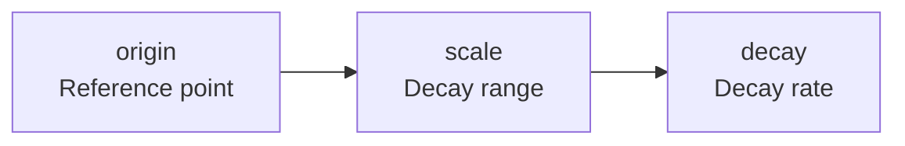


Before reading this document, understand these concepts first:
- [Query DSL]() - match, bool query basics
- [Data Modeling]() - Analyzer operation principles


Learn relevance tuning methods including Score, BM25, and Boosting to improve search result quality.

The core value of a search engine is enabling users to find what they want **on the first page**. No matter how quickly results are returned, if what users want is on page 10, it's meaningless. Search Relevance is the key concept for solving this problem.

Elasticsearch uses the BM25 algorithm by default to assign a relevance score to each document. However, default scores alone often cannot meet business requirements. Requirements like "prioritize promotional products," "give bonus points to recent products," or "deprioritize out-of-stock items" are implemented through Boosting and Function Score. This document covers various tuning techniques to improve search quality.

## What is Score?

**Score** is a number indicating how relevant a document is to the search query.
Higher scores appear higher in search results.

```json
GET /products/_search
{
  "query": {
    "match": { "name": "MacBook Pro" }
  }
}
```

Response:
```json
{
  "hits": {
    "hits": [
      {
        "_score": 2.876,          // Relevance score
        "_source": { "name": "MacBook Pro 14-inch" }
      },
      {
        "_score": 1.234,
        "_source": { "name": "MacBook Air" }
      }
    ]
  }
}
```

---

## BM25 Algorithm

Elasticsearch uses **BM25** (Best Matching 25) as its default scoring algorithm.

### BM25 Core Elements

```
Score = IDF × TF × fieldLength
```

| Element | Meaning | Example |
|---------|---------|---------|
| **TF** (Term Frequency) | Term frequency in document | "MacBook" appears 3 times → score increases |
| **IDF** (Inverse Document Frequency) | Rarity across all documents | Rare words → score increases |
| **Field Length** | Field length | Match in shorter field → score increases |

### TF (Term Frequency)

More occurrences of the search term = higher relevance:

- "MacBook" appears 1 time → score 1.0
- "MacBook" appears 3 times → score ~1.7 (logarithmic scale)

### IDF (Inverse Document Frequency)

Rarer words are considered more important:

- "the" (appears in 1M documents) → low IDF
- "MacBook" (appears in 10K documents) → high IDF

### Field Length Normalization

Matches in shorter fields are considered more relevant:

- "MacBook Pro" (2-word field) → high score
- "Apple's latest MacBook Pro model released..." (10-word field) → lower score

---

## Score Analysis

### Explain API

See how the score was calculated:

```json
GET /products/_search
{
  "explain": true,
  "query": {
    "match": { "name": "MacBook" }
  }
}
```

Response (simplified):
```json
{
  "_explanation": {
    "value": 1.234,
    "description": "weight(name:MacBook)",
    "details": [
      {
        "value": 0.876,
        "description": "idf, computed as..."
      },
      {
        "value": 1.41,
        "description": "tf, computed as freq=1.0..."
      }
    ]
  }
}
```

### Profile API

Analyze query execution performance:

```json
GET /products/_search
{
  "profile": true,
  "query": {
    "match": { "name": "MacBook" }
  }
}
```

---

## Boosting

Adjust scores by adding weights to specific conditions.

### Field Boosting

Add weight to important fields:

```json
GET /products/_search
{
  "query": {
    "multi_match": {
      "query": "MacBook Pro",
      "fields": [
        "name^3",           // name field 3x weight
        "description"       // description field 1x (default)
      ]
    }
  }
}
```

### Boosting in Bool Query

```json
GET /products/_search
{
  "query": {
    "bool": {
      "must": [
        { "match": { "name": "MacBook" } }
      ],
      "should": [
        {
          "term": {
            "is_promotion": {
              "value": true,
              "boost": 2.0        // Promotion items 2x score
            }
          }
        },
        {
          "range": {
            "rating": {
              "gte": 4.5,
              "boost": 1.5        // High-rated items 1.5x score
            }
          }
        }
      ]
    }
  }
}
```

### Negative Boosting

Lower scores for certain conditions:

```json
GET /products/_search
{
  "query": {
    "boosting": {
      "positive": {
        "match": { "name": "MacBook" }
      },
      "negative": {
        "term": { "condition": "refurbished" }
      },
      "negative_boost": 0.5    // Reduce score to 50%
    }
  }
}
```

---

## Function Score Query

Implement complex scoring logic.

### Basic Structure

```json
GET /products/_search
{
  "query": {
    "function_score": {
      "query": { "match": { "name": "laptop" } },
      "functions": [
        // Score adjustment functions
      ],
      "score_mode": "sum",      // How to combine function results
      "boost_mode": "multiply"  // How to combine with original score
    }
  }
}
```

### score_mode Options

| Value | Description |
|-------|-------------|
| `multiply` | Multiply function results |
| `sum` | Sum function results |
| `avg` | Average of function results |
| `max` | Maximum of function results |
| `min` | Minimum of function results |
| `first` | Use only first function result |

### boost_mode Options

| Value | Description |
|-------|-------------|
| `multiply` | Original score × function result |
| `replace` | Replace with function result |
| `sum` | Original score + function result |
| `avg` | Average |
| `max` | Maximum of both |
| `min` | Minimum of both |

### Practical Example: Product Search Ranking

```json
GET /products/_search
{
  "query": {
    "function_score": {
      "query": {
        "bool": {
          "must": [
            { "match": { "name": "laptop" } }
          ],
          "filter": [
            { "term": { "in_stock": true } }
          ]
        }
      },
      "functions": [
        {
          // Boost popular products
          "filter": { "range": { "sales_count": { "gte": 100 } } },
          "weight": 2
        },
        {
          // Boost recent products (decay by date)
          "gauss": {
            "created_at": {
              "origin": "now",
              "scale": "30d",
              "decay": 0.5
            }
          }
        },
        {
          // Factor in rating
          "field_value_factor": {
            "field": "rating",
            "factor": 1.2,
            "modifier": "sqrt",
            "missing": 3
          }
        },
        {
          // Add randomness (diversity)
          "random_score": {
            "seed": 12345,
            "field": "_seq_no"
          },
          "weight": 0.1
        }
      ],
      "score_mode": "sum",
      "boost_mode": "multiply"
    }
  }
}
```

### Decay Functions

Decrease scores based on distance or time.



| Function | Decay Shape |
|----------|-------------|
| `linear` | Linear decay |
| `exp` | Exponential decay |
| `gauss` | Gaussian curve |

```json
{
  "gauss": {
    "location": {
      "origin": { "lat": 37.5, "lon": 127.0 },
      "scale": "5km",
      "decay": 0.5
    }
  }
}
```

→ Score decays to 50% at 5km from origin

---

## Search Quality Improvement Techniques

### 1. Synonym Handling

Configure custom Analyzer for synonym handling.
→ [Analyzer basics]()

```json
PUT /products
{
  "settings": {
    "analysis": {
      "filter": {
        "synonym_filter": {
          "type": "synonym",
          "synonyms": [
            "laptop, notebook, portable computer",
            "phone, smartphone, mobile"
          ]
        }
      },
      "analyzer": {
        "synonym_analyzer": {
          "tokenizer": "standard",
          "filter": ["lowercase", "synonym_filter"]
        }
      }
    }
  }
}
```

### 2. Autocomplete (Prefix Matching)

```json
GET /products/_search
{
  "query": {
    "match_phrase_prefix": {
      "name": {
        "query": "MacBook P",
        "max_expansions": 10
      }
    }
  }
}
```

### 3. Typo Correction (Fuzzy)

```json
GET /products/_search
{
  "query": {
    "match": {
      "name": {
        "query": "Macbok",
        "fuzziness": "AUTO"
      }
    }
  }
}
```

### 4. Highlighting

```json
GET /products/_search
{
  "query": {
    "match": { "description": "M3 chip" }
  },
  "highlight": {
    "fields": {
      "description": {
        "pre_tags": ["<strong>"],
        "post_tags": ["</strong>"],
        "fragment_size": 150
      }
    }
  }
}
```

---

## Practical Tips

### 1. Use filter Actively

Conditions that don't need Score go in `filter`:

```json
{
  "bool": {
    "must": [
      { "match": { "name": "MacBook" } }      // Needs score
    ],
    "filter": [
      { "term": { "category": "Laptop" } },   // No score needed
      { "term": { "in_stock": true } }
    ]
  }
}
```

### 2. A/B Test Field Weights

Find optimal weights through testing:

```json
// Experiment A
"fields": ["name^3", "description^1"]

// Experiment B
"fields": ["name^2", "description^2"]
```

### 3. Score Normalization

Use `max_boost` in function_score:

```json
{
  "function_score": {
    "max_boost": 10,    // Limit maximum boost
    "functions": [...]
  }
}
```

### 4. Search Quality Metrics

- **Precision**: Ratio of relevant results among returned results
- **Recall**: Ratio of returned results among all relevant documents
- **NDCG**: Quality score considering ranking

---

## Summary

| Technique | Use Case | Example |
|-----------|----------|---------|
| Field Boost | Emphasize important fields | `name^3` |
| Bool should | Optional boosting | Prioritize promotion items |
| Negative Boost | Lower scores | Deprioritize refurbished items |
| Function Score | Complex logic | Popularity, freshness factors |
| Decay | Distance/time based | Recency, proximity |

---

## Next Steps

| Goal | Recommended Document |
|------|---------------------|
| Data analysis | [Aggregations](aggregations/) |
| Practical implementation | [Product Search System](../examples/product-search/) |
| Performance optimization | [Performance Tuning](performance-tuning/) |
