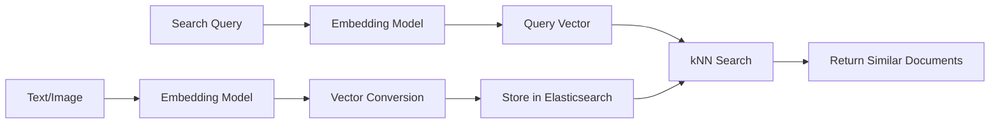

Learn how to implement semantic search and similar image search using Elasticsearch's vector search (kNN).

{}
- **Elasticsearch 8.0+** required (native kNN support)
- Versions before 8.x require script_score or plugins
{}

## What is Vector Search?

Traditional search is **keyword matching**. Searching "puppy" only finds documents containing "puppy".

**Vector Search** is **semantic-based** search:
- Search "puppy" → Also finds "dog", "pet", "canine"
- Image search → Find similar images
- Recommendation systems → Recommend similar products

### How It Works



1. **Embedding**: Convert text/image to high-dimensional vector
2. **Storage**: Store vector in Elasticsearch dense_vector field
3. **Search**: Find closest documents to query vector using kNN algorithm

---

## Index Configuration

### dense_vector Field Definition

```json
PUT /products-vector
{
  "mappings": {
    "properties": {
      "name": {
        "type": "text"
      },
      "description": {
        "type": "text"
      },
      "description_vector": {
        "type": "dense_vector",
        "dims": 384,
        "index": true,
        "similarity": "cosine"
      }
    }
  }
}
```

### Key Settings

| Option | Description | Recommended |
|--------|-------------|-------------|
| `dims` | Vector dimensions | Depends on model (384, 768, 1536, etc.) |
| `index` | Create kNN index | `true` (for search) |
| `similarity` | Similarity calculation method | `cosine` (normalized vectors), `dot_product`, `l2_norm` |

### similarity Options

| Method | Description | When to Use |
|--------|-------------|-------------|
| `cosine` | Cosine similarity | Most text embeddings (default) |
| `dot_product` | Inner product | Already normalized vectors (faster) |
| `l2_norm` | Euclidean distance | Distance-based similarity |

---

## Document Indexing

### Embedding Generation (Python Example)

```python
from sentence_transformers import SentenceTransformer

model = SentenceTransformer('sentence-transformers/all-MiniLM-L6-v2')

text = "MacBook Pro 14-inch with Apple M3 Pro chip"
vector = model.encode(text).tolist()  # 384-dimension vector
```

### Store in Elasticsearch

```json
PUT /products-vector/_doc/1
{
  "name": "MacBook Pro 14-inch",
  "description": "Premium laptop with Apple M3 Pro chip",
  "description_vector": [0.12, -0.34, 0.56, ...]  // 384 floats
}
```

### Bulk Indexing

```json
POST /_bulk
{"index": {"_index": "products-vector", "_id": "1"}}
{"name": "MacBook Pro", "description_vector": [0.12, -0.34, ...]}
{"index": {"_index": "products-vector", "_id": "2"}}
{"name": "Galaxy Book", "description_vector": [0.08, -0.21, ...]}
```

---

## kNN Search

### Basic kNN Query

```json
GET /products-vector/_search
{
  "knn": {
    "field": "description_vector",
    "query_vector": [0.15, -0.30, 0.52, ...],  // Search vector
    "k": 10,
    "num_candidates": 100
  }
}
```

| Parameter | Description |
|-----------|-------------|
| `k` | Number of nearest neighbors to return |
| `num_candidates` | Number of candidate documents per shard (accuracy↑ = performance↓) |

### kNN + Filter Combination

```json
GET /products-vector/_search
{
  "knn": {
    "field": "description_vector",
    "query_vector": [0.15, -0.30, ...],
    "k": 10,
    "num_candidates": 100,
    "filter": {
      "bool": {
        "must": [
          { "term": { "category": "laptop" } },
          { "range": { "price": { "lte": 2000 } } }
        ]
      }
    }
  }
}
```

### Hybrid: kNN + Keyword Search

```json
GET /products-vector/_search
{
  "query": {
    "bool": {
      "should": [
        {
          "match": {
            "name": {
              "query": "MacBook",
              "boost": 0.3
            }
          }
        }
      ]
    }
  },
  "knn": {
    "field": "description_vector",
    "query_vector": [0.15, -0.30, ...],
    "k": 10,
    "num_candidates": 100,
    "boost": 0.7
  }
}
```

> **Hybrid Search**: Combines keyword matching (precision) with semantic search (relevance) for best results

---

## Spring Boot Implementation

### Product.java

```java
@Document(indexName = "products-vector")
public class Product {

    @Id
    private String id;

    @Field(type = FieldType.Text)
    private String name;

    @Field(type = FieldType.Text)
    private String description;

    @Field(type = FieldType.Dense_Vector, dims = 384)
    private float[] descriptionVector;

    @Field(type = FieldType.Keyword)
    private String category;

    @Field(type = FieldType.Integer)
    private Integer price;

    // getters, setters
}
```

### VectorSearchService.java

```java
@Service
public class VectorSearchService {

    private final ElasticsearchOperations operations;
    private final EmbeddingService embeddingService;

    /**
     * Semantic search
     */
    public List<Product> semanticSearch(String query, int k) {
        // 1. Convert query to vector
        float[] queryVector = embeddingService.embed(query);

        // 2. kNN search
        NativeQuery nativeQuery = NativeQuery.builder()
            .withKnnQuery(KnnQuery.builder()
                .field("description_vector")
                .queryVector(queryVector)
                .k(k)
                .numCandidates(100)
                .build()
            )
            .build();

        return operations.search(nativeQuery, Product.class)
            .getSearchHits().stream()
            .map(SearchHit::getContent)
            .toList();
    }

    /**
     * Hybrid search (kNN + keyword)
     */
    public List<Product> hybridSearch(String query, int k) {
        float[] queryVector = embeddingService.embed(query);

        NativeQuery nativeQuery = NativeQuery.builder()
            .withQuery(Query.of(q -> q
                .bool(b -> b
                    .should(Query.of(sq -> sq
                        .match(m -> m
                            .field("name")
                            .query(query)
                            .boost(0.3f)
                        )
                    ))
                )
            ))
            .withKnnQuery(KnnQuery.builder()
                .field("description_vector")
                .queryVector(queryVector)
                .k(k)
                .numCandidates(100)
                .boost(0.7f)
                .build()
            )
            .build();

        return operations.search(nativeQuery, Product.class)
            .getSearchHits().stream()
            .map(SearchHit::getContent)
            .toList();
    }

    /**
     * Similar product recommendations
     */
    public List<Product> findSimilar(String productId, int k) {
        // Get reference product's vector
        Product product = operations.get(productId, Product.class);
        if (product == null || product.getDescriptionVector() == null) {
            return List.of();
        }

        NativeQuery nativeQuery = NativeQuery.builder()
            .withKnnQuery(KnnQuery.builder()
                .field("description_vector")
                .queryVector(product.getDescriptionVector())
                .k(k + 1)  // Exclude self
                .numCandidates(100)
                .build()
            )
            .build();

        return operations.search(nativeQuery, Product.class)
            .getSearchHits().stream()
            .map(SearchHit::getContent)
            .filter(p -> !p.getId().equals(productId))  // Exclude self
            .limit(k)
            .toList();
    }
}
```

### EmbeddingService.java

```java
@Service
public class EmbeddingService {

    private final RestTemplate restTemplate;

    // Call external embedding API (e.g., OpenAI, HuggingFace)
    public float[] embed(String text) {
        EmbeddingRequest request = new EmbeddingRequest(text);
        EmbeddingResponse response = restTemplate.postForObject(
            "http://embedding-service/embed",
            request,
            EmbeddingResponse.class
        );
        return response.getVector();
    }

    // Batch embedding
    public List<float[]> embedBatch(List<String> texts) {
        // ... batch processing
    }
}
```

---

## Embedding Model Selection

| Model | Dimensions | Characteristics | Use Case |
|-------|------------|-----------------|----------|
| `all-MiniLM-L6-v2` | 384 | Fast, lightweight | General text |
| `all-mpnet-base-v2` | 768 | High quality | Precision search |
| `text-embedding-ada-002` (OpenAI) | 1536 | Highest quality | Production |
| `multilingual-e5-large` | 1024 | Multilingual support | Non-English search |

> **Multilingual Tip**: Use multilingual models (`multilingual-e5-*`) or language-specific models for non-English search

---

## Performance Optimization

### Indexing Performance

```json
PUT /products-vector
{
  "mappings": {
    "properties": {
      "description_vector": {
        "type": "dense_vector",
        "dims": 384,
        "index": true,
        "similarity": "dot_product",
        "index_options": {
          "type": "hnsw",
          "m": 16,
          "ef_construction": 100
        }
      }
    }
  }
}
```

| HNSW Parameter | Description | Trade-off |
|----------------|-------------|-----------|
| `m` | Connections per node | Higher = more accurate↑, memory↑ |
| `ef_construction` | Search range during index build | Higher = more accurate↑, indexing speed↓ |

### Search Performance

```json
{
  "knn": {
    "field": "description_vector",
    "query_vector": [...],
    "k": 10,
    "num_candidates": 50  // Accuracy vs speed trade-off
  }
}
```

- Lower `num_candidates` → Faster but less accurate
- Higher `num_candidates` → More accurate but slower

---

## Use Cases

### 1. Semantic Search

Search "lightweight work laptop" → Returns products related to weight, battery, performance

### 2. Similar Product Recommendations

Display "Similar Products" on product detail page

### 3. Image Search

Image embedding → Find similar images (fashion, interior)

### 4. FAQ Bot

Question embedding → Return most similar FAQ answer

---

## Next Steps

| Goal | Recommended Document |
|------|---------------------|
| Improve search quality | [Search Relevance](../search-relevance/) |
| Basic search | [Query DSL](../query-dsl/) |
| Performance optimization | [Performance Tuning](../performance-tuning/) |
