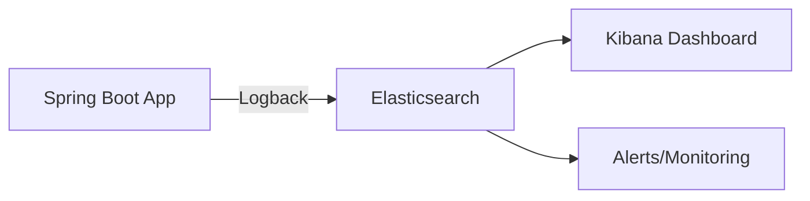

Implement a system to collect, store, and analyze application logs using Elasticsearch.

{}
- **Elasticsearch**: 8.11.x
- **Spring Boot**: 3.2.x
- **Logback**: Included in Spring Boot
{}

## Implementation Goals



- **Log Collection**: Store application logs directly in Elasticsearch
- **Real-time Search**: Error logs, specific user request tracing
- **Dashboards**: Visualize error rates, response time distribution
- **Alerts**: Notify on error spikes

---

## 1. Index Design

### Log Index Mapping

```json
PUT /_index_template/logs
{
  "index_patterns": ["logs-*"],
  "template": {
    "settings": {
      "number_of_shards": 2,
      "number_of_replicas": 1,
      "refresh_interval": "5s"
    },
    "mappings": {
      "properties": {
        "@timestamp": {
          "type": "date"
        },
        "level": {
          "type": "keyword"
        },
        "logger": {
          "type": "keyword"
        },
        "thread": {
          "type": "keyword"
        },
        "message": {
          "type": "text",
          "fields": {
            "keyword": {
              "type": "keyword",
              "ignore_above": 256
            }
          }
        },
        "exception": {
          "type": "text"
        },
        "stack_trace": {
          "type": "text",
          "index": false
        },
        "application": {
          "type": "keyword"
        },
        "environment": {
          "type": "keyword"
        },
        "host": {
          "type": "keyword"
        },
        "request_id": {
          "type": "keyword"
        },
        "user_id": {
          "type": "keyword"
        },
        "duration_ms": {
          "type": "long"
        },
        "http_method": {
          "type": "keyword"
        },
        "http_path": {
          "type": "keyword"
        },
        "http_status": {
          "type": "integer"
        }
      }
    }
  }
}
```

### Daily Index Pattern

```
logs-2024.01.15
logs-2024.01.16
logs-2024.01.17
```

> **Advantage**: Easy to delete old logs (delete by index)

---

## 2. Spring Boot Configuration

### build.gradle.kts

```kotlin
dependencies {
    implementation("org.springframework.boot:spring-boot-starter-web")
    implementation("org.springframework.boot:spring-boot-starter-data-elasticsearch")

    // Logback Elasticsearch Appender
    implementation("com.internetitem:logback-elasticsearch-appender:1.6")

    // JSON Logging
    implementation("net.logstash.logback:logstash-logback-encoder:7.4")
}
```

### logback-spring.xml

```xml
<?xml version="1.0" encoding="UTF-8"?>
<configuration>
    <include resource="org/springframework/boot/logging/logback/defaults.xml"/>

    <!-- Console output -->
    <appender name="CONSOLE" class="ch.qos.logback.core.ConsoleAppender">
        <encoder class="net.logstash.logback.encoder.LogstashEncoder">
            <includeMdcKeyName>requestId</includeMdcKeyName>
            <includeMdcKeyName>userId</includeMdcKeyName>
        </encoder>
    </appender>

    <!-- Elasticsearch sender -->
    <appender name="ELASTIC" class="com.internetitem.logback.elasticsearch.ElasticsearchAppender">
        <url>http://localhost:9200/_bulk</url>
        <index>logs-%date{yyyy.MM.dd}</index>
        <type>_doc</type>
        <connectTimeout>30000</connectTimeout>
        <readTimeout>30000</readTimeout>
        <maxQueueSize>10000</maxQueueSize>
        <sleepTime>250</sleepTime>
        <maxRetries>3</maxRetries>

        <property>
            <name>application</name>
            <value>${spring.application.name:-app}</value>
        </property>
        <property>
            <name>environment</name>
            <value>${spring.profiles.active:-default}</value>
        </property>
        <property>
            <name>host</name>
            <value>${HOSTNAME:-unknown}</value>
        </property>
    </appender>

    <!-- Async processing (performance improvement) -->
    <appender name="ASYNC_ELASTIC" class="ch.qos.logback.classic.AsyncAppender">
        <appender-ref ref="ELASTIC"/>
        <queueSize>10000</queueSize>
        <discardingThreshold>0</discardingThreshold>
        <neverBlock>true</neverBlock>
    </appender>

    <root level="INFO">
        <appender-ref ref="CONSOLE"/>
        <appender-ref ref="ASYNC_ELASTIC"/>
    </root>
</configuration>
```

### Request Tracking with MDC

```java
@Component
public class RequestTrackingFilter extends OncePerRequestFilter {

    @Override
    protected void doFilterInternal(HttpServletRequest request,
                                    HttpServletResponse response,
                                    FilterChain chain) throws ServletException, IOException {
        try {
            String requestId = UUID.randomUUID().toString().substring(0, 8);
            String userId = extractUserId(request);

            MDC.put("requestId", requestId);
            MDC.put("userId", userId);
            MDC.put("httpMethod", request.getMethod());
            MDC.put("httpPath", request.getRequestURI());

            long startTime = System.currentTimeMillis();

            chain.doFilter(request, response);

            long duration = System.currentTimeMillis() - startTime;
            MDC.put("durationMs", String.valueOf(duration));
            MDC.put("httpStatus", String.valueOf(response.getStatus()));

            log.info("Request completed");
        } finally {
            MDC.clear();
        }
    }

    private String extractUserId(HttpServletRequest request) {
        // Extract user ID from JWT or session
        return request.getHeader("X-User-Id");
    }
}
```

---

## 3. Log Search API

### LogSearchService.java

```java
@Service
public class LogSearchService {

    private final ElasticsearchOperations operations;

    public LogSearchService(ElasticsearchOperations operations) {
        this.operations = operations;
    }

    /**
     * Search error logs
     */
    public SearchResult searchErrors(String query,
                                     LocalDateTime from,
                                     LocalDateTime to,
                                     int page, int size) {

        BoolQuery.Builder boolQuery = new BoolQuery.Builder();

        // Error levels only
        boolQuery.filter(Query.of(q -> q
            .terms(t -> t
                .field("level")
                .terms(v -> v.value(List.of(
                    FieldValue.of("ERROR"),
                    FieldValue.of("WARN")
                )))
            )
        ));

        // Time range
        boolQuery.filter(Query.of(q -> q
            .range(r -> r
                .field("@timestamp")
                .gte(JsonData.of(from.toString()))
                .lt(JsonData.of(to.toString()))
            )
        ));

        // Message search
        if (hasText(query)) {
            boolQuery.must(Query.of(q -> q
                .multiMatch(m -> m
                    .query(query)
                    .fields("message", "exception", "stack_trace")
                )
            ));
        }

        NativeQuery nativeQuery = NativeQuery.builder()
            .withQuery(Query.of(q -> q.bool(boolQuery.build())))
            .withSort(Sort.by("@timestamp").descending())
            .withPageable(PageRequest.of(page, size))
            .build();

        // Search across daily index pattern
        SearchHits<LogEntry> hits = operations.search(
            nativeQuery,
            LogEntry.class,
            IndexCoordinates.of("logs-*")
        );

        return toSearchResult(hits);
    }

    /**
     * Trace specific request
     */
    public List<LogEntry> traceRequest(String requestId) {
        NativeQuery query = NativeQuery.builder()
            .withQuery(Query.of(q -> q
                .term(t -> t.field("request_id").value(requestId))
            ))
            .withSort(Sort.by("@timestamp").ascending())
            .withPageable(PageRequest.of(0, 1000))
            .build();

        SearchHits<LogEntry> hits = operations.search(
            query,
            LogEntry.class,
            IndexCoordinates.of("logs-*")
        );

        return hits.getSearchHits().stream()
            .map(SearchHit::getContent)
            .toList();
    }

    /**
     * Get logs by user
     */
    public List<LogEntry> getUserLogs(String userId, LocalDateTime from, LocalDateTime to) {
        BoolQuery.Builder boolQuery = new BoolQuery.Builder()
            .filter(Query.of(q -> q.term(t -> t.field("user_id").value(userId))))
            .filter(Query.of(q -> q
                .range(r -> r
                    .field("@timestamp")
                    .gte(JsonData.of(from.toString()))
                    .lt(JsonData.of(to.toString()))
                )
            ));

        NativeQuery query = NativeQuery.builder()
            .withQuery(Query.of(q -> q.bool(boolQuery.build())))
            .withSort(Sort.by("@timestamp").descending())
            .withPageable(PageRequest.of(0, 100))
            .build();

        return operations.search(query, LogEntry.class, IndexCoordinates.of("logs-*"))
            .getSearchHits().stream()
            .map(SearchHit::getContent)
            .toList();
    }
}
```

---

## 4. Log Analytics (Aggregations)

### LogAnalyticsService.java

```java
@Service
public class LogAnalyticsService {

    private final ElasticsearchOperations operations;

    /**
     * Error count by hour
     */
    public Map<String, Long> getErrorCountByHour(LocalDateTime from, LocalDateTime to) {
        NativeQuery query = NativeQuery.builder()
            .withQuery(Query.of(q -> q
                .bool(b -> b
                    .filter(Query.of(f -> f.term(t -> t.field("level").value("ERROR"))))
                    .filter(Query.of(f -> f
                        .range(r -> r
                            .field("@timestamp")
                            .gte(JsonData.of(from.toString()))
                            .lt(JsonData.of(to.toString()))
                        )
                    ))
                )
            ))
            .withAggregation("errors_by_hour", Aggregation.of(a -> a
                .dateHistogram(dh -> dh
                    .field("@timestamp")
                    .calendarInterval(CalendarInterval.Hour)
                    .format("yyyy-MM-dd HH:00")
                )
            ))
            .withMaxResults(0)
            .build();

        SearchHits<LogEntry> hits = operations.search(
            query, LogEntry.class, IndexCoordinates.of("logs-*"));

        // Parse results
        return parseHistogramResult(hits, "errors_by_hour");
    }

    /**
     * Calculate error rate (errors / total logs)
     */
    public ErrorRateResult getErrorRate(LocalDateTime from, LocalDateTime to) {
        NativeQuery query = NativeQuery.builder()
            .withQuery(Query.of(q -> q
                .range(r -> r
                    .field("@timestamp")
                    .gte(JsonData.of(from.toString()))
                    .lt(JsonData.of(to.toString()))
                )
            ))
            .withAggregation("total", Aggregation.of(a -> a.valueCount(v -> v.field("level"))))
            .withAggregation("errors", Aggregation.of(a -> a
                .filter(f -> f.term(t -> t.field("level").value("ERROR")))
            ))
            .withMaxResults(0)
            .build();

        SearchHits<LogEntry> hits = operations.search(
            query, LogEntry.class, IndexCoordinates.of("logs-*"));

        long total = extractCount(hits, "total");
        long errors = extractCount(hits, "errors");
        double errorRate = total > 0 ? (double) errors / total * 100 : 0;

        return new ErrorRateResult(total, errors, errorRate);
    }

    /**
     * HTTP status code distribution
     */
    public Map<Integer, Long> getStatusCodeDistribution(LocalDateTime from, LocalDateTime to) {
        NativeQuery query = NativeQuery.builder()
            .withQuery(Query.of(q -> q
                .bool(b -> b
                    .filter(Query.of(f -> f
                        .range(r -> r
                            .field("@timestamp")
                            .gte(JsonData.of(from.toString()))
                            .lt(JsonData.of(to.toString()))
                        )
                    ))
                    .filter(Query.of(f -> f.exists(e -> e.field("http_status"))))
                )
            ))
            .withAggregation("status_codes", Aggregation.of(a -> a
                .terms(t -> t.field("http_status").size(20))
            ))
            .withMaxResults(0)
            .build();

        SearchHits<LogEntry> hits = operations.search(
            query, LogEntry.class, IndexCoordinates.of("logs-*"));

        return parseTermsResult(hits, "status_codes");
    }

    /**
     * Top N slow requests
     */
    public List<SlowRequest> getSlowRequests(int topN, long thresholdMs) {
        NativeQuery query = NativeQuery.builder()
            .withQuery(Query.of(q -> q
                .range(r -> r.field("duration_ms").gte(JsonData.of(thresholdMs)))
            ))
            .withSort(Sort.by("duration_ms").descending())
            .withPageable(PageRequest.of(0, topN))
            .build();

        return operations.search(query, LogEntry.class, IndexCoordinates.of("logs-*"))
            .getSearchHits().stream()
            .map(hit -> new SlowRequest(
                hit.getContent().getHttpPath(),
                hit.getContent().getDurationMs(),
                hit.getContent().getTimestamp()
            ))
            .toList();
    }

    /**
     * Response time percentiles
     */
    public LatencyPercentiles getLatencyPercentiles(LocalDateTime from, LocalDateTime to) {
        NativeQuery query = NativeQuery.builder()
            .withQuery(Query.of(q -> q
                .bool(b -> b
                    .filter(Query.of(f -> f.exists(e -> e.field("duration_ms"))))
                    .filter(Query.of(f -> f
                        .range(r -> r
                            .field("@timestamp")
                            .gte(JsonData.of(from.toString()))
                            .lt(JsonData.of(to.toString()))
                        )
                    ))
                )
            ))
            .withAggregation("latency_percentiles", Aggregation.of(a -> a
                .percentiles(p -> p
                    .field("duration_ms")
                    .percents(50.0, 90.0, 95.0, 99.0)
                )
            ))
            .withMaxResults(0)
            .build();

        SearchHits<LogEntry> hits = operations.search(
            query, LogEntry.class, IndexCoordinates.of("logs-*"));

        return parsePercentilesResult(hits, "latency_percentiles");
    }
}
```

---

## 5. Index Lifecycle Management (ILM)

### ILM Policy Setup

```json
PUT /_ilm/policy/logs_policy
{
  "policy": {
    "phases": {
      "hot": {
        "min_age": "0ms",
        "actions": {
          "rollover": {
            "max_age": "1d",
            "max_size": "50gb"
          },
          "set_priority": {
            "priority": 100
          }
        }
      },
      "warm": {
        "min_age": "7d",
        "actions": {
          "shrink": {
            "number_of_shards": 1
          },
          "forcemerge": {
            "max_num_segments": 1
          },
          "set_priority": {
            "priority": 50
          }
        }
      },
      "cold": {
        "min_age": "30d",
        "actions": {
          "set_priority": {
            "priority": 0
          }
        }
      },
      "delete": {
        "min_age": "90d",
        "actions": {
          "delete": {}
        }
      }
    }
  }
}
```

### Apply ILM to Index Template

```json
PUT /_index_template/logs
{
  "index_patterns": ["logs-*"],
  "template": {
    "settings": {
      "index.lifecycle.name": "logs_policy",
      "index.lifecycle.rollover_alias": "logs"
    }
  }
}
```

---

## 6. Kibana Dashboard Setup

### Key Visualizations

1. **Error Rate Trend** (Line Chart)
   - X-axis: @timestamp
   - Y-axis: Count of level:ERROR

2. **Log Level Distribution** (Pie Chart)
   - Field: level

3. **HTTP Status Codes** (Horizontal Bar)
   - Field: http_status

4. **Response Time Distribution** (Histogram)
   - Field: duration_ms

5. **Recent Error List** (Data Table)
   - Fields: @timestamp, level, message, http_path

### Alert Rules (Kibana Alerting)

```
Condition: ERROR logs > 100 in 5 minutes
Action: Slack/Email notification
```

---

## 7. Performance Optimization Tips

### Logging Performance

```java
// ❌ Inefficient - always concatenates strings
log.debug("Processing order: " + order.getId() + " for user: " + user.getName());

// ✅ Efficient - level check before processing
log.debug("Processing order: {} for user: {}", order.getId(), user.getName());

// ✅ More efficient - for expensive operations
if (log.isDebugEnabled()) {
    log.debug("Order details: {}", toJson(order));
}
```

### Index Settings

```json
{
  "settings": {
    "refresh_interval": "5s",      // Real-time vs performance trade-off
    "number_of_replicas": 0,       // Development environment
    "translog.durability": "async" // For high-volume logs
  }
}
```

---

## Next Steps

| Goal | Recommended Document |
|------|---------------------|
| Advanced aggregations | [Aggregations](../../concepts/aggregations/) |
| Performance optimization | [Performance Tuning](../../concepts/performance-tuning/) |
| Cluster management | [High Availability](../../concepts/high-availability/) |
