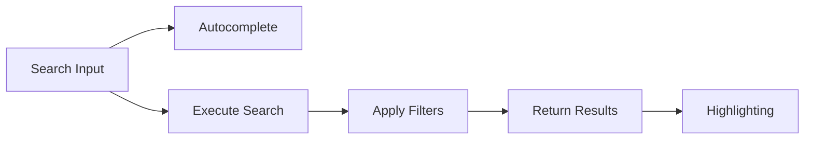


If you want to run this code immediately, use the **complete Spring Boot project**:
- 📁 [examples/elasticsearch/product-search/](https://github.com/advanced-beginner/advanced-beginner.github.io/tree/main/examples/elasticsearch/product-search)
- Instant Elasticsearch execution with docker-compose (including Nori)
- Automatic sample data initialization



- Apply Korean morphological analysis with **Nori analyzer** to enable search for "삼성" and "전자" from "삼성전자"
- Implement autocomplete functionality with **Edge N-gram**
- Provide filtering and facets with **Bool Query + Aggregation**
- Highlight search terms with **highlighting**
- Total time required: approximately 30 minutes


Implement a production-level product search system with Korean morphological analysis, autocomplete, and filtering.

## Implementation Goals



- **Korean Search**: Searching "삼성전자" matches both "삼성" and "전자"
- **Autocomplete**: Typing "맥북 프" suggests "맥북 프로"
- **Filtering**: Category, price range, brand filters
- **Highlighting**: Highlight search terms

---

## 1. Index Design

### Nori Analyzer Configuration

```json
PUT /products
{
  "settings": {
    "analysis": {
      "analyzer": {
        "korean_analyzer": {
          "type": "custom",
          "tokenizer": "nori_tokenizer",
          "filter": [
            "nori_readingform",
            "lowercase",
            "nori_part_of_speech_filter"
          ]
        },
        "autocomplete_analyzer": {
          "type": "custom",
          "tokenizer": "edge_ngram_tokenizer",
          "filter": ["lowercase"]
        },
        "autocomplete_search_analyzer": {
          "type": "custom",
          "tokenizer": "standard",
          "filter": ["lowercase"]
        }
      },
      "tokenizer": {
        "nori_tokenizer": {
          "type": "nori_tokenizer",
          "decompound_mode": "mixed"
        },
        "edge_ngram_tokenizer": {
          "type": "edge_ngram",
          "min_gram": 1,
          "max_gram": 20,
          "token_chars": ["letter", "digit"]
        }
      },
      "filter": {
        "nori_part_of_speech_filter": {
          "type": "nori_part_of_speech",
          "stoptags": [
            "E", "IC", "J", "MAG", "MAJ",
            "MM", "SP", "SSC", "SSO", "SC",
            "SE", "XPN", "XSA", "XSN", "XSV",
            "UNA", "NA", "VSV"
          ]
        }
      }
    }
  },
  "mappings": {
    "properties": {
      "name": {
        "type": "text",
        "analyzer": "korean_analyzer",
        "fields": {
          "keyword": {
            "type": "keyword"
          },
          "autocomplete": {
            "type": "text",
            "analyzer": "autocomplete_analyzer",
            "search_analyzer": "autocomplete_search_analyzer"
          }
        }
      },
      "description": {
        "type": "text",
        "analyzer": "korean_analyzer"
      },
      "category": {
        "type": "keyword"
      },
      "brand": {
        "type": "keyword"
      },
      "price": {
        "type": "integer"
      },
      "discount_price": {
        "type": "integer"
      },
      "rating": {
        "type": "float"
      },
      "review_count": {
        "type": "integer"
      },
      "in_stock": {
        "type": "boolean"
      },
      "tags": {
        "type": "keyword"
      },
      "created_at": {
        "type": "date"
      }
    }
  }
}
```

### Test Analyzer

```json
// Korean analysis
GET /products/_analyze
{
  "analyzer": "korean_analyzer",
  "text": "삼성전자 갤럭시북 프로"
}
// Result: ["삼성", "전자", "갤럭시북", "갤럭시", "북", "프로"]

// Autocomplete analysis
GET /products/_analyze
{
  "analyzer": "autocomplete_analyzer",
  "text": "맥북"
}
// Result: ["맥", "맥북"]
```


- `nori_tokenizer`'s `decompound_mode: mixed` decomposes compound words
- `edge_ngram` is for prefix matching; use `standard` analyzer for search
- Use `Multi-field` to utilize the same field for multiple purposes (search, sorting, autocomplete)


---

## 2. Sample Data

```json
POST /_bulk
{"index": {"_index": "products", "_id": "1"}}
{"name": "맥북 프로 14인치 M3 Pro", "description": "Apple M3 Pro 칩, 18GB 통합 메모리, 512GB SSD", "category": "노트북", "brand": "Apple", "price": 2390000, "discount_price": 2290000, "rating": 4.8, "review_count": 1250, "in_stock": true, "tags": ["프리미엄", "신상품"], "created_at": "2024-01-10"}
{"index": {"_index": "products", "_id": "2"}}
{"name": "맥북 에어 13인치 M3", "description": "Apple M3 칩, 8GB 통합 메모리, 256GB SSD, 미드나이트", "category": "노트북", "brand": "Apple", "price": 1390000, "rating": 4.7, "review_count": 890, "in_stock": true, "tags": ["베스트셀러"], "created_at": "2024-01-15"}
{"index": {"_index": "products", "_id": "3"}}
{"name": "갤럭시북4 프로 16인치", "description": "인텔 코어 울트라 7, 16GB RAM, 512GB SSD", "category": "노트북", "brand": "Samsung", "price": 1890000, "rating": 4.5, "review_count": 456, "in_stock": true, "tags": ["신상품"], "created_at": "2024-01-20"}
{"index": {"_index": "products", "_id": "4"}}
{"name": "아이패드 프로 11인치 M4", "description": "Apple M4 칩, 256GB, 스페이스 블랙", "category": "태블릿", "brand": "Apple", "price": 1499000, "rating": 4.9, "review_count": 2100, "in_stock": true, "tags": ["프리미엄", "신상품"], "created_at": "2024-01-05"}
{"index": {"_index": "products", "_id": "5"}}
{"name": "갤럭시 탭 S9 Ultra", "description": "스냅드래곤 8 Gen 2, 12GB RAM, 256GB", "category": "태블릿", "brand": "Samsung", "price": 1599000, "rating": 4.6, "review_count": 780, "in_stock": false, "tags": ["대화면"], "created_at": "2024-01-08"}
```

---

## 3. Search Implementation

### Basic Search

```json
GET /products/_search
{
  "query": {
    "bool": {
      "must": [
        {
          "multi_match": {
            "query": "맥북 프로",
            "fields": ["name^3", "description"],
            "type": "best_fields"
          }
        }
      ],
      "filter": [
        { "term": { "in_stock": true } }
      ]
    }
  }
}
```

### Autocomplete

```json
GET /products/_search
{
  "size": 5,
  "_source": ["name"],
  "query": {
    "match": {
      "name.autocomplete": {
        "query": "맥북 프",
        "operator": "and"
      }
    }
  }
}
```

### Filter + Search Combination

```json
GET /products/_search
{
  "query": {
    "bool": {
      "must": [
        {
          "multi_match": {
            "query": "프로",
            "fields": ["name^3", "description"]
          }
        }
      ],
      "filter": [
        { "term": { "category": "노트북" } },
        { "terms": { "brand": ["Apple", "Samsung"] } },
        { "range": { "price": { "gte": 1000000, "lte": 2500000 } } },
        { "term": { "in_stock": true } }
      ]
    }
  },
  "sort": [
    { "_score": "desc" },
    { "review_count": "desc" }
  ]
}
```

### Search + Filter Facets

```json
GET /products/_search
{
  "size": 10,
  "query": {
    "bool": {
      "must": [
        { "match": { "name": "노트북" } }
      ],
      "filter": [
        { "term": { "in_stock": true } }
      ]
    }
  },
  "aggs": {
    "categories": {
      "terms": { "field": "category", "size": 10 }
    },
    "brands": {
      "terms": { "field": "brand", "size": 20 }
    },
    "price_ranges": {
      "range": {
        "field": "price",
        "ranges": [
          { "key": "Under 1M KRW", "to": 1000000 },
          { "key": "1M-1.5M KRW", "from": 1000000, "to": 1500000 },
          { "key": "1.5M-2M KRW", "from": 1500000, "to": 2000000 },
          { "key": "Over 2M KRW", "from": 2000000 }
        ]
      }
    },
    "avg_rating": {
      "avg": { "field": "rating" }
    }
  }
}
```

### Highlighting

```json
GET /products/_search
{
  "query": {
    "match": { "description": "M3 칩" }
  },
  "highlight": {
    "fields": {
      "name": {
        "pre_tags": ["<em class='highlight'>"],
        "post_tags": ["</em>"]
      },
      "description": {
        "pre_tags": ["<em class='highlight'>"],
        "post_tags": ["</em>"],
        "fragment_size": 100,
        "number_of_fragments": 3
      }
    }
  }
}
```


- Search multiple fields simultaneously with `multi_match`, adjust importance with field weights (`^3`)
- `must` affects scoring, `filter` is cached for better performance
- Provide filter facets with `aggs` to allow users to narrow results


---

## 4. Spring Boot Implementation

### Product.java

```java
@Document(indexName = "products")
public class Product {

    @Id
    private String id;

    @MultiField(
        mainField = @Field(type = FieldType.Text, analyzer = "korean_analyzer"),
        otherFields = {
            @InnerField(suffix = "keyword", type = FieldType.Keyword),
            @InnerField(suffix = "autocomplete", type = FieldType.Text,
                analyzer = "autocomplete_analyzer",
                searchAnalyzer = "autocomplete_search_analyzer")
        }
    )
    private String name;

    @Field(type = FieldType.Text, analyzer = "korean_analyzer")
    private String description;

    @Field(type = FieldType.Keyword)
    private String category;

    @Field(type = FieldType.Keyword)
    private String brand;

    @Field(type = FieldType.Integer)
    private Integer price;

    @Field(type = FieldType.Integer)
    private Integer discountPrice;

    @Field(type = FieldType.Float)
    private Float rating;

    @Field(type = FieldType.Integer)
    private Integer reviewCount;

    @Field(type = FieldType.Boolean)
    private Boolean inStock;

    @Field(type = FieldType.Keyword)
    private List<String> tags;

    @Field(type = FieldType.Date)
    private LocalDate createdAt;

    // Getters and Setters
}
```

### ProductSearchService.java

```java
@Service
public class ProductSearchService {

    private final ElasticsearchOperations operations;

    public ProductSearchService(ElasticsearchOperations operations) {
        this.operations = operations;
    }

    public SearchResult search(SearchRequest request) {
        BoolQuery.Builder boolQuery = new BoolQuery.Builder();

        // Search keyword
        if (hasText(request.getKeyword())) {
            boolQuery.must(Query.of(q -> q
                .multiMatch(m -> m
                    .query(request.getKeyword())
                    .fields("name^3", "description")
                    .type(TextQueryType.BestFields)
                )
            ));
        }

        // Filters
        if (hasText(request.getCategory())) {
            boolQuery.filter(Query.of(q -> q
                .term(t -> t.field("category").value(request.getCategory()))
            ));
        }

        if (request.getBrands() != null && !request.getBrands().isEmpty()) {
            boolQuery.filter(Query.of(q -> q
                .terms(t -> t
                    .field("brand")
                    .terms(v -> v.value(
                        request.getBrands().stream()
                            .map(FieldValue::of)
                            .toList()
                    ))
                )
            ));
        }

        if (request.getMinPrice() != null || request.getMaxPrice() != null) {
            boolQuery.filter(Query.of(q -> q
                .range(r -> {
                    r.field("price");
                    if (request.getMinPrice() != null)
                        r.gte(JsonData.of(request.getMinPrice()));
                    if (request.getMaxPrice() != null)
                        r.lte(JsonData.of(request.getMaxPrice()));
                    return r;
                })
            ));
        }

        // Stock filter
        if (request.isInStockOnly()) {
            boolQuery.filter(Query.of(q -> q
                .term(t -> t.field("in_stock").value(true))
            ));
        }

        // Build query
        NativeQuery query = NativeQuery.builder()
            .withQuery(Query.of(q -> q.bool(boolQuery.build())))
            .withPageable(PageRequest.of(
                request.getPage(),
                request.getSize()
            ))
            .withSort(buildSort(request.getSortBy()))
            .withHighlightQuery(buildHighlight())
            .withAggregation("categories", Aggregation.of(a -> a
                .terms(t -> t.field("category").size(10))
            ))
            .withAggregation("brands", Aggregation.of(a -> a
                .terms(t -> t.field("brand").size(20))
            ))
            .withAggregation("price_ranges", Aggregation.of(a -> a
                .range(r -> r
                    .field("price")
                    .ranges(
                        AggregationRange.of(ar -> ar.to("1000000").key("Under 1M KRW")),
                        AggregationRange.of(ar -> ar.from("1000000").to("1500000").key("1M-1.5M KRW")),
                        AggregationRange.of(ar -> ar.from("1500000").to("2000000").key("1.5M-2M KRW")),
                        AggregationRange.of(ar -> ar.from("2000000").key("Over 2M KRW"))
                    )
                )
            ))
            .build();

        SearchHits<Product> hits = operations.search(query, Product.class);

        return SearchResult.builder()
            .products(hits.getSearchHits().stream()
                .map(this::toProductResponse)
                .toList())
            .total(hits.getTotalHits())
            .facets(extractFacets(hits))
            .build();
    }

    public List<String> autocomplete(String prefix) {
        NativeQuery query = NativeQuery.builder()
            .withQuery(Query.of(q -> q
                .match(m -> m
                    .field("name.autocomplete")
                    .query(prefix)
                    .operator(Operator.And)
                )
            ))
            .withPageable(PageRequest.of(0, 5))
            .withSourceFilter(new FetchSourceFilter(
                new String[]{"name"}, null
            ))
            .build();

        SearchHits<Product> hits = operations.search(query, Product.class);

        return hits.getSearchHits().stream()
            .map(h -> h.getContent().getName())
            .distinct()
            .toList();
    }

    private Sort buildSort(String sortBy) {
        if (sortBy == null) {
            return Sort.by(
                Sort.Order.desc("_score"),
                Sort.Order.desc("review_count")
            );
        }
        return switch (sortBy) {
            case "price_asc" -> Sort.by("price").ascending();
            case "price_desc" -> Sort.by("price").descending();
            case "rating" -> Sort.by("rating").descending();
            case "newest" -> Sort.by("created_at").descending();
            default -> Sort.by("_score").descending();
        };
    }

    private HighlightQuery buildHighlight() {
        return new HighlightQuery(
            new Highlight(List.of(
                new HighlightField("name"),
                new HighlightField("description")
            )),
            Product.class
        );
    }

    private ProductResponse toProductResponse(SearchHit<Product> hit) {
        ProductResponse response = new ProductResponse(hit.getContent());
        if (hit.getHighlightFields().containsKey("name")) {
            response.setHighlightedName(
                String.join("", hit.getHighlightField("name"))
            );
        }
        return response;
    }
}
```

### ProductController.java

```java
@RestController
@RequestMapping("/api/products")
public class ProductController {

    private final ProductSearchService searchService;

    @GetMapping("/search")
    public ResponseEntity<SearchResult> search(
            @RequestParam(required = false) String keyword,
            @RequestParam(required = false) String category,
            @RequestParam(required = false) List<String> brands,
            @RequestParam(required = false) Integer minPrice,
            @RequestParam(required = false) Integer maxPrice,
            @RequestParam(defaultValue = "true") boolean inStockOnly,
            @RequestParam(required = false) String sortBy,
            @RequestParam(defaultValue = "0") int page,
            @RequestParam(defaultValue = "10") int size) {

        SearchRequest request = SearchRequest.builder()
            .keyword(keyword)
            .category(category)
            .brands(brands)
            .minPrice(minPrice)
            .maxPrice(maxPrice)
            .inStockOnly(inStockOnly)
            .sortBy(sortBy)
            .page(page)
            .size(size)
            .build();

        return ResponseEntity.ok(searchService.search(request));
    }

    @GetMapping("/autocomplete")
    public ResponseEntity<List<String>> autocomplete(
            @RequestParam String q) {
        return ResponseEntity.ok(searchService.autocomplete(q));
    }
}
```


- Index the same field with multiple analyzers using `@MultiField`
- Construct complex Bool Query and Aggregation with `ElasticsearchOperations`
- Get highlighted text from `SearchHit`'s `getHighlightFields()`


---

## 5. API Testing

### Basic Search

```bash
curl "http://localhost:8080/api/products/search?keyword=맥북"
```

### With Filters

```bash
curl "http://localhost:8080/api/products/search?keyword=프로&category=노트북&brands=Apple&minPrice=1000000&maxPrice=3000000"
```

### Sorting

```bash
curl "http://localhost:8080/api/products/search?keyword=노트북&sortBy=price_asc"
```

### Autocomplete

```bash
curl "http://localhost:8080/api/products/autocomplete?q=맥북"
```

---

## 6. Optimization Tips

### Improve Search Quality

```json
// Add synonyms
"filter": {
  "synonym_filter": {
    "type": "synonym",
    "synonyms": [
      "노트북, 랩탑, laptop",
      "핸드폰, 스마트폰, 휴대폰"
    ]
  }
}
```

### Search Term Boosting

```json
{
  "function_score": {
    "query": { ... },
    "functions": [
      {
        "filter": { "term": { "tags": "베스트셀러" } },
        "weight": 1.5
      },
      {
        "field_value_factor": {
          "field": "review_count",
          "factor": 0.0001,
          "modifier": "log1p"
        }
      }
    ]
  }
}
```


- **Synonyms** enable searches for similar terms like "노트북" and "랩탑"
- **function_score** applies weights based on bestseller tags or review counts
- Improving search quality requires continuous testing and user feedback


---

## Next Steps

| Goal | Recommended Document |
|------|---------------------|
| Improve search quality | [Search Relevance](../concepts/search-relevance/) |
| Performance optimization | [Performance Tuning](../concepts/performance-tuning/) |
| Data analysis | [Aggregations](../concepts/aggregations/) |
