This guide walks you through safely scaling an Elasticsearch cluster.

**Estimated time**: About 30-60 minutes (additional time for node addition and shard rebalancing)


**Covers**: Adding data nodes, role-based node separation, Hot-Warm-Cold architecture, and post-scaling validation

**Does not cover**: For query-level performance optimization, see [Slow Query Optimization](../slow-query-optimization/). For memory issues, see [Memory Troubleshooting](../memory-troubleshooting/).



- **Horizontal scaling**: Add data nodes and rebalance shards
- **Role separation**: Separate master, data, coordinating, and ingest nodes for stability
- **Hot-Warm-Cold**: Tier nodes by data access frequency for cost optimization
- **Post-scaling validation**: Always verify cluster status, shard distribution, and performance metrics


---

## Before You Begin

Verify the following prerequisites:

| Item | Requirement | How to Verify |
|------|------------|---------------|
| Elasticsearch version | Same version on all nodes | `curl -X GET "localhost:9200/_cat/nodes?v&h=name,version"` |
| Cluster status | green (recommended) | `curl -X GET "localhost:9200/_cluster/health"` |
| Network | New node can communicate with existing nodes | ping or telnet test |
| Security settings | Identical security configuration (TLS, auth) | Check elasticsearch.yml |

```bash
# Comprehensive cluster status check
curl -X GET "localhost:9200/_cluster/health?pretty"

# Per-node status
curl -X GET "localhost:9200/_cat/nodes?v&h=name,role,heap.percent,cpu,disk.avail"

# Shard distribution per index
curl -X GET "localhost:9200/_cat/shards?v&s=index"
```


Always record the current state before scaling the cluster. This serves as a baseline for comparison if issues arise.


---

## Symptoms

You need cluster scaling in the following situations:

**Low disk space:**
```bash
# Check disk usage
curl -X GET "localhost:9200/_cat/allocation?v&h=node,disk.percent,disk.avail"

# disk.percent > 85%: Warning (watermark)
# disk.percent > 90%: Risk of switching to read-only
```

**Increased query latency:**
```bash
# Check per-node search latency
curl -X GET "localhost:9200/_cat/nodes?v&h=name,search.query_total,search.query_time"
```

**Decreased indexing speed:**
```bash
# Check indexing performance
curl -X GET "localhost:9200/_cat/nodes?v&h=name,indexing.index_total,indexing.index_time"
```

---

## Step 1: Analyze Current State

### 1.1 Identify Bottlenecks

```bash
# Per-node resource overview
curl -X GET "localhost:9200/_cat/nodes?v&h=name,role,heap.percent,cpu,disk.percent,disk.avail"

# Example output:
# name    role  heap.percent cpu disk.percent disk.avail
# node-1  dim   82           75  88           20gb
# node-2  dim   78           70  85           30gb
```

### 1.2 Check Shard Distribution

```bash
# Shard count per node
curl -X GET "localhost:9200/_cat/allocation?v"

# Check for uneven shard placement
curl -X GET "localhost:9200/_cat/shards?v&s=node,index"
```

---

## Step 2: Horizontal Scaling (Adding Data Nodes)

### 2.1 Configure the New Node

Configure `elasticsearch.yml` for the new node:

```yaml
# Basic settings
cluster.name: my-cluster
node.name: node-3

# Network
network.host: 192.168.1.103
discovery.seed_hosts: ["192.168.1.101", "192.168.1.102"]

# Role settings (data node)
node.roles: ["data"]

# Path settings
path.data: /var/data/elasticsearch
path.logs: /var/log/elasticsearch
```

### 2.2 Start the Node and Verify

```bash
# Start the new node
systemctl start elasticsearch

# Verify it joined the cluster
curl -X GET "localhost:9200/_cat/nodes?v"

# Check cluster status (verify the node count increased)
curl -X GET "localhost:9200/_cluster/health?pretty"
```

### 2.3 Shard Rebalancing

When a new node joins, Elasticsearch automatically rebalances shards. You can also adjust manually:

```bash
# Check rebalancing progress
curl -X GET "localhost:9200/_cat/recovery?v&active_only=true"

# Adjust rebalancing speed (default: 40mb/s)
curl -X PUT "localhost:9200/_cluster/settings" -H 'Content-Type: application/json' -d'
{
  "persistent": {
    "cluster.routing.allocation.node_concurrent_recoveries": 4,
    "indices.recovery.max_bytes_per_sec": "100mb"
  }
}'

# Move a specific shard of an index to a specific node
curl -X POST "localhost:9200/_cluster/reroute" -H 'Content-Type: application/json' -d'
{
  "commands": [{
    "move": {
      "index": "products",
      "shard": 0,
      "from_node": "node-1",
      "to_node": "node-3"
    }
  }]
}'
```

---

## Step 3: Role-Based Node Separation

For large clusters, separate node roles to improve stability.

### Role Configuration

| Role | Description | Recommended Specs | Minimum Count |
|------|------------|-------------------|---------------|
| **master** | Cluster state management | Low CPU/memory, stable disk | 3 (odd number) |
| **data** | Data storage and search | High CPU/memory/disk | 2+ |
| **coordinating** | Request routing and result merging | High CPU/memory | 2+ |
| **ingest** | Pipeline processing | High CPU | 1+ |

### Configuration Examples

```yaml
# Dedicated master node
node.roles: ["master"]

# Dedicated data node
node.roles: ["data"]

# Dedicated coordinating node (no roles = coordinating)
node.roles: []

# Dedicated ingest node
node.roles: ["ingest"]
```


Always run an **odd number** of master nodes. A minimum of 3 is recommended to prevent split-brain.


---

## Step 4: Hot-Warm-Cold Architecture

Tier nodes by data access frequency to optimize costs.

### Architecture Overview

```mermaid
flowchart TB
    subgraph Hot["Hot Nodes<br>&#40;SSD, High Performance&#41;"]
        H1["node-hot-1"]
        H2["node-hot-2"]
    end

    subgraph Warm["Warm Nodes<br>&#40;HDD, Medium Performance&#41;"]
        W1["node-warm-1"]
        W2["node-warm-2"]
    end

    subgraph Cold["Cold Nodes<br>&#40;Large HDD, Low Performance&#41;"]
        C1["node-cold-1"]
    end

    Client["Client Request"] --> Coord["Coordinating Node"]
    Coord --> Hot
    Coord --> Warm
    Coord --> Cold

    Hot -->|"After 7 days"| Warm
    Warm -->|"After 30 days"| Cold
```



### 4.1 Node Role Settings

```yaml
# Hot node (latest data, frequent reads/writes)
node.roles: ["data_hot"]
node.attr.data: hot

# Warm node (older data, occasional reads)
node.roles: ["data_warm"]
node.attr.data: warm

# Cold node (archived data, rarely accessed)
node.roles: ["data_cold"]
node.attr.data: cold
```

### 4.2 Index Allocation Settings

```bash
# Place new indices on hot nodes
curl -X PUT "localhost:9200/logs-2026.03.23" -H 'Content-Type: application/json' -d'
{
  "settings": {
    "index.routing.allocation.require.data": "hot",
    "number_of_shards": 3,
    "number_of_replicas": 1
  }
}'
```

### 4.3 Automate with ILM (Index Lifecycle Management)

```bash
# Create an ILM policy
curl -X PUT "localhost:9200/_ilm/policy/logs_policy" -H 'Content-Type: application/json' -d'
{
  "policy": {
    "phases": {
      "hot": {
        "min_age": "0ms",
        "actions": {
          "rollover": {
            "max_size": "50gb",
            "max_age": "7d"
          }
        }
      },
      "warm": {
        "min_age": "7d",
        "actions": {
          "allocate": {
            "require": { "data": "warm" }
          },
          "forcemerge": { "max_num_segments": 1 },
          "shrink": { "number_of_shards": 1 }
        }
      },
      "cold": {
        "min_age": "30d",
        "actions": {
          "allocate": {
            "require": { "data": "cold" }
          }
        }
      },
      "delete": {
        "min_age": "90d",
        "actions": {
          "delete": {}
        }
      }
    }
  }
}'
```

### 4.4 Apply ILM to Index Templates

```bash
curl -X PUT "localhost:9200/_index_template/logs_template" -H 'Content-Type: application/json' -d'
{
  "index_patterns": ["logs-*"],
  "template": {
    "settings": {
      "index.lifecycle.name": "logs_policy",
      "index.lifecycle.rollover_alias": "logs",
      "index.routing.allocation.require.data": "hot"
    }
  }
}'
```

---

## Step 5: Post-Scaling Validation

### 5.1 Check Cluster Status

```bash
# Cluster health
curl -X GET "localhost:9200/_cluster/health?pretty"

# Expected values:
# "status": "green"
# "number_of_nodes": increased node count
# "unassigned_shards": 0
```

### 5.2 Check Shard Distribution

```bash
# Verify even shard distribution across nodes
curl -X GET "localhost:9200/_cat/allocation?v&h=node,shards,disk.percent,disk.avail"

# Example (even distribution):
# node    shards disk.percent disk.avail
# node-1  50     60           80gb
# node-2  48     58           85gb
# node-3  52     55           90gb
```

### 5.3 Check Performance Metrics

```bash
# Check search latency
curl -X GET "localhost:9200/_cat/nodes?v&h=name,search.query_total,search.query_time"

# Check indexing performance
curl -X GET "localhost:9200/_cat/nodes?v&h=name,indexing.index_total,indexing.index_time"

# Per-node resource usage
curl -X GET "localhost:9200/_cat/nodes?v&h=name,heap.percent,cpu,disk.percent"
```

---

## Checklist

Items to verify during cluster scaling:

- [ ] **Are all nodes on the same ES version?** - Version mismatch prevents joining
- [ ] **Is network connectivity working?** - Check firewall, ports (9200, 9300)
- [ ] **Are security settings identical?** - TLS certificates, authentication config
- [ ] **Is the cluster status green?** - Verify no unassigned shards
- [ ] **Is shard distribution even?** - Verify no node is overloaded
- [ ] **Is the ILM policy applied?** - When using Hot-Warm-Cold

---

## Verifying Success

Confirm the cluster scaling succeeded using the following methods:

1. **Cluster status**: Verify it is green and all nodes are healthy
   ```bash
   curl -X GET "localhost:9200/_cluster/health?pretty"
   ```

2. **Shard rebalancing complete**: Verify no rebalancing is in progress
   ```bash
   curl -X GET "localhost:9200/_cat/recovery?v&active_only=true"
   # No output means rebalancing is complete
   ```

3. **Disk usage**: Verify each node's disk usage is below 70%
   ```bash
   curl -X GET "localhost:9200/_cat/allocation?v&h=node,disk.percent"
   ```


- Cluster status is green, all nodes are healthy
- Shard rebalancing is complete with even distribution
- Disk usage is below 70%
- Search/indexing performance has improved or remained stable


---

## Common Errors

### New Node Does Not Join the Cluster

**Cause**: `cluster.name` mismatch or network issues

**Solution**:
1. Verify `cluster.name` is identical in `elasticsearch.yml`
2. Verify firewall allows ports 9200 (HTTP) and 9300 (Transport)
3. Verify `discovery.seed_hosts` includes the existing node addresses

```bash
# Check new node logs
tail -f /var/log/elasticsearch/my-cluster.log | grep "master not discovered"
```

### Shards Are Not Rebalancing

**Cause**: Allocation settings are restrictive or disk watermark is exceeded

**Solution**:
```bash
# Check allocation settings
curl -X GET "localhost:9200/_cluster/settings?include_defaults=true&filter_path=**.allocation"

# Enable allocation
curl -X PUT "localhost:9200/_cluster/settings" -H 'Content-Type: application/json' -d'
{
  "persistent": {
    "cluster.routing.allocation.enable": "all"
  }
}'

# Check disk watermark
curl -X GET "localhost:9200/_cluster/settings?include_defaults=true&filter_path=**.watermark"
```

### "master_not_discovered_exception"

**Cause**: Unable to reach the master node

**Solution**:
1. Verify the master node is running
2. Check `discovery.seed_hosts` and `cluster.initial_master_nodes` settings
3. Check network connectivity (port 9300)

```bash
# Check master node
curl -X GET "localhost:9200/_cat/master?v"
```

---

## Related Documents

- [Mapping Migration](../mapping-migration/) - Zero-downtime mapping migration
- [Index Rebuild](../index-rebuild/) - Large-scale index rebuild
- [Memory Troubleshooting](../memory-troubleshooting/) - Handling memory issues after scaling
