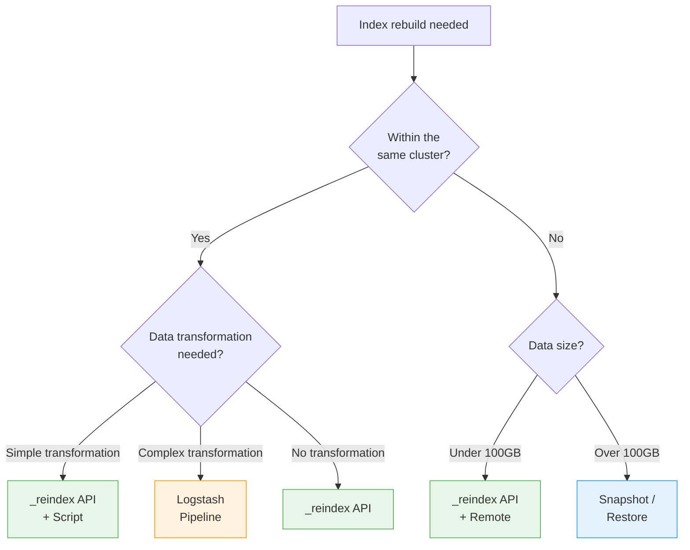

This guide walks you through efficiently rebuilding large indices.

**Estimated time**: About 30-60 minutes (may take several hours depending on data size)


**Covers**: _reindex API, Snapshot/Restore, Logstash comparison, large-scale processing strategies, and performance optimization

**Does not cover**: For simple mapping changes, see [Mapping Migration](). For cluster scaling, see [Cluster Scaling]().



- **_reindex API**: Simplest option, best for rebuilds within the same cluster
- **Snapshot/Restore**: Best for cross-cluster migration and very large datasets
- **Logstash**: Best for complex transformations or external source integration
- **Performance optimization**: Use `refresh_interval: -1`, replica 0, and sliced scroll


---

## Before You Begin

Verify the following prerequisites:

| Item | Requirement | How to Verify |
|------|------------|---------------|
| Elasticsearch version | 7.x or higher | `curl -X GET "localhost:9200"` |
| Cluster status | green | `curl -X GET "localhost:9200/_cluster/health"` |
| Disk space | At least 2x the index size available | `curl -X GET "localhost:9200/_cat/allocation?v"` |
| Index permissions | Read + Write + Admin | Test with the commands below |

```bash
# Check index size
curl -X GET "localhost:9200/_cat/indices/products?v&h=index,docs.count,store.size"

# Check available disk space
curl -X GET "localhost:9200/_cat/allocation?v&h=node,disk.avail,disk.total,disk.percent"
```


Disk I/O and CPU usage increase significantly during index rebuilds. Schedule the operation outside peak hours or configure resource limits.


---

## Symptoms

You need an index rebuild in the following situations:

- When you need to change the number of shards (cannot be changed after creation)
- When you need to make large-scale mapping changes
- When you need to clean up old data or restructure the index
- When index performance is consistently degrading

```bash
# Check shard count (immutable setting)
curl -X GET "localhost:9200/products/_settings?pretty&filter_path=**.number_of_shards"

# Response: "number_of_shards": "1" <- Rebuild required to change this
```

---

## Method Selection Guide



### Method Comparison

| Item | _reindex API | Snapshot/Restore | Logstash |
|------|-------------|-----------------|----------|
| **Difficulty** | Easy | Moderate | Moderate |
| **Speed** | Fast | Very fast | Moderate |
| **Data transformation** | Script (simple) | Not possible | Very flexible |
| **Cross-cluster** | remote option | Possible | Possible |
| **Resource usage** | High | Low | Moderate |
| **Suitable size** | Up to hundreds of GB | Unlimited | Up to hundreds of GB |

---

## Method 1: _reindex API

### 1.1 Prepare the New Index

```bash
# Create new index with updated settings
curl -X PUT "localhost:9200/products-v2" -H 'Content-Type: application/json' -d'
{
  "settings": {
    "number_of_shards": 5,
    "number_of_replicas": 0,
    "refresh_interval": "-1"
  },
  "mappings": {
    "properties": {
      "name": { "type": "text", "analyzer": "standard" },
      "price": { "type": "double" },
      "category": { "type": "keyword" },
      "created_at": { "type": "date" }
    }
  }
}'
```

### 1.2 Basic Reindex

```bash
curl -X POST "localhost:9200/_reindex?wait_for_completion=false" -H 'Content-Type: application/json' -d'
{
  "source": {
    "index": "products-v1",
    "size": 5000
  },
  "dest": {
    "index": "products-v2"
  }
}'

# Response: {"task": "node-1:54321"}
```

### 1.3 Parallel Processing with Sliced Scroll

For large indices, use sliced scroll for parallel Reindex:

```bash
# Manual slicing (divide into a specific number of slices)
curl -X POST "localhost:9200/_reindex?wait_for_completion=false" -H 'Content-Type: application/json' -d'
{
  "source": {
    "index": "products-v1",
    "size": 5000,
    "slice": {
      "id": 0,
      "max": 5
    }
  },
  "dest": {
    "index": "products-v2"
  }
}'

# Or automatic slicing (ES 7.x+)
curl -X POST "localhost:9200/_reindex?slices=auto&wait_for_completion=false" -H 'Content-Type: application/json' -d'
{
  "source": { "index": "products-v1" },
  "dest": { "index": "products-v2" }
}'
```

### 1.4 Monitoring Progress

```bash
# Check task status
curl -X GET "localhost:9200/_tasks/node-1:54321?pretty"

# List all Reindex tasks
curl -X GET "localhost:9200/_tasks?actions=*reindex&detailed&pretty"

# Cancel a task (if needed)
curl -X POST "localhost:9200/_tasks/node-1:54321/_cancel"
```

---

## Method 2: Snapshot/Restore

Useful for large datasets or cross-cluster migration.

### 2.1 Register a Repository

```bash
# Shared filesystem repository
curl -X PUT "localhost:9200/_snapshot/my_backup" -H 'Content-Type: application/json' -d'
{
  "type": "fs",
  "settings": {
    "location": "/mnt/backups/elasticsearch"
  }
}'
```

### 2.2 Create a Snapshot

```bash
# Snapshot a specific index
curl -X PUT "localhost:9200/_snapshot/my_backup/products_snapshot?wait_for_completion=true" -H 'Content-Type: application/json' -d'
{
  "indices": "products-v1",
  "ignore_unavailable": true,
  "include_global_state": false
}'
```

### 2.3 Restore with a Different Name

```bash
# Restore with a renamed index
curl -X POST "localhost:9200/_snapshot/my_backup/products_snapshot/_restore" -H 'Content-Type: application/json' -d'
{
  "indices": "products-v1",
  "rename_pattern": "products-v1",
  "rename_replacement": "products-v2",
  "index_settings": {
    "index.number_of_replicas": 0
  }
}'
```


Snapshot/Restore cannot change mappings or settings. If you need structural changes, perform an additional _reindex after the Restore.


---

## Method 3: Logstash

Use this when you need complex data transformations.

### 3.1 Logstash Pipeline Configuration

```ruby
# logstash-reindex.conf
input {
  elasticsearch {
    hosts => ["localhost:9200"]
    index => "products-v1"
    query => '{ "query": { "match_all": {} } }'
    size => 5000
    scroll => "5m"
    docinfo => true
  }
}

filter {
  # Complex transformation logic
  mutate {
    convert => { "price" => "float" }
    rename => { "old_field" => "new_field" }
    remove_field => ["unwanted_field"]
  }
}

output {
  elasticsearch {
    hosts => ["localhost:9200"]
    index => "products-v2"
    document_id => "%{[@metadata][_id]}"
    action => "index"
  }
}
```

### 3.2 Execution

```bash
bin/logstash -f logstash-reindex.conf
```

---

## Performance Optimization

### Target Index Settings

Optimize the target index settings before running Reindex:

```bash
# 1. Disable refresh
curl -X PUT "localhost:9200/products-v2/_settings" -H 'Content-Type: application/json' -d'
{ "refresh_interval": "-1" }'

# 2. Set replicas to 0
curl -X PUT "localhost:9200/products-v2/_settings" -H 'Content-Type: application/json' -d'
{ "number_of_replicas": 0 }'

# 3. Adjust translog settings (optional)
curl -X PUT "localhost:9200/products-v2/_settings" -H 'Content-Type: application/json' -d'
{
  "index.translog.durability": "async",
  "index.translog.sync_interval": "30s"
}'
```


`translog.durability: async` carries a risk of data loss. Use it only during the rebuild and be sure to restore it to `request` afterward.


### Restore Settings After Completion

```bash
# Restore refresh
curl -X PUT "localhost:9200/products-v2/_settings" -H 'Content-Type: application/json' -d'
{ "refresh_interval": "1s" }'

# Restore replicas
curl -X PUT "localhost:9200/products-v2/_settings" -H 'Content-Type: application/json' -d'
{ "number_of_replicas": 1 }'

# Restore translog
curl -X PUT "localhost:9200/products-v2/_settings" -H 'Content-Type: application/json' -d'
{ "index.translog.durability": "request" }'

# Manual refresh
curl -X POST "localhost:9200/products-v2/_refresh"

# Force merge (optional: segment optimization)
curl -X POST "localhost:9200/products-v2/_forcemerge?max_num_segments=1"
```

---

## Checklist

Items to verify during an index rebuild:

- [ ] **Is there enough disk space?** - At least 2x the index size available
- [ ] **Is the cluster status green?** - If yellow, resolve existing issues first
- [ ] **Have you chosen a rebuild method?** - _reindex / Snapshot / Logstash
- [ ] **Have you applied performance optimizations?** - refresh, replica, translog settings
- [ ] **Do the document counts match?** - Compare the source and new index
- [ ] **Have you restored the settings?** - refresh_interval, replica, translog

---

## Verifying Success

Confirm the rebuild succeeded using the following methods:

1. **Document count comparison**: Verify it matches the source
   ```bash
   echo "Source:" && curl -s "localhost:9200/products-v1/_count" | python3 -m json.tool
   echo "New index:" && curl -s "localhost:9200/products-v2/_count" | python3 -m json.tool
   ```

2. **Cluster status check**: Verify the cluster is green after the rebuild
   ```bash
   curl -X GET "localhost:9200/_cluster/health?pretty"
   ```

3. **Sample query test**: Verify that key queries work correctly
   ```bash
   curl -X GET "localhost:9200/products-v2/_search?pretty" -H 'Content-Type: application/json' -d'
   {
     "query": { "match_all": {} },
     "size": 5
   }'
   ```


- Document count matches the source
- Cluster status is green
- Key queries work correctly
- Settings (refresh, replica, translog) are restored


---

## Common Errors

### "circuit_breaking_exception" during reindex

```json
{
  "error": {
    "type": "circuit_breaking_exception",
    "reason": "Data too large"
  }
}
```

**Cause**: Out of memory during Reindex

**Solution**: Reduce the `source.size` value:
```bash
"source": { "index": "products-v1", "size": 1000 }
```

### Task Disappeared

**Cause**: The task was lost due to a node restart

**Solution**: Check completed tasks in the `.tasks` index:
```bash
curl -X GET "localhost:9200/.tasks/_search?pretty" -H 'Content-Type: application/json' -d'
{
  "query": { "match": { "task.action": "indices:data/write/reindex" } }
}'
```

### Version Conflict

```json
{
  "failures": [{
    "cause": { "type": "version_conflict_engine_exception" }
  }]
}
```

**Cause**: Concurrent writes to the source index

**Solution**: Use `conflicts: proceed` to ignore conflicts, or set the source index to read-only:
```bash
# Ignore conflicts
"conflicts": "proceed"

# Or set the source index to read-only
curl -X PUT "localhost:9200/products-v1/_settings" -H 'Content-Type: application/json' -d'
{ "index.blocks.write": true }'
```

---

## Related Documents

- [Mapping Migration]() - Zero-downtime mapping migration
- [Cluster Scaling]() - Cluster-level scaling
- [Memory Troubleshooting]() - Handling memory issues during rebuilds
