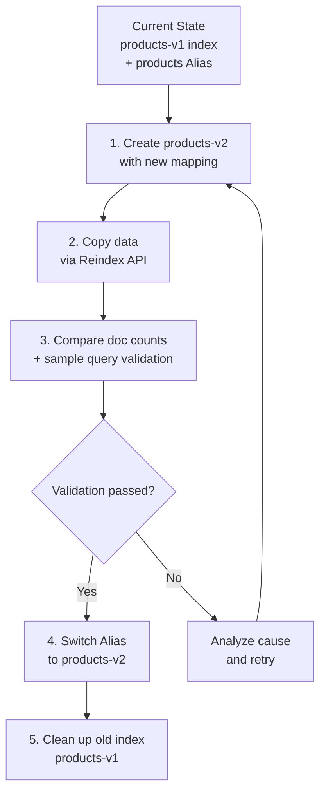

This guide walks you through changing index mappings (field types, analyzers, etc.) without downtime.

**Estimated time**: About 20-40 minutes (additional time may be required depending on data size)


**Covers**: Zero-downtime mapping changes using the Reindex API, Alias switching strategy, and validation methods

**Does not cover**: For large-scale index rebuilds, see [Index Rebuild](../index-rebuild/). For cluster-level changes, see [Cluster Scaling](../cluster-scaling/).



- **Alias-based operations**: Your application accesses indices through Aliases
- **Create new index**: Create a new index with the updated mapping and Reindex
- **Switch Alias**: After validation, switch the Alias to the new index
- **Rollback ready**: You can roll back instantly as long as you don't delete the old index


---

## Before You Begin

Verify the following prerequisites:

| Item | Requirement | How to Verify |
|------|------------|---------------|
| Elasticsearch version | 7.x or higher | `curl -X GET "localhost:9200"` |
| Cluster status | green or yellow | `curl -X GET "localhost:9200/_cluster/health"` |
| Index permissions | Read + Write + Alias management | Test with the commands below |

```bash
# Check current mapping
curl -X GET "localhost:9200/products/_mapping?pretty"

# Check Alias status
curl -X GET "localhost:9200/_cat/aliases?v"
```


Reindex copies all documents from the source index. Make sure you have at least 2x the disk space of the existing index.


---

## Symptoms

You need a mapping migration in the following situations:

- When you need to change a field type (e.g., `text` to `keyword`, `long` to `double`)
- When you need to replace an analyzer (e.g., `standard` to `nori` Korean analyzer)
- When you need to add a `multi-field` to an existing field

```bash
# Example error when attempting to change a mapping
curl -X PUT "localhost:9200/products/_mapping" -H 'Content-Type: application/json' -d'
{
  "properties": {
    "price": { "type": "double" }
  }
}'

# Response: "mapper [price] cannot be changed from type [long] to [double]"
```

---

## Migration Flow



---

## Step 1: Check Current Index State

### 1.1 Back Up the Existing Mapping

```bash
# Save the current mapping to a file
curl -s -X GET "localhost:9200/products/_mapping?pretty" > products_mapping_backup.json

# Also save the current settings
curl -s -X GET "localhost:9200/products/_settings?pretty" > products_settings_backup.json

# Record the document count (for later validation)
curl -s -X GET "localhost:9200/products/_count?pretty"
```

### 1.2 Verify the Alias

Check whether your application is using an Alias:

```bash
# Check Alias list
curl -X GET "localhost:9200/_cat/aliases/products?v"

# Example output:
# alias    index        filter routing.index routing.search
# products products-v1  -      -             -
```


If you are using the index name directly without an Alias, set up an Alias first. This is required for zero-downtime switching.


```bash
# If no Alias exists: add an Alias to the existing index
curl -X POST "localhost:9200/_aliases" -H 'Content-Type: application/json' -d'
{
  "actions": [
    { "add": { "index": "products-v1", "alias": "products" } }
  ]
}'
```

---

## Step 2: Create a New Index

Create a new index with the updated mapping:

```bash
# Example: change price from long to double, apply nori analyzer to name
curl -X PUT "localhost:9200/products-v2" -H 'Content-Type: application/json' -d'
{
  "settings": {
    "number_of_shards": 3,
    "number_of_replicas": 0,
    "refresh_interval": "-1",
    "analysis": {
      "analyzer": {
        "korean": {
          "type": "custom",
          "tokenizer": "nori_tokenizer"
        }
      }
    }
  },
  "mappings": {
    "properties": {
      "name": {
        "type": "text",
        "analyzer": "korean",
        "fields": {
          "keyword": { "type": "keyword" }
        }
      },
      "price": { "type": "double" },
      "category": { "type": "keyword" },
      "created_at": { "type": "date" }
    }
  }
}'
```


For better Reindex performance, set `refresh_interval: "-1"` and `number_of_replicas: 0` when creating the new index. Restore the original values after migration is complete.


---

## Step 3: Copy Data with Reindex

### 3.1 Basic Reindex

```bash
curl -X POST "localhost:9200/_reindex" -H 'Content-Type: application/json' -d'
{
  "source": {
    "index": "products-v1"
  },
  "dest": {
    "index": "products-v2"
  }
}'
```

### 3.2 When Field Transformation Is Needed

You can use a Script to transform data during the copy:

```bash
curl -X POST "localhost:9200/_reindex" -H 'Content-Type: application/json' -d'
{
  "source": {
    "index": "products-v1"
  },
  "dest": {
    "index": "products-v2"
  },
  "script": {
    "source": "ctx._source.price = (double) ctx._source.price",
    "lang": "painless"
  }
}'
```

### 3.3 For Large Indices

Run asynchronously to avoid timeouts:

```bash
# Asynchronous execution
curl -X POST "localhost:9200/_reindex?wait_for_completion=false" -H 'Content-Type: application/json' -d'
{
  "source": {
    "index": "products-v1",
    "size": 5000
  },
  "dest": {
    "index": "products-v2"
  }
}'

# Response: {"task": "node-1:12345"}

# Check progress
curl -X GET "localhost:9200/_tasks/node-1:12345?pretty"
```

---

## Step 4: Validation

### 4.1 Compare Document Counts

```bash
# Source document count
curl -s -X GET "localhost:9200/products-v1/_count" | python3 -m json.tool

# New index document count
curl -s -X GET "localhost:9200/products-v2/_count" | python3 -m json.tool

# The two values must be identical
```

### 4.2 Sample Query Tests

```bash
# Run refresh on the new index (to make documents searchable)
curl -X POST "localhost:9200/products-v2/_refresh"

# Sample search test
curl -X GET "localhost:9200/products-v2/_search?pretty" -H 'Content-Type: application/json' -d'
{
  "query": {
    "match": { "name": "갤럭시" }
  }
}'

# Aggregation test
curl -X GET "localhost:9200/products-v2/_search?pretty" -H 'Content-Type: application/json' -d'
{
  "size": 0,
  "aggs": {
    "categories": {
      "terms": { "field": "category" }
    }
  }
}'
```

### 4.3 Verify Mapping Changes

```bash
# Verify that the new mapping was applied correctly
curl -X GET "localhost:9200/products-v2/_mapping?pretty"
```

---

## Step 5: Switch the Alias

Once validation is complete, switch the Alias atomically:

```bash
# Atomic Alias switch (zero downtime)
curl -X POST "localhost:9200/_aliases" -H 'Content-Type: application/json' -d'
{
  "actions": [
    { "remove": { "index": "products-v1", "alias": "products" } },
    { "add": { "index": "products-v2", "alias": "products" } }
  ]
}'
```


The actions array in the `_aliases` API is executed **atomically**. No search requests will fail between the two operations.


---

## Step 6: Restore Settings After Migration

```bash
# Restore refresh_interval
curl -X PUT "localhost:9200/products-v2/_settings" -H 'Content-Type: application/json' -d'
{ "refresh_interval": "1s" }'

# Restore replica count
curl -X PUT "localhost:9200/products-v2/_settings" -H 'Content-Type: application/json' -d'
{ "number_of_replicas": 1 }'
```

---

## Checklist

Items to verify during a mapping migration:

- [ ] **Is there enough disk space?** - At least 2x the existing index size
- [ ] **Have you tested the new mapping?** - Validate with a small dataset first
- [ ] **Are you using an Alias?** - Required for zero-downtime switching
- [ ] **Do the document counts match?** - Compare the source and new index
- [ ] **Do sample queries work correctly?** - Test both search and aggregations
- [ ] **Have you restored the settings?** - refresh_interval, replica count

---

## Verifying Success

Confirm the migration succeeded using the following methods:

1. **Alias check**: Verify that the Alias points to the new index
   ```bash
   curl -X GET "localhost:9200/_cat/aliases/products?v"
   # Should output products products-v2
   ```

2. **Application behavior check**: Confirm that existing APIs respond normally

3. **Performance check**: Verify there is no performance degradation from the mapping changes
   ```bash
   curl -X GET "localhost:9200/products/_search?pretty" -H 'Content-Type: application/json' -d'
   {
     "query": { "match": { "name": "테스트" } }
   }' | grep took
   ```


- The Alias points to the new index (products-v2)
- The document count matches the source
- Application queries work normally
- If rollback is needed, you only need to switch the Alias back


---

## Common Errors

### "mapper_parsing_exception"

```json
{
  "error": {
    "type": "mapper_parsing_exception",
    "reason": "failed to parse field [price] of type [double]"
  }
}
```

**Cause**: The source data cannot be converted to the new mapping's type

**Solution**: Use a Script during Reindex to transform the data:
```bash
"script": {
  "source": "ctx._source.price = Double.parseDouble(ctx._source.price.toString())"
}
```

### Slow Reindex Speed

**Cause**: Default settings may impose throttling

**Solution**: Adjust `requests_per_second`:
```bash
curl -X POST "localhost:9200/_reindex?requests_per_second=-1" -H 'Content-Type: application/json' -d'
{
  "source": { "index": "products-v1" },
  "dest": { "index": "products-v2" }
}'
```

### "index_already_exists_exception"

**Cause**: The products-v2 index already exists

**Solution**: Delete the previously failed index and retry:
```bash
curl -X DELETE "localhost:9200/products-v2"
```

---

## Related Documents

- [Index Rebuild](../index-rebuild/) - Large-scale index rebuild strategies
- [Cluster Scaling](../cluster-scaling/) - Cluster-level scaling
- [Slow Query Optimization](../slow-query-optimization/) - Query performance improvements
