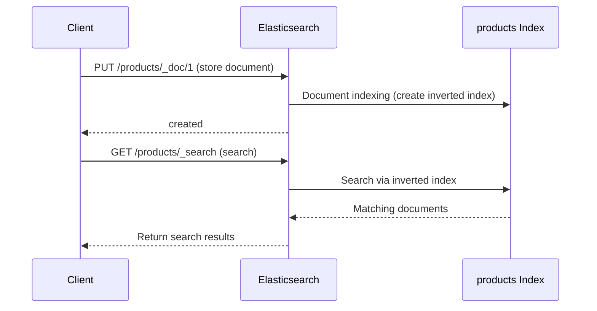

# Quick Start

Store and search data in Elasticsearch in 5 minutes.

## Overview


## Prerequisites

- **Docker Desktop** or Docker Engine
- **curl** or web browser

## Step 1: Start Elasticsearch

Run Elasticsearch and Kibana with Docker Compose.

```bash
# Navigate to docker/elasticsearch directory in repository root
cd docker/elasticsearch
docker-compose up -d
```

> **Don't have docker-compose.yml?**
> Check the file contents in [Environment Setup Guide](../examples/setup/).

Verify successful startup:

```bash
docker-compose ps
```

Expected output:
```
NAME            STATUS
elasticsearch   Up (healthy)
kibana          Up
```

> **Note:** It may take 30-60 seconds for Elasticsearch to fully start.

Check cluster health:

```bash
curl -s http://localhost:9200/_cluster/health | jq
```

```json
{
  "cluster_name": "docker-cluster",
  "status": "green",
  "number_of_nodes": 1
}
```

## Step 2: Access Kibana Dev Tools

Open Kibana in your browser:

```
http://localhost:5601
```

Select **Management → Dev Tools** from the left menu.

> **Dev Tools**: A console where you can directly execute Elasticsearch APIs.

## Step 3: Store Your First Document

Store product data in the Dev Tools console:

```json
PUT /products/_doc/1
{
  "name": "MacBook Pro 14-inch",
  "category": "Laptop",
  "price": 2399,
  "description": "M3 Pro chip, 18GB memory, Space Black"
}
```

Response:
```json
{
  "_index": "products",
  "_id": "1",
  "result": "created"
}
```

Let's add a few more:

```json
PUT /products/_doc/2
{
  "name": "MacBook Air 13-inch",
  "category": "Laptop",
  "price": 1299,
  "description": "M3 chip, 8GB memory, Midnight"
}

PUT /products/_doc/3
{
  "name": "iPad Pro 11-inch",
  "category": "Tablet",
  "price": 999,
  "description": "M4 chip, 256GB, Space Black"
}

PUT /products/_doc/4
{
  "name": "Galaxy Book4 Pro",
  "category": "Laptop",
  "price": 1499,
  "description": "Intel Core Ultra, 16GB memory"
}
```

## Step 4: Search

### Search All

Retrieve all products:

```json
GET /products/_search
{
  "query": {
    "match_all": {}
  }
}
```

### Keyword Search

Search for products containing "MacBook":

```json
GET /products/_search
{
  "query": {
    "match": {
      "name": "MacBook"
    }
  }
}
```

Response:
```json
{
  "hits": {
    "total": { "value": 2 },
    "hits": [
      { "_source": { "name": "MacBook Pro 14-inch", ... } },
      { "_source": { "name": "MacBook Air 13-inch", ... } }
    ]
  }
}
```

### Conditional Search

Laptops under $1500:

```json
GET /products/_search
{
  "query": {
    "bool": {
      "must": [
        { "match": { "category": "Laptop" } }
      ],
      "filter": [
        { "range": { "price": { "lte": 1500 } } }
      ]
    }
  }
}
```

**Congratulations!** You've verified Elasticsearch's basic operations.

## Shutdown

```bash
# In docker/elasticsearch directory
docker-compose down
```

To preserve data:
```bash
docker-compose stop  # Stop containers only, keep volumes
```

---

## What Happened?



1. **Document Storage**: You stored JSON documents in an index
2. **Indexing**: Elasticsearch automatically created an Inverted Index
3. **Search**: Results were found in milliseconds via the inverted index

> **What is an Inverted Index?**
> Like an index at the back of a book, it maps words → document locations.
> Stored as "MacBook" → [doc1, doc2] format, enabling fast search.

---

## Key API Summary

| Operation | HTTP Method | Endpoint | Description |
|-----------|-------------|----------|-------------|
| Create/Update Document | PUT | `/index/_doc/ID` | Store with specified ID |
| Create Document | POST | `/index/_doc` | Auto-generate ID |
| Get Document | GET | `/index/_doc/ID` | Retrieve specific document |
| Delete Document | DELETE | `/index/_doc/ID` | Delete specific document |
| Search | GET/POST | `/index/_search` | Query-based search |
| Delete Index | DELETE | `/index` | Delete entire index |

---

## Troubleshooting

### Elasticsearch Connection Failed

```
curl: (7) Failed to connect to localhost port 9200
```

**Solution:**
1. Verify Docker is running: `docker ps`
2. Check container status: `docker-compose ps`
3. Check logs: `docker-compose logs elasticsearch`
4. Wait for Elasticsearch to fully start (up to 60 seconds)

### Cluster Status is Yellow

In a single-node environment, Yellow is normal because Replicas cannot be allocated.

**In production:** Configure at least 2 or more nodes.

### Cannot Access Kibana

```
Kibana server is not ready yet
```

**Solution:**
1. Elasticsearch must be running properly first
2. Wait a moment and try again (up to 2 minutes)

### Out of Memory

```
bootstrap check failure: max virtual memory areas too low
```

**Solution on Linux:**
```bash
sudo sysctl -w vm.max_map_count=262144
```

---

## Next Steps

After completing Quick Start, proceed to the next steps:

| Goal | Recommended Document |
|------|---------------------|
| Understand Elasticsearch structure | [Core Components](../concepts/core-components/) |
| Learn schema design | [Data Modeling](../concepts/data-modeling/) |
| Spring Boot integration | [Environment Setup](../examples/setup/) |
