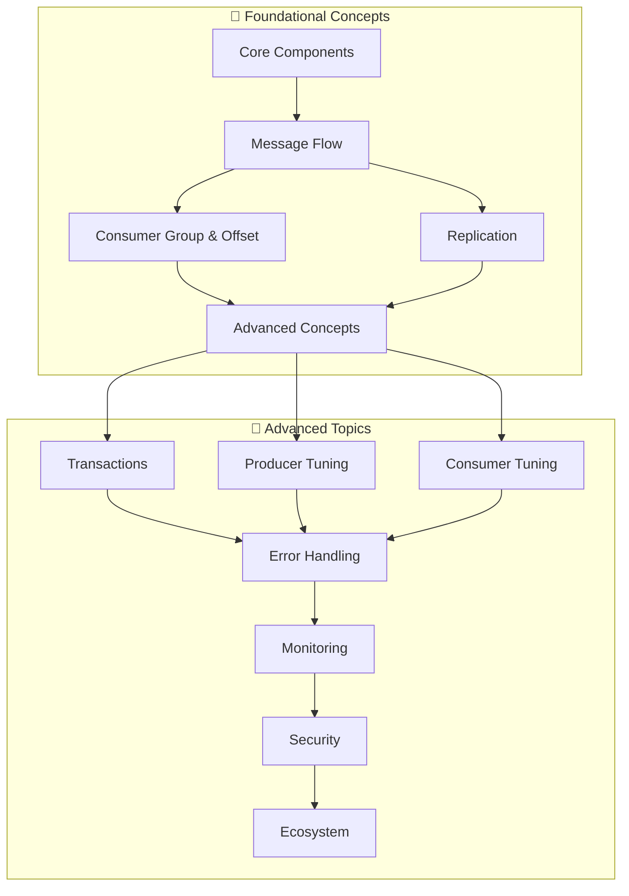

To properly utilize Kafka, knowing just the API usage is not enough. You need to understand how messages are stored, what path they take for delivery, and how they are recovered in failure scenarios to quickly diagnose and resolve problems that occur during operations. This section covers Kafka's core components and operating principles step by step.

## Learning Roadmap

The diagram below shows the dependency relationships between concepts. Follow the arrow direction for learning.

*This diagram shows the dependency relationships between Kafka concepts. Follow the recommended learning order from foundational concepts to advanced topics.*

#### Learning Path

The learning path below is designed considering dependencies between concepts. It's recommended to thoroughly understand foundational concepts before moving to advanced learning. Core Components and Message Flow in particular form the foundation for all subsequent concepts, so make sure to understand them well before proceeding.

**Foundational Concepts**

Foundational concepts cover the core elements that make up a Kafka cluster and the process of message delivery. The goal is to understand the complete flow where Producer sends a message, Broker stores it in a specific Partition of a Topic, and Consumer reads it. Along the way, you'll also learn how Consumer Groups enable parallel processing and why Offsets are important.

1. [Core Components](core-components/) - Understand the roles and relationships of Producer, Consumer, Broker, Topic, and Partition. These are the basic building blocks of Kafka architecture.
2. [Message Flow](message-flow/) - Trace the complete process of message delivery from Producer to Consumer. Examine in detail what happens at each stage.
3. [Consumer Group and Offset](consumer-group/) - Learn how multiple Consumers cooperate to process messages in parallel, and how Offset management tracks how far each Consumer has read.
4. [Replication](replication/) - Understand the replication mechanism that ensures data is not lost even during Broker failures. Covers the concepts of Leader, Follower, and ISR.
5. [Advanced Concepts](advanced-concepts/) - Covers concepts frequently encountered in practice such as acks settings, partitioning via Message Key, data retention policies, and Idempotent Producer.

**Advanced Topics**

Advanced topics cover advanced subjects for operating Kafka reliably and efficiently in production environments. These include essential content for actual service operation such as guaranteed message delivery through transactions, Producer and Consumer performance tuning, error handling, and monitoring system implementation.

6. [Transactions and Exactly-Once](transactions/) - Learn the transaction feature that ensures messages are processed exactly once. Especially important when integrating with Kafka Streams or other systems.
7. [Producer Tuning](producer-tuning/) - Covers how to optimize Producer throughput and latency through batch processing, compression, and buffer settings.
8. [Consumer Tuning](consumer-tuning/) - Examines in detail the settings that affect Consumer performance such as Fetch size, Poll interval, and commit strategies.
9. [Advanced Error Handling](error-handling/) - Learn error handling methods in production environments including retry strategies, failed message management using Dead Letter Topics, and failure recovery patterns.
10. [Monitoring Basics](monitoring/) - Build a monitoring system to understand the state of your Kafka cluster and detect problems early, covering Consumer Lag, Broker metrics, and alert configuration.
11. [Security](security/) - Covers security configuration for safely operating Kafka clusters including encryption via TLS, SASL authentication, and ACL-based authorization management.
12. [Ecosystem](ecosystem/) - Introduces major components of the Kafka ecosystem and their use cases including Kafka Connect, Schema Registry, and Kafka Streams.
