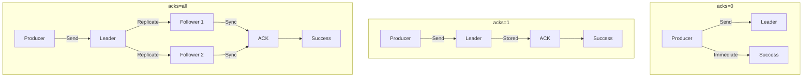
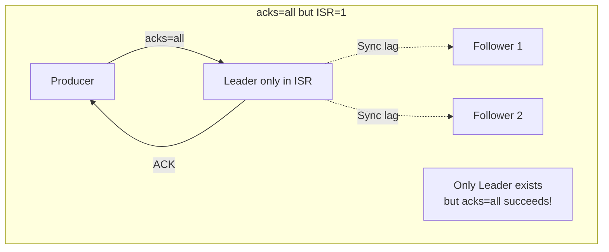
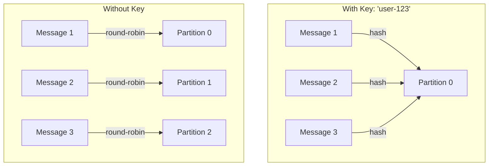
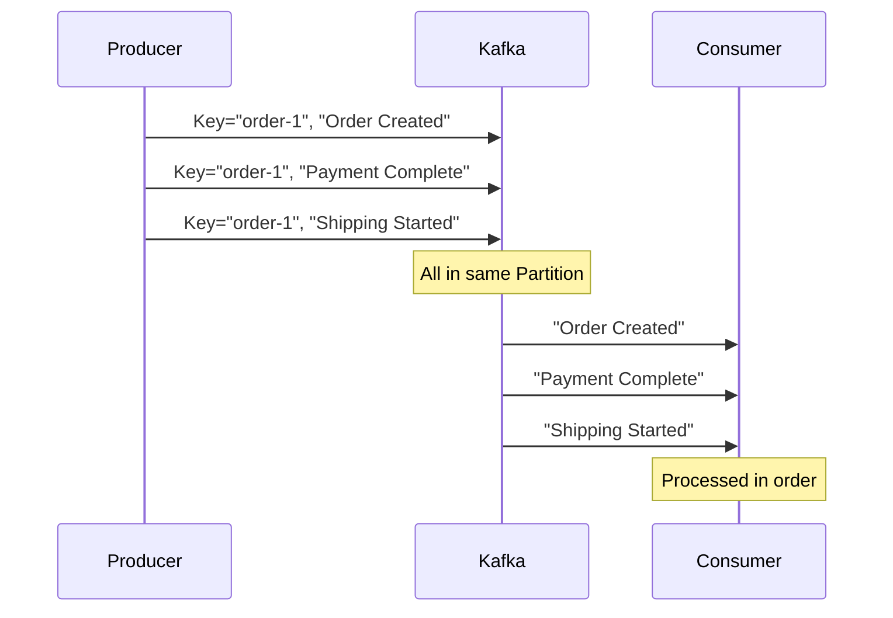
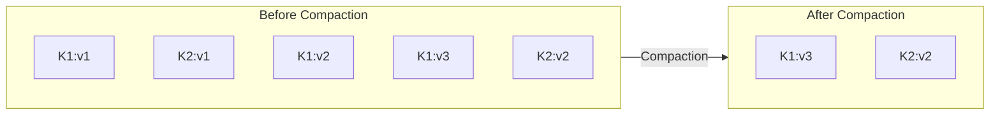
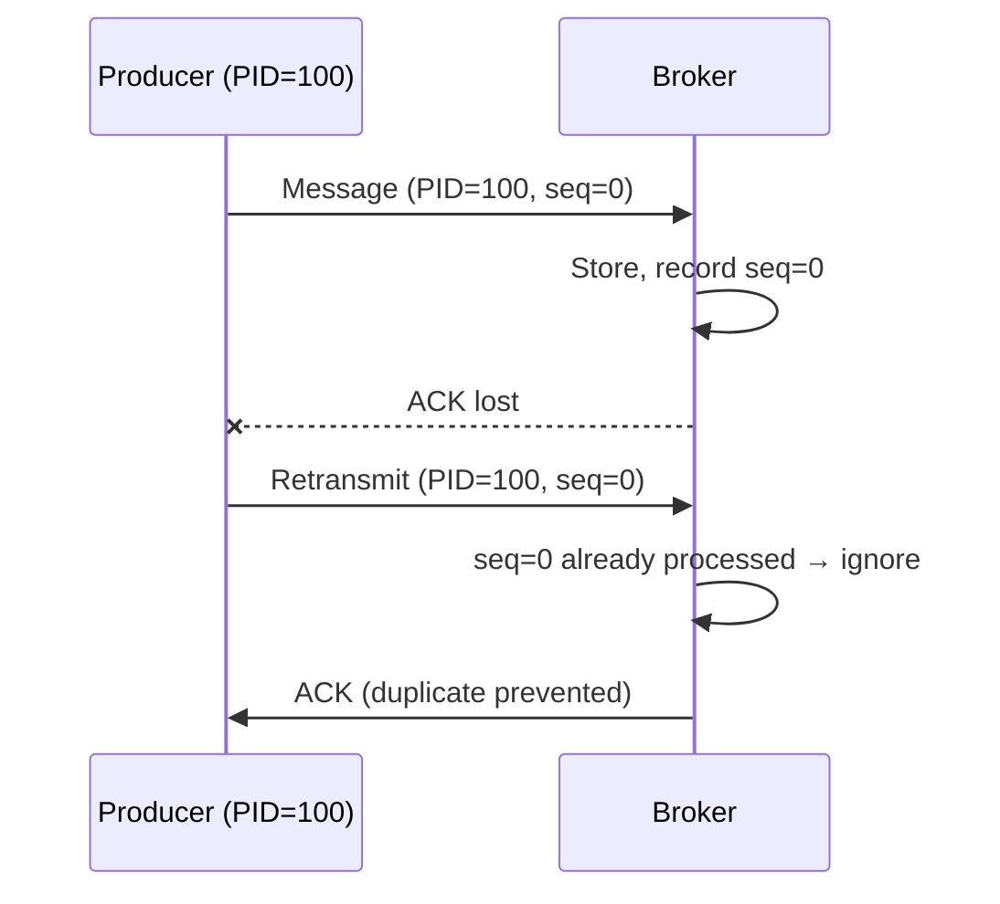


- acks=0 (fast/may lose), acks=1 (Leader only), acks=all (all ISR, recommended)
- Use acks=all + min.insync.replicas=2 combination for data safety
- Message Key sends to same Partition for ordering; be cautious when changing Partition count
- Retention: time-based deletion (default 7 days), size-based deletion, Log Compaction
- Idempotent Producer (default in Kafka 3.0+) prevents duplicates on network errors


**Target Audience**: Developers who want to understand Kafka's advanced concepts and optimize production settings

**Prerequisites**: Topic, Partition, Broker concepts from [Message Flow](../message-flow/), ISR, Leader, Follower concepts from [Replication](../replication/)

---

Understand acks, Message Key, and Retention policies. This document is written for Kafka 3.6.x, with code examples verified on Spring Boot 3.2.x, Spring Kafka 3.1.x, and Java 17 environments.

Before reading this document, you should understand Topic, Partition, and Broker concepts from [Message Flow](../message-flow/) and ISR, Leader, and Follower concepts from [Replication](../replication/).

#### acks (Acknowledgment)

acks is a setting that determines how the Producer confirms message delivery success. This setting affects the balance between message safety and transmission speed.



*Diagram: acks=0 completes immediately without waiting for response. acks=1 completes after Leader storage confirmation. acks=all returns ACK after Leader completes replication to all ISR Followers.*

**acks=0** means the Producer sends the next message immediately without waiting for a Broker response. It provides the fastest performance but has the highest risk of message loss since it doesn't even confirm if the message reached the Broker. Use only for cases where some loss is acceptable, like log collection or metrics.

**acks=1** returns ACK after the Leader Broker stores the message. Leader storage is confirmed, but if the Leader fails before replication to Followers, the message can be lost. Suitable for general event processing where a balance of speed and safety is needed.

**acks=all** returns ACK only after the message is replicated to all replicas in the ISR. The slowest but safest setting, used for cases where data loss is critical, like payments or orders.

**The Pitfall of acks=all and the Solution**

Data safety is not fully guaranteed with `acks=all` alone. `acks=all` confirms replication to all replicas in ISR, but if only the Leader remains in ISR, storing on just the Leader is treated as success.



To solve this problem, use the `min.insync.replicas` setting together. This setting specifies the minimum number of replicas that must be synchronized for ACK to be returned. Using `acks=all` with `min.insync.replicas=2` means writes only succeed when at least 2 replicas are in ISR. If ISR shrinks to 1, write requests fail, ensuring data safety.


- acks=0: Fastest, may lose (for logs/metrics)
- acks=1: Only Leader confirmation, may lose on Leader failure
- acks=all: All ISR confirmation, safest (recommended for production)
- acks=all alone is insufficient, must use with min.insync.replicas=2


```yaml
# Topic settings (recommended)
min.insync.replicas: 2  # Minimum 2 replicas required

# Producer settings
acks: all
```

In Spring Kafka, configure as follows:

```yaml
spring:
  kafka:
    producer:
      acks: all  # Recommended
      retries: 3
```

#### Message Key

Message Key is used to route messages to specific Partitions. With a Key, messages with the same Key are always stored in the same Partition, ensuring order.



With a Key, Kafka calculates the Key's hash value to determine the Partition. The same Key always produces the same hash value, so it's stored in the same Partition. Without a Key, the Sticky Partitioner (Kafka 2.4+) sends to the same Partition for a period for batch efficiency, then switches to another Partition.

**The Principle of Order Guarantee**

Using the same Key stores messages in the same Partition, and a single Partition is processed in order by one Consumer, so message order is guaranteed.



Using user ID as Key guarantees per-user event order, and using order ID as Key guarantees per-order state change order. In IoT environments, device ID as Key can group per-device data.

```java
import org.springframework.kafka.core.KafkaTemplate;
import org.springframework.stereotype.Service;

@Service
public class OrderProducer {

    private final KafkaTemplate<String, String> kafkaTemplate;

    public OrderProducer(KafkaTemplate<String, String> kafkaTemplate) {
        this.kafkaTemplate = kafkaTemplate;
    }

    // With Key - same orderId always goes to same Partition
    public void sendOrder(String orderId, String orderJson) {
        kafkaTemplate.send("orders", orderId, orderJson);
        //                  Topic    Key      Value
    }

    // Without Key (Sticky Partitioner, default in Kafka 2.4+)
    public void sendLog(String logMessage) {
        kafkaTemplate.send("logs", null, logMessage);
    }
}
```

**Caution: Changing Partition Count**

Changing the Partition count changes the Key hash, so existing and new messages may be stored in different Partitions. Even if Key "A" was originally stored in Partition 0, if the Partition count increases from 3 to 5, it may be stored in Partition 2. Therefore, for topics requiring Key-based order guarantee, set the Partition count large enough initially and don't change it.

#### Retention (Retention Policy)

Retention determines how long messages are kept. Kafka provides three retention policies.

**Time-based deletion** deletes messages after a specified time. The default is 7 days (604800000ms). Configure based on data characteristics: 7 days for event logs, 1 year for audit logs, 24 hours for session data.

```yaml
# Topic settings
retention.ms: 604800000  # 7 days (default)
```

**Size-based deletion** deletes oldest segments when Partition total size exceeds the specified capacity. Used when disk capacity management is needed.

```yaml
retention.bytes: 107374182400  # 100GB
```

**Log Compaction** keeps only the last value per Key. It organizes based on Key duplication rather than time or capacity. Suitable for cases where only the latest value is needed, like user profiles or settings state.



Log Compaction runs asynchronously in background threads. Only closed segments are Compaction targets; the current active segment being written to is excluded. With `min.cleanable.dirty.ratio` setting at 0.5 (default), Compaction starts when uncleaned data exceeds 50%.

**Tombstone Messages (Delete Processing)**

To delete a Key in a Log Compaction environment, send a Tombstone message with null value. Tombstone is kept for `delete.retention.ms` (default 24 hours) and then completely deleted in the next Compaction.

```java
import org.springframework.kafka.core.KafkaTemplate;
import org.springframework.stereotype.Service;

@Service
public class UserProfileService {

    private final KafkaTemplate<String, String> kafkaTemplate;

    public UserProfileService(KafkaTemplate<String, String> kafkaTemplate) {
        this.kafkaTemplate = kafkaTemplate;
    }

    // Delete user profile (send Tombstone)
    public void deleteUserProfile(String userId) {
        // null value means Tombstone message
        kafkaTemplate.send("user-profiles", userId, null);
        // Key completely deleted after delete.retention.ms (default 24 hours)
    }

    // Update user profile
    public void updateUserProfile(String userId, String profileJson) {
        kafkaTemplate.send("user-profiles", userId, profileJson);
    }
}
```

Consumer should process delete when receiving Tombstone message (null value).

```java
@KafkaListener(topics = "user-profiles", groupId = "profile-service")
public void consume(ConsumerRecord<String, String> record) {
    if (record.value() == null) {
        // Tombstone message - process delete
        log.info("User deleted: {}", record.key());
        userRepository.deleteById(record.key());
    } else {
        // Normal update
        userRepository.save(parseProfile(record.value()));
    }
}
```

**Mixed Policy**

You can apply time-based deletion and Compaction simultaneously. Setting `cleanup.policy=compact,delete` implements policies like "keep only the latest value per Key within the last 7 days".

```yaml
# Time-based deletion + Compaction applied together
cleanup.policy: compact,delete
retention.ms: 604800000  # 7 days
```

#### Idempotent Producer

Idempotent Producer guarantees prevention of duplicate messages on retransmission due to network errors.

When ACK is lost due to network error, the Producer doesn't know if the message was stored and retransmits. Normal Producer stores the same message twice in this case. Idempotent Producer assigns a Producer ID (PID) and sequence number to each message, allowing the Broker to detect and ignore duplicates.



`enable.idempotence=true` is the default since Kafka 3.0. Unless there's a special reason, don't turn off this setting. When Idempotent Producer is enabled, `acks=all`, `retries=Integer.MAX_VALUE`, and `max.in.flight.requests.per.connection=5` are automatically set.

```yaml
spring:
  kafka:
    producer:
      properties:
        enable.idempotence: true  # Default: true (Kafka 3.0+)
```

#### Comprehensive Configuration Examples

For **high-reliability production environments**, prioritize data safety.

```yaml
# Producer
spring:
  kafka:
    producer:
      acks: all
      retries: 3
      properties:
        enable.idempotence: true  # Kafka 3.0+ default
        max.in.flight.requests.per.connection: 5

# When creating Topic
kafka-topics.sh --create \
  --topic orders \
  --partitions 6 \
  --replication-factor 3 \
  --config min.insync.replicas=2 \
  --config retention.ms=604800000
```

For **high-performance logging environments**, prioritize throughput.

```yaml
# Producer
spring:
  kafka:
    producer:
      acks: 0
      batch-size: 65536
      linger-ms: 10

# Topic
retention.ms: 86400000  # 1 day
```

#### Summary

acks determines the message delivery guarantee level. For production environments, using `acks=all` with `min.insync.replicas=2` is recommended for data safety.

Message Key is used for partitioning and order guarantee. Messages where order matters should use the same Key to be stored in the same Partition, and be aware that Key hash may change when Partition count changes.

Retention defines the data retention policy. Use time-based deletion for event logs, Log Compaction for state storage, and both policies can be applied together as needed.

Idempotent Producer is enabled by default since Kafka 3.0, automatically preventing duplicate messages on network errors.

#### FAQ

**Q: Does acks=all significantly reduce performance?**

It depends on the environment. Generally, expect 10~30% latency increase compared to acks=1. Throughput can be compensated with batch settings.

**Q: Can order be guaranteed without Message Key?**

Possible with only 1 Partition, but you sacrifice parallelism. Using Key is recommended in practice.

**Q: What happens when using both Log Compaction and time-based deletion?**

With `cleanup.policy=compact,delete` setting, "only the latest value per Key within N days" is kept. Both policies are applied as AND condition.

**Q: Should Idempotent Producer always be enabled?**

Default is true in Kafka 3.0+. Don't turn it off without a special reason. Performance impact is minimal.

**Q: What if min.insync.replicas=2 but there are only 2 Brokers?**

If even 1 fails, writes are blocked (NotEnoughReplicasException). At least 3 Brokers + RF=3 + min.insync.replicas=2 is recommended.

#### References

- [Kafka Producer Configs - Apache Kafka Documentation](https://kafka.apache.org/documentation/#producerconfigs)
- [Log Compaction - Confluent Documentation](https://docs.confluent.io/platform/current/kafka/design.html#log-compaction)
- [KIP-98: Exactly Once Delivery and Transactional Messaging](https://cwiki.apache.org/confluence/display/KAFKA/KIP-98)
- [Idempotent Producer - Confluent Blog](https://www.confluent.io/blog/exactly-once-semantics-are-possible-heres-how-apache-kafka-does-it/)

#### Next Steps

- [Transactions and Exactly-Once](../transactions/) - Message delivery guarantees and Transaction API
- [Producer Tuning](../producer-tuning/) - Producer performance optimization
