# Advanced Concepts

Understanding acks, Message Key, and Retention policies.

## acks (Acknowledgment)

Determines how Producer confirms successful message delivery.

### acks Options

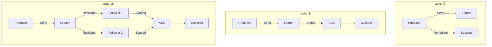

### Option Comparison

| acks | Behavior | Speed | Safety | Use Case |
|------|----------|-------|--------|----------|
| **0** | No response wait | Fastest | Lowest | Logs, metrics |
| **1** | Leader store confirmed | Medium | Medium | General events |
| **all** | All ISR replicated | Slowest | Highest | Payments, orders |

### ⚠️ Important: The acks=all Pitfall

> **`acks=all` alone doesn't guarantee data safety!**

`acks=all` confirms replication to "all replicas in ISR". But what if only the Leader remains in ISR?

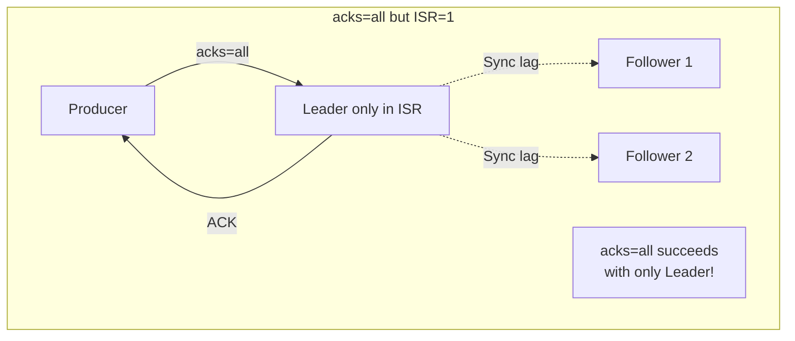

**Solution: Use with `min.insync.replicas`**

```yaml
# Topic configuration (recommended)
min.insync.replicas: 2  # Require at least 2 replicas

# Producer configuration
acks: all
```

| Configuration | ISR=3 | ISR=2 | ISR=1 |
|---------------|-------|-------|-------|
| `acks=all` only | ✅ Success | ✅ Success | ✅ Success (Risky!) |
| `acks=all` + `min.insync.replicas=2` | ✅ Success | ✅ Success | ❌ Failure (Safe) |

### Spring Kafka Configuration

```yaml
spring:
  kafka:
    producer:
      acks: all  # Recommended
      retries: 3
```

### Trade-off Diagram

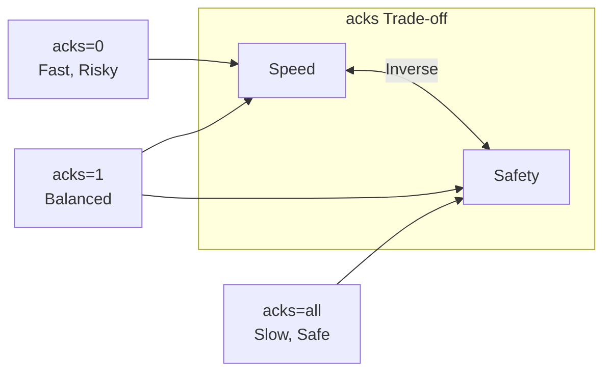

## Message Key

Used to route messages to specific Partitions.

### Role of Key

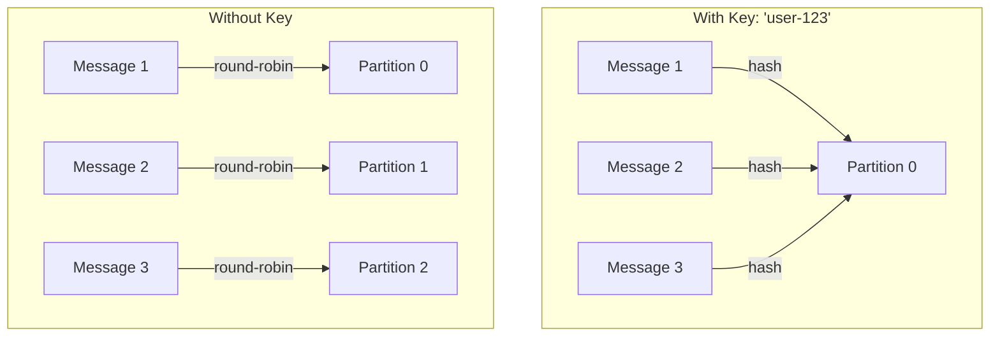

### Order Guarantee

> **Same Key = Same Partition = Order Guaranteed**

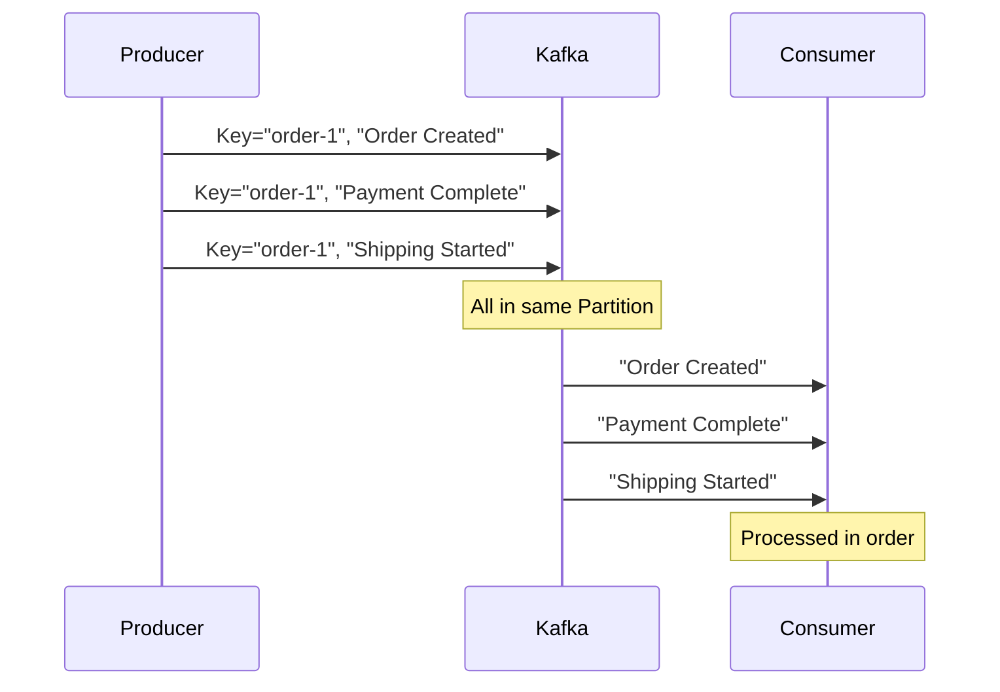

### Use Cases

| Key Choice | Effect | Example |
|------------|--------|---------|
| **User ID** | Guarantee order per user | `user-123` |
| **Order ID** | Guarantee order status sequence | `order-456` |
| **Device ID** | Group IoT device data | `device-789` |

### Spring Kafka Code

```java
// With Key
kafkaTemplate.send("orders", orderId, orderJson);
//                  Topic    Key      Value

// Without Key (round-robin)
kafkaTemplate.send("logs", null, logMessage);
```

### Caution

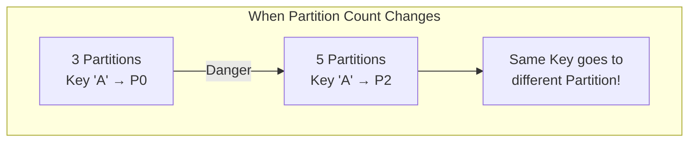

> **Warning:** Changing Partition count changes Key hash, causing existing and new messages to go to different Partitions.

## Retention Policy

Determines how long messages are kept.

### Policy Types

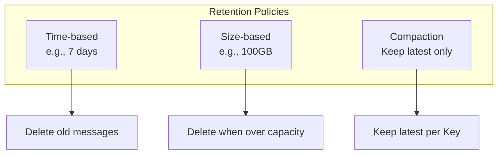

### Time-based (Default)

```yaml
# Topic configuration
retention.ms: 604800000  # 7 days (default)
```

```
Day 1    Day 2    Day 3    ...    Day 7    Day 8
[msg1]   [msg2]   [msg3]          [msg7]   [Deleted]
```

### Size-based

```yaml
retention.bytes: 107374182400  # 100GB
```

Deletes oldest segments when capacity exceeded.

### Log Compaction

Policy that **keeps only the last value per Key**.

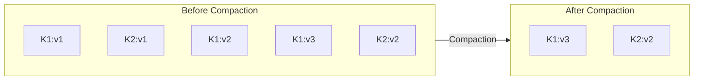

### Recommended Settings by Use Case

| Use Case | Policy | Example Setting |
|----------|--------|-----------------|
| **Event logs** | Time-based | 7-day retention |
| **Audit logs** | Time-based | 1-year retention |
| **User state** | Compaction | Latest state only |
| **Session data** | Time-based | 24 hours |

### Compaction Configuration

```yaml
# Topic configuration
cleanup.policy: compact
min.cleanable.dirty.ratio: 0.5
```

## Idempotent Producer

Guarantees **no duplicate messages** during retransmission due to network errors.

### Problem Scenario

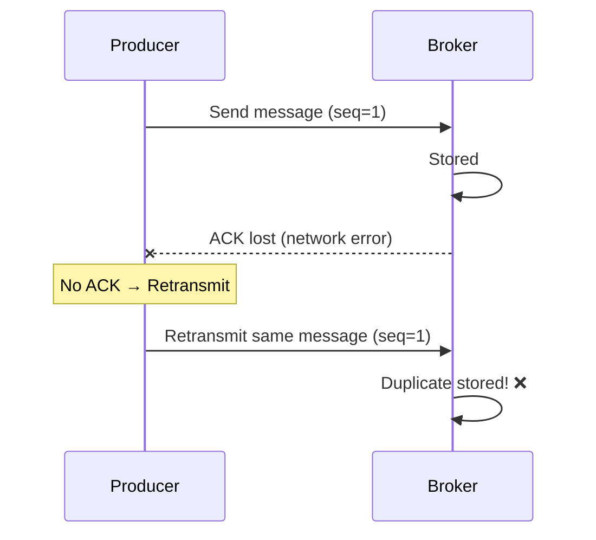

### Solution: Idempotent Producer

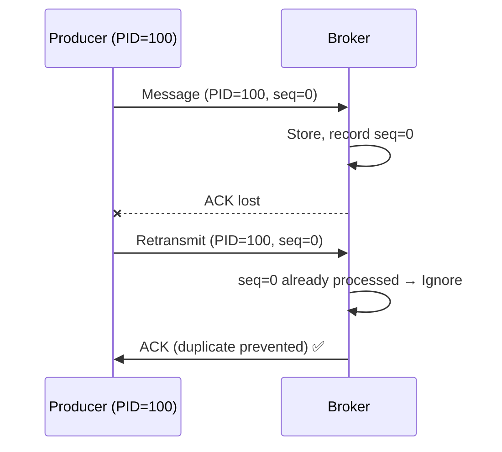

### How It Works

| Concept | Description |
|---------|-------------|
| **Producer ID (PID)** | Producer identifier, assigned by broker |
| **Sequence Number** | Message sequence per Partition |
| **Duplicate Detection** | Same PID + seq is ignored |

### Configuration

```yaml
spring:
  kafka:
    producer:
      properties:
        enable.idempotence: true  # Default: true (Kafka 3.0+)
```

### Caution

```java
// Automatically configured when Idempotent Producer is enabled
acks = all                              // Required
retries = Integer.MAX_VALUE             // Infinite retries
max.in.flight.requests.per.connection = 5  // Max 5
```

> **Note:** `enable.idempotence=true` is the default since Kafka 3.0.

## Combined Configuration Examples

### High-Reliability Production Environment

```yaml
# Producer
spring:
  kafka:
    producer:
      acks: all
      retries: 3
      properties:
        enable.idempotence: true  # Kafka 3.0+ default
        max.in.flight.requests.per.connection: 5

# Topic creation
kafka-topics.sh --create \
  --topic orders \
  --partitions 6 \
  --replication-factor 3 \
  --config min.insync.replicas=2 \
  --config retention.ms=604800000
```

### High-Performance Logging Environment

```yaml
# Producer
spring:
  kafka:
    producer:
      acks: 0
      batch-size: 65536
      linger-ms: 10

# Topic
retention.ms: 86400000  # 1 day
```

## Summary

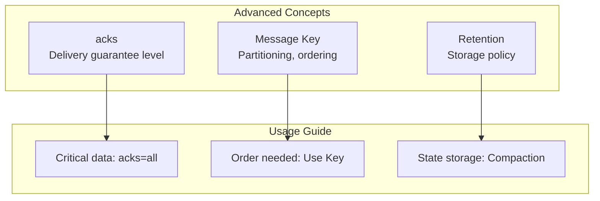

| Concept | Key Question | Recommendation |
|---------|--------------|----------------|
| **acks** | How safe? | Production: `all` |
| **Message Key** | Order important? | Use Key when order matters |
| **Retention** | How long to keep? | Based on requirements |

## Next Steps

- [Transactions & Exactly-Once](../transactions/) - Message delivery guarantees and Transaction API
- [Hands-on Examples](../../examples/) - Apply learned concepts
