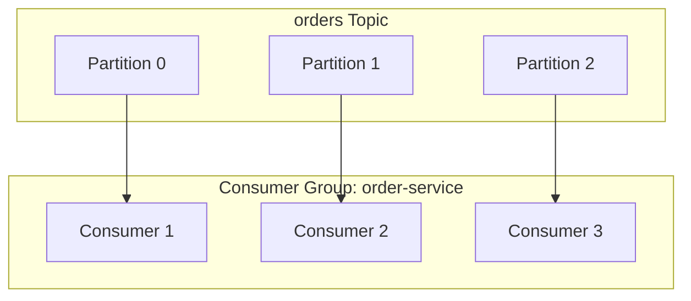
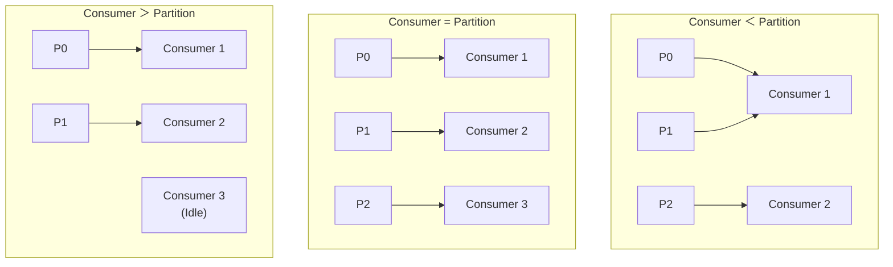
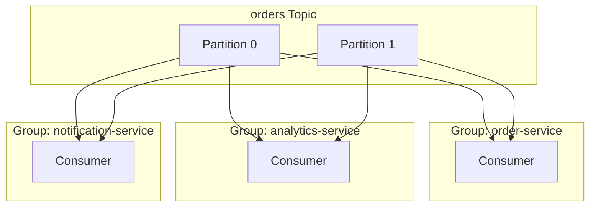
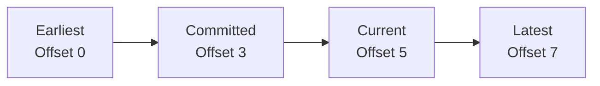
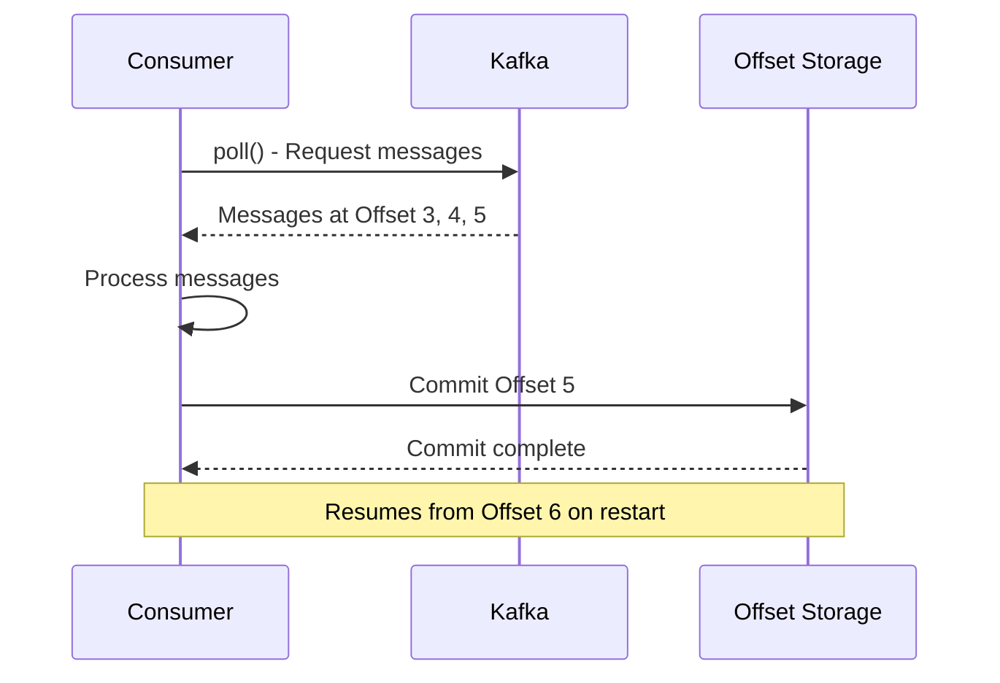
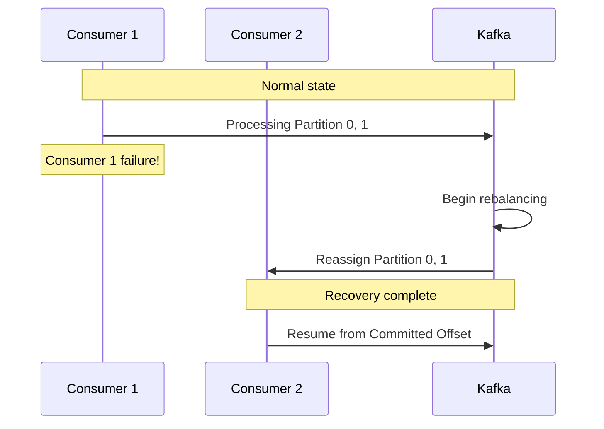
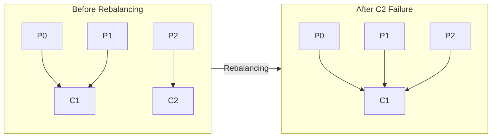
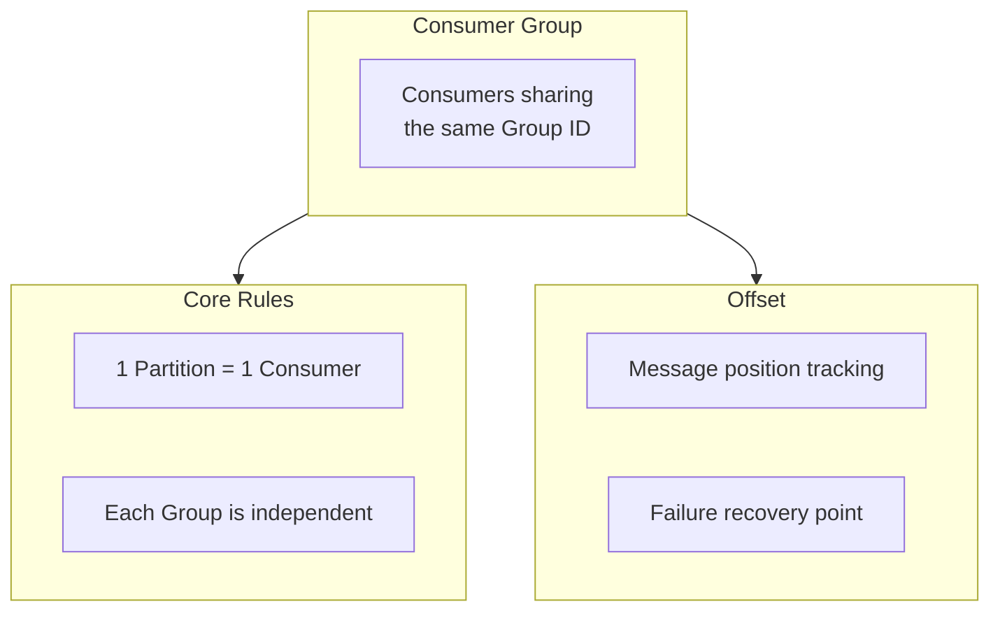

# Consumer Group & Offset

Understanding the core concepts of parallel processing and progress tracking.

## What is a Consumer Group?

A **Consumer Group** is a logical group of Consumers with the same purpose.



### Core Rule

> **One Partition can only be read by one Consumer within a Consumer Group**

Why this rule matters:
- **Order guarantee**: Messages from the same Partition are processed in order
- **Duplication prevention**: Same message isn't processed by multiple Consumers simultaneously

## Consumer Count vs Partition Count



| Situation | Result |
|-----------|--------|
| Consumer < Partition | Some Consumers handle multiple Partitions |
| Consumer = Partition | Optimal (1:1 mapping) |
| Consumer > Partition | Some Consumers remain idle |

## Multiple Consumer Groups

Different Consumer Groups consume messages **independently**.



Each group:
- Receives all messages independently
- Manages separate Offsets
- Processes in parallel without affecting each other

## What is an Offset?

An **Offset** is a sequential position number of a message within a Partition.

```
Partition 0:
┌─────┬─────┬─────┬─────┬─────┬─────┬─────┐
│  0  │  1  │  2  │  3  │  4  │  5  │  6  │
└─────┴─────┴─────┴─────┴─────┴─────┴─────┘
                    ↑           ↑
            Current Offset    Latest Offset
             (Read position)   (Newest message)
```

### Types of Offsets



| Offset Type | Description |
|-------------|-------------|
| **Earliest** | Position of oldest message |
| **Committed** | Last committed position |
| **Current** | Position Consumer is currently reading |
| **Latest** | Position of newest message |

## Offset Commit

The process of informing Kafka that a Consumer successfully processed messages.



### Auto Commit vs Manual Commit

```yaml
# application.yml
spring:
  kafka:
    consumer:
      enable-auto-commit: true   # Auto commit (default)
      auto-commit-interval: 5000 # Commit every 5 seconds
```

| Method | Pros | Cons |
|--------|------|------|
| **Auto Commit** | Simple implementation | Data loss possible on processing failure |
| **Manual Commit** | Precise control | Complex implementation |

### Manual Commit Example

```java
@KafkaListener(topics = "orders")
public void consume(ConsumerRecord<String, String> record,
                    Acknowledgment ack) {
    try {
        processOrder(record.value());
        ack.acknowledge();  // Commit on success
    } catch (Exception e) {
        // Don't commit - will be reprocessed
        log.error("Processing failed", e);
    }
}
```

## Failure Recovery Scenarios

### When a Consumer Fails



### Rebalancing

Process of redistributing Partitions within a Consumer Group:

**Trigger conditions:**
- Consumer added/removed
- Consumer failure
- Partition count change



## auto.offset.reset Setting

Behavior when a Consumer Group starts for the first time or has no Offset information:

```yaml
spring:
  kafka:
    consumer:
      auto-offset-reset: earliest  # or latest
```

| Setting | Behavior |
|---------|----------|
| **earliest** | Read from oldest message |
| **latest** | Read only new messages |
| **none** | Error if no Offset exists |

## Summary



| Concept | Role |
|---------|------|
| **Consumer Group** | Parallel processing, load balancing |
| **Offset** | Progress tracking, failure recovery |
| **Rebalancing** | Automatic failure recovery |

## Next Steps

- [Replication](../replication/) - Data replication and high availability
