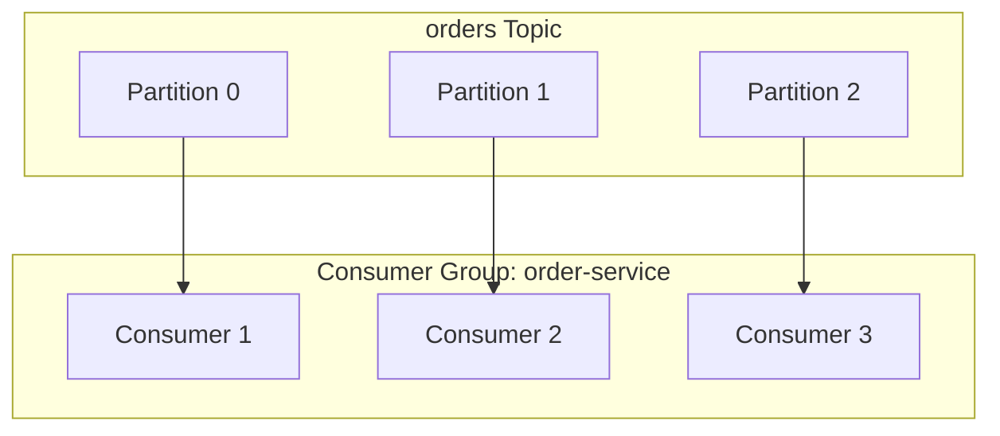
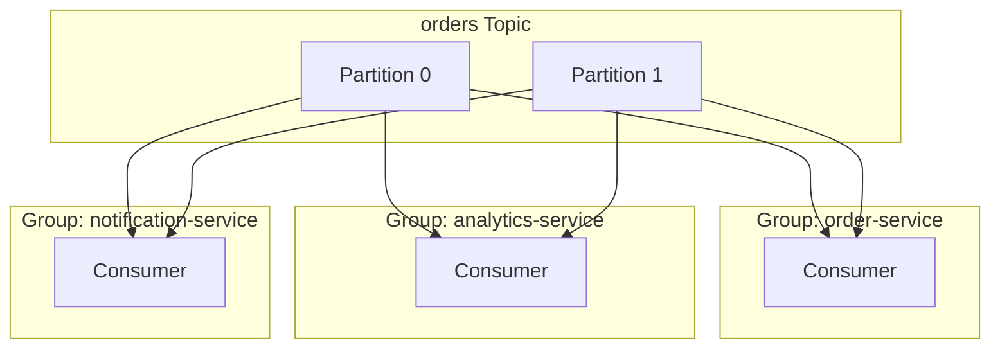
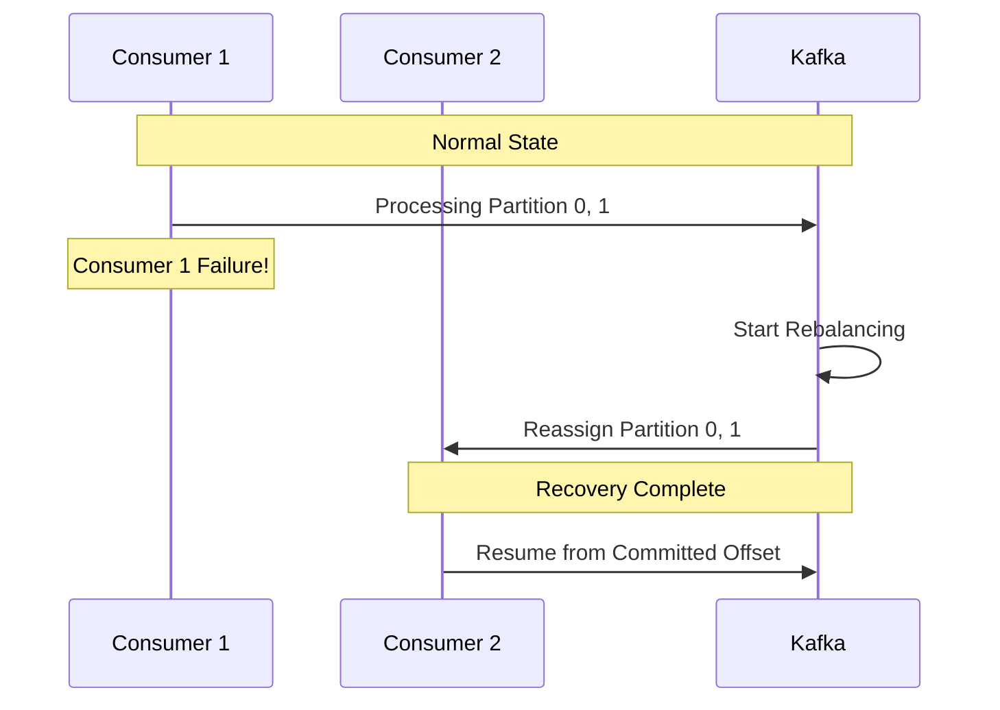


- Consumer Group is a logical grouping that enables parallel processing of Consumers with the same purpose
- Core rule: One Partition can only be read by one Consumer within a Group
- Offset is the message position number within a Partition, stored in the __consumer_offsets topic
- Auto commit is convenient but risks data loss; manual commit provides precise control
- When a Consumer fails, rebalancing automatically redistributes Partitions


**Target audience**: Developers building or operating Kafka Consumers, those learning about parallel processing and state management

**Prerequisites**: Topic and Partition concepts from [Message Flow](message-flow/), Leader/Follower concepts from [Replication](replication/)

---

Understanding the core concepts of parallel processing and progress state management. This document is based on Kafka 3.6.x, with code examples verified in Spring Boot 3.2.x, Spring Kafka 3.1.x, and Java 17 environments.

Before reading this document, you should understand the Topic and Partition concepts from [Message Flow](message-flow/) and the Leader and Follower concepts from [Replication](replication/).

#### What is a Consumer Group?

A Consumer Group is a logical grouping of Consumers with the same purpose. Taking an order processing service as an example, multiple server instances each operate as Consumers and form a single Consumer Group. The Consumers in this group collaborate to process messages from a topic by dividing the workload.



*Diagram: The 3 Partitions of the orders Topic are assigned 1:1 to the 3 Consumers in the order-service Consumer Group, where each Consumer handles one Partition exclusively.*

In the diagram above, the orders topic consists of 3 Partitions, and the order-service Consumer Group has 3 Consumers. You can see that each Consumer handles one Partition exclusively. This is the core operating principle of Consumer Groups.

**Core Rule: One Partition can only be read by one Consumer within a Consumer Group**

This rule defines Kafka's parallel processing model. Since messages from the same Partition are always processed sequentially by the same Consumer, message ordering is guaranteed. Additionally, multiple Consumers never process the same message simultaneously, preventing duplicate processing.

**Why this design?**

Jay Kreps, the creator of Kafka, chose this rule for clear reasons. First, simplicity: since only ordering within a Partition needs to be guaranteed, complex synchronization mechanisms like distributed locks are unnecessary. Second, performance: overhead from coordination between Consumers is eliminated, improving processing speed. Third, scalability: the number of Partitions directly determines maximum parallelism, making the scaling model clear.


- Consumer Group is a logical grouping that enables parallel processing of Consumers with the same purpose
- Core rule: One Partition can only be read by one Consumer within a Group
- This rule enables ordering guarantees, duplicate processing prevention, and simple synchronization


#### Relationship Between Consumer Count and Partition Count

The number of Consumers and Partitions directly affects performance and resource efficiency. When there are fewer Consumers than Partitions, some Consumers handle multiple Partitions. This is normal operation, where a single Consumer processes messages from multiple Partitions sequentially.

When the number of Consumers equals the number of Partitions, optimal 1:1 mapping is achieved. Each Consumer handles exactly one Partition, distributing load evenly and maximizing parallel processing efficiency. This is the recommended configuration.

When there are more Consumers than Partitions, some Consumers will have no Partition to receive and remain idle. This wastes resources and should be avoided. However, keeping a few spare Consumers for failover is sometimes acceptable.

```java
// Recommended: Determine Consumer instance count based on Partition count
// If orders topic has 6 Partitions, maximum 6 Consumer instances
@KafkaListener(topics = "orders", groupId = "order-service")
public void consume(String message) {
    // Consumer instance count is controlled via Kubernetes Deployment replicas
}
```

In production environments, Consumer instance count is typically controlled through Kubernetes Deployment replicas settings. The common pattern is to first determine the topic's Partition count, then set replicas accordingly.


- Consumer count < Partition count: Some Consumers handle multiple Partitions (normal)
- Consumer count = Partition count: Optimal 1:1 mapping, maximum parallel processing efficiency
- Consumer count > Partition count: Idle Consumers occur, resource waste


#### Multiple Consumer Groups

Different Consumer Groups consume messages completely independently. This characteristic is useful when messages from a single topic need to be processed by multiple services for their own purposes.



*Diagram: Messages from the orders Topic are independently delivered to three Consumer Groups: order-service, analytics-service, and notification-service. Each Group independently receives all messages.*

In the diagram above, messages from the orders topic are delivered to all three Consumer Groups. order-service processes orders, analytics-service collects analytics data, and notification-service sends notifications. Each group independently receives all messages, manages separate Offsets (stored in the `__consumer_offsets` topic), and processes messages at their own pace without affecting each other.


- Different Consumer Groups consume messages completely independently
- Each Group receives all messages and manages separate Offsets
- Useful when a single Topic needs to be processed by multiple services for different purposes


#### What is an Offset?

An Offset is the sequential position number of a message within a Partition. It starts at 0 and increments by 1 each time a message is added. Consumers use this Offset to track how far they've read, allowing them to resume from where they left off after a restart.

```
Partition 0:
┌─────┬─────┬─────┬─────┬─────┬─────┬─────┐
│  0  │  1  │  2  │  3  │  4  │  5  │  6  │
└─────┴─────┴─────┴─────┴─────┴─────┴─────┘
                    ↑           ↑
            Committed Offset  Log End Offset
              (committed)      (latest message)
```

**Types of Offsets**

There are several types of Offsets, each with different meanings. Earliest (Log Start Offset) is the position of the oldest message, pointing to the oldest message that hasn't been deleted according to the retention policy. Committed Offset is the position that the Consumer last confirmed as processed. Current Position is where the Consumer is currently reading, and Latest (Log End Offset, LEO) is the position of the newest message.

Consumer Lag is the difference between Log End Offset and Committed Offset, representing the number of messages not yet processed. If this value keeps increasing, it means the Consumer's processing speed cannot keep up with the Producer's production speed, requiring monitoring.

**Offset Storage Location**

Offsets are stored in an internal topic called `__consumer_offsets`. By default, it is configured with 50 Partitions and a Replication Factor of 3.

```bash
# Check Offset storage (Kafka 3.6+)
kafka-topics.sh --describe --topic __consumer_offsets \
    --bootstrap-server localhost:9092
```

Before Kafka 0.9, Offsets were stored in Zookeeper. However, there were two problems. First, Zookeeper uses a consensus protocol (ZAB) that requires majority agreement for every write, creating write bottlenecks. Second, there were scalability limitations where Zookeeper load increased dramatically as the number of Consumers grew.

Storing in a Kafka topic leverages Kafka's own replication and durability, and uses Log Compaction to keep only the latest Offsets for efficient storage. Additionally, throughput can be controlled by the number of Partitions, enabling horizontal scaling.

Inside `__consumer_offsets`, a Key combining Consumer Group ID, Topic, and Partition is stored with a Value containing Offset, metadata, and commit timestamp. This topic is configured as a Compacted topic, keeping only the latest value per Key.

```bash
# Check internal messages (for debugging)
kafka-console-consumer.sh \
    --topic __consumer_offsets \
    --bootstrap-server localhost:9092 \
    --formatter "kafka.coordinator.group.GroupMetadataManager\$OffsetsMessageFormatter" \
    --from-beginning
```


- Offset is the sequential position number of a message within a Partition (starting from 0)
- Consumer Lag = Log End Offset - Committed Offset (measures processing delay)
- Offsets are stored in the __consumer_offsets topic (50 Partitions, RF=3)


#### Offset Commit

Offset commit is the process of notifying Kafka that a Consumer has successfully processed a message. Messages before the committed Offset are considered processed, so when a Consumer restarts, it starts reading from after the committed Offset.

**Auto Commit vs Manual Commit**

Auto commit automatically commits the current position at set intervals (default 5 seconds). While simple to implement, if a failure occurs during message processing, Offsets for unprocessed messages may already be committed, leading to data loss. It's suitable for cases where some loss is acceptable, such as log collection or metrics transmission.

```yaml
# application.yml - Auto commit configuration
spring:
  kafka:
    consumer:
      enable-auto-commit: true   # Auto commit (Spring Kafka 3.x default: false)
      auto-commit-interval: 5000 # Commit every 5 seconds (Kafka default)
```

Manual commit explicitly controls the commit timing in application code. Since commits only occur after message processing is fully complete, data loss can be prevented. While implementation becomes more complex, it's essential for cases where data accuracy is important, such as payments and orders.

**Manual Commit Implementation Example**

```java
import org.springframework.kafka.annotation.KafkaListener;
import org.springframework.kafka.support.Acknowledgment;
import org.apache.kafka.clients.consumer.ConsumerRecord;
import org.slf4j.Logger;
import org.slf4j.LoggerFactory;
import org.springframework.stereotype.Component;

@Component
public class OrderConsumer {

    private static final Logger log = LoggerFactory.getLogger(OrderConsumer.class);

    @KafkaListener(
        topics = "orders",
        groupId = "order-service",
        containerFactory = "kafkaListenerContainerFactory"
    )
    public void consume(ConsumerRecord<String, String> record,
                        Acknowledgment ack) {
        try {
            log.info("Received: partition={}, offset={}, value={}",
                     record.partition(), record.offset(), record.value());

            processOrder(record.value());

            ack.acknowledge();  // Commit only on success
            log.debug("Committed offset: {}", record.offset());

        } catch (Exception e) {
            // Do not commit - will be reprocessed in next poll()
            log.error("Processing failed. offset={}. Will retry.", record.offset(), e);
        }
    }

    private void processOrder(String orderJson) {
        // Order processing logic
    }
}
```

In the code above, the Offset is only committed when `Acknowledgment.acknowledge()` is called. If an exception occurs, no commit is made, so the message will be received again in the next poll() for reprocessing.

To use manual commit, you need to specify AckMode as MANUAL in the ContainerFactory configuration.

```java
import org.springframework.context.annotation.Bean;
import org.springframework.context.annotation.Configuration;
import org.springframework.kafka.config.ConcurrentKafkaListenerContainerFactory;
import org.springframework.kafka.core.ConsumerFactory;
import org.springframework.kafka.listener.ContainerProperties.AckMode;

@Configuration
public class KafkaConfig {

    @Bean
    public ConcurrentKafkaListenerContainerFactory<String, String>
            kafkaListenerContainerFactory(ConsumerFactory<String, String> consumerFactory) {

        ConcurrentKafkaListenerContainerFactory<String, String> factory =
                new ConcurrentKafkaListenerContainerFactory<>();
        factory.setConsumerFactory(consumerFactory);
        factory.getContainerProperties().setAckMode(AckMode.MANUAL);
        return factory;
    }
}
```

#### auto.offset.reset Configuration

This setting determines where to start reading when a Consumer Group starts for the first time or when there is no existing Offset information.

```yaml
spring:
  kafka:
    consumer:
      auto-offset-reset: earliest  # or latest, none
```

Setting `earliest` reads from the oldest message. Use this when a new Consumer Group needs to process all existing data. Suitable when preventing data loss is important.

Setting `latest` reads only new messages. Messages before the Consumer Group starts are ignored. Use this when only real-time processing is needed and historical data is not required.

Setting `none` throws an exception when there is no Offset information. Use this when you want to explicitly manage Offsets, preventing the Consumer from operating in unexpected situations.

**Common Mistake: auto.offset.reset Not Working**

`auto.offset.reset` only applies when Offsets don't exist. This setting is ignored for Consumer Groups that already have committed Offsets.

```bash
# Check Consumer Group with already committed Offsets
kafka-consumer-groups.sh --describe --group order-service \
    --bootstrap-server localhost:9092

# Example output:
# GROUP           TOPIC    PARTITION  CURRENT-OFFSET  LOG-END-OFFSET  LAG
# order-service   orders   0          1523            1523            0
```

In the output above, if CURRENT-OFFSET is displayed, Offsets have already been committed. In this case, setting earliest will not read from the beginning. You need to manually reset Offsets, and detailed methods can be found in [Consumer Advanced Operations](consumer-advanced/).


- Auto commit is convenient but risks data loss; manual commit provides precise control
- Use manual commit (ack.acknowledge()) when data accuracy is important
- auto.offset.reset only applies when Offsets don't exist; ignored for already committed cases


#### Failure Recovery and Rebalancing

When a Consumer fails, Kafka automatically performs rebalancing. Rebalancing is the process of redistributing Partition assignments within a Consumer Group.



*Diagram: When Consumer 1 fails, Kafka starts rebalancing, reassigns Partition 0 and 1 (previously handled by Consumer 1) to Consumer 2, which resumes processing from the Committed Offset.*

When Consumer 1 fails, Kafka detects this and initiates rebalancing. Partitions 0 and 1 that Consumer 1 was handling are reassigned to Consumer 2. Consumer 2 resumes message processing from each Partition's Committed Offset.

During rebalancing, all Consumers in that Consumer Group temporarily stop processing messages. Minimizing this downtime is an important operational concern. Details on rebalancing optimization and Lag monitoring are covered in [Consumer Advanced Operations](consumer-advanced/).


- Kafka automatically performs rebalancing when a Consumer fails
- New leader resumes from Committed Offset (no data loss)
- All Consumers pause during rebalancing; minimizing downtime is critical


#### Comparison with Other Messaging Systems

Comparing Kafka's Consumer Group model with other messaging systems helps understand it better.

Kafka uses a Pull model where Consumers actively fetch messages. Messages are retained permanently based on configuration and are not deleted after consumption. Ordering is guaranteed within a Partition, and one Partition can only be read by one Consumer within a Consumer Group. Message replay is possible through Offset reset.

RabbitMQ uses a Push model where the Broker delivers messages to Consumers. Messages are deleted after consumption, and ordering is guaranteed within a Queue. It uses a competing Consumer model where multiple Consumers can fetch messages from the same Queue. It's suitable when complex routing logic is needed or low latency is required.

Apache Pulsar supports a hybrid model with both Pull and Push. Messages can be permanently stored through Tiered Storage, and it supports Partition ordering and Offset reset similar to Kafka. Rebalancing is handled on the Broker side, simplifying Client implementation.

Kafka Consumer Groups are suitable for high-volume streaming processing (hundreds of thousands of messages per second), cases requiring message replay, and event processing where ordering is important.

#### Summary

Consumer Groups logically group Consumers with the same purpose to enable parallel processing and load distribution. The core rule is that one Partition is assigned to only one Consumer within a Consumer Group.

Offset is the position number of a message within a Partition, tracking the Consumer's progress. It's stored in the `__consumer_offsets` topic, allowing processing to resume from where it left off after a Consumer restart.

Commit is the process of recording message processing completion. Auto commit is convenient but risks data loss, while manual commit is complex but provides precise control. Manual commit should be used when data accuracy is important.

#### FAQ

**Q: How should I name Consumer Group IDs?**

The `{service-name}-{purpose}` pattern is recommended. For example, `order-service-processor`, `analytics-aggregator` - use names that clearly indicate which service and what purpose.

**Q: How can multiple services process the same message?**

Use different Consumer Group IDs for each service. Since each Consumer Group independently receives all messages, multiple services can process messages from a single topic for their own purposes.

**Q: Will messages be lost if a Consumer dies?**

Messages after the Committed Offset will not be lost. After rebalancing, another Consumer takes over the Partition and reprocesses from the Committed Offset. However, when using auto commit, if a failure occurs during processing, there may be a discrepancy between the committed Offset and actually processed messages, which could lead to loss.

#### How to Run the Code Examples

To run the code examples in this document, Kafka must be running first. Start Kafka with the `docker-compose up -d` command in the docker directory at the project root.

```bash
# Start Kafka (from project root)
cd docker && docker-compose up -d

# Create Topic
kafka-topics.sh --create --topic orders \
    --partitions 3 --replication-factor 1 \
    --bootstrap-server localhost:9092
```

Run the example project.

```bash
# Navigate to example directory
cd examples/quick-start

# Run application
./gradlew bootRun
```

Send messages and verify Consumer operation.

```bash
# Send message via REST API
curl -X POST "http://localhost:8080/send?message=Hello"

# Verify receipt in Consumer logs
# Received: partition=0, offset=0, value=Hello

# Check Consumer Group status
kafka-consumer-groups.sh --describe --group order-service \
    --bootstrap-server localhost:9092
```

#### References

- [Kafka Official Documentation: Consumer Groups](https://kafka.apache.org/documentation/#consumerconfigs)
- [Confluent: Kafka Consumer Design](https://docs.confluent.io/platform/current/clients/consumer.html)
- [KIP-429: Consumer Group Protocol](https://cwiki.apache.org/confluence/display/KAFKA/KIP-429)

#### Next Steps

- [Consumer Advanced Operations](consumer-advanced/) - Rebalancing optimization, Lag monitoring
- [Replication](replication/) - Data replication and high availability
