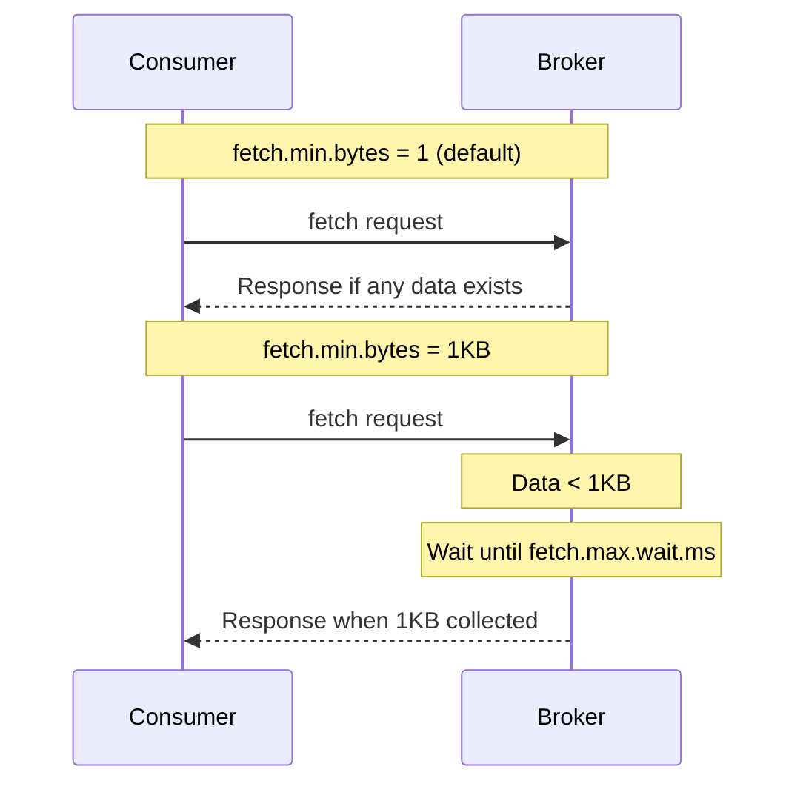
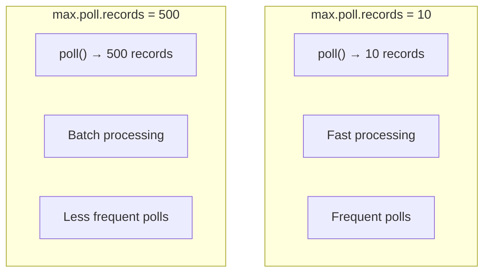
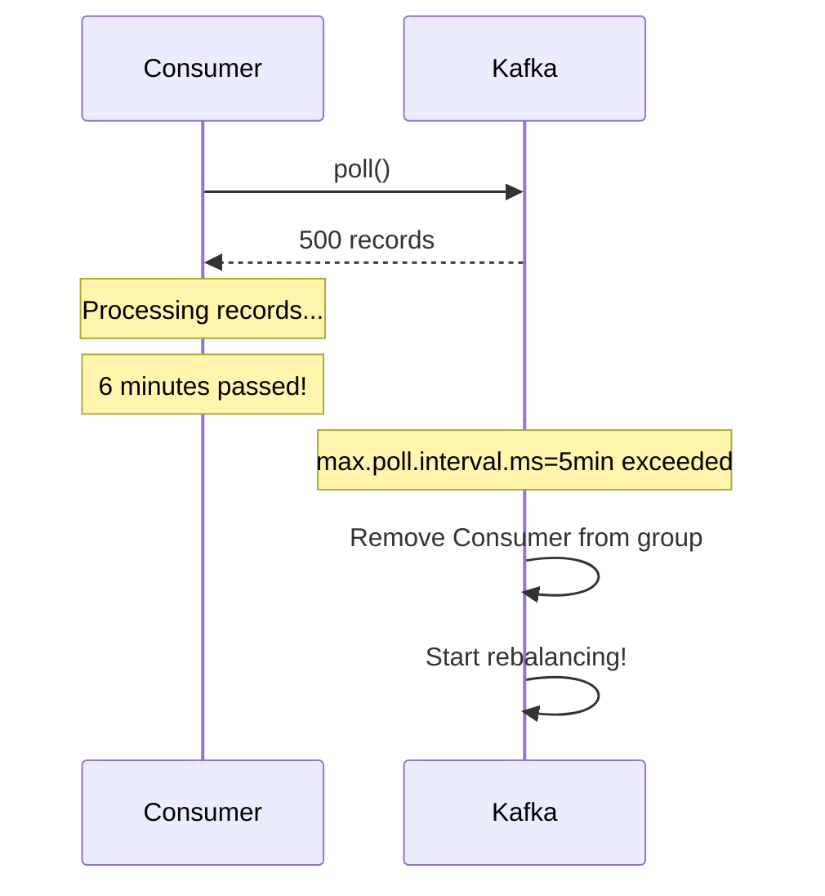
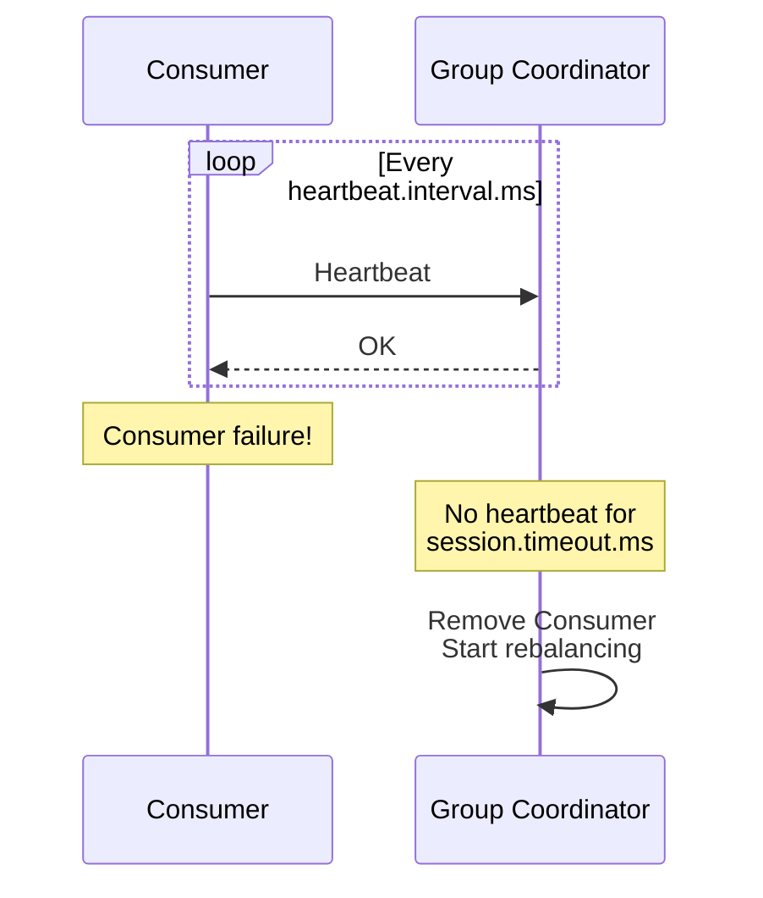
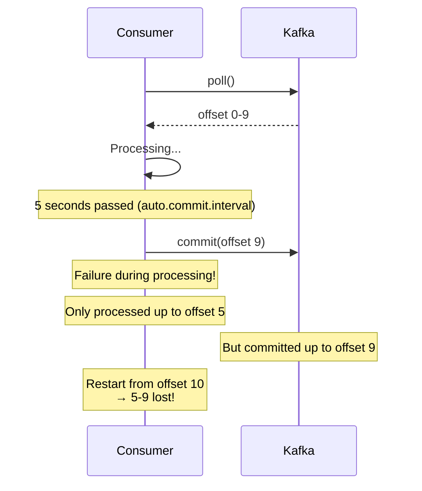
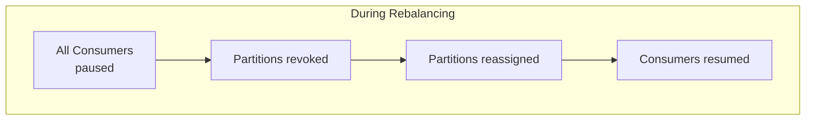
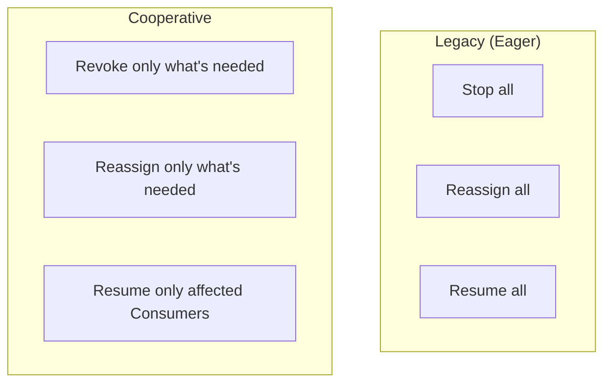
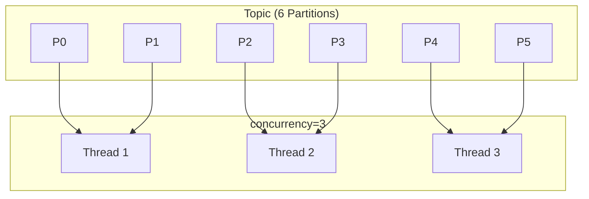
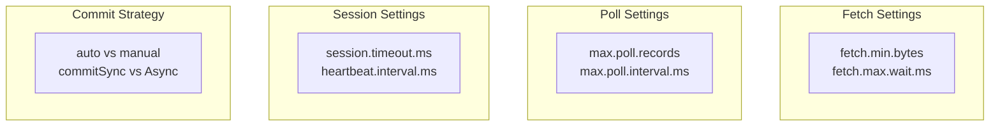

# Consumer Tuning

Understanding settings for optimizing Consumer performance and stable operation.

## Consumer Internal Structure

```mermaid
flowchart LR
    subgraph Kafka["Kafka"]
        BROKER[Broker]
    end

    subgraph Consumer["Consumer Internal"]
        FETCH[Fetcher]
        POLL[poll()]
        PROCESS[Message Processing]
        COMMIT[Offset Commit]
    end

    subgraph Application["Application"]
        LOGIC[Business Logic]
    end

    BROKER -->|fetch.min.bytes<br>fetch.max.wait.ms| FETCH
    FETCH -->|max.poll.records| POLL
    POLL --> PROCESS
    PROCESS --> LOGIC
    PROCESS --> COMMIT
```

## Key Settings Overview

| Setting | Default | Impact |
|---------|---------|--------|
| `fetch.min.bytes` | 1 | Minimum fetch size |
| `fetch.max.wait.ms` | 500ms | Fetch wait time |
| `max.poll.records` | 500 | Max records per poll |
| `max.poll.interval.ms` | 5 min | Max poll interval |
| `session.timeout.ms` | 45 sec | Session timeout |
| `heartbeat.interval.ms` | 3 sec | Heartbeat interval |

## Fetch Settings

### fetch.min.bytes

Minimum data size for Broker to respond.



### fetch.max.wait.ms

Maximum wait time to respond even if `fetch.min.bytes` isn't met.

```yaml
spring:
  kafka:
    consumer:
      fetch-min-size: 1  # default
      fetch-max-wait: 500  # 500ms (default)
```

| Setting Combination | Effect | Use Case |
|---------------------|--------|----------|
| min=1, wait=500 | Immediate response | Minimize latency |
| min=1KB, wait=500 | Batch priority | Increase throughput |
| min=1KB, wait=100 | Fast response | Balance |

## Poll Settings

### max.poll.records

Maximum records fetched in one `poll()` call.



### max.poll.interval.ms

**One of the most important settings.**

Maximum allowed time between two `poll()` calls.



### Configuration Guide

```yaml
spring:
  kafka:
    consumer:
      properties:
        max.poll.records: 500  # default
        max.poll.interval.ms: 300000  # 5 min (default)
```

**Rule:** `max.poll.interval.ms` > (processing time per record × `max.poll.records`)

```java
// Example: 100ms processing time per record
// max.poll.records = 500
// Required time: 100ms × 500 = 50 seconds
// max.poll.interval.ms should be at least 60 seconds
```

## Session and Heartbeat Settings

### Understanding the Relationship



### Setting Relationship

```yaml
spring:
  kafka:
    consumer:
      properties:
        session.timeout.ms: 45000  # Session timeout
        heartbeat.interval.ms: 3000  # Heartbeat interval
```

**Recommended Rules:**
- `session.timeout.ms` >= 3 × `heartbeat.interval.ms`
- Generally `heartbeat.interval.ms` is 1/3 of `session.timeout.ms`

### Setting Scenarios

| Environment | session.timeout | heartbeat.interval | Effect |
|-------------|-----------------|-------------------|--------|
| **Fast detection** | 10s | 3s | Fast rebalancing, frequent false positives |
| **Stable** | 45s | 15s | Slow detection, stable |
| **GC issues** | 60s+ | 20s | Tolerates GC pauses |

## Offset Commit Strategy

### Auto Commit

```yaml
spring:
  kafka:
    consumer:
      enable-auto-commit: true  # default
      auto-commit-interval: 5000  # Commit every 5s
```



### Manual Commit

```yaml
spring:
  kafka:
    consumer:
      enable-auto-commit: false
    listener:
      ack-mode: manual  # or manual_immediate
```

#### commitSync vs commitAsync

```java
@KafkaListener(topics = "my-topic")
public void listen(ConsumerRecord<String, String> record,
                   Consumer<?, ?> consumer) {
    try {
        process(record);

        // Sync commit: blocks until commit completes
        consumer.commitSync();

        // Async commit: returns immediately, result via callback
        consumer.commitAsync((offsets, exception) -> {
            if (exception != null) {
                log.error("Commit failed", exception);
            }
        });
    } catch (Exception e) {
        // Don't commit → will be reprocessed
    }
}
```

| Method | Pros | Cons |
|--------|------|------|
| **commitSync** | Guaranteed commit | Performance impact |
| **commitAsync** | High performance | Complex failure handling |

#### Spring Kafka Acknowledgment

```java
@KafkaListener(topics = "my-topic")
public void listen(String message, Acknowledgment ack) {
    process(message);
    ack.acknowledge();  // Commit
}
```

### AckMode Options

```yaml
spring:
  kafka:
    listener:
      ack-mode: manual  # Select option
```

| AckMode | Behavior |
|---------|----------|
| `RECORD` | Commit per record |
| `BATCH` | Commit after all records from poll() |
| `MANUAL` | Commit when acknowledge() called |
| `MANUAL_IMMEDIATE` | Commit immediately on acknowledge() |

## Rebalancing Optimization

### Rebalancing Cost



### Cooperative Rebalancing (Recommended)

Incremental rebalancing supported in Kafka 2.4+.

```yaml
spring:
  kafka:
    consumer:
      properties:
        partition.assignment.strategy: org.apache.kafka.clients.consumer.CooperativeStickyAssignor
```



### Static Membership

Prevents rebalancing on Consumer restart.

```yaml
spring:
  kafka:
    consumer:
      properties:
        group.instance.id: consumer-${HOSTNAME}  # Fixed ID
        session.timeout.ms: 300000  # 5 min
```

If Consumer restarts within 5 minutes, it keeps the same Partitions.

## Throughput vs Latency

### Throughput Optimization

```yaml
spring:
  kafka:
    consumer:
      fetch-min-size: 1048576  # 1MB
      fetch-max-wait: 500
      properties:
        max.poll.records: 1000
        fetch.max.bytes: 52428800  # 50MB
```

### Latency Optimization

```yaml
spring:
  kafka:
    consumer:
      fetch-min-size: 1
      fetch-max-wait: 100  # 100ms
      properties:
        max.poll.records: 100
```

### Balanced Configuration

```yaml
spring:
  kafka:
    consumer:
      fetch-min-size: 1
      fetch-max-wait: 500
      properties:
        max.poll.records: 500
        max.poll.interval.ms: 300000
        session.timeout.ms: 45000
        heartbeat.interval.ms: 3000
```

## Parallel Processing

### Concurrency Setting

```yaml
spring:
  kafka:
    listener:
      concurrency: 3  # 3 Consumer threads
```



**Rule:** concurrency <= Partition count

## Consumer Lag Management

### What is Lag?

```
Partition 0:
├── Latest Offset: 1000
├── Consumer Offset: 800
└── Lag: 200
```

### Lag Causes and Solutions

| Cause | Solution |
|-------|----------|
| Slow processing | Increase concurrency, optimize logic |
| Not enough Partitions | Increase Partition count |
| Network issues | Optimize fetch settings |
| Reprocessing | Adjust position via seek |

## Summary



| Goal | Key Settings |
|------|--------------|
| **Throughput ↑** | fetch.min.bytes ↑, max.poll.records ↑ |
| **Latency ↓** | fetch.max.wait ↓, max.poll.records ↓ |
| **Stability** | Proper session/heartbeat settings |
| **Accuracy** | Manual commit |

## Next Steps

- [Advanced Error Handling](../error-handling/) - Error handling patterns and Dead Letter Topic
