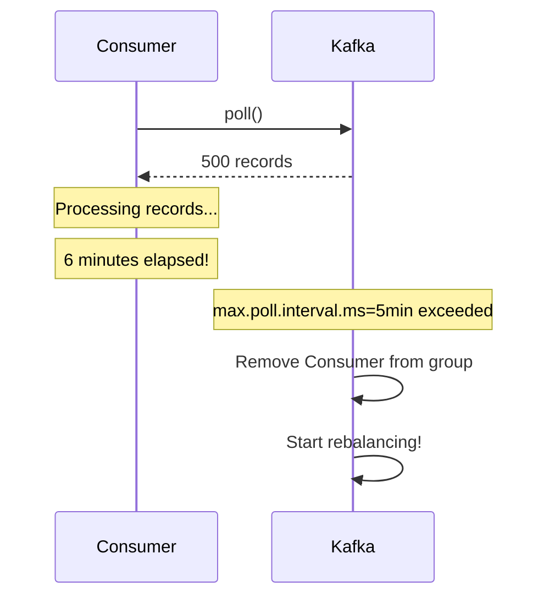
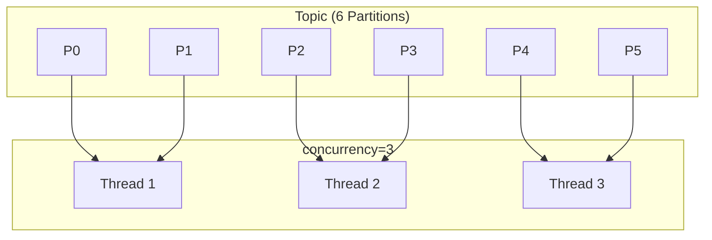


- Use fetch.min.bytes/fetch.max.wait.ms to balance batch efficiency and latency
- max.poll.records and max.poll.interval.ms are key to preventing rebalancing
- session.timeout.ms should be at least 3x heartbeat.interval.ms
- Throughput optimization: increase fetch.min.size, increase max.poll.records
- Latency optimization: decrease fetch.min.size, decrease fetch.max.wait


**Target Audience**: Developers optimizing Consumer performance, operators seeking operational stability

**Prerequisites**: Consumer operation principles from [Consumer Group & Offset]()

---

Understand Consumer performance optimization and stable operation settings.

#### Consumer Internal Structure

Consumer operates by fetching messages from Broker, delivering to the application, and committing Offset after processing. When Fetcher retrieves data from Broker, it's delivered to the application through poll(), and Offset is committed after processing.

```mermaid
flowchart LR
    subgraph Kafka["Kafka"]
        BROKER[Broker]
    end

    subgraph Consumer["Consumer Internals"]
        FETCH[Fetcher]
        POLL[poll()]
        PROCESS[Message Processing]
        COMMIT[Offset Commit]
    end

    subgraph Application["Application"]
        LOGIC[Business Logic]
    end

    BROKER -->|fetch.min.bytes<br>fetch.max.wait.ms| FETCH
    FETCH -->|max.poll.records| POLL
    POLL --> PROCESS
    PROCESS --> LOGIC
    PROCESS --> COMMIT
```

*Diagram: Consumer internal structure - Fetcher retrieves data from Broker, delivers to application through poll(), commits Offset after processing. Related settings apply at each stage.*

Key settings include `fetch.min.bytes` for minimum fetch size (default 1), `fetch.max.wait.ms` for fetch wait time (default 500ms), `max.poll.records` for maximum records per poll (default 500), `max.poll.interval.ms` for maximum poll interval (default 5 minutes), `session.timeout.ms` for session timeout (default 45 seconds), and `heartbeat.interval.ms` for heartbeat interval (default 3 seconds).


- Consumer operation: Fetcher → poll() → Message Processing → Offset Commit
- Key settings: fetch.min.bytes, max.poll.records, max.poll.interval.ms
- Balance throughput and latency through setting combinations


#### Fetch Settings

**fetch.min.bytes**

The minimum data size for Broker to respond. With default 1, it responds immediately if there's even 1 byte of data. Increasing to 1KB waits until 1KB accumulates or fetch.max.wait.ms is reached.

**fetch.max.wait.ms**

The maximum wait time to respond even if fetch.min.bytes is not met. Together with fetch.min.bytes, it balances batch efficiency and latency.

```yaml
spring:
  kafka:
    consumer:
      fetch-min-size: 1  # Default
      fetch-max-wait: 500  # 500ms (default)
```

min=1, wait=500 combination responds immediately to minimize latency. min=1KB, wait=500 prioritizes batching to increase throughput. min=1KB, wait=100 balances fast response with batching.


- fetch.min.bytes: Minimum data size before response (1=immediate, 1KB+=batch efficiency)
- fetch.max.wait.ms: Maximum wait time to respond even without meeting min
- Balance batch efficiency and latency with these two settings


#### Poll Settings

**max.poll.records**

The maximum number of records retrieved in a single poll() call. Small values process quickly with frequent poll() calls. Large values provide higher efficiency through batch processing but increase processing time.

**max.poll.interval.ms**

One of the most important settings. The maximum allowed time between two poll() calls. Exceeding this time removes the Consumer from the group and triggers rebalancing.



*Diagram: When 6 minutes pass during record processing after poll(), max.poll.interval.ms (5 minutes) is exceeded, removing Consumer from group and starting rebalancing.*

The rule is `max.poll.interval.ms` > (processing time per record × `max.poll.records`). For example, with 100ms processing time per record and max.poll.records=500, required time is 50 seconds, so max.poll.interval.ms should be at least 60 seconds.


- max.poll.records: Number of records per fetch (small=fast processing, large=batch efficiency)
- max.poll.interval.ms: Rebalancing occurs when poll() interval exceeds this
- Rule: max.poll.interval.ms > (processing time × max.poll.records)


```yaml
spring:
  kafka:
    consumer:
      properties:
        max.poll.records: 500  # Default
        max.poll.interval.ms: 300000  # 5 minutes (default)
```

#### Session and Heartbeat Settings

Consumer sends Heartbeat every heartbeat.interval.ms to indicate it's alive. If no Heartbeat is received for session.timeout.ms, Consumer is considered failed, removed from the group, and rebalancing starts.

```yaml
spring:
  kafka:
    consumer:
      properties:
        session.timeout.ms: 45000  # Session timeout
        heartbeat.interval.ms: 3000  # Heartbeat interval
```

The recommended rule is session.timeout.ms >= 3 × heartbeat.interval.ms. Generally, heartbeat.interval.ms is set to 1/3 of session.timeout.ms. For fast detection, set session.timeout=10 seconds, heartbeat=3 seconds, but this may cause frequent false positives. For stable operation, session.timeout=45 seconds, heartbeat=15 seconds is appropriate. In environments with GC issues, set session.timeout=60 seconds or more, heartbeat=20 seconds to accommodate GC pauses.

#### Offset Commit Strategies

**Auto Commit**

```yaml
spring:
  kafka:
    consumer:
      enable-auto-commit: true  # Default
      auto-commit-interval: 5000  # Commit every 5 seconds
```

Auto commit automatically commits Offset at configured intervals. Simple, but if a failure occurs during processing, messages after the already committed Offset may be lost.

**Manual Commit**

```yaml
spring:
  kafka:
    consumer:
      enable-auto-commit: false
    listener:
      ack-mode: manual  # Or manual_immediate
```

commitSync blocks until commit completes, guaranteeing reliable commits but reducing performance. commitAsync returns immediately for high performance but handling failures is complex.

```java
@KafkaListener(topics = "my-topic")
public void listen(String message, Acknowledgment ack) {
    process(message);
    ack.acknowledge();  // Commit
}
```

Spring Kafka AckMode options include RECORD for committing per record, BATCH for committing after all records in poll() are processed, MANUAL for committing on acknowledge() call, and MANUAL_IMMEDIATE for immediate commit on acknowledge().

#### Rebalancing Optimization

When rebalancing occurs, all Consumers pause, Partitions are revoked and reassigned, and Consumers resume. Processing is interrupted during this process, so minimizing rebalancing is important.

**Cooperative Rebalancing (Recommended)**

Incremental rebalancing supported in Kafka 2.4+. The existing Eager approach stops all, reassigns all, then resumes all. The Cooperative approach revokes only what's needed, reassigns only what's needed, and resumes only affected Consumers.

```yaml
spring:
  kafka:
    consumer:
      properties:
        partition.assignment.strategy: org.apache.kafka.clients.consumer.CooperativeStickyAssignor
```

**Static Membership**

Prevents rebalancing on Consumer restart. With a fixed ID, if Consumer restarts within 5 minutes, it keeps the same Partitions.

```yaml
spring:
  kafka:
    consumer:
      properties:
        group.instance.id: consumer-${HOSTNAME}  # Fixed ID
        session.timeout.ms: 300000  # 5 minutes
```

#### Throughput vs Latency

**Throughput Optimization**

To increase throughput, increase batch size and allow wait time.

```yaml
spring:
  kafka:
    consumer:
      fetch-min-size: 1048576  # 1MB
      fetch-max-wait: 500
      properties:
        max.poll.records: 1000
        fetch.max.bytes: 52428800  # 50MB
```

**Latency Optimization**

To reduce latency, decrease batch size and configure for fast response.

```yaml
spring:
  kafka:
    consumer:
      fetch-min-size: 1
      fetch-max-wait: 100  # 100ms
      properties:
        max.poll.records: 100
```

**Balanced Settings**

```yaml
spring:
  kafka:
    consumer:
      fetch-min-size: 1
      fetch-max-wait: 500
      properties:
        max.poll.records: 500
        max.poll.interval.ms: 300000
        session.timeout.ms: 45000
        heartbeat.interval.ms: 3000
```

#### Parallel Processing

The concurrency setting controls the number of Consumer threads. With 6 Partitions and concurrency=3, each thread handles 2 Partitions.

```yaml
spring:
  kafka:
    listener:
      concurrency: 3  # 3 Consumer threads
```



*Diagram: With a Topic having 6 Partitions and concurrency=3, each thread handles 2 Partitions.*

The rule is concurrency <= Partition count. If concurrency exceeds Partition count, some threads become idle.


- concurrency setting controls Consumer thread count
- Rule: concurrency <= Partition count (idle threads if exceeded)
- 6 Partitions + concurrency=3 = 2 Partitions per thread


#### Consumer Lag Management

Lag is Latest Offset minus Consumer Offset. Causes and solutions for Lag: if processing speed is slow, increase concurrency or optimize processing logic. If Partitions are insufficient, increase Partition count. If there are network issues, optimize fetch settings. If reprocessing is needed, adjust position using seek.

#### Summary

Fetch settings (fetch.min.bytes, fetch.max.wait.ms) control how data is retrieved from Broker. Poll settings (max.poll.records, max.poll.interval.ms) control how data is delivered to the application. Session settings (session.timeout.ms, heartbeat.interval.ms) control Consumer state detection. Commit strategy (auto vs manual, commitSync vs Async) determines how processing completion is recorded.

To increase throughput, increase fetch.min.bytes and max.poll.records. To reduce latency, decrease fetch.max.wait and max.poll.records. For stability, set appropriate session/heartbeat. For accuracy, use manual commit.

#### Next Steps

- [Advanced Error Handling]() - Error handling patterns and Dead Letter Topic
