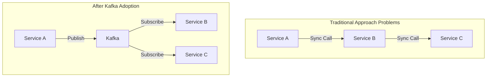
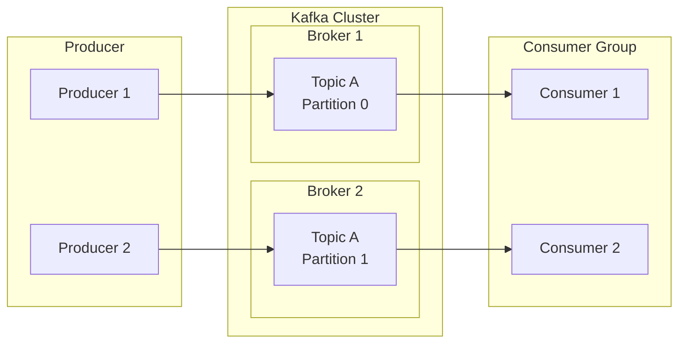
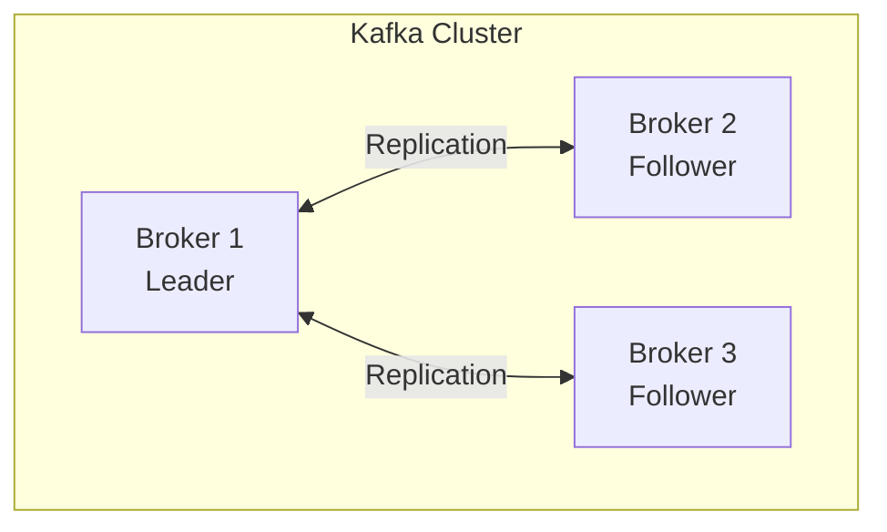
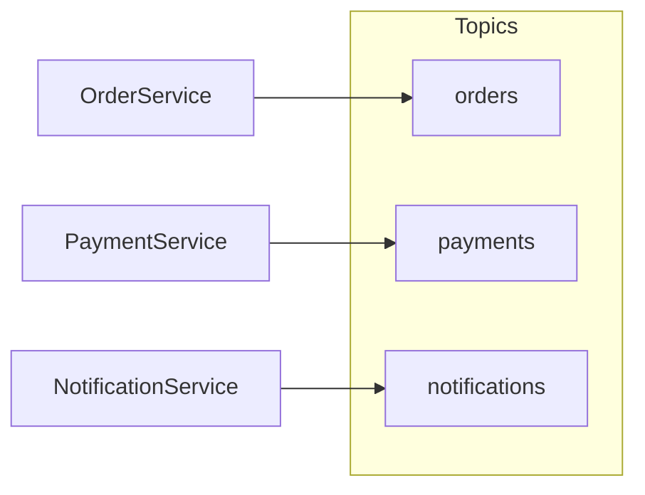
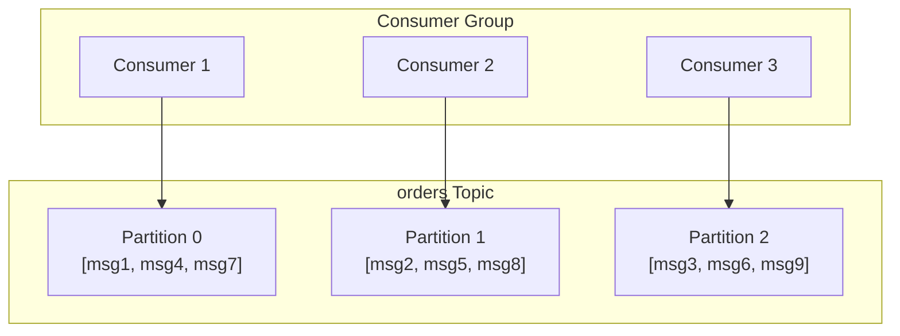
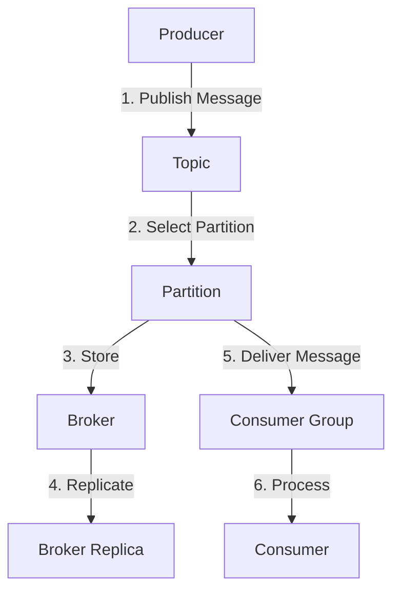

# Kafka Core Components

Understanding Kafka's five core components.

## Why is Kafka Needed?

Kafka solves three fundamental problems:

1. **Asynchronous Processing**: Decouples request-response to reduce coupling between systems
2. **High Volume Processing**: Processes large amounts of data in real-time
3. **High Availability**: Maintains service without data loss even during failures



## Overall Architecture



## 1. Producer

**Role:** Client that publishes messages to Kafka

```java
// Producer example in Spring Kafka
@Component
public class OrderProducer {
    private final KafkaTemplate<String, String> kafkaTemplate;

    public void sendOrder(String orderId, String orderData) {
        kafkaTemplate.send("orders", orderId, orderData);
    }
}
```

**Key Concepts:**
- Decides which Topic to send messages to
- Can route to specific Partition via Message Key
- Can choose synchronous/asynchronous sending

## 2. Consumer

**Role:** Client that reads messages from Kafka

```java
// Consumer example in Spring Kafka
@Component
public class OrderConsumer {
    @KafkaListener(topics = "orders", groupId = "order-service")
    public void consume(String message) {
        // Process message
    }
}
```

**Key Concepts:**
- Belongs to a Consumer Group for parallel processing
- Tracks read position via Offset
- Fetches messages using Pull model

## 3. Broker

**Role:** Kafka server that stores and delivers messages



**Key Concepts:**
- Multiple Brokers form a cluster
- Data is persistently stored on disk
- Leader/Follower structure ensures high availability

> **Analogy:** A Broker is like a post office. It receives letters (messages), stores them, and delivers them to recipients (Consumers).

## 4. Topic

**Role:** Logical channel for categorizing messages



**Key Concepts:**
- Groups related messages together
- Composed of multiple Partitions
- Identified by name (e.g., `orders`, `user-events`)

> **Analogy:** A Topic is like a TV channel. Just like news channels and sports channels, it's organized by subject.

## 5. Partition

**Role:** Divides a Topic to enable parallel processing



**Key Concepts:**
- Order is guaranteed within a single Partition
- Same Message Key routes to same Partition
- Number of Partitions = Maximum parallelism

> **Analogy:** Partitions are like checkout counters at a store. More counters means more customers can be served simultaneously.

## Relationships Between Components



## Summary

| Component | Role | Analogy |
|-----------|------|---------|
| **Producer** | Publish messages | Person sending letters |
| **Consumer** | Consume messages | Person receiving letters |
| **Broker** | Store/deliver messages | Post office |
| **Topic** | Categorize messages | TV channel |
| **Partition** | Unit of parallel processing | Checkout counter |

## Next Steps

- [Message Flow](../message-flow/) - Learn how messages are delivered in detail
