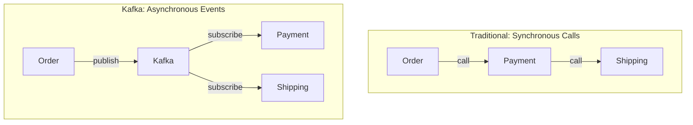
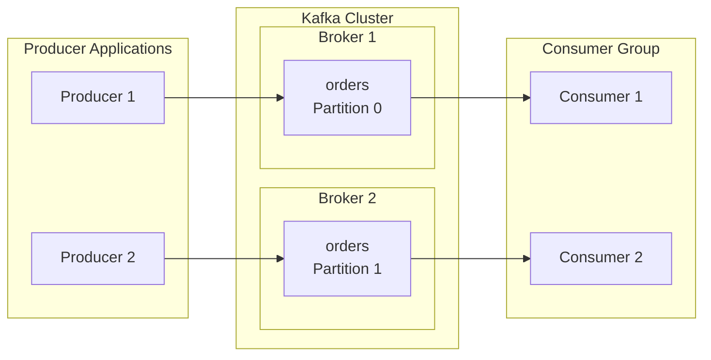
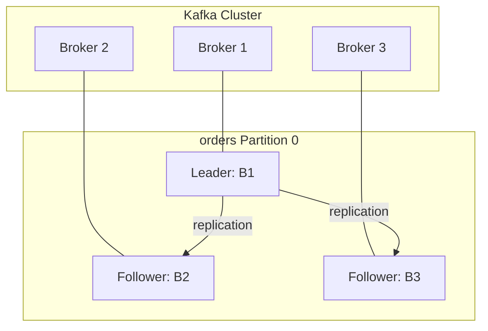
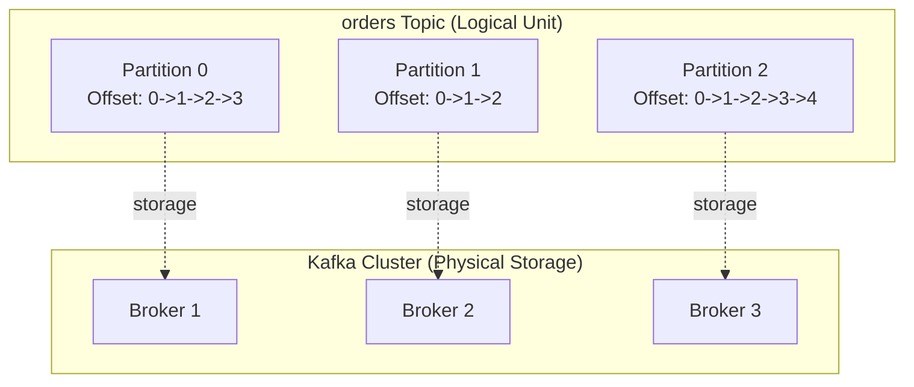
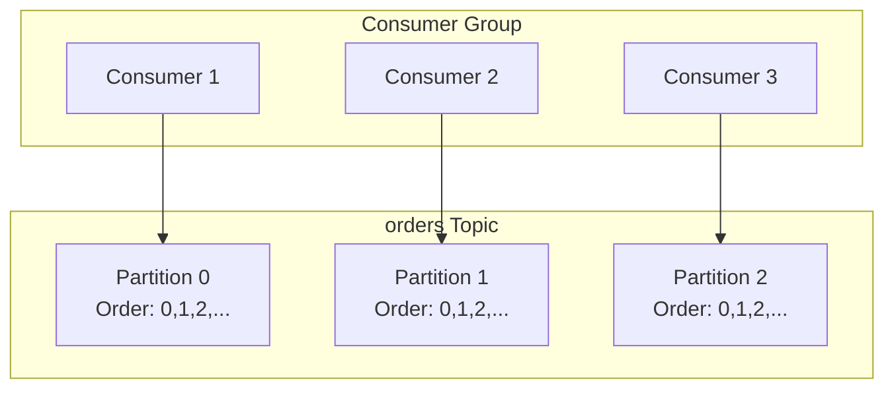
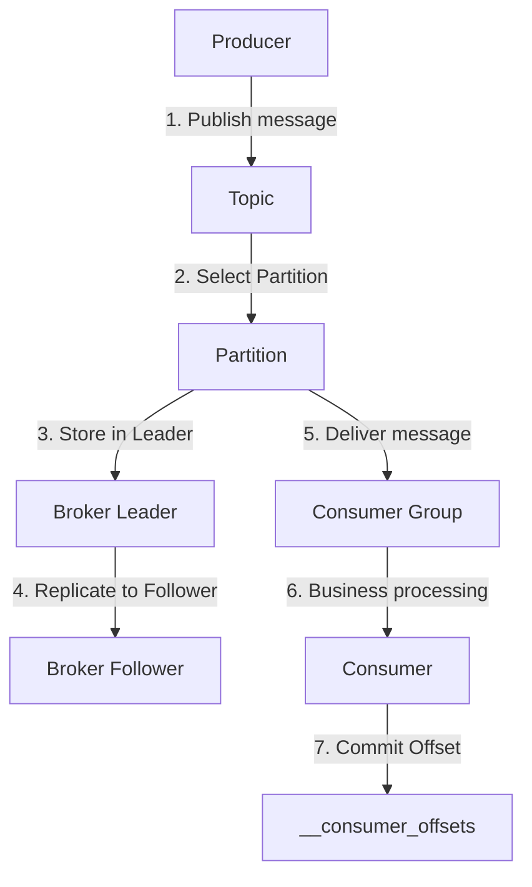


- **Producer**: Publishes messages and selects Partitions to send to Broker
- **Consumer**: Reads messages from Partitions as part of a Consumer Group and manages Offsets
- **Broker**: Stores and replicates messages, providing high availability through Leader/Follower structure
- **Topic**: A logical channel for categorizing messages
- **Partition**: A unit that physically divides Topics to enable parallel processing


**Target Audience**: Developers new to Kafka or those learning basic concepts of distributed messaging systems

**Prerequisites**: Basic network communication concepts, REST API experience, Spring Boot fundamentals

---

Kafka consists of five core components. Producer publishes messages, Consumer consumes messages, and Broker stores and delivers messages. Topic is a logical channel for categorizing messages, and Partition physically divides Topics to enable parallel processing. Understanding how these five components interact provides the foundation for designing and operating Kafka-based systems.

This document explains step by step why each component is needed, what role it plays, and how it's used in actual code. All code examples have been validated in Spring Boot 3.2.x and Spring Kafka 3.1.x environments.

## Why Kafka is Needed

Communication between services is inevitable in distributed systems. Like the order service calling the payment service, and the payment service calling the shipping service. However, this direct synchronous calling approach has three fundamental problems.

The first problem is tight coupling. If the payment service API changes, the order service must also be modified. To add a new shipping service, the order service code must change. As services increase, these dependencies become complexly intertwined, and a single change causes ripple effects across multiple services.

The second problem is failure propagation. If the payment service goes down, the order service also fails. Synchronous calls mean the caller completely depends on the callee's state. It's very common for a single service failure to escalate to system-wide failure.

The third problem is performance bottlenecks. If order processing takes 100ms, payment 200ms, and shipping 150ms, the total response time is 450ms. Synchronous calls accumulate delay time at each step. This problem worsens when traffic surges.

Kafka solves these three problems with event-based asynchronous communication. Instead of services calling each other directly, they publish events to Kafka, and interested services subscribe. Even if the payment service API changes, the order service is unaffected. Even if the payment service goes down, messages are stored in Kafka and processed when the service recovers. Each service processes messages at its own pace, so delay times don't accumulate.



*Diagram: Left side shows synchronous calling pattern with sequential calls from Order to Payment to Shipping. Right side shows asynchronous event pattern through Kafka where Order publishes to Kafka and Payment and Shipping subscribe independently.*


- Kafka solves tight coupling, failure propagation, and performance bottleneck problems between services
- Event-based asynchronous communication allows services to operate independently
- Messages are stored in Kafka and not lost even during service failures


## Understanding the Overall Structure

A Kafka cluster consists of multiple Brokers. Each Broker is an independent server, working together to provide high availability and scalability. Producer publishes messages to specific Topics, and Broker stores these messages in Topic Partitions. Consumer reads messages from assigned Partitions as a member of its Consumer Group.

The key to this structure is Partitions. A single Topic is divided into multiple Partitions, and each Partition can be distributed across different Brokers. This allows even a single Topic to achieve high throughput by utilizing resources from multiple Brokers. Each Consumer within a Consumer Group handles different Partitions to process messages in parallel.



*Diagram: Producers 1 and 2 send messages to Partition 0 and 1 of the orders Topic in Brokers 1 and 2 respectively within the Kafka Cluster, and Consumers 1 and 2 from the Consumer Group read messages from each Partition.*


- Kafka cluster consists of multiple Brokers providing high availability
- Topic is divided into multiple Partitions enabling parallel processing
- Each Consumer in a Consumer Group handles different Partitions


## Role and Operation of Producer

Producer is the client that publishes messages to Kafka. While it appears to simply send messages, several complex operations are performed internally. When an application calls the send() method, Producer first serializes the message. This converts Java objects to byte arrays. Then the Partitioner determines which Partition to send the message to. If there's a Message Key, it selects a Partition based on the Key's hash value; otherwise, it distributes using round-robin.

Producer doesn't send messages immediately for efficiency; instead, it collects them in an internal buffer called Record Accumulator. When batch.size is reached or linger.ms time passes, the Sender thread bundles buffered messages and sends them to the Broker. This batch processing significantly reduces network overhead. If sending fails, it automatically retries according to the retries setting.

In Spring Kafka, KafkaTemplate is used to publish messages. The example below is a Producer that publishes order events. Using orderId as Key ensures all events for the same order are sent to the same Partition, guaranteeing order.

```java
@Slf4j
@Component
@RequiredArgsConstructor
public class OrderProducer {

    private final KafkaTemplate<String, String> kafkaTemplate;

    public void sendOrder(String orderId, String orderJson) {
        kafkaTemplate.send("orders", orderId, orderJson)
            .whenComplete((result, ex) -> {
                if (ex == null) {
                    log.info("Send success: topic={}, partition={}, offset={}",
                        result.getRecordMetadata().topic(),
                        result.getRecordMetadata().partition(),
                        result.getRecordMetadata().offset());
                } else {
                    log.error("Send failed: {}", ex.getMessage());
                }
            });
    }
}
```

The most important Producer setting is acks. acks=0 only sends without waiting for confirmation, making it fastest but with possible message loss. acks=1 only waits for Leader Broker confirmation, so messages can be lost if the Leader fails. acks=all waits for confirmation from all ISR (In-Sync Replicas), making it safest but with increased latency. For production environments, acks=all is recommended for data safety.

The enable.idempotence=true setting prevents duplicate sending. When Producer retries due to network errors, Broker checks if it's an already received message to prevent duplicate storage. From Kafka 3.0, this setting is enabled by default.

```yaml
spring:
  kafka:
    producer:
      bootstrap-servers: localhost:9092
      key-serializer: org.apache.kafka.common.serialization.StringSerializer
      value-serializer: org.apache.kafka.common.serialization.StringSerializer
      acks: all
      retries: 3
      properties:
        enable.idempotence: true
        max.in.flight.requests.per.connection: 5
```


- Producer operates in sequence: serialization -> Partition selection -> batch sending
- Key-based Partitioning ensures same Key always goes to same Partition
- acks setting adjusts delivery guarantee level (acks=all recommended)
- enable.idempotence=true prevents duplicate sending (default in Kafka 3.0+)


## Role and Operation of Consumer

Consumer is the client that reads messages from Kafka. Like Producer, it appears simple but complex mechanisms operate internally. Consumer uses pull, not push. That is, Broker doesn't push messages; Consumer periodically requests and retrieves messages from Broker. This approach allows Consumer to fetch messages at its own processing pace.

One of Consumer's key responsibilities is Offset management. Offset is a sequence number indicating a message's position within a Partition. Consumer records how far it has read using Offset. This information is stored in an internal Topic called __consumer_offsets. When Consumer restarts, it resumes reading from the last committed Offset.

Consumer Group is a unit where multiple Consumers cooperate to process messages in parallel. Consumers in the same Consumer Group divide and handle Topic Partitions. A single Partition can only be handled by one Consumer within the group. This rule ensures messages from the same Partition are always processed by the same Consumer, guaranteeing order. When Consumers are added or removed, Rebalancing occurs and Partitions are redistributed.

In Spring Kafka, the @KafkaListener annotation is used to implement Consumers. The concurrency attribute specifies the number of Consumer threads. In the example below, concurrency="3" means 3 Consumer threads operate in parallel. If there are 3 or more Partitions, each thread handles one or more Partitions.

```java
@Slf4j
@Component
public class OrderConsumer {

    @KafkaListener(
        topics = "orders",
        groupId = "order-service-group",
        concurrency = "3"
    )
    public void consume(
            @Payload String message,
            @Header(KafkaHeaders.RECEIVED_PARTITION) int partition,
            @Header(KafkaHeaders.OFFSET) long offset) {

        log.info("Received: partition={}, offset={}, message={}",
            partition, offset, message);

        processOrder(message);
    }

    private void processOrder(String message) {
        // Order processing business logic
    }
}
```

In Consumer settings, auto-offset-reset determines where to start reading when a Consumer Group first starts or when there's no recorded Offset. earliest reads from the beginning of the Partition, latest reads from the most recent message. Choose earliest if all existing messages need to be processed, or latest if only new messages need to be processed.

enable-auto-commit determines whether to automatically commit Offsets. When set to true, auto-commit occurs every auto.commit.interval.ms. However, if auto-commit happens right after fetching a message and processing fails, that message won't be processed again. To prevent this problem, use manual commit (enable-auto-commit: false) and explicitly commit after message processing completes.

```yaml
spring:
  kafka:
    consumer:
      bootstrap-servers: localhost:9092
      group-id: order-service-group
      key-deserializer: org.apache.kafka.common.serialization.StringDeserializer
      value-deserializer: org.apache.kafka.common.serialization.StringDeserializer
      auto-offset-reset: earliest
      enable-auto-commit: false
      properties:
        max.poll.records: 500
        max.poll.interval.ms: 300000
```


- Consumer uses pull method to fetch messages at its own processing pace
- Offset tracks read position, stored in __consumer_offsets Topic
- Each Partition in a Consumer Group is handled by only one Consumer
- auto-offset-reset sets start position, enable-auto-commit sets commit method


## Role of Broker and Cluster Configuration

Broker is Kafka's core server. It receives messages, stores them on disk, and delivers messages according to Consumer requests. One reason Kafka achieves high throughput is Broker's storage method. Broker writes messages sequentially to disk. Sequential I/O is much faster than random I/O due to disk physical characteristics. It also actively uses the operating system's page cache to serve frequently accessed data directly from memory.

A Kafka cluster consists of multiple Brokers. For production environments, a minimum of 3 Brokers is recommended. Each Broker has a unique ID and cooperates within the cluster. The Broker acting as Leader for a Partition handles reads and writes for that Partition, and Brokers acting as Followers replicate the Leader's data. If the Leader Broker fails, one of the Followers is elected as the new Leader, and service continues.

From Kafka 3.3, KRaft mode is enabled by default, allowing cluster operation without Zookeeper. In KRaft mode, some Brokers also serve as Controllers to manage cluster metadata. This approach reduces operational complexity and shortens cluster startup time.



*Diagram: 3 Brokers in Kafka Cluster configured as Leader (Broker 1) and Followers (Broker 2, 3) for orders Partition 0, with Leader replicating data to Followers.*

The most important Broker settings are replication.factor and min.insync.replicas. replication.factor=3 means each Partition has 3 replicas. min.insync.replicas=2 means when Producer sends with acks=all, it's considered successful only when written to at least 2 replicas. This configuration allows continued service without data loss even if 1 Broker fails.

```properties
broker.id=1
listeners=PLAINTEXT://:9092
log.dirs=/var/lib/kafka/data
num.partitions=3
default.replication.factor=3
min.insync.replicas=2
log.retention.hours=168
log.segment.bytes=1073741824
```

A Broker can be compared to a post office. It receives letters (messages), stores them, and delivers when recipients (Consumers) come. If multiple post offices (Brokers) cooperate, even if one post office has a problem, other post offices can continue service.


- Broker achieves high throughput through sequential I/O and page cache
- Leader/Follower structure enables automatic failover during failures
- KRaft mode (Kafka 3.3+) enables cluster operation without Zookeeper
- replication.factor=3, min.insync.replicas=2 configuration recommended


## Role of Topic and Design Principles

Topic is a logical channel for categorizing messages. Different types of events like orders, payments, and notifications can be managed separately. Each Topic has independent settings. Order data can be retained for 7 days while log data is retained for only 1 day, configured according to business requirements.

Topic names should follow clear and consistent naming conventions. A good Topic name should itself indicate what data flows through it. Names like orders, payment-completed, user-activity-logs that clearly express the domain or event are good. Names like data, topic1, temp should be avoided. It's important to establish naming conventions at the team or organization level and apply them consistently.

When creating Topics, Partition count and Replication Factor must be carefully decided. Partition count can be increased later but cannot be decreased. Increasing Partitions can change the Partition assignment of existing message Keys, potentially affecting order guarantees. Therefore, appropriate Partition count should be set from the beginning considering expected throughput and Consumer count.

### Relationship Between Topic and Partition

Topic is a logical channel, and Partition is the physical storage unit within that channel. The diagram below shows how a single Topic is divided into multiple Partitions, with each Partition distributed across different Brokers.



*Diagram: orders Topic is divided into 3 Partitions, each with independent Offsets. Physically, each Partition is distributed and stored across different Brokers.*

```bash
# Create Topic
kafka-topics.sh --bootstrap-server localhost:9092 \
  --create --topic orders \
  --partitions 6 \
  --replication-factor 3

# List Topics
kafka-topics.sh --bootstrap-server localhost:9092 --list

# Describe Topic details
kafka-topics.sh --bootstrap-server localhost:9092 \
  --describe --topic orders
```

A Topic can be compared to a TV channel. Like news channels, sports channels, and drama channels organized by subject. Viewers (Consumers) can select and watch only channels they're interested in. Each channel operates independently, so even if the news channel has problems, the sports channel broadcasts normally.


- Topic is a logical channel for categorizing messages
- Clear naming conventions required (orders, payment-completed, etc.)
- Each Topic can have independent retention policies
- Partition count can be increased later but cannot be decreased


## Role of Partition and Parallel Processing

Partition is the unit that physically divides a Topic. When a single Topic is divided into multiple Partitions, multiple Consumers can process messages simultaneously. Without Partitions, no matter how many Consumers are deployed, only one Consumer can process messages, creating a bottleneck.

Message order is guaranteed within a Partition. When a message is added to a Partition, it's assigned a sequence number called Offset. Offset starts at 0 and increases by 1. Consumers read messages in Offset order, so messages within the same Partition are processed in the order they were published. However, order is not guaranteed across different Partitions. If overall order is important, the same Key must be used to send to the same Partition.

When deciding Partition count, consider target throughput and Consumer count together. For example, if target throughput is 100,000 messages/second and one Consumer can process 10,000 messages/second, at least 10 Partitions are needed. However, too many Partitions cause overhead. Each Partition uses Broker file handles and memory, and Rebalancing time increases. A level that adds 20-30% buffer to current requirements is appropriate.



*Diagram: orders Topic divided into Partitions 0, 1, 2, with Consumers 1, 2, 3 from the Consumer Group each handling one Partition to process messages in parallel.*

Partitions can be compared to checkout counters at a mart. If there's only one counter, lines get long and wait times increase. Adding counters allows more customers to be processed simultaneously. But too many counters increase staff allocation and management costs. Maintaining an appropriate number of counters is efficient.

Partition assignment strategy determines which Partition to send messages to. Without a Key, messages are evenly distributed to Partitions using round-robin. With a Key, Partition is selected based on the Key's hash value. The same Key always goes to the same Partition, guaranteeing order. For example, using orderId as Key ensures all events for the same order are processed in order.


- Partition is the unit of parallel processing; parallel processing possible up to Partition count
- Order guaranteed only within Partition; use same Key if overall order needed
- Partition count should consider target throughput and Consumer count
- Too many Partitions cause overhead (file handles, rebalancing time)


## Interaction Between Components

The five components work closely together in delivering messages from Producer to Consumer. When Producer publishes a message, serialization and Partition selection occur first. The Leader Broker of the selected Partition receives the message, adds it to the log, and Follower Brokers replicate it. According to acks settings, response is sent to Producer when replication completes.

Consumer sends poll requests to the Leader Broker of assigned Partitions. Broker returns messages after the Consumer's last committed Offset. Consumer processes messages and commits the Offset. This Offset information is stored in the __consumer_offsets Topic, allowing Consumer to resume from the last position when restarted.



*Diagram: Complete message flow from Producer publishing to Topic -> Partition selection -> Leader Broker storage -> Follower replication -> Consumer Group delivery -> Consumer business processing -> Offset commit to __consumer_offsets.*


- Messages processed in order: serialization -> Partition selection -> Leader storage -> Follower replication
- Consumer fetches messages via poll and commits Offset after processing
- Commit info stored in __consumer_offsets Topic enables recovery on restart


## Common Problems and Solutions

When Producer can't send messages, it's usually a connection problem. Check if bootstrap-servers address is correct and if the Broker is network accessible. If Topic doesn't exist and auto.create.topics.enable is false, the Topic must be created first. Also check Broker logs for authentication or permission-related error messages.

When Consumer can't receive messages, there can be several causes. Check if group-id is correct and if it's subscribed to the Topic. If auto-offset-reset is latest and messages were published before Consumer started, they can't be read. Check Consumer Lag to distinguish whether messages are piling up or there are no messages at all.

Message ordering problems are related to Partition assignment. In Kafka, order is guaranteed only within the same Partition. If overall order is needed, Partition must be set to 1, but this means giving up parallel processing. Generally, related messages (e.g., events for the same order) are given the same Key to send to the same Partition.

```bash
# Check Consumer Group status
kafka-consumer-groups.sh --bootstrap-server localhost:9092 \
  --describe --group order-service-group

# Check Topic messages
kafka-console-consumer.sh --bootstrap-server localhost:9092 \
  --topic orders --from-beginning --max-messages 10
```


- For Producer connection problems, check bootstrap-servers address and network accessibility
- If Consumer can't receive messages, check group-id, Topic subscription, auto-offset-reset
- If order guarantee needed, use same Key to send to same Partition
- Use kafka-consumer-groups.sh to check Consumer Group status and Lag


## Next Steps

This document covered Kafka's five core components. If you understand each component's role and operation, the next step is to examine in more detail how messages are delivered from Producer to Consumer. Consumer Group and Offset management, Replication mechanisms are also important topics in actual operations.

- [Message Flow](message-flow/) - Trace the complete process of message delivery from Producer to Consumer step by step
- [Consumer Group and Offset](consumer-group/) - Learn details of parallel processing and Offset management
- [Practice Examples](../examples/basic/) - Write code directly based on theory and verify operation
