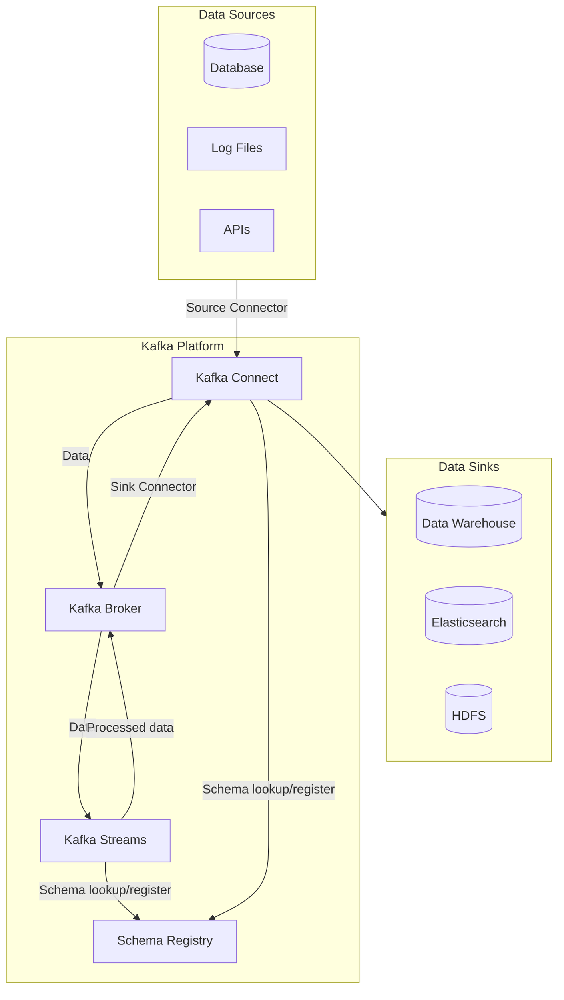
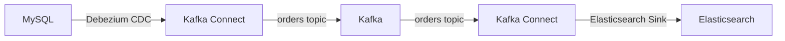
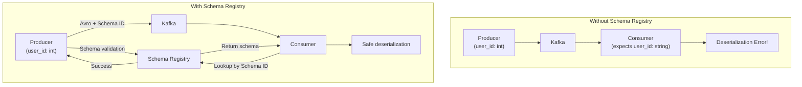
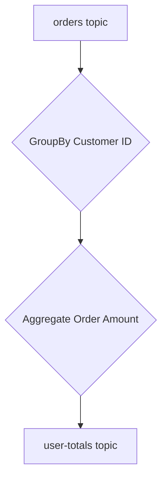

# Kafka Ecosystem

Kafka provides a complete ecosystem for building data pipelines and stream processing applications, going beyond a simple message broker. Here we introduce the core components: **Kafka Connect**, **Schema Registry**, and **Kafka Streams**.



---

## 1. Kafka Connect

**Kafka Connect** is a framework for reliably streaming data between Kafka and other systems. You can build data pipelines with configuration alone, no coding required.

### Core Concepts

| Component | Role | Example |
|-----------|------|---------|
| **Source Connector** | External system → Kafka | DB changes to Kafka topic |
| **Sink Connector** | Kafka → External system | Kafka topic to Elasticsearch |
| **Converter** | Data format conversion | JSON, Avro, Protobuf |
| **Transform** | Simple message transformation | Add/remove fields, routing |

### Example: Database Changes to Elasticsearch

1. **Debezium Source Connector** reads MySQL change logs (Binlog) and streams to `orders` topic.
2. **Elasticsearch Sink Connector** reads messages from `orders` topic and indexes to Elasticsearch.



### Advantages
- **No code required**: Configure pipelines with JSON configuration files only
- **Scalability & reliability**: Runs in distributed environment, automatic failure recovery
- **Rich ecosystem**: Many pre-built connectors for JDBC, S3, HDFS, Elasticsearch, etc.

---

## 2. Schema Registry

**Schema Registry** is a service that centrally manages and validates message schemas (structures). Essential for ensuring data consistency and compatibility.

### Why Is It Needed?

Without schemas, Consumers must guess message structure, and if Producers change the structure, Consumers can break.



### Core Features

- **Schema version management**: Manages schema change history.
- **Compatibility validation**: Enforces compatibility (forward/backward/full) when Producers change schemas.
- **Serialization/deserialization support**: Integrates with Avro, Protobuf, JSON Schema for efficient serialization.

### Advantages
- **Data quality assurance**: Only data following defined schemas is stored in Kafka
- **Loose coupling**: Producers and Consumers communicate via schemas, reducing direct dependencies
- **Efficient storage**: Message size reduction when used with Avro

---

## 3. Kafka Streams

**Kafka Streams** is a Java/Scala library for real-time processing and analysis of Kafka topic data. You can build stream processing applications using only Kafka, without a separate processing cluster.

### Core Concepts

| Concept | Description |
|---------|-------------|
| **KStream** | Stream of records. Immutable data (e.g., event logs) |
| **KTable** | Mutable data stream. Keeps only the latest value per Key (e.g., user profiles) |
| **Topology** | DAG (Directed Acyclic Graph) defining data processing flow |

### Example: Real-time Order Aggregation

```java
// Kafka Streams DSL example
StreamsBuilder builder = new StreamsBuilder();

KStream<String, Order> orders = builder.stream("orders");

KTable<String, Double> userTotalAmount = orders
    .groupBy((key, value) -> value.getCustomerId()) // Group by customer ID
    .aggregate(
        () -> 0.0, // Initial value
        (aggKey, newValue, aggValue) -> aggValue + newValue.getAmount(), // Aggregation
        Materialized.as("user-order-totals")
    );

// Send results to 'user-totals' topic
userTotalAmount.toStream().to("user-totals");
```



### Advantages
- **Simplicity**: Library form included in application, no separate cluster (Spark, Flink, etc.) needed
- **Stateful processing**: Supports stateful processing (aggregation, joins, etc.) using local state store (RocksDB)
- **Elasticity**: Easy scale up/down by adding/removing application instances

## Summary

| Component | One-liner | Main Use Cases |
|-----------|-----------|----------------|
| **Kafka Connect** | Data pipeline framework | DB ↔ Kafka, S3 ↔ Kafka |
| **Schema Registry** | Central schema management & validation | Data governance, Avro/Protobuf integration |
| **Kafka Streams** | Real-time stream processing library | Real-time aggregation, event-driven microservices |
