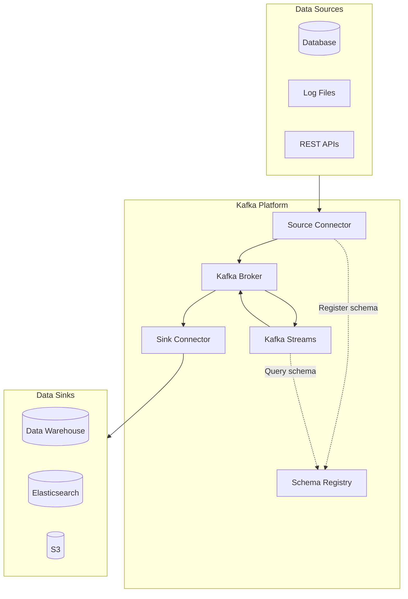
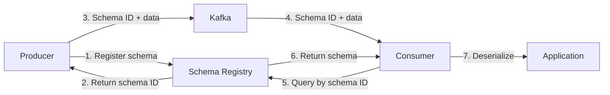


- Kafka Connect: Data movement between external systems and Kafka, build pipelines with configuration alone, no coding required
- Schema Registry: Centralized message schema management, compatibility validation prevents runtime errors
- Kafka Streams: Real-time stream processing library, no separate cluster required
- Debezium: CDC (Change Data Capture) streams database changes to Kafka
- Schema compatibility: Supports BACKWARD (default), FORWARD, FULL, NONE policies


**Target Audience**: Developers and data engineers building data pipelines using the Kafka ecosystem

**Prerequisites**: Understanding of Topic, Producer, Consumer concepts from [Core Components](core-components/), overall data flow from [Message Flow](message-flow/)

---

Kafka plays a role far beyond a simple message broker. A complete ecosystem has formed around Kafka for building data pipelines, managing schemas, and performing real-time stream processing. The core components of this ecosystem are Kafka Connect, Schema Registry, and Kafka Streams. Each component operates independently while providing greater synergy when used together.

Kafka Connect moves data between external systems and Kafka. You can stream database changes to Kafka or load Kafka messages to Elasticsearch or S3 with configuration alone, no coding required. Schema Registry centrally manages message schemas to ensure data compatibility between Producers and Consumers. Kafka Streams is a library for real-time processing and transformation of data stored in Kafka topics.

This document explains in detail the problems each component solves, how they work, and how to use them in practice. All examples have been validated in Confluent Platform 7.5.x and Spring Boot 3.2.x environments.

#### Complete Ecosystem Architecture

Understanding the data flow in the Kafka ecosystem clarifies the role of each component. When data is generated from external systems, Kafka Connect's Source Connector sends it to Kafka topics. During this process, Schema Registry validates and stores the message schema. Data stored in Kafka is processed in real-time through Kafka Streams or delivered to other systems via Sink Connectors.

The advantage of this architecture is that each component can scale independently. When data collection volume increases, increase the number of Source Connector tasks; when processing volume increases, add Streams instances. Each part is loosely coupled, minimizing the impact of one component's failure on the entire system.



#### Kafka Connect

Kafka Connect is a framework for reliably streaming data between Kafka and external systems. You can connect Kafka to various systems including databases, file systems, cloud storage, and search engines. The biggest advantage is that you can build data pipelines with JSON configuration alone, no coding required.

**Why Kafka Connect is Needed**

You could develop Producers or Consumers directly when integrating Kafka with external systems. However, this approach has several problems. First, duplicate development occurs. You need separate code for fetching data from MySQL, PostgreSQL, and Oracle. You must repeatedly write similar logic.

Error handling must also be implemented directly. How to retry on network errors, how to manage offsets, and how to prevent duplicate data must all be decided and implemented by developers. Scalable parallel processing logic is also needed. When single-threaded processing is insufficient, you must consider how to scale out.

Kafka Connect solves all these problems. Development time is reduced since you can use already validated Connectors. Retry, offset management, and error handling are provided at the framework level. Running in distributed mode allows tasks to be processed in parallel across multiple workers, increasing throughput.

**Core Components**

Kafka Connect consists of several concepts. A Source Connector reads data from external systems and sends it to Kafka topics. Debezium MySQL Connector is a representative example. It detects changes (INSERT, UPDATE, DELETE) in MySQL databases in real-time and streams them to Kafka topics.

Sink Connectors work in the opposite direction. They read messages from Kafka topics and send them to external systems. Elasticsearch Sink Connector loads Kafka topic messages into Elasticsearch indexes. S3 Sink Connector stores messages as files in AWS S3 buckets.

Converters transform data formats. Since Kafka messages are byte arrays, conversion to actual data formats (JSON, Avro, Protobuf, etc.) is needed. JsonConverter handles JSON format, AvroConverter handles Avro format.

Transform (SMT, Single Message Transform) is a lightweight processor that transforms messages. It performs simple transformations such as adding or removing fields, renaming fields, or routing messages based on specific conditions. Complex transformations should use Kafka Streams.

A Worker is a JVM process that runs Connectors and Tasks. Standalone mode runs on a single worker and is suitable for development and testing. Distributed mode forms a cluster with multiple workers and is suitable for production environments. In distributed mode, tasks are automatically redistributed when workers are added or removed.

**Docker Compose Configuration**

To run Kafka Connect, you first need a Kafka cluster. The Docker Compose configuration below sets up Kafka in KRaft mode together with Kafka Connect. MySQL is also included so you can start CDC (Change Data Capture) testing right away.

```yaml
version: '3.8'
services:
  kafka:
    image: confluentinc/cp-kafka:7.5.0
    hostname: kafka
    ports:
      - "9092:9092"
    environment:
      KAFKA_NODE_ID: 1
      KAFKA_PROCESS_ROLES: broker,controller
      KAFKA_CONTROLLER_QUORUM_VOTERS: 1@kafka:9093
      KAFKA_LISTENERS: PLAINTEXT://:9092,CONTROLLER://:9093
      KAFKA_ADVERTISED_LISTENERS: PLAINTEXT://kafka:9092
      KAFKA_LISTENER_SECURITY_PROTOCOL_MAP: PLAINTEXT:PLAINTEXT,CONTROLLER:PLAINTEXT
      KAFKA_INTER_BROKER_LISTENER_NAME: PLAINTEXT
      KAFKA_CONTROLLER_LISTENER_NAMES: CONTROLLER
      CLUSTER_ID: 'MkU3OEVBNTcwNTJENDM2Qk'

  connect:
    image: confluentinc/cp-kafka-connect:7.5.0
    hostname: connect
    depends_on:
      - kafka
    ports:
      - "8083:8083"
    environment:
      CONNECT_BOOTSTRAP_SERVERS: kafka:9092
      CONNECT_REST_PORT: 8083
      CONNECT_GROUP_ID: connect-cluster
      CONNECT_CONFIG_STORAGE_TOPIC: connect-configs
      CONNECT_OFFSET_STORAGE_TOPIC: connect-offsets
      CONNECT_STATUS_STORAGE_TOPIC: connect-status
      CONNECT_CONFIG_STORAGE_REPLICATION_FACTOR: 1
      CONNECT_OFFSET_STORAGE_REPLICATION_FACTOR: 1
      CONNECT_STATUS_STORAGE_REPLICATION_FACTOR: 1
      CONNECT_KEY_CONVERTER: org.apache.kafka.connect.json.JsonConverter
      CONNECT_VALUE_CONVERTER: org.apache.kafka.connect.json.JsonConverter
      CONNECT_PLUGIN_PATH: /usr/share/java,/usr/share/confluent-hub-components

  mysql:
    image: mysql:8.0
    hostname: mysql
    ports:
      - "3306:3306"
    environment:
      MYSQL_ROOT_PASSWORD: rootpass
      MYSQL_DATABASE: orders
```

**Source Connector Configuration: MySQL CDC**

Using Debezium MySQL Connector, you can stream MySQL database changes to Kafka in real-time. This approach is called CDC (Change Data Capture). It reads MySQL binary logs to detect INSERT, UPDATE, and DELETE events.

The configuration below sends changes from the order_items table in the orders database to the cdc.orders.order_items topic. database.server.id is a unique ID used in MySQL replication. When connecting multiple Connectors to the same MySQL server, different IDs must be used.

```json
{
  "name": "mysql-source-connector",
  "config": {
    "connector.class": "io.debezium.connector.mysql.MySqlConnector",
    "tasks.max": "1",
    "database.hostname": "mysql",
    "database.port": "3306",
    "database.user": "root",
    "database.password": "rootpass",
    "database.server.id": "1",
    "database.server.name": "mysql-server",
    "database.include.list": "orders",
    "table.include.list": "orders.order_items",
    "topic.prefix": "cdc",
    "schema.history.internal.kafka.bootstrap.servers": "kafka:9092",
    "schema.history.internal.kafka.topic": "schema-changes.orders"
  }
}
```

Registering and managing Connectors is done through the REST API. The commands below show how to register a Connector and check its status. When the Connector starts successfully, the status field shows RUNNING.

```bash
# Register Connector
curl -X POST http://localhost:8083/connectors \
  -H "Content-Type: application/json" \
  -d @mysql-source-connector.json

# Check Connector status
curl http://localhost:8083/connectors/mysql-source-connector/status

# List Connectors
curl http://localhost:8083/connectors
```

**Sink Connector Configuration: Elasticsearch**

Sink Connectors send messages from Kafka topics to external systems. Elasticsearch Sink Connector loads Kafka messages into Elasticsearch indexes. This allows data stored in Kafka to become searchable.

The configuration below sends messages from the cdc.orders.order_items topic to Elasticsearch. When key.ignore is true, the message key is not used as the Elasticsearch document ID. When behavior.on.null.values is delete, documents are deleted when messages with null values are received. This is how DELETE events are handled in CDC.

```json
{
  "name": "elasticsearch-sink-connector",
  "config": {
    "connector.class": "io.confluent.connect.elasticsearch.ElasticsearchSinkConnector",
    "tasks.max": "1",
    "topics": "cdc.orders.order_items",
    "connection.url": "http://elasticsearch:9200",
    "type.name": "_doc",
    "key.ignore": "true",
    "schema.ignore": "true",
    "behavior.on.null.values": "delete"
  }
}
```

**Commonly Used Connectors**

Various Connectors exist in the Kafka Connect ecosystem. The Debezium project provides CDC Connectors for major databases including MySQL, PostgreSQL, MongoDB, and Oracle. Confluent provides Connectors for various systems including JDBC, Elasticsearch, S3, and HDFS. Most common use cases can be solved with existing Connectors.

When selecting a Connector, check community activity and documentation quality. Connectors provided by Debezium and Confluent are actively maintained and well documented. While it's rare to need to develop your own Connector, you can implement custom Connectors using the Kafka Connect API if necessary.

#### Schema Registry

Schema Registry is a service that centrally manages Kafka message schemas. Producers register schemas when sending messages, and Consumers query schemas when reading messages. This ensures data compatibility between Producers and Consumers.

**Why Schema Registry is Needed**

There's a common problem when exchanging messages in JSON format. If a Producer sends user_id as a number but the Consumer expects a string, a deserialization error occurs. This problem is discovered at runtime, meaning the failure has already occurred.

Schema changes are even more complicated. When adding new fields or removing existing fields, not all Consumers are updated simultaneously. Some Consumers use the previous version of the schema while others use the new version. For messages to be processed correctly in this situation, schema compatibility must be guaranteed.

Schema Registry solves this problem. All schemas are registered centrally, and compatibility with existing schemas is automatically checked when new schemas are registered. Incompatible changes are rejected at the registration stage, preventing runtime errors.



**Docker Compose Configuration**

Schema Registry runs as a separate service from the Kafka cluster. Internally, it stores schema information in a Kafka topic called _schemas. Add the following configuration to your existing Docker Compose file.

```yaml
schema-registry:
  image: confluentinc/cp-schema-registry:7.5.0
  hostname: schema-registry
  depends_on:
    - kafka
  ports:
    - "8081:8081"
  environment:
    SCHEMA_REGISTRY_HOST_NAME: schema-registry
    SCHEMA_REGISTRY_KAFKASTORE_BOOTSTRAP_SERVERS: kafka:9092
    SCHEMA_REGISTRY_LISTENERS: http://0.0.0.0:8081
```

**Avro Schema Definition**

Schema Registry supports Avro, Protobuf, and JSON Schema formats. Avro is the most widely used format. Avro stores schemas with data, supports rich data types, and has well-defined rules for schema evolution.

Below is an example Avro schema for order data. The type and name of each field are specified. logicalType specifies the logical type. timestamp-millis indicates that the long type value is a timestamp in milliseconds.

```json
{
  "type": "record",
  "name": "Order",
  "namespace": "com.example.kafka",
  "fields": [
    {"name": "orderId", "type": "string"},
    {"name": "customerId", "type": "string"},
    {"name": "amount", "type": "double"},
    {"name": "status", "type": "string"},
    {"name": "createdAt", "type": "long", "logicalType": "timestamp-millis"}
  ]
}
```

**Spring Boot Integration**

To use Schema Registry with Spring Boot, add Confluent's Avro serialization library to your dependencies. kafka-avro-serializer is for Producers and kafka-avro-deserializer is for Consumers. In practice, both are included in the same library.

```yaml
spring:
  kafka:
    bootstrap-servers: localhost:9092
    producer:
      key-serializer: org.apache.kafka.common.serialization.StringSerializer
      value-serializer: io.confluent.kafka.serializers.KafkaAvroSerializer
    consumer:
      key-deserializer: org.apache.kafka.common.serialization.StringDeserializer
      value-deserializer: io.confluent.kafka.serializers.KafkaAvroDeserializer
    properties:
      schema.registry.url: http://localhost:8081
      specific.avro.reader: true
```

When specific.avro.reader is true, Avro deserializes to specific Java classes that Avro generated. When false, it deserializes to a generic object called GenericRecord. Using specific classes allows you to leverage IDE autocomplete and compile-time type checking for safer development.

```java
@Component
@RequiredArgsConstructor
public class OrderAvroProducer {

    private final KafkaTemplate<String, Order> kafkaTemplate;

    public void sendOrder(Order order) {
        kafkaTemplate.send("orders-avro", order.getOrderId(), order);
    }
}
```

**Schema Compatibility Policies**

Schema Registry supports four compatibility policies. Choosing the appropriate policy is important.

BACKWARD compatibility ensures that new schemas can read old data. This is suitable for scenarios where Consumers are updated first. Deleting fields or adding fields with default values is allowed. This is the default policy.

FORWARD compatibility ensures that old schemas can read new data. This is suitable for scenarios where Producers are updated first. Adding fields or deleting fields with default values is allowed.

FULL compatibility ensures bidirectional compatibility. Producers and Consumers can be updated in any order. Only fields with default values can be added or deleted, making it the most restrictive.

NONE performs no compatibility checking. All changes are allowed, but runtime errors are possible, so it's not recommended.

```bash
# Set compatibility policy
curl -X PUT http://localhost:8081/config/orders-avro-value \
  -H "Content-Type: application/json" \
  -d '{"compatibility": "BACKWARD"}'

# Register schema
curl -X POST http://localhost:8081/subjects/orders-avro-value/versions \
  -H "Content-Type: application/vnd.schemaregistry.v1+json" \
  -d '{"schema": "{\"type\":\"record\",\"name\":\"Order\",...}"}'

# Test compatibility
curl -X POST http://localhost:8081/compatibility/subjects/orders-avro-value/versions/latest \
  -H "Content-Type: application/vnd.schemaregistry.v1+json" \
  -d '{"schema": "{...new schema...}"}'
```

#### Kafka Streams

Kafka Streams is a Java library for real-time processing of data in Kafka topics. Unlike Apache Flink or Spark Streaming, no separate cluster is required. It's added as a library to regular Java applications. Scaling up automatically happens when application instances are increased.

**Why Kafka Streams**

There are several options for real-time data processing. Implementing Consumers directly allows simple transformations, but complex processing like window aggregation, stream joins, and state management must be implemented manually. Apache Flink or Spark Streaming offer rich features but require separate cluster operations.

Kafka Streams sits in the middle. It provides essential features for stream processing like window aggregation, stream-table joins, and state stores, while operating as just a library without a separate cluster. To increase throughput, just add application instances. Partitions are automatically distributed in the same way as Kafka's Consumer Groups.

**Core Concepts**

In Kafka Streams, data is represented by two abstractions: KStream and KTable.

KStream is a record stream. Each record is treated as an independent event. It's suitable for processing events that occur over time, such as click logs, order events, and sensor data. Even if there are multiple records with the same key, each is processed separately.

KTable is a changelog stream. Only the latest value is maintained for each key. It's suitable for data representing current state, such as user profiles, product inventory, and configuration values. When a new record arrives with the same key, the previous value is overwritten.

GlobalKTable is a special table where data from all partitions is replicated to all instances. It's useful for joining small reference data (country codes, product categories, etc.) with streams.

Topology is a DAG (Directed Acyclic Graph) that defines the data processing flow. Source processors read data from topics, stream processors transform data, and sink processors write results to topics.

**Real-time Order Aggregation Example**

The example below aggregates order events in real-time to calculate the total order amount per customer in 5-minute windows. It also filters high-value orders over 100,000 to a separate topic.

Using Spring Boot's @EnableKafkaStreams annotation, Kafka Streams can be automatically configured. When you define a KStream bean, the topology is automatically configured and executed when the application starts.

```java
@Slf4j
@Configuration
@EnableKafkaStreams
public class OrderStreamConfig {

    private final ObjectMapper objectMapper = new ObjectMapper();

    @Bean
    public KStream<String, String> orderStream(StreamsBuilder builder) {
        KStream<String, String> orders = builder.stream("orders");

        KTable<Windowed<String>, Double> customerTotals = orders
            .mapValues(this::extractAmount)
            .groupBy((key, amount) -> extractCustomerId(key))
            .windowedBy(TimeWindows.ofSizeWithNoGrace(Duration.ofMinutes(5)))
            .aggregate(
                () -> 0.0,
                (customerId, amount, total) -> total + amount,
                Materialized.with(Serdes.String(), Serdes.Double())
            );

        customerTotals.toStream()
            .map((windowedKey, total) ->
                KeyValue.pair(windowedKey.key(),
                    String.format("{\"customerId\":\"%s\",\"total\":%.2f}",
                        windowedKey.key(), total)))
            .to("customer-totals");

        orders
            .filter((key, value) -> extractAmount(value) > 100000)
            .to("high-value-orders");

        return orders;
    }

    private Double extractAmount(String orderJson) {
        try {
            return objectMapper.readTree(orderJson).get("amount").asDouble();
        } catch (Exception e) {
            log.error("Failed to parse order: {}", orderJson, e);
            return 0.0;
        }
    }

    private String extractCustomerId(String key) {
        String[] parts = key.split("-");
        return parts.length > 1 ? parts[1] : "unknown";
    }
}
```

```yaml
spring:
  kafka:
    streams:
      application-id: order-aggregation-app
      bootstrap-servers: localhost:9092
      properties:
        default.key.serde: org.apache.kafka.common.serialization.Serdes$StringSerde
        default.value.serde: org.apache.kafka.common.serialization.Serdes$StringSerde
```

**KStream and KTable Join**

One frequently needed pattern in stream processing is combining reference data with event streams. For example, adding user profile information to click events, or adding product information to order events.

When joining KStream with KTable, the current value from the table is combined with each record in the stream. When the table value is updated, subsequent joins reflect the change. This is similar to database joins, but data flows in real-time.

```java
KStream<String, String> clickStream = builder.stream("clicks");
KTable<String, String> userProfiles = builder.table("user-profiles");

KStream<String, String> enrichedClicks = clickStream.join(
    userProfiles,
    (click, profile) -> click + " by " + profile
);
```

#### Troubleshooting Guide

Operating Kafka ecosystem components inevitably brings various problems. Here are commonly occurring issues and their solutions.

**Kafka Connect Issues**

When a Connector enters the FAILED state, first check the status via REST API. The trace field contains detailed error messages. Configuration errors are common, so check connection information, authentication credentials, and table names. For temporary network errors, restarting the Connector should work.

```bash
# Check status
curl http://localhost:8083/connectors/my-connector/status

# Check logs
docker logs connect 2>&1 | grep -i error

# Restart Connector
curl -X POST http://localhost:8083/connectors/my-connector/restart

# Restart specific Task
curl -X POST http://localhost:8083/connectors/my-connector/tasks/0/restart
```

**Schema Registry Issues**

Compatibility errors mean the new schema is incompatible with the existing schema. First check the current compatibility policy and compare existing and new schemas. For BACKWARD compatibility, default values must be specified when adding fields. If the policy needs to be changed, a data migration plan must be created.

```bash
# Check compatibility policy
curl http://localhost:8081/config/topic-value

# Check existing schema
curl http://localhost:8081/subjects/topic-value/versions/latest
```

**Kafka Streams Issues**

Frequent rebalancing affects processing performance. Adjust max.poll.interval.ms and session.timeout.ms values to increase stability. If processing time is long, max.poll.interval.ms should be increased. If state store errors occur, clean up the state directory and restart. However, in this case, the state will be rebuilt from scratch.

```yaml
spring:
  kafka:
    streams:
      properties:
        max.poll.interval.ms: 300000
        session.timeout.ms: 45000
        num.stream.threads: 2
```

#### Component Selection Guide

Each component in the Kafka ecosystem solves different problems. Choosing the right component for the situation is important.

Use Kafka Connect when data integration with external systems is needed. This includes streaming database changes to Kafka or loading Kafka data to data warehouses or search engines. Connectors for most common systems already exist, so pipelines can be built with configuration alone, no coding required.

Use Schema Registry when data schema consistency and evolution management is needed. It's especially useful when multiple teams use the same topic or when schema changes are frequent. Using Avro or Protobuf ensures automatic schema compatibility validation and type safety.

Use Kafka Streams when real-time data processing and transformation is needed. It's suitable for real-time aggregation, stream joins, and event-driven applications. Operating burden is low since it works as just a library without a separate cluster. However, for large-scale processing or complex CEP (Complex Event Processing), Apache Flink should be considered.

#### Next Steps

This document covered the core components of the Kafka ecosystem. If you understand the role and usage of each component, you can try building them hands-on through practical examples.

- [Practice Examples](../examples/) - Hands-on with Kafka Connect, Schema Registry, Kafka Streams
- [Security](security/) - Security configuration for ecosystem components
- [Monitoring](monitoring/) - Monitoring Connect and Streams metrics
