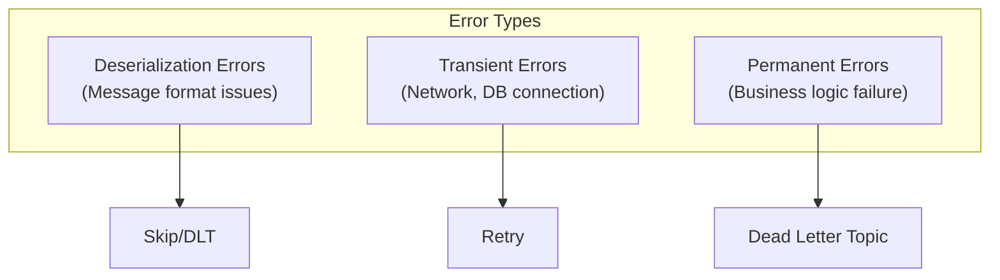
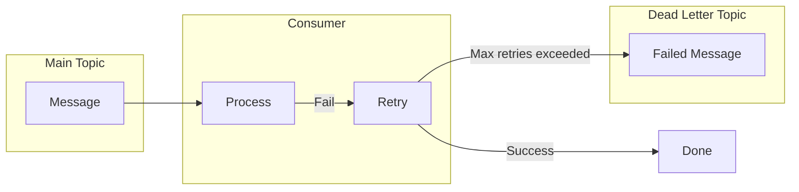
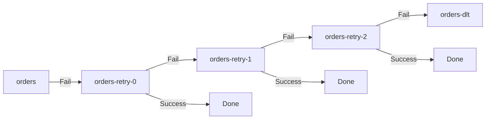


- Error types: Deserialization errors (skip), Transient errors (retry), Permanent errors (DLT)
- Use @RetryableTopic for declarative retry and DLT handling (Spring Kafka 2.7+)
- DefaultErrorHandler + DeadLetterPublishingRecoverer for DLT publishing
- Handle deserialization errors with ErrorHandlingDeserializer
- Set up alerts when DLT messages arrive for quick response


**Target Audience**: Developers implementing Consumer error handling strategies

**Prerequisites**: Consumer operation principles from [Consumer Group & Offset](), Spring Kafka basics

---

Understand Kafka Consumer error handling strategies and Dead Letter Topic patterns.

#### Error Types

Errors occurring in Kafka Consumer are broadly classified into three types.



*Diagram: Handling strategy by error type - Deserialization errors are skipped/DLT, transient errors are retried, permanent errors are sent to DLT.*

Deserialization errors are message format issues like JSON parsing failure.


- Deserialization errors: Message format issues, retry is pointless → skip/DLT
- Transient errors: DB connection, timeout, etc. → can be resolved with retry
- Permanent errors: Business logic failure → send to DLT for separate handling
 Since the message itself is wrong, retrying won't solve it. Skip or send to Dead Letter Topic.

Transient errors are temporary issues like DB connection failures or timeouts. Since retrying after a short wait has high success probability, apply retry strategy.

Permanent errors are business logic issues like validation failures. Since retrying produces the same result, send to Dead Letter Topic for separate handling.

#### Basic Error Handling

**DefaultErrorHandler (Spring Kafka 2.8+)**

The default error handler provided since Spring Kafka 2.8. Retries at configured intervals and count, and skips the record after maximum retry count is exceeded.

```java
@Configuration
public class KafkaConfig {

    @Bean
    public DefaultErrorHandler errorHandler() {
        // 3 retries at 1 second intervals
        return new DefaultErrorHandler(
            new FixedBackOff(1000L, 3L)
        );
    }
}
```

**Retry Strategies**

FixedBackOff retries at fixed intervals. The example above retries 3 times at 1 second intervals.

ExponentialBackOff increases wait time exponentially. First retry after 1 second, second after 2 seconds, third after 4 seconds, and so on.

```java
@Bean
public DefaultErrorHandler errorHandler() {
    ExponentialBackOff backOff = new ExponentialBackOff(1000L, 2.0);
    backOff.setMaxElapsedTime(60000L);  // Max 1 minute
    return new DefaultErrorHandler(backOff);
}
```

#### Dead Letter Topic (DLT)

Dead Letter Topic is a separate Topic that stores messages that cannot be processed after retries. By not discarding failed messages but keeping them, you can analyze or manually process them later.



*Diagram: DLT processing flow - On message processing failure, retry, send to Dead Letter Topic when max retries exceeded.*


- Dead Letter Topic: Storage space for messages that failed after retries
- Failed messages are kept (not discarded) for analysis/manual processing
- Default DLT Topic name: original-topic.DLT (e.g., orders.DLT)


**DeadLetterPublishingRecoverer**

DLT publishing feature provided by Spring Kafka. Sends messages to DLT when they fail after maximum retries. Default DLT Topic name is `original-topic.DLT` (e.g., `orders.DLT`).

```java
@Configuration
public class KafkaConfig {

    @Bean
    public DefaultErrorHandler errorHandler(
            KafkaTemplate<String, Object> kafkaTemplate) {

        DeadLetterPublishingRecoverer recoverer =
            new DeadLetterPublishingRecoverer(kafkaTemplate);

        return new DefaultErrorHandler(
            recoverer,
            new FixedBackOff(1000L, 3L)
        );
    }
}
```

**DLT Customization**

You can change the DLT Topic name or configure certain exceptions to not retry.

```java
@Bean
public DefaultErrorHandler errorHandler(
        KafkaTemplate<String, Object> kafkaTemplate) {

    // Customize DLT Topic name
    DeadLetterPublishingRecoverer recoverer =
        new DeadLetterPublishingRecoverer(kafkaTemplate,
            (record, exception) ->
                new TopicPartition(
                    record.topic() + "-dead-letter",
                    record.partition()
                ));

    // Don't retry certain exceptions
    DefaultErrorHandler handler = new DefaultErrorHandler(
        recoverer,
        new FixedBackOff(1000L, 3L)
    );

    handler.addNotRetryableExceptions(
        ValidationException.class,
        NullPointerException.class
    );

    return handler;
}
```

ValidationException or NullPointerException produce the same result on retry, so send immediately to DLT.

#### @RetryableTopic (Recommended)

Declarative retry and DLT handling provided in Spring Kafka 2.7+. Define retry policy with annotations for cleaner code.

**Basic Usage**

```java
@Component
public class OrderConsumer {

    @RetryableTopic(
        attempts = "4",  // 1 original + 3 retries
        backoff = @Backoff(delay = 1000, multiplier = 2)
    )
    @KafkaListener(topics = "orders")
    public void consume(OrderEvent event) {
        // Processing logic
        processOrder(event);
    }

    @DltHandler
    public void handleDlt(OrderEvent event,
                          @Header(KafkaHeaders.RECEIVED_TOPIC) String topic,
                          @Header(KafkaHeaders.EXCEPTION_MESSAGE) String error) {
        log.error("DLT received - Topic: {}, Error: {}", topic, error);
        // DLT message processing (alerts, logging, etc.)
        alertService.sendAlert(event, error);
    }
}
```

**Retry Topic Structure**

@RetryableTopic automatically creates retry Topics. On failure from original orders, it goes through orders-retry-0, orders-retry-1, orders-retry-2, and finally to orders-dlt.



*Diagram: @RetryableTopic retry flow - On failure from orders, goes through orders-retry-0, retry-1, retry-2, and finally to orders-dlt.*


- @RetryableTopic: Declarative retry and DLT handling (Spring Kafka 2.7+)
- Auto-creates retry Topics: topic-retry-0, retry-1, ..., topic-dlt
- Implement DLT message handling logic with @DltHandler


**Advanced Settings**

```java
@RetryableTopic(
    attempts = "4",
    backoff = @Backoff(delay = 1000, multiplier = 2, maxDelay = 10000),
    autoCreateTopics = "true",
    topicSuffixingStrategy = TopicSuffixingStrategy.SUFFIX_WITH_INDEX_VALUE,
    dltStrategy = DltStrategy.ALWAYS_RETRY_ON_ERROR,
    include = {RetryableException.class},  // Exceptions to retry
    exclude = {NonRetryableException.class}  // Exceptions not to retry
)
@KafkaListener(topics = "orders")
public void consume(OrderEvent event) {
    // ...
}
```

attempts is total attempt count (default 3). backoff.delay is base wait time (default 1000ms), backoff.multiplier is wait time increase rate (default 0 for fixed), backoff.maxDelay is maximum wait time. include specifies exceptions to retry, exclude specifies exceptions not to retry.

#### Deserialization Error Handling

When message deserialization fails, Consumer cannot process that message. Using ErrorHandlingDeserializer allows handling deserialization failures in the application.

```yaml
spring:
  kafka:
    consumer:
      key-deserializer: org.springframework.kafka.support.serializer.ErrorHandlingDeserializer
      value-deserializer: org.springframework.kafka.support.serializer.ErrorHandlingDeserializer
      properties:
        spring.deserializer.key.delegate.class: org.apache.kafka.common.serialization.StringDeserializer
        spring.deserializer.value.delegate.class: org.springframework.kafka.support.serializer.JsonDeserializer
        spring.json.trusted.packages: "com.example.*"
```

On deserialization failure, value is passed as null, and exception information is included in headers.

```java
@KafkaListener(topics = "orders")
public void consume(ConsumerRecord<String, OrderEvent> record) {
    if (record.value() == null) {
        // Deserialization failed
        log.error("Deserialization failed: {}", new String(record.headers()
            .lastHeader("springDeserializerExceptionValue").value()));
        return;
    }
    processOrder(record.value());
}
```

#### Error Handling Patterns

**Pattern 1: Retry + DLT**

The most common pattern. Retry a certain number of times, then send to DLT on failure.

```java
@RetryableTopic(attempts = "4")
@KafkaListener(topics = "orders")
public void consume(OrderEvent event) {
    validateAndProcess(event);
}

@DltHandler
public void handleDlt(OrderEvent event) {
    saveToFailedOrders(event);
    notifyAdmin(event);
}
```

**Pattern 2: Conditional Retry**

Decide whether to retry based on exception type. Retry transient errors, log and skip permanent errors.

```java
@KafkaListener(topics = "orders")
public void consume(OrderEvent event) {
    try {
        processOrder(event);
    } catch (TemporaryException e) {
        // Can retry → throw exception
        throw e;
    } catch (PermanentException e) {
        // Can't retry → log and skip
        log.error("Cannot process: {}", event, e);
        saveToFailedOrders(event, e);
    }
}
```

**Pattern 3: Manual Reprocessing**

Read messages from DLT, manually review, and reprocess.

```java
@KafkaListener(topics = "orders-dlt")
public void processDlt(
        ConsumerRecord<String, OrderEvent> record,
        @Header(KafkaHeaders.EXCEPTION_MESSAGE) String error) {

    OrderEvent event = record.value();

    // Reprocess after manual review
    if (canBeFixed(event)) {
        OrderEvent fixed = fixEvent(event);
        kafkaTemplate.send("orders", record.key(), fixed);
        log.info("Reprocessing complete: {}", record.key());
    } else {
        permanentlyFailed(event, error);
    }
}
```

#### Monitoring and Alerts

Send alerts immediately when messages arrive in DLT for quick response.

```java
@DltHandler
public void handleDlt(
        ConsumerRecord<String, OrderEvent> record,
        @Header(KafkaHeaders.EXCEPTION_MESSAGE) String error,
        @Header(KafkaHeaders.ORIGINAL_TOPIC) String originalTopic,
        @Header(KafkaHeaders.ORIGINAL_OFFSET) long originalOffset) {

    DltMessage dltMessage = DltMessage.builder()
        .key(record.key())
        .value(record.value())
        .originalTopic(originalTopic)
        .originalOffset(originalOffset)
        .error(error)
        .timestamp(Instant.now())
        .build();

    // Slack/email alert
    alertService.sendDltAlert(dltMessage);

    // Record metrics
    meterRegistry.counter("kafka.dlt.received",
        "topic", originalTopic).increment();
}
```

#### Summary

For error handling strategies, @RetryableTopic provides declarative retry, DefaultErrorHandler provides programmatic handling, @DltHandler provides DLT handling.

By error type, retry transient errors with exponential backoff, move permanent errors immediately to DLT, log and skip deserialization errors. Send alerts and manually review messages stored in DLT.

#### Next Steps

- [Monitoring Basics]() - Kafka monitoring and metrics
