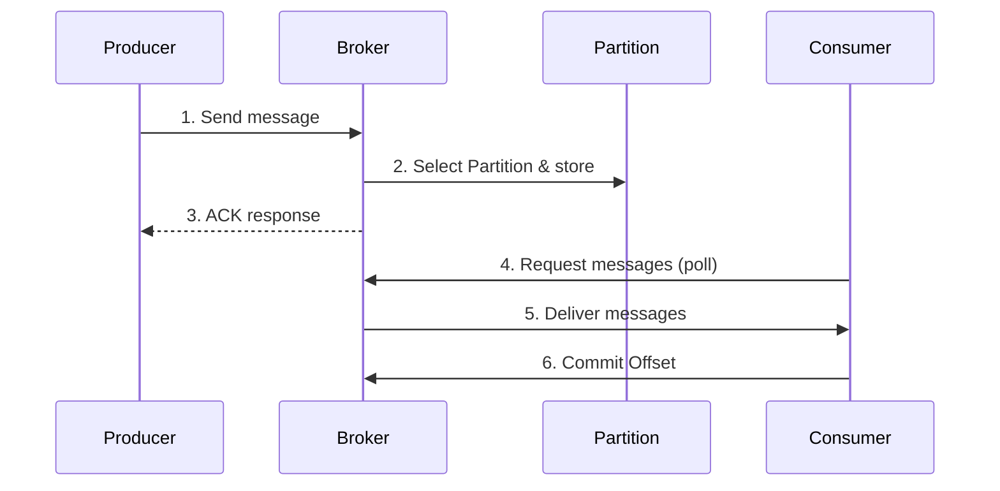


- Producer serializes messages and Partitioner determines target Partition
- With Key, same Key goes to same Partition ensuring order guarantee
- Broker stores messages in Partition, replicates to ISR, then returns ACK
- Consumer fetches messages via Pull method, commits Offset after processing
- Three delivery guarantee levels: At-Most-Once, At-Least-Once, Exactly-Once


**Target Audience**: Developers who understand Kafka's basic components, those learning detailed message delivery operations

**Prerequisites**: Understanding of Producer, Consumer, Broker, Topic, Partition concepts from [Core Components](core-components/)

---

Understanding the complete process of message publishing and consumption in Kafka is the foundation of stable system operation. Knowing what happens at each stage as messages travel from Producer to Broker storage to Consumer retrieval enables quick problem identification and resolution in trouble situations.

This document examines each stage of message flow in detail and addresses common problems and solutions at each stage. The goal is to understand not just "how it works" but "why it was designed this way and what impact it has in practice."

#### Why Understanding Message Flow is Important

If you think of Kafka as just a simple message queue, you'll encounter unexpected problems during operation. Deep understanding of message flow enables you to answer questions like these.

"Why did message order get scrambled?" - This problem is hard to diagnose without understanding the relationship between Partition and Key. Kafka guarantees order only within the same Partition, so messages requiring order must use the same Key.

"Why was the same message processed twice?" - This problem occurs without understanding Offset commit timing. Committing before processing causes message loss on processing failure, while committing after processing can cause duplicate processing on commit failure.

"Why isn't Consumer receiving messages?" - This problem is hard to diagnose without understanding Pull method characteristics. Consumer can't receive messages if it doesn't call poll(), and too long poll() intervals trigger rebalancing.

"Why is throughput lower than expected?" - This problem can't be resolved without understanding Partition distribution principles. If Consumer count exceeds Partition count, some Consumers become idle.

#### Overall Flow Overview

The process of message delivery from Producer to Consumer can be broadly divided into three stages. In the first stage, Producer serializes the message, selects a Partition, and sends to Broker. In the second stage, Broker stores the message in a Partition and synchronizes replicas. In the third stage, Consumer sends poll requests to Broker to fetch messages, processes them, and commits Offset.



*Diagram: When Producer sends message to Broker, Broker stores in Partition and responds with ACK. When Consumer requests via poll, Broker delivers messages, and Consumer commits Offset after processing.*


- Message flow is divided into 3 stages: publish (Producer->Broker), store (Broker), consume (Broker->Consumer)
- Understanding each stage's operation is necessary to resolve order scrambling, duplicate processing, and message loss problems
- Pull method characteristics and Offset commit timing determine delivery guarantee level


#### Message Publishing Stage

The process of Producer sending messages to Kafka consists of several stages. First, the application creates a message as a Key-Value pair. Key is optional but must be specified if order guarantee is needed. Then the Serializer converts objects to byte arrays. StringSerializer for strings, JsonSerializer for JSON, AvroSerializer for Avro.

The serialized message passes through the Partitioner which determines which Partition to store it in. With a Key, the Key's hash value divided by Partition count gives the Partition number as remainder. Same Key always goes to same Partition, guaranteeing order. Without Key, round robin distributes evenly across Partitions.

```java
// Producer code example
kafkaTemplate.send("orders", orderId, orderJson);
//                  Topic    Key      Value
```

**Why Key Design is Important**

Key is not just a simple identifier; it determines the message's fate. Kafka guarantees order only within a Partition, so messages requiring order must use the same Key.

Consider order status change events as an example. Using orderId as Key ensures all events for the same order (OrderCreated, OrderPaid, OrderShipped) are stored in the same Partition and processed in order. But sending without Key can store each event in different Partitions, and Consumer might process OrderShipped before OrderCreated. This causes state machine errors or business logic errors.

When designing Keys, consider the business domain. Order events use orderId, user activity logs use userId, sensor data uses sensorId as Key. For generic logs where order doesn't matter, sending without Key distributes evenly, which is better for throughput.

**Hot Partition Problem**

When messages concentrate on specific Keys, only that Partition becomes overloaded - the Hot Partition problem. For example, if all orders from a large enterprise use customer-enterprise Key, that Partition's throughput explodes while other Partitions remain idle.

To solve this, Keys must be more granular. Including order ID like customer-enterprise-order-123 distributes the same customer's orders across multiple Partitions. However, in this case order between the same customer's orders is not guaranteed, so customer ID should only be used as Key when order guarantee is essential.


- Producer processes messages in sequence: serialization -> Partitioner -> send
- With Key, hash-based Partition determination, same Key goes to same Partition
- Without Key, round robin distributes evenly
- Message concentration on specific Keys causes Hot Partition problem, solve by granularizing Keys


#### Message Storage Stage

When Broker receives a message, it appends to the end of the Partition's log. This storage method is called Append-only. Stored messages cannot be modified, and each message is assigned a unique Offset within the Partition. Offset starts at 0 and increases by 1 for each added message.

The reason Kafka is fast despite storing to disk is sequential I/O. Only appending data to file end means disk heads don't need to move. It also leverages the operating system's page cache to serve frequently accessed data directly from memory. When sending data to Consumers, Zero-Copy technology copies directly from kernel space to network buffer. Thanks to these optimizations, Kafka can process over 100,000 messages per second on a single Partition.

Physically, a Partition consists of multiple Segment files. Each Segment comprises log files (.log) and index files (.index, .timeindex). When Segment size reaches log.segment.bytes (default 1GB) or log.roll.hours time passes, a new Segment is created. Old Segments are automatically deleted according to log.retention.hours settings.

```
/kafka-logs/
└── orders-0/                     # Topic "orders" Partition 0
    ├── 00000000000000000000.log   # First Segment
    ├── 00000000000000000000.index
    ├── 00000000000012345678.log   # Second Segment
    └── ...
```


- Broker stores messages to Partition log using Append-only method
- High throughput achieved through sequential I/O, page cache, Zero-Copy
- Each message has unique Offset within Partition
- Managed in Segment file units, automatically deleted according to retention settings


#### Message Consumption Stage

Consumer fetches messages from Broker using Pull method. When Consumer calls the poll() method, Broker returns messages after the last committed Offset from Partitions assigned to that Consumer. Consumer processes messages and commits Offset to record processing completion.

```java
@KafkaListener(topics = "orders", groupId = "order-service")
public void consume(ConsumerRecord<String, String> record) {
    String key = record.key();
    String value = record.value();
    long offset = record.offset();

    processOrder(value);
    // Offset is committed automatically (default setting)
}
```

**Why Pull Method is Used**

There's a clear reason Kafka chose Pull over Push. In Push method, Broker pushes messages to Consumer, but if Consumer processing is slow, messages pile up potentially causing memory exhaustion. Backpressure mechanisms are needed and implementation becomes complex.

In Pull method, Consumer fetches messages at its own processing pace. Slow Consumers work without problems, and fast Consumers can fetch more messages. Also, Consumer can fetch multiple messages at once for efficient batch processing.

The caveat with Pull method is poll() call interval. If next poll() isn't called within max.poll.interval.ms (default 5 minutes), Consumer is considered dead and rebalancing occurs. Long-running tasks should be delegated to separate threads or max.poll.interval.ms should be increased.

```java
@KafkaListener(topics = "orders")
public void consume(String message) {
    // Processing taking 5+ minutes triggers rebalancing
    // Solution: delegate to separate thread
    executorService.submit(() -> verySlowProcess(message));
}
```


- Consumer uses Pull method to fetch messages at its own processing pace
- Unlike Push, no backpressure problems even if Consumer is slow
- If poll() interval exceeds max.poll.interval.ms (default 5 min), rebalancing occurs
- Long-running tasks should be delegated to separate threads to prevent poll() timeout


#### Message Guarantee Levels

Kafka provides three message delivery guarantee levels. At-Most-Once delivers messages at most once and may lose them. Offset is committed immediately after fetching, then processed. If error occurs during processing, that message won't be processed again. Used for logs or metrics where some loss is acceptable.

At-Least-Once delivers messages at least once and may duplicate. Offset is committed after processing. If processing succeeds but error occurs before commit, the same message is processed again. Most commonly used method; duplicate problems can be solved by ensuring idempotency in Consumer.

Exactly-Once processes messages exactly once. Uses Kafka transactions to perform processing and commit atomically. Used for financial transactions where accuracy is critical, but has overhead so should only be used when necessary.

In most cases, the combination of At-Least-Once and idempotent processing is appropriate. Idempotent processing means implementing so results are the same even if the same message is processed multiple times. For example, store event ID in database and check before processing if it's already been processed.

```java
@KafkaListener(topics = "orders")
public void consume(ConsumerRecord<String, OrderEvent> record) {
    String eventId = record.value().getEventId();

    if (processedEventRepository.exists(eventId)) {
        log.info("Already processed event, skipping: {}", eventId);
        return;
    }

    processOrder(record.value());
    processedEventRepository.save(eventId);
}
```


- At-Most-Once: may lose, no duplicates (suitable for logs, metrics)
- At-Least-Once: no loss, may duplicate (general use, idempotent processing needed)
- Exactly-Once: no loss/duplicates (uses transactions, for accuracy-critical cases like finance)
- Most cases: At-Least-Once + idempotent processing combination is appropriate


#### Common Mistakes in Practice

The first common mistake is implementing order-dependent logic without Keys. For order-critical events like order status changes, not specifying Key causes events to arrive out of order at Consumer, causing state machine errors. The solution is to always specify Key for order-critical events.

```java
// Wrong code: order status change without Key
kafkaTemplate.send("order-events", orderEvent);

// Correct code
kafkaTemplate.send("order-events", orderId, orderEvent);
```

The second common mistake is relying on auto-commit with long processing times. Auto-commit (enable.auto.commit=true) commits Offset every 5 seconds by default. If processing takes 10 seconds, auto-commit occurs during processing, and on processing failure the message is lost. Use manual commit for long processing.

```java
@KafkaListener(topics = "orders")
public void consume(String message, Acknowledgment ack) {
    longRunningProcess(message);
    ack.acknowledge();  // Commit after processing complete
}
```

The third common mistake is Consumer processing speed slower than Producer send speed. In this case, Consumer lag continuously increases until it reaches unprocessable levels. Solve by adding Consumer instances, optimizing processing logic, or increasing Partition count.

The fourth common mistake is deploying more Consumers than Partitions. One Partition can only be processed by one Consumer within a Consumer Group. If there are 3 Partitions but 5 Consumers, 2 become idle. Keep Consumer count at or below Partition count, or increase Partition count first if expansion is needed.


- Order-critical events must have Key specified
- When using auto-commit with long processing time, message loss possible; manual commit recommended
- If Consumer Lag increases, add instances or optimize processing logic
- Keep Consumer count at or below Partition count (excess Consumers become idle)


#### Comparison with Other Messaging Systems

Kafka, RabbitMQ, and AWS SQS each have different characteristics, making situational choice important.

Kafka's distributed log architecture provides very high throughput. Messages are retained for configured duration enabling reprocessing, and order is guaranteed within Partition. Multiple Consumer Groups can independently read the same messages, making it suitable for event sourcing or stream processing. However, operational complexity is high.

RabbitMQ is a traditional message broker that well supports complex routing rules and request-response patterns. Per-message TTL and priority settings are possible. Operations are simpler than Kafka but throughput is lower, and by default messages are deleted after consumption making reprocessing difficult.

AWS SQS is a fully managed service with lowest operational burden. Easy integration with AWS Lambda makes it suitable for serverless architectures. However, throughput is limited, and FIFO queues must be used for order guarantee.

Kafka is suitable when high throughput is needed, message reprocessing is needed, or multiple Consumers need to read the same messages. RabbitMQ is suitable for complex routing or RPC patterns, and AWS SQS for simple queuing with minimal operational burden.


- Kafka: high throughput, message retention/reprocessing, multiple Consumer Group independent consumption
- RabbitMQ: complex routing, RPC patterns, message deleted after consumption
- AWS SQS: fully managed, simple queuing, easy serverless integration
- Choosing the right system for requirements is important


#### Operations Monitoring Guide

The most important metric in Kafka operations is Consumer lag. Lag is the number of messages produced by Producer that Consumer hasn't processed yet. Lag near 0 means processing is near real-time; continuously increasing Lag means Consumer can't keep up with throughput.

```bash
kafka-consumer-groups.sh --describe --group order-service \
  --bootstrap-server localhost:9092
```

Lag under 100 is normal. 100-1,000 requires Consumer performance check. 1,000-10,000 needs Consumer addition or optimization. Over 10,000 requires immediate action to identify processing bottleneck.

When problems occur, check in this order. First check Consumer lag to identify processing bottleneck. Check Consumer group member count to verify Consumer failures. Check Broker CPU and memory to determine infrastructure issues. Check Producer error rate to verify send failures. Finally check network latency.


- Consumer Lag is the most important monitoring metric
- Lag under 100 normal, 100-1000 caution, 1000-10000 warning, over 10000 critical
- When problems occur: check Lag -> Consumer status -> Broker -> Producer -> network in order
- kafka-consumer-groups.sh command enables real-time Lag monitoring


#### Key Summary

Key must be specified when order guarantee is needed. Messages with same Key are stored in same Partition guaranteeing order. However, message concentration on specific Keys can cause Hot Partition problems.

Partition is the unit of parallel processing. Consumer count should be kept at or below Partition count for all Consumers to have work. Partition count must be increased first if expansion is needed.

Offset represents Consumer's read position. Commit timing determines message guarantee level. Committing before processing risks loss; committing after processing risks duplication.

Pull method allows Consumer to fetch messages at its own pace. However, if poll() interval is too long, rebalancing occurs so caution is needed.

#### Next Steps

This document covered the complete process of message delivery from Producer to Consumer. Next step is to learn in more detail about Consumer Group and Offset management.

- [Consumer Group and Offset](consumer-group/) - Details of parallel processing and state management
