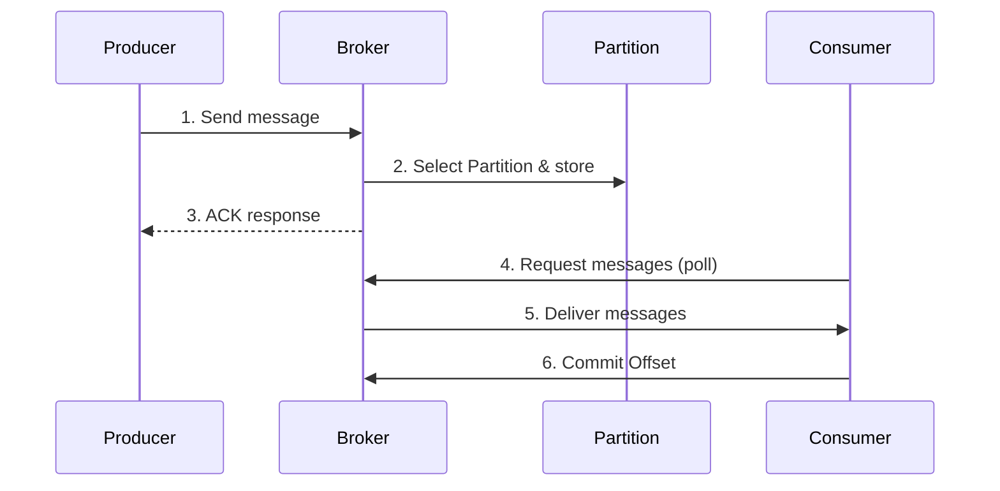
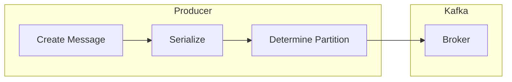
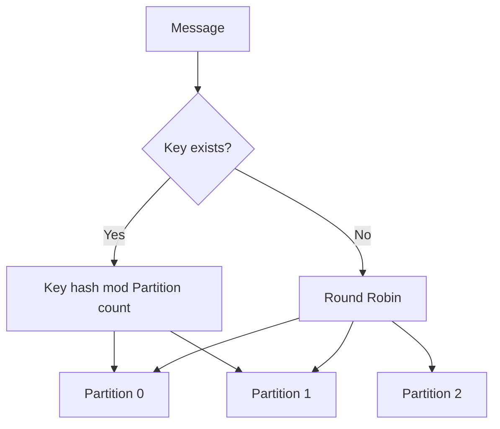
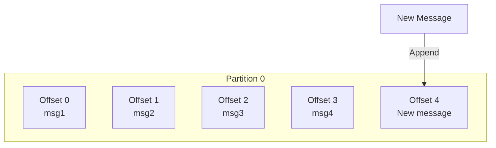
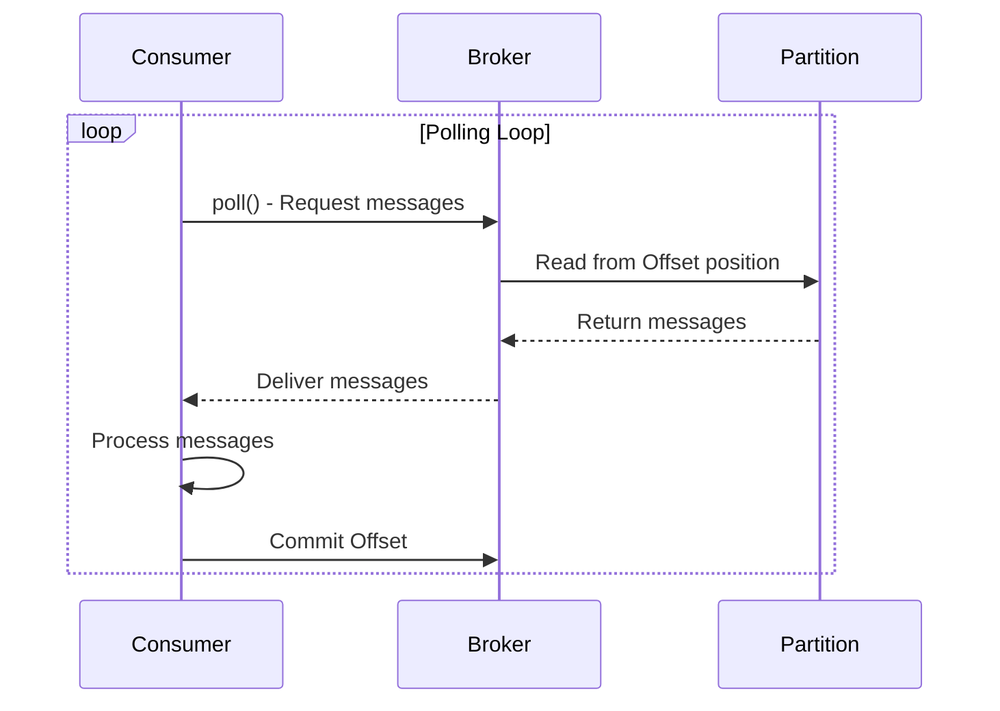
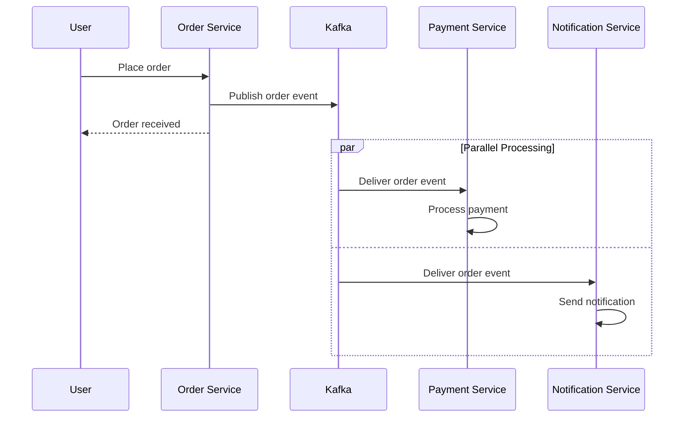
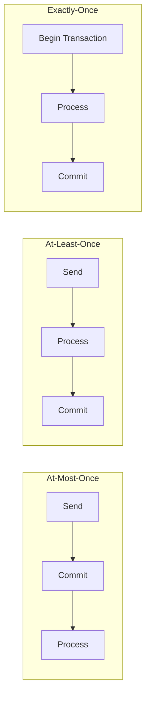

# Message Flow

Understanding the complete process of message publication and consumption in Kafka.

## Overview of the Complete Flow



## Step 1: Message Publishing (Produce)

Producer sends messages to Kafka.



### Publishing Process

1. **Create Message**: Compose message as Key-Value pair
2. **Serialize**: Convert object to byte array
3. **Determine Partition**: Key hash or round-robin
4. **Send**: Transmit to Broker over network

```java
// Producer code example
kafkaTemplate.send("orders", orderId, orderJson);
//                  Topic    Key      Value
```

### Partition Selection Methods



- **With Key**: Same Key always goes to same Partition
- **Without Key**: Round-robin for even distribution

## Step 2: Message Storage (Store)

Broker stores messages in Partitions.



### Storage Characteristics

| Characteristic | Description |
|----------------|-------------|
| **Sequential Storage** | Messages appended to end of Partition (Append-only) |
| **Immutability** | Stored messages cannot be modified |
| **Offset Assignment** | Each message gets a unique sequence number |
| **Durability** | Stored on disk, survives restarts |

### What is an Offset?

```
Partition 0: [0] [1] [2] [3] [4] [5] [6] [7]
                              ↑           ↑
                       Current Offset    Latest Offset
                        (Read position)   (Newest message)
```

- Unique identifier for each message (sequential number)
- Consumer tracks read position based on Offset
- Starts at 0 and increases infinitely

## Step 3: Message Consumption (Consume)

Consumer fetches messages from Broker.



### Consumption Process

1. **Poll**: Consumer requests messages from Broker
2. **Fetch**: Broker reads messages from Partition
3. **Process**: Consumer executes business logic
4. **Commit**: Save processed Offset

```java
// Consumer code example
@KafkaListener(topics = "orders", groupId = "order-service")
public void consume(ConsumerRecord<String, String> record) {
    String key = record.key();
    String value = record.value();
    long offset = record.offset();

    // Process business logic
    processOrder(value);

    // Offset is committed automatically (default setting)
}
```

### Pull vs Push

Kafka uses the **Pull model**:

| Model | Description | Advantage |
|-------|-------------|-----------|
| **Pull** | Consumer fetches when needed | Matches Consumer processing speed |
| Push | Broker pushes to Consumer | Can overload Consumer |

## Complete Flow Example

Message flow in an order system:



## Message Delivery Guarantees



| Level | Description | Use Case |
|-------|-------------|----------|
| **At-Most-Once** | At most once (may be lost) | Logs, metrics |
| **At-Least-Once** | At least once (may duplicate) | General events |
| **Exactly-Once** | Exactly once | Financial transactions |

## Next Steps

- [Consumer Group & Offset](../consumer-group-offset/) - Parallel processing and state management
