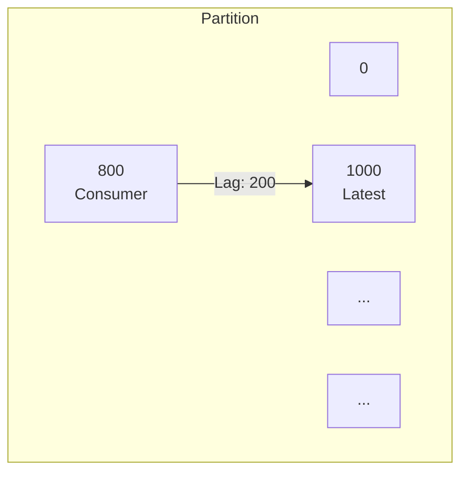
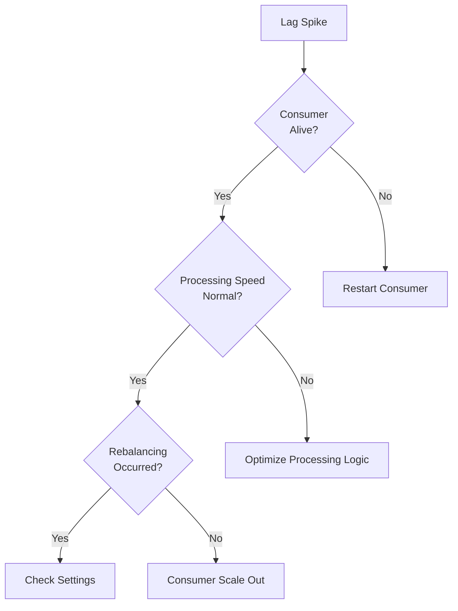


- Consumer Lag is the most important metric; take immediate action on increasing trends
- Broker key metrics: UnderReplicatedPartitions, ActiveControllerCount, OfflinePartitionsCount
- Producer metrics: record-send-rate, record-error-rate, request-latency-avg
- Prometheus + Grafana recommended for visualization and alerting
- On Lag spike: Check Consumer status → Processing speed → Rebalancing → Scale out


**Target Audience**: Operators and developers managing and monitoring Kafka clusters

**Prerequisites**: Offset and Lag concepts from [Consumer Group & Offset](consumer-group/)

---

Understand key metrics for Kafka clusters and applications.

#### Monitoring Targets

What to monitor in a Kafka system can be divided into four areas.

Broker monitoring is essential for understanding the overall cluster status. Check replication status, controller status, partition status, etc. to determine if the cluster is operating normally.

Producer monitoring tracks message delivery performance. Check throughput per second, error rate, and latency to verify Producer is operating efficiently.

Consumer monitoring tracks message processing status. Consumer Lag is the most important metric, showing whether processing speed keeps up with production speed.

Topic/Partition monitoring checks data distribution status and each partition's state.

#### Consumer Lag

Consumer Lag is the most important metric in Kafka monitoring. Lag is the difference between the Topic's latest message Offset (Log End Offset, LEO) and the Consumer's current processed position (Consumer Offset). For example, if a Partition's LEO is 1000 and Consumer Offset is 800, the Lag is 200. This means the Consumer has 200 messages left to process.



**Interpreting Lag**

Lag of 0 indicates Consumer is processing messages in real-time; this is normal status. Lag maintaining a constant value indicates Consumer is processing messages stably; this is also normal status. However, continuously increasing Lag means processing speed is slower than production speed and action is needed. Spiking Lag means Consumer has stopped processing or a serious problem has occurred, requiring urgent action.

**Lag Monitoring Methods**

Using the kafka-consumer-groups.sh command, you can check the Consumer Group's current status and Lag.

```bash
kafka-consumer-groups.sh \
  --bootstrap-server localhost:9092 \
  --group order-service \
  --describe
```

The output shows Current Consumer Offset, Log End Offset, and Lag for each Partition.

```
GROUP           TOPIC           PARTITION  CURRENT-OFFSET  LOG-END-OFFSET  LAG
order-service   orders          0          800             1000            200
order-service   orders          1          750             900             150
order-service   orders          2          820             820             0
```

Using Spring Boot Actuator, you can expose Lag metrics directly from the application.

```yaml
management:
  endpoints:
    web:
      exposure:
        include: health,metrics,kafka
```

Query Lag through the Actuator endpoint.

```bash
curl http://localhost:8080/actuator/metrics/kafka.consumer.fetch.manager.records.lag
```

#### Broker Metrics

Key metrics for understanding Broker status.

UnderReplicatedPartitions indicates the number of partitions with insufficient replication. If this value is greater than 0, some Brokers may be down or there may be network issues, requiring immediate investigation.

ActiveControllerCount is the number of active controllers in the cluster. This value should always be 1. If 0, there's no controller and the cluster isn't operating normally; if 2 or more, there may be a Split Brain situation.

OfflinePartitionsCount is the number of partitions in offline state. If this value is greater than 0, data in those partitions is inaccessible, requiring urgent action.

RequestHandlerAvgIdlePercent indicates the request handler's idle rate. If this value is below 30%, the Broker may be overloaded and resource expansion should be considered.

**JMX Metrics Setup**

Broker metrics are exposed through JMX (Java Management Extensions). Enable JMX port when starting Broker.

```bash
# Enable JMX (when starting broker)
KAFKA_JMX_OPTS="-Dcom.sun.management.jmxremote -Dcom.sun.management.jmxremote.port=9999"
```

Key JMX Bean paths are as follows.

```
kafka.server:type=ReplicaManager,name=UnderReplicatedPartitions
kafka.controller:type=KafkaController,name=ActiveControllerCount
kafka.server:type=BrokerTopicMetrics,name=MessagesInPerSec
kafka.network:type=RequestMetrics,name=TotalTimeMs,request=Produce
```

#### Producer Metrics

Metrics for monitoring Producer performance and stability.

record-send-rate indicates records sent per second, used to understand throughput. record-error-rate is errors per second; if this exceeds 1% of total sends, there may be a problem. request-latency-avg is average latency per request; if it exceeds 100ms, check network or Broker performance. batch-size-avg is average batch size, used to check batch efficiency. buffer-exhausted-rate is the frequency of buffer exhaustion; if greater than 0, increase buffer size.

**Spring Kafka + Micrometer Setup**

Using Spring Kafka with Micrometer makes Producer metrics collection easy.

```yaml
management:
  metrics:
    enable:
      kafka: true
```

Add custom metrics to track business-related indicators.

```java
@Component
public class KafkaMetrics {

    private final MeterRegistry meterRegistry;
    private final Counter successCounter;
    private final Counter errorCounter;

    public KafkaMetrics(MeterRegistry meterRegistry) {
        this.meterRegistry = meterRegistry;
        this.successCounter = meterRegistry.counter("kafka.producer.success");
        this.errorCounter = meterRegistry.counter("kafka.producer.error");
    }

    public void recordSuccess() {
        successCounter.increment();
    }

    public void recordError() {
        errorCounter.increment();
    }
}
```

#### Consumer Metrics

Metrics for monitoring Consumer status and performance.

records-lag is the current Lag value, the most important metric. An increasing trend indicates insufficient processing speed. records-lag-max is the maximum Lag value among all partitions, useful for checking if specific partitions have issues. records-consumed-rate is records consumed per second; sudden decrease indicates a problem. fetch-latency-avg is average fetch latency; increasing trend may indicate network or Broker issues. commit-latency-avg is average Offset commit latency; check if it exceeds 100ms.

**Lag Alert Setup**

Configure alerts when Lag exceeds certain thresholds.

```java
@Component
public class LagMonitor {

    private final MeterRegistry meterRegistry;
    private final AlertService alertService;

    @Scheduled(fixedRate = 30000)  // Every 30 seconds
    public void checkLag() {
        Gauge lagGauge = meterRegistry.find("kafka.consumer.fetch.manager.records.lag")
            .gauge();

        if (lagGauge != null && lagGauge.value() > 10000) {
            alertService.sendAlert(
                "Consumer Lag Critical",
                String.format("Current lag: %.0f", lagGauge.value())
            );
        }
    }
}
```

#### Prometheus + Grafana

Using Prometheus and Grafana, you can visualize Kafka metrics and configure alerts.

**JMX Exporter Setup**

JMX Exporter converts JMX metrics to Prometheus format.

```yaml
# jmx_exporter_config.yaml
rules:
  - pattern: kafka.server<type=(.+), name=(.+)><>Value
    name: kafka_server_$1_$2
    type: GAUGE

  - pattern: kafka.consumer<type=(.+), name=(.+), (.+)=(.+)><>Value
    name: kafka_consumer_$1_$2
    labels:
      $3: $4
    type: GAUGE
```

**Spring Boot Prometheus Setup**

Expose Prometheus endpoint from Spring Boot application.

```yaml
management:
  endpoints:
    web:
      exposure:
        include: prometheus,health,metrics
  metrics:
    export:
      prometheus:
        enabled: true
```

**Grafana Dashboard Queries**

Visualize Kafka metrics in Grafana using PromQL.

To aggregate Consumer Lag by Topic and Partition, use `sum(kafka_consumer_records_lag) by (topic, partition)` query. To calculate message processing rate over 5 minutes, use `rate(kafka_consumer_records_consumed_total[5m])` query. To calculate Producer error rate over 5 minutes, use `rate(kafka_producer_record_error_total[5m])` query.

#### Alert Setup Guide

Apply tiered thresholds when setting up Lag-based alerts. Lag below 100 is normal status. Between 100 and 1000, send warning alert. Above 1000, send urgent alert. If Lag is continuously increasing, send a separate trend alert.


Recommended thresholds per metric. Consumer Lag is Warning at 1,000, Critical at 10,000. Producer Error Rate is Warning at 1%, Critical at 5%. Broker UnderReplicated is Warning at 1, Critical above 1. Request Latency is Warning at 100ms, Critical at 500ms.

#### Logging Strategy

Structured logging is very useful for problem tracking. Using MDC (Mapped Diagnostic Context), you can add context information to logs.

```java
@KafkaListener(topics = "orders")
public void consume(ConsumerRecord<String, OrderEvent> record) {
    MDC.put("topic", record.topic());
    MDC.put("partition", String.valueOf(record.partition()));
    MDC.put("offset", String.valueOf(record.offset()));
    MDC.put("key", record.key());

    try {
        processOrder(record.value());
        log.info("Message processing complete");
    } catch (Exception e) {
        log.error("Message processing failed", e);
        throw e;
    } finally {
        MDC.clear();
    }
}
```

Outputting MDC fields in JSON format from Logback configuration makes searching and filtering in log analysis tools easy.

```xml
<appender name="KAFKA_LOG" class="ch.qos.logback.core.rolling.RollingFileAppender">
    <encoder class="net.logstash.logback.encoder.LogstashEncoder">
        <includeMdcKeyName>topic</includeMdcKeyName>
        <includeMdcKeyName>partition</includeMdcKeyName>
        <includeMdcKeyName>offset</includeMdcKeyName>
    </encoder>
</appender>
```

#### Troubleshooting

Identify causes step-by-step when Lag spikes.

First, check if Consumer is alive. If Consumer process is dead, restart it. If Consumer is alive, check if processing speed is normal. If processing speed is slow, optimize processing logic. If processing speed is normal, check if rebalancing occurred. If rebalancing occurred, review settings like session.timeout.ms, max.poll.interval.ms. If no rebalancing occurred, consider Consumer scale out.



**Problem Diagnosis Checklist**

Check Consumer status with kafka-consumer-groups.sh command.

```bash
kafka-consumer-groups.sh --describe --group order-service
```

Check for rebalancing occurrence in Kafka server logs.

```bash
grep "Rebalancing" /var/log/kafka/server.log
```

Check network connection status with netstat.

```bash
netstat -an | grep 9092
```

Check disk usage in Kafka data directory. Broker cannot receive new messages if disk is full.

```bash
df -h /var/lib/kafka
```

#### Summary

Three key metrics for Kafka monitoring. Consumer Lag is the most important metric indicating processing delay. Error Rate is an indicator of system quality. Latency is an indicator of performance.

For monitoring tools, use kafka-consumer-groups CLI, Spring Actuator, Prometheus, and Grafana. In order of priority, Consumer Lag is most important, followed by Error Rate, Latency, and finally Broker Health.

#### Next Steps

- [Hands-on Examples](../examples/) - Apply what you've learned in practice
