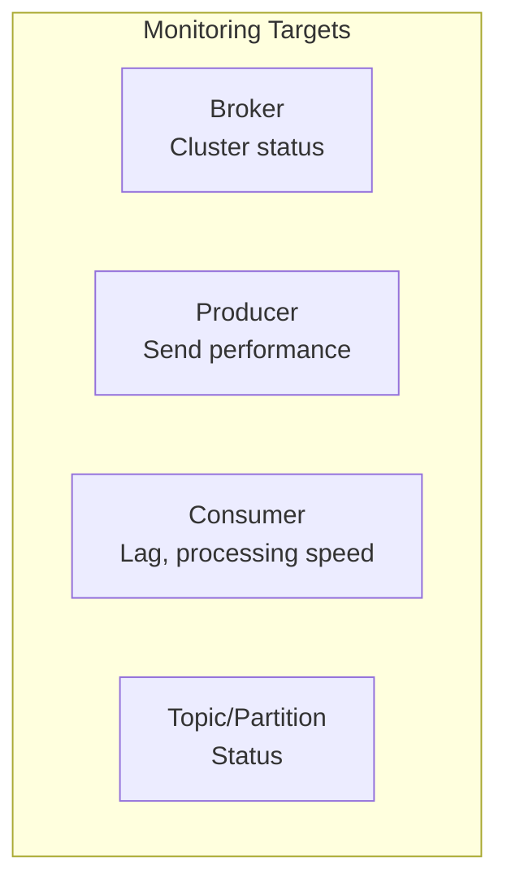
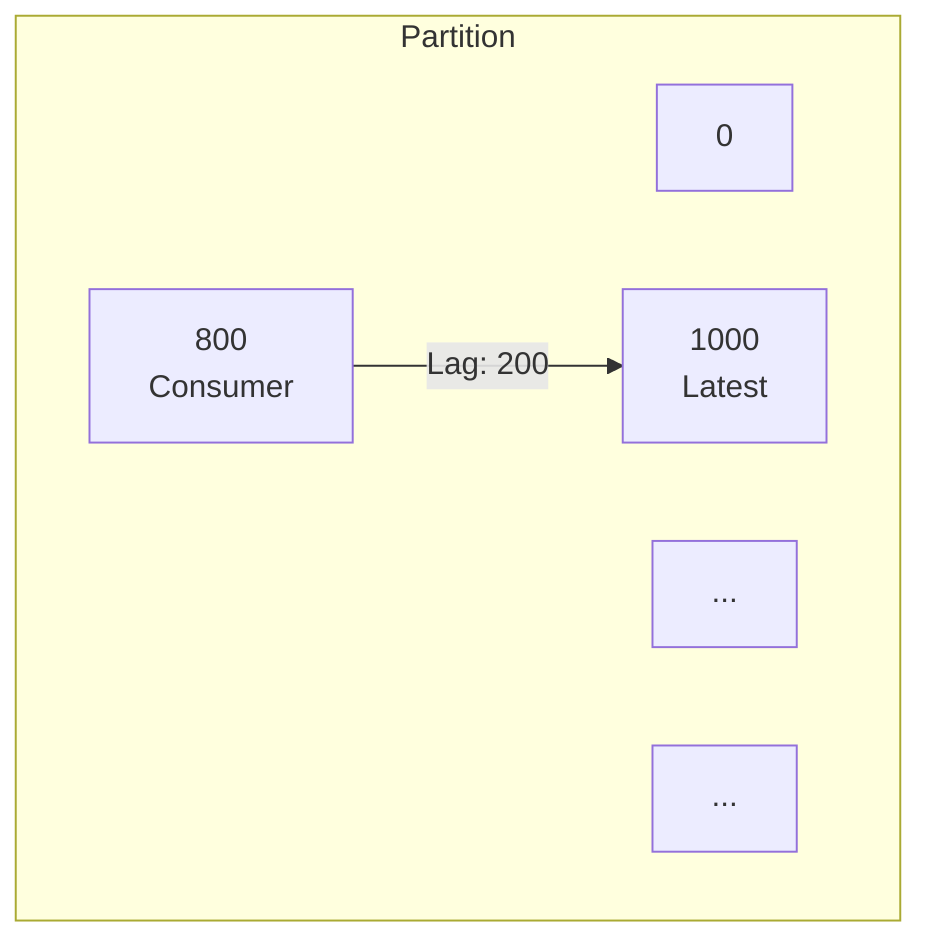
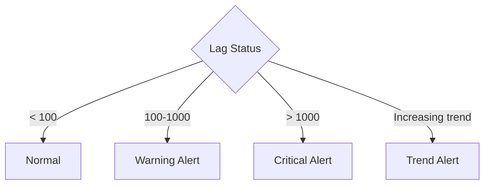
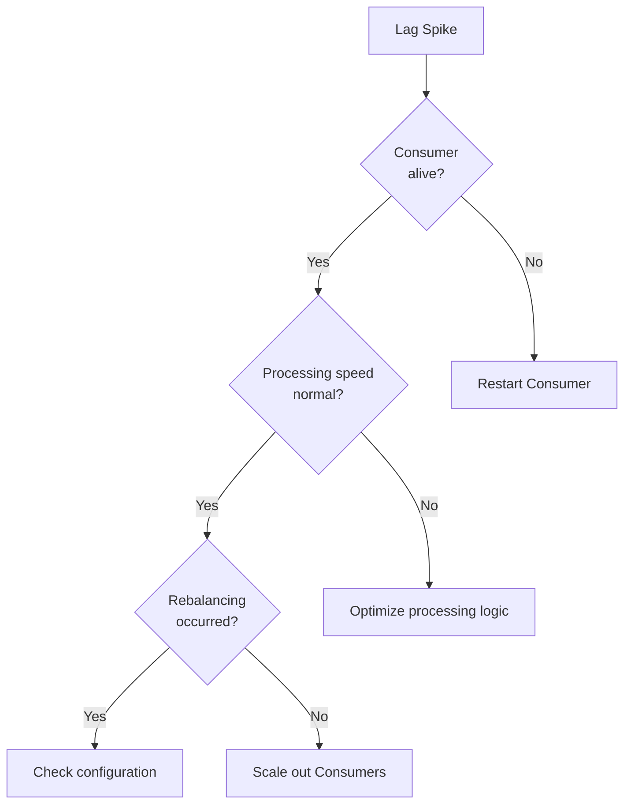
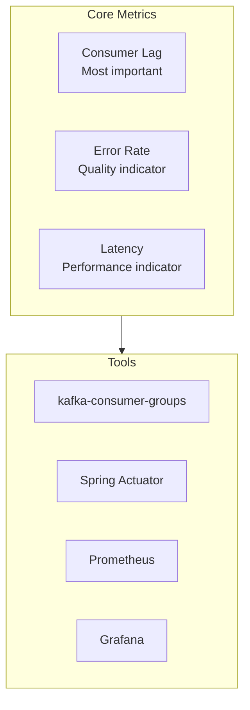

# Monitoring Basics

Understanding core metrics for Kafka clusters and applications.

## Monitoring Targets



## Consumer Lag

The most important metric.

### What is Lag?

```
Partition 0:
├── Log End Offset (LEO): 1000  (Latest message)
├── Consumer Offset: 800       (Current position)
└── Lag: 200                   (Pending processing)
```



### Lag Meaning

| Lag Status | Meaning | Action |
|------------|---------|--------|
| **0** | Real-time processing | Normal |
| **Constant value** | Stable processing | Normal |
| **Increasing trend** | Processing speed < production speed | Action needed |
| **Spike** | Processing stopped | Urgent action |

### Lag Monitoring

#### kafka-consumer-groups Command

```bash
kafka-consumer-groups.sh \
  --bootstrap-server localhost:9092 \
  --group order-service \
  --describe
```

Output:
```
GROUP           TOPIC           PARTITION  CURRENT-OFFSET  LOG-END-OFFSET  LAG
order-service   orders          0          800             1000            200
order-service   orders          1          750             900             150
order-service   orders          2          820             820             0
```

#### Spring Boot Actuator

```yaml
management:
  endpoints:
    web:
      exposure:
        include: health,metrics,kafka
```

```bash
curl http://localhost:8080/actuator/metrics/kafka.consumer.fetch.manager.records.lag
```

## Broker Metrics

### Core Metrics

| Metric | Description | Alert Level |
|--------|-------------|-------------|
| **UnderReplicatedPartitions** | Under-replicated partition count | > 0 |
| **ActiveControllerCount** | Active controller count | != 1 |
| **OfflinePartitionsCount** | Offline partition count | > 0 |
| **RequestHandlerAvgIdlePercent** | Handler idle rate | < 30% |

### JMX Metric Check

```bash
# Enable JMX (on broker start)
KAFKA_JMX_OPTS="-Dcom.sun.management.jmxremote -Dcom.sun.management.jmxremote.port=9999"
```

### Key JMX Beans

```
kafka.server:type=ReplicaManager,name=UnderReplicatedPartitions
kafka.controller:type=KafkaController,name=ActiveControllerCount
kafka.server:type=BrokerTopicMetrics,name=MessagesInPerSec
kafka.network:type=RequestMetrics,name=TotalTimeMs,request=Produce
```

## Producer Metrics

### Spring Kafka + Micrometer

```yaml
management:
  metrics:
    enable:
      kafka: true
```

### Core Metrics

| Metric | Description | Recommendation |
|--------|-------------|----------------|
| `record-send-rate` | Records sent per second | Monitor |
| `record-error-rate` | Errors per second | < 1% |
| `request-latency-avg` | Average request latency | < 100ms |
| `batch-size-avg` | Average batch size | Check batch efficiency |
| `buffer-exhausted-rate` | Buffer exhaustion frequency | 0 |

```java
// Add custom metrics with Micrometer
@Component
public class KafkaMetrics {

    private final MeterRegistry meterRegistry;
    private final Counter successCounter;
    private final Counter errorCounter;

    public KafkaMetrics(MeterRegistry meterRegistry) {
        this.meterRegistry = meterRegistry;
        this.successCounter = meterRegistry.counter("kafka.producer.success");
        this.errorCounter = meterRegistry.counter("kafka.producer.error");
    }

    public void recordSuccess() {
        successCounter.increment();
    }

    public void recordError() {
        errorCounter.increment();
    }
}
```

## Consumer Metrics

### Core Metrics

| Metric | Description | Watch For |
|--------|-------------|-----------|
| `records-lag` | Current Lag | Increasing trend |
| `records-lag-max` | Max Lag | Threshold exceeded |
| `records-consumed-rate` | Records consumed per second | Sharp decrease |
| `fetch-latency-avg` | Average fetch latency | Increasing trend |
| `commit-latency-avg` | Average commit latency | > 100ms |

### Lag Alerting

```java
@Component
public class LagMonitor {

    private final MeterRegistry meterRegistry;
    private final AlertService alertService;

    @Scheduled(fixedRate = 30000)  // Every 30 seconds
    public void checkLag() {
        Gauge lagGauge = meterRegistry.find("kafka.consumer.fetch.manager.records.lag")
            .gauge();

        if (lagGauge != null && lagGauge.value() > 10000) {
            alertService.sendAlert(
                "Consumer Lag Critical",
                String.format("Current lag: %.0f", lagGauge.value())
            );
        }
    }
}
```

## Prometheus + Grafana

### JMX Exporter Configuration

```yaml
# jmx_exporter_config.yaml
rules:
  - pattern: kafka.server<type=(.+), name=(.+)><>Value
    name: kafka_server_$1_$2
    type: GAUGE

  - pattern: kafka.consumer<type=(.+), name=(.+), (.+)=(.+)><>Value
    name: kafka_consumer_$1_$2
    labels:
      $3: $4
    type: GAUGE
```

### Spring Boot Configuration

```yaml
management:
  endpoints:
    web:
      exposure:
        include: prometheus,health,metrics
  metrics:
    export:
      prometheus:
        enabled: true
```

### Grafana Dashboard Query Examples

```promql
# Consumer Lag
sum(kafka_consumer_records_lag) by (topic, partition)

# Message processing rate
rate(kafka_consumer_records_consumed_total[5m])

# Producer error rate
rate(kafka_producer_record_error_total[5m])
```

## Alerting Guide

### Lag-based Alerting



### Alert Threshold Examples

| Metric | Warning | Critical |
|--------|---------|----------|
| Consumer Lag | 1,000 | 10,000 |
| Producer Error Rate | 1% | 5% |
| Broker UnderReplicated | 1 | > 1 |
| Request Latency | 100ms | 500ms |

## Logging Strategy

### Structured Logging

```java
@KafkaListener(topics = "orders")
public void consume(ConsumerRecord<String, OrderEvent> record) {
    MDC.put("topic", record.topic());
    MDC.put("partition", String.valueOf(record.partition()));
    MDC.put("offset", String.valueOf(record.offset()));
    MDC.put("key", record.key());

    try {
        processOrder(record.value());
        log.info("Message processed");
    } catch (Exception e) {
        log.error("Message processing failed", e);
        throw e;
    } finally {
        MDC.clear();
    }
}
```

### logback Configuration

```xml
<appender name="KAFKA_LOG" class="ch.qos.logback.core.rolling.RollingFileAppender">
    <encoder class="net.logstash.logback.encoder.LogstashEncoder">
        <includeMdcKeyName>topic</includeMdcKeyName>
        <includeMdcKeyName>partition</includeMdcKeyName>
        <includeMdcKeyName>offset</includeMdcKeyName>
    </encoder>
</appender>
```

## Troubleshooting

### When Lag Spikes



### Checklist

1. **Check Consumer status**
   ```bash
   kafka-consumer-groups.sh --describe --group order-service
   ```

2. **Check rebalancing**
   ```bash
   grep "Rebalancing" /var/log/kafka/server.log
   ```

3. **Check network**
   ```bash
   netstat -an | grep 9092
   ```

4. **Check disk usage**
   ```bash
   df -h /var/lib/kafka
   ```

## Summary



| Priority | Metric | Tool |
|----------|--------|------|
| 1 | Consumer Lag | CLI, Prometheus |
| 2 | Error Rate | Micrometer |
| 3 | Latency | Micrometer |
| 4 | Broker Health | JMX |

## Next Steps

- [Hands-on Examples](../../examples/) - Apply learned concepts directly
