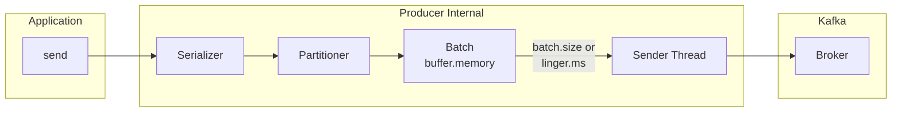
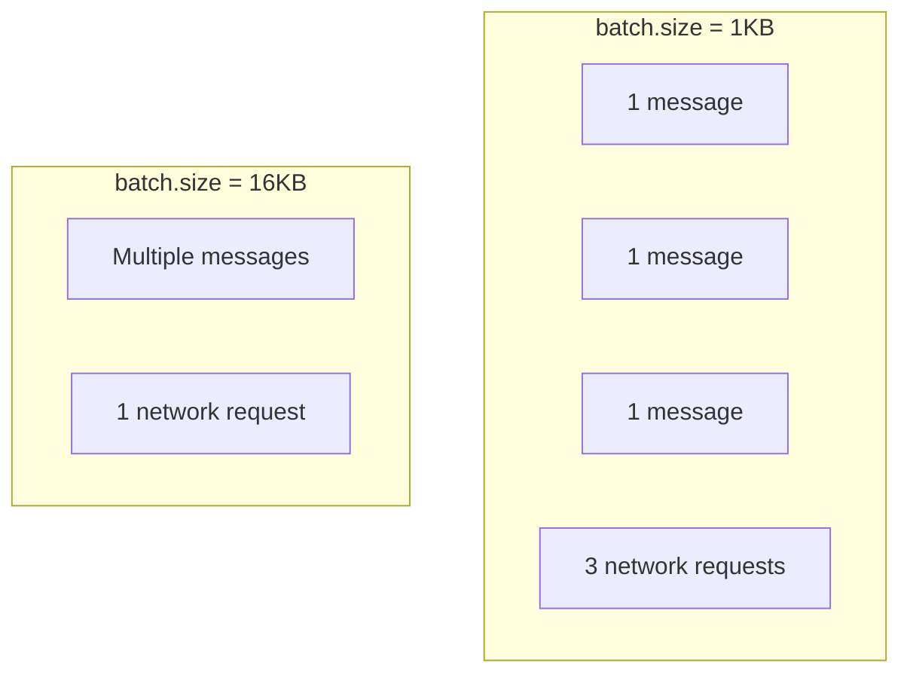
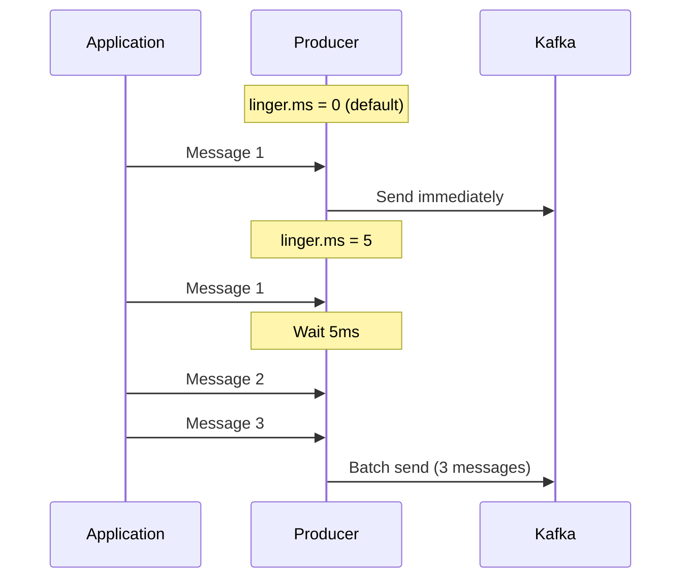
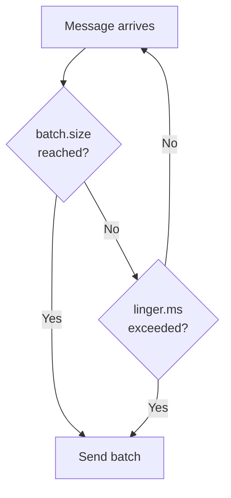
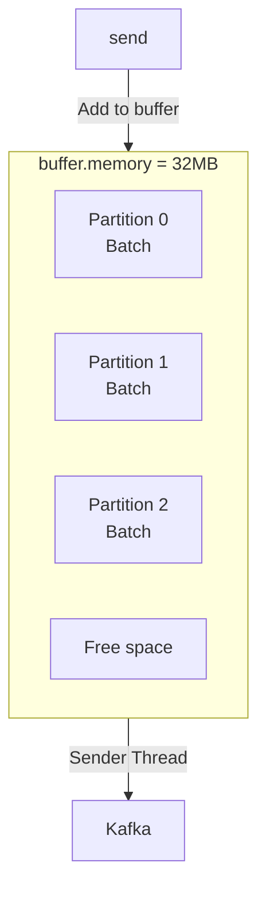
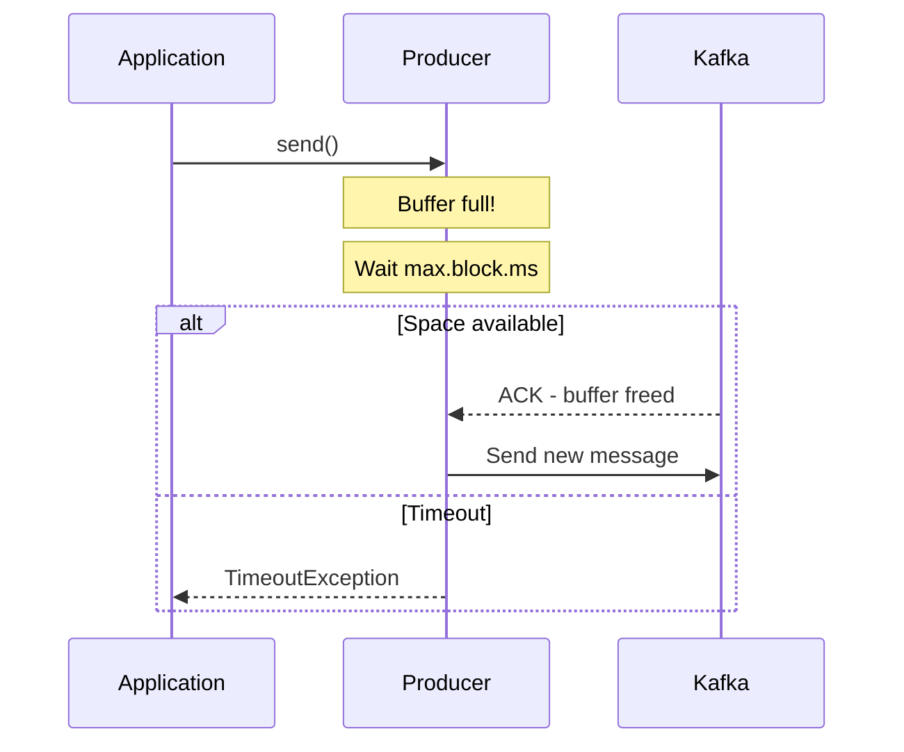
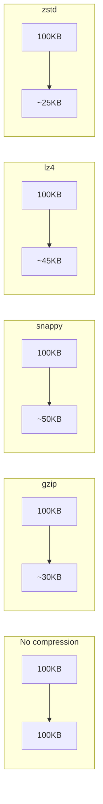
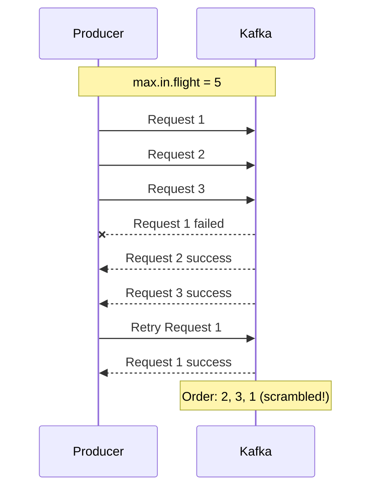
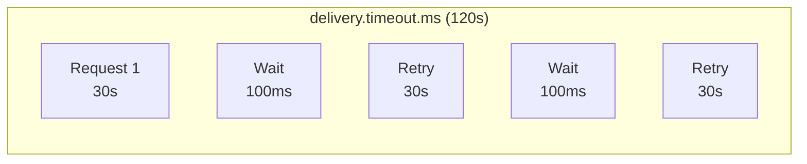
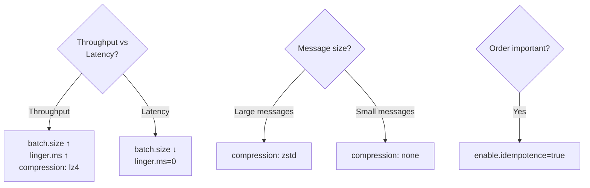

# Producer Tuning

Understanding key settings for optimizing Producer performance.

## Producer Internal Structure



## Key Settings Overview

| Setting | Default | Impact |
|---------|---------|--------|
| `batch.size` | 16KB | Batch size |
| `linger.ms` | 0ms | Batch wait time |
| `buffer.memory` | 32MB | Total buffer size |
| `compression.type` | none | Compression method |
| `max.in.flight.requests.per.connection` | 5 | Concurrent requests |

## batch.size

Maximum size of a message batch to send at once.

### How It Works



### Configuration Guide

```yaml
spring:
  kafka:
    producer:
      batch-size: 16384  # 16KB (default)
      # batch-size: 65536  # 64KB (throughput focus)
      # batch-size: 1024   # 1KB (latency focus)
```

| Value | Effect | Suitable For |
|-------|--------|--------------|
| **Small** | Low latency, low throughput | Real-time requirements |
| **Large** | High throughput, high latency | Batch processing |

## linger.ms

Time to wait before sending even if batch isn't full.

### How It Works



### Configuration Guide

```yaml
spring:
  kafka:
    producer:
      properties:
        linger.ms: 5  # Wait 5ms
```

| Value | Effect | Suitable For |
|-------|--------|--------------|
| **0 (default)** | Send immediately | Minimize latency |
| **5-10ms** | Moderate batching | General recommendation |
| **100ms+** | Maximum batching | High-volume batch processing |

### batch.size + linger.ms Combination



Sends when either condition is met.

## buffer.memory

Total buffer memory available to the Producer.

### How It Works



### When Buffer Is Full



### Configuration Guide

```yaml
spring:
  kafka:
    producer:
      buffer-memory: 33554432  # 32MB (default)
      properties:
        max.block.ms: 60000  # Max buffer wait time
```

**Recommendation:** `buffer.memory` > `batch.size` × Partition count

## compression.type

Sets message compression method.

### Compression Methods Comparison



| Method | Ratio | CPU Usage | Speed | Recommendation |
|--------|-------|-----------|-------|----------------|
| **none** | 0% | Lowest | Fastest | Small messages |
| **gzip** | Highest | Highest | Slowest | Storage priority |
| **snappy** | Medium | Low | Fast | **General recommendation** |
| **lz4** | Medium | Low | Fastest | High performance |
| **zstd** | High | Medium | Fast | Kafka 2.1+ |

### Configuration

```yaml
spring:
  kafka:
    producer:
      compression-type: snappy  # General recommendation
      # compression-type: lz4   # High performance
      # compression-type: zstd  # High compression
```

### Benefits of Compression

```
Original data: 100MB
├── Network transfer: 100MB
├── Broker storage: 100MB
└── Replication: 200MB (RF=3)

snappy compressed: 50MB
├── Network transfer: 50MB (-50%)
├── Broker storage: 50MB (-50%)
└── Replication: 100MB (-50%)
```

## max.in.flight.requests.per.connection

Maximum requests waiting for ACK on a single connection.

### Ordering Problem



### Solution

```yaml
# Method 1: Idempotent Producer (recommended)
spring:
  kafka:
    producer:
      properties:
        enable.idempotence: true  # Kafka 3.0+ default
        max.in.flight.requests.per.connection: 5  # Safe up to 5

# Method 2: Limit in-flight to 1 (performance impact)
spring:
  kafka:
    producer:
      properties:
        max.in.flight.requests.per.connection: 1
```

Idempotent Producer guarantees order through sequence numbers.

## Retry Settings

### Key Settings

```yaml
spring:
  kafka:
    producer:
      retries: 2147483647  # Integer.MAX_VALUE (default)
      properties:
        delivery.timeout.ms: 120000  # Total timeout
        retry.backoff.ms: 100  # Retry interval
        request.timeout.ms: 30000  # Single request timeout
```

### Timeout Relationship



**Rule:** `delivery.timeout.ms` >= `request.timeout.ms` + `linger.ms`

## Profile-based Configuration Examples

### Throughput Optimization

```yaml
spring:
  kafka:
    producer:
      acks: all
      batch-size: 65536  # 64KB
      compression-type: lz4
      properties:
        linger.ms: 50
        buffer.memory: 67108864  # 64MB
```

### Latency Optimization

```yaml
spring:
  kafka:
    producer:
      acks: 1  # or all
      batch-size: 1024  # 1KB
      compression-type: none
      properties:
        linger.ms: 0
```

### Balanced Configuration

```yaml
spring:
  kafka:
    producer:
      acks: all
      batch-size: 16384  # 16KB
      compression-type: snappy
      properties:
        linger.ms: 5
        enable.idempotence: true
```

## Tuning Guide



## Summary

| Setting | Throughput ↑ | Latency ↓ |
|---------|--------------|-----------|
| `batch.size` | ↑ Larger | ↓ Smaller |
| `linger.ms` | ↑ Larger | = 0 |
| `compression.type` | lz4/snappy | none |
| `buffer.memory` | ↑ Larger | No impact |

## Next Steps

- [Consumer Tuning](../consumer-tuning/) - Consumer performance optimization
