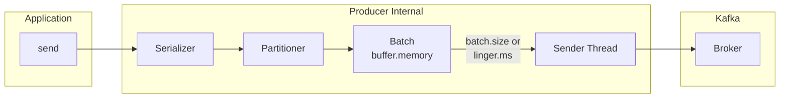
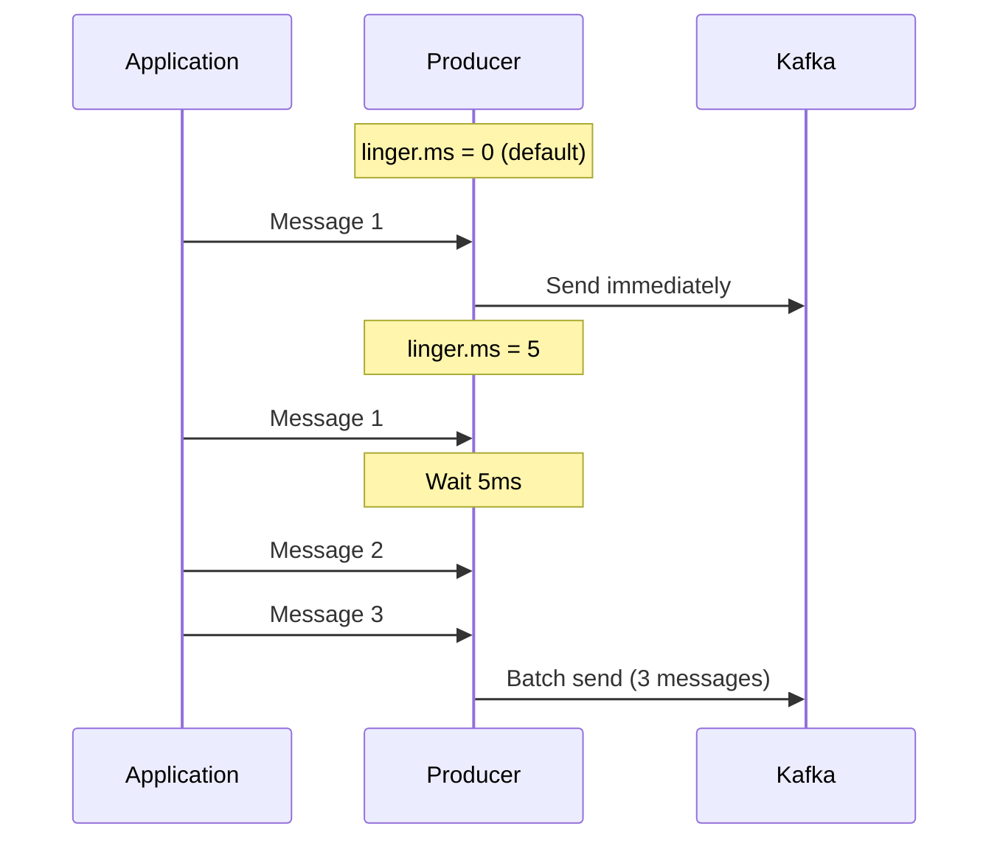
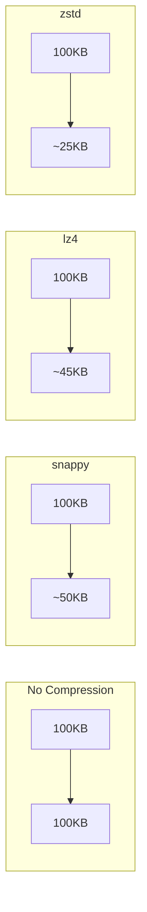
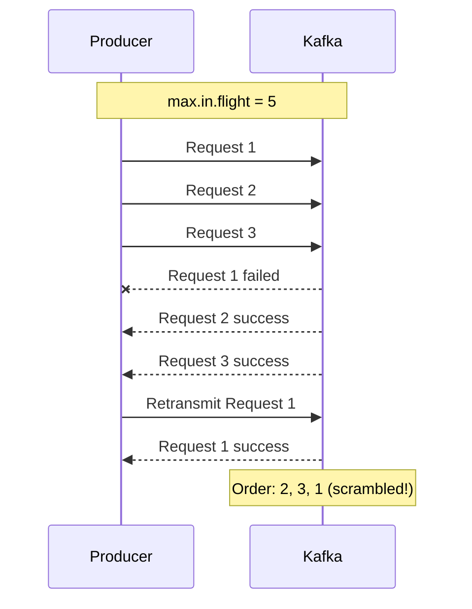


- Adjust batch efficiency with batch.size and linger.ms (operates as OR condition)
- Just linger.ms=5 can increase throughput by ~2.7x
- compression.type: recommend snappy (general), lz4 (high performance), zstd (high compression)
- Idempotent Producer (Kafka 3.0+ default) prevents duplicates and guarantees order
- BufferExhaustedException occurs when buffer.memory is insufficient


**Target Audience**: Developers optimizing Producer performance, operators needing high-volume message processing

**Prerequisites**: acks, Idempotent Producer concepts from [Advanced Concepts](../advanced-concepts/), Topic, Partition concepts from [Message Flow](../message-flow/)

---

Understanding the core settings to optimize Producer performance. This document is written for Kafka 3.6.x and code examples are validated in Spring Boot 3.2.x, Spring Kafka 3.1.x, and Java 17 environments.

Before reading this document, you should first understand acks, Message Key, and Idempotent Producer from [Advanced Concepts](../advanced-concepts/), and Topic, Partition, Broker concepts from [Message Flow](../message-flow/).

#### Producer Internal Structure

When an application calls send(), the Producer's Serializer serializes the message, and the Partitioner decides which Partition to send it to. Messages are then batched, and the Sender Thread sends them to the Broker.



*Diagram: Producer internal structure - Processing flow after send() call: Serializer → Partitioner → Batch → Sender Thread → Broker. Sent when batch.size or linger.ms condition is met.*

Core settings include batch.size for batch size (default 16KB), linger.ms for batch wait time (default 0ms), buffer.memory for total buffer size (default 32MB), compression.type for compression method (default none), and max.in.flight.requests.per.connection for concurrent requests (default 5).


- Producer flow: send() → Serializer → Partitioner → Batch → Sender → Broker
- batch.size and linger.ms operate as OR condition (sent when either is met)
- Core tuning points: batch.size, linger.ms, compression.type


#### batch.size

The maximum size of a batch to send at once. Small values cause one network request per message, increasing network overhead. Large values allow multiple messages in one network request, improving efficiency.

```yaml
spring:
  kafka:
    producer:
      batch-size: 16384  # 16KB (default)
      # batch-size: 65536  # 64KB (throughput priority)
      # batch-size: 1024   # 1KB (latency priority)
```

Small values provide low latency and low throughput, suitable for real-time requirements. Large values provide high throughput and high latency, suitable for batch processing.


- batch.size: Maximum batch size per send (default 16KB)
- Small value: low latency + low throughput (real-time use)
- Large value: high throughput + high latency (batch processing use)


#### linger.ms

Time to wait before sending even if batch isn't full. Default 0 sends messages immediately upon arrival. Setting to 5ms waits 5ms for additional messages before sending together.



*Diagram: linger.ms=0 sends immediately upon message arrival. linger.ms=5 waits 5ms to collect additional messages for batch send.*

```yaml
spring:
  kafka:
    producer:
      properties:
        linger.ms: 5  # Wait 5ms
```

Default 0 sends immediately to minimize latency. 5~10ms provides moderate batching and is generally recommended. 100ms or more provides maximum batching, suitable for high-volume batch processing.

batch.size and linger.ms operate as an OR condition. Sent when batch.size is reached OR linger.ms is exceeded.


- linger.ms=0: Send immediately, minimize latency
- linger.ms=5~20ms: Moderate batching, generally recommended
- OR condition with batch.size: Sent when either condition is met


#### buffer.memory

Total buffer memory available to the Producer. Batches are created per Partition and stored in this buffer, then sent to Broker by Sender Thread.

When buffer is full, wait for max.block.ms. If space becomes available within that time, add new message; otherwise TimeoutException occurs.

```yaml
spring:
  kafka:
    producer:
      buffer-memory: 33554432  # 32MB (default)
      properties:
        max.block.ms: 60000  # Max buffer wait time
```

Recommended rule: buffer.memory > batch.size × Partition count

#### compression.type

Sets message compression method. Using compression reduces network transmission and Broker storage space but increases CPU usage.



*Diagram: Example of 100KB original data compressed to ~50KB with snappy, ~45KB with lz4, ~25KB with zstd.*

none has 0% compression ratio, lowest CPU, highest speed, suitable for small messages. gzip has highest compression ratio but highest CPU and lowest speed, used when storage space is priority. snappy has medium compression ratio, low CPU, high speed, generally recommended. lz4 has medium compression ratio, low CPU, highest speed, recommended when high performance is needed. zstd has high compression ratio, medium CPU, high speed, available from Kafka 2.1+.


- Compression recommended: snappy (general), lz4 (high performance), zstd (high compression)
- Compression can reduce network/storage space by 50% or more
- gzip has high CPU usage, use lz4/snappy when CPU is bottleneck


```yaml
spring:
  kafka:
    producer:
      compression-type: snappy  # General recommendation
      # compression-type: lz4   # High performance
      # compression-type: zstd  # High compression
```

With compression, original 100MB data becomes 50MB with snappy, saving 50% in network transmission, Broker storage, and replication transmission.

#### max.in.flight.requests.per.connection

Maximum requests waiting for ACK on a single connection. When this value is greater than 1, request 1 can fail while requests 2 and 3 succeed, then request 1 is retransmitted, causing order scrambling.



*Diagram: With max.in.flight=5, when request 1 fails and requests 2, 3 succeed first, then request 1 is retransmitted, causing order to be scrambled to 2, 3, 1.*

With Idempotent Producer (Kafka 3.0+ default enabled), order is guaranteed by sequence numbers, allowing safe use of max.in.flight up to 5.


- max.in.flight > 1: Possible order scrambling during retransmission
- Idempotent Producer: Guarantees order with sequence numbers (Kafka 3.0+ default enabled)
- Recommended combination: Idempotent + max.in.flight=5


```yaml
# Method 1: Idempotent Producer (recommended)
spring:
  kafka:
    producer:
      properties:
        enable.idempotence: true  # Kafka 3.0+ default
        max.in.flight.requests.per.connection: 5  # Safe up to 5

# Method 2: Limit in-flight to 1 (performance impact)
spring:
  kafka:
    producer:
      properties:
        max.in.flight.requests.per.connection: 1
```

#### Retry Settings

```yaml
spring:
  kafka:
    producer:
      retries: 2147483647  # Integer.MAX_VALUE (default)
      properties:
        delivery.timeout.ms: 120000  # Total timeout
        retry.backoff.ms: 100  # Retry interval
        request.timeout.ms: 30000  # Single request timeout
```

delivery.timeout.ms is the total timeout for message delivery. Within this time, requests, waits, and retries are repeated. Rule: delivery.timeout.ms >= request.timeout.ms + linger.ms

#### Profile-based Configuration Examples

**Throughput Optimization**

```yaml
spring:
  kafka:
    producer:
      acks: all
      batch-size: 65536  # 64KB
      compression-type: lz4
      properties:
        linger.ms: 50
        buffer.memory: 67108864  # 64MB
```

**Latency Optimization**

```yaml
spring:
  kafka:
    producer:
      acks: 1  # or all
      batch-size: 1024  # 1KB
      compression-type: none
      properties:
        linger.ms: 0
```

**Balanced Configuration**

```yaml
spring:
  kafka:
    producer:
      acks: all
      batch-size: 16384  # 16KB
      compression-type: snappy
      properties:
        linger.ms: 5
        enable.idempotence: true
```

#### Performance Reference Data

The numbers below are for reference only. Actual performance varies greatly depending on environment (hardware, network, message size, serialization method). Direct measurement is recommended.

```bash
# Kafka built-in performance testing tool
kafka-producer-perf-test.sh --topic test-topic \
    --num-records 1000000 \
    --record-size 1024 \
    --throughput -1 \
    --producer-props bootstrap.servers=localhost:9092 \
        linger.ms=5 batch.size=16384
```

Just linger.ms=5 alone can increase throughput by about 2.7x. In most cases, 5~20ms is optimal. For batch.size, throughput increase beyond 64KB is minimal, and 64KB is optimal for memory efficiency.

Comparing compression methods, snappy and lz4 are generally recommended. gzip has high compression ratio but high CPU usage, resulting in lower throughput.

#### Production Troubleshooting

**BufferExhaustedException**

Occurs when buffer.memory is full and fails to free space within max.block.ms time. Increase buffer.memory, extend max.block.ms, or adjust linger.ms to facilitate batch sending.

```yaml
spring:
  kafka:
    producer:
      buffer-memory: 67108864  # 32MB → 64MB increase
      properties:
        max.block.ms: 120000   # 60s → 120s increase
        linger.ms: 5           # Facilitate batch sending
```

**RecordTooLargeException**

Message exceeds max.request.size. Must adjust maximum size settings in Producer, Broker, and Topic. For messages exceeding 1MB, consider using reference pattern. Store actual data in S3 or MinIO and send only URL to Kafka.

**TimeoutException (Delivery Timeout)**

Delivery not completed within delivery.timeout.ms. Check Broker status, network latency, ISR status, and adjust timeout settings.

```yaml
spring:
  kafka:
    producer:
      retries: 2147483647
      properties:
        delivery.timeout.ms: 180000  # 3 minutes
        request.timeout.ms: 60000    # 1 minute
        retry.backoff.ms: 500
```

#### Memory Optimization Guide

Producer memory calculation: buffer.memory + (batch.size × Partition count) + overhead. For example, buffer.memory 32MB, batch.size 64KB × 30 Partitions = 1.9MB, Serialization buffer ~10MB, total expected ~45MB per Producer.

For low message volume (~1K/s), recommend Heap 512MB and buffer.memory 32MB. For medium (~10K/s), recommend Heap 1GB and buffer.memory 64MB. For high (~100K/s), recommend Heap 2GB+ and buffer.memory 128MB+.

#### Summary

To increase throughput, increase batch.size and linger.ms and use lz4 or snappy compression. To reduce latency, decrease batch.size and set linger.ms to 0. buffer.memory affects throughput but doesn't directly affect latency.

#### FAQ

**Q: Does increasing linger.ms risk message loss?**

No. linger.ms is the wait time in buffer, and if Producer dies during this time, messages in buffer are lost. However, this is unrelated to acks setting. For critical data, use with acks=all.

**Q: Should I tune batch.size or linger.ms first?**

Tune linger.ms first. Just changing from default 0 to 5~20ms can significantly improve throughput. Adjust batch.size afterwards.

**Q: Can compression bottleneck Producer CPU?**

Yes. gzip has high CPU usage. If CPU bottleneck is a concern, use lz4 or snappy. They have lower compression ratios but are faster.

**Q: What happens when buffer.memory is insufficient?**

After waiting max.block.ms, BufferExhaustedException occurs. Increase buffer.memory or check Broker response speed.

**Q: Does Idempotent Producer reduce performance?**

In Kafka 3.0+, it's default enabled and performance impact is minimal (within 1~2%). Benefits of order guarantee and duplicate prevention are greater.

#### References

- [Kafka Producer Configs - Apache Documentation](https://kafka.apache.org/documentation/#producerconfigs)
- [Kafka Performance Tuning - Confluent Blog](https://www.confluent.io/blog/configure-kafka-to-minimize-latency/)
- [Producer Compression - Confluent Documentation](https://docs.confluent.io/platform/current/installation/configuration/producer-configs.html#compression-type)
- [kafka-producer-perf-test - Kafka Tools](https://kafka.apache.org/documentation/#basic_ops_producer_perf)

#### Next Steps

- [Consumer Advanced Operations](../consumer-advanced/) - Consumer performance optimization
- [Transactions](../transactions/) - Exactly-Once processing
