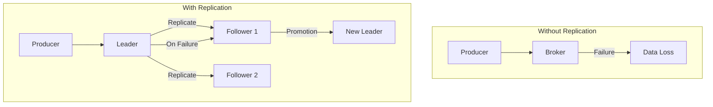
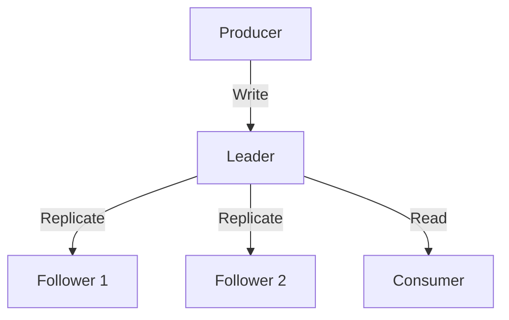


- Replication Factor (RF) is the number of Partition replicas; RF=3 is recommended for production
- Leader handles all reads/writes, Followers only replicate and promote on failure
- ISR (In-Sync Replicas) is the set of replicas synchronized with the Leader
- Use min.insync.replicas=2 + acks=all combination for data safety
- KRaft mode (Kafka 3.3+) enables cluster operation without Zookeeper


**Target Audience**: Developers and operators managing Kafka clusters or designing high-availability systems

**Prerequisites**: Understanding of Broker and Partition concepts from [Core Components](core-components/)

---

Data replication is the core of Kafka's high availability and fault tolerance. Without replication, a single Broker failure could result in permanent data loss. This document explains in detail how Kafka's replication mechanism works and how to configure it for production environments.

Kafka replicates each Partition across multiple Brokers. If one Broker fails, the same data exists on other Brokers, so the service can continue. One of the replicas serves as the Leader, and the rest are Followers. All reads and writes go through the Leader, and Followers continuously replicate data from the Leader.

#### Why Replication is Needed

If data is stored on a single Broker only, there's no way to recover in case of failure. Let's see what actually happens.

When operating without replication and a Broker goes down, all Partition data stored on that Broker is permanently lost. Producers fail to send messages, and Consumers can no longer read from that Partition. Without a backup, there's no way to restore the data.

With replication, the situation is completely different. When the Leader Broker fails, one of the ISR (In-Sync Replicas) is automatically promoted to the new Leader within seconds. Producers and Consumers briefly disconnect and then automatically reconnect to the new Leader. The service continues without data loss.



*Diagram: Left shows the case without replication where Broker failure causes data loss. Right shows the case with replication where data is replicated from Leader to Followers, and a Follower is promoted to new Leader on failure.*


- Operating without replication means permanent data loss on single Broker failure
- With replication, one of the ISR is automatically promoted to new Leader on Leader failure
- Service recovery within seconds without data loss


#### Roles of Leader and Follower

Each Partition consists of one Leader and multiple Followers. The Leader handles all read and write requests for that Partition. When a Producer sends a message, the Leader receives and stores it, then replicates to Followers. When a Consumer requests messages, the Leader responds.

The Follower's role is to continuously replicate the Leader's data to maintain synchronization. Followers do not directly handle client requests. Instead, they prepare to be promoted as the new Leader when the Leader fails. This design ensures consistency in reads and writes, and enables fast recovery on failure.



*Diagram: When Producer sends a write request to the Leader, the Leader replicates to Followers. Consumer reads only from the Leader. All client requests are processed through the Leader.*


- Leader handles all read/write requests, Followers only replicate
- Followers maintain readiness to be promoted as new Leader on Leader failure
- Clients discover Leader location through metadata and connect directly


Producers and Consumers connect only to the Leader. Kafka clients request metadata when connecting to a Broker to discover each Partition's Leader location and connect directly to that Leader.

#### Replication Factor Configuration

Replication Factor determines the number of replicas for each Partition. RF=1 means no replication, only the original exists. RF=2 means one original and one replica, tolerating 1 Broker failure. RF=3 means one original and two replicas, tolerating 2 Broker failures.

RF=3 is recommended for production environments. RF=2 may seem sufficient at first glance, but it's risky considering actual operational scenarios. If Broker A is the Leader and Broker B is the Follower, and you take Broker A down for scheduled maintenance, Broker B is promoted to Leader. At this point, only 1 replica exists. If Broker B fails during maintenance, data is lost.

With RF=3, even if you take Broker A down, Brokers B and C remain, maintaining 2 replicas. If Broker B fails during maintenance, Broker C is promoted to Leader and the service continues. Storage costs increase by 50%, but operational stability improves significantly.


- RF=1: No replication, data loss on single failure
- RF=2: Tolerates 1 failure, risky during scheduled maintenance
- RF=3: Tolerates 2 failures, recommended for production (50% storage cost increase)


#### Understanding ISR (In-Sync Replicas)

ISR is the set of replicas synchronized with the Leader. If a Follower fails to replicate the Leader's data in time, it's removed from the ISR. To be included in ISR, it must synchronize with the Leader within replica.lag.time.max.ms (default 30 seconds).

The ISR concept is important because it relates to Leader election. When the Leader fails, the new Leader is elected only from within the ISR. Only Followers in the ISR have the latest synchronized data with the Leader. If a Follower not in the ISR becomes Leader, it would serve stale unsynchronized data, causing data loss.

**LEO and High Watermark**

To understand how replication works, you need to know LEO (Log End Offset) and High Watermark. LEO is the Offset following the last message in each replica. If the Leader's LEO is 100, it means messages 0 through 99 are stored. High Watermark is the Offset where replication is complete across all ISR. Consumers can only read up to the High Watermark.

For example, if the Leader's LEO is 100 and the Follower's LEO is 95, the High Watermark is 95. Messages 96-100 have not yet been replicated to the Follower. If the Leader fails in this state, the Follower is promoted to Leader, and messages 96-100 are lost. This is why the acks=all setting is important.

**replica.lag.time.max.ms Configuration**

This setting is the maximum lag time allowed for a Follower to remain in the ISR. If the value is too short, Followers may be removed from ISR due to momentary network delays, causing unnecessary rebalancing. If the value is too long, actual failure detection slows, risking data consistency.

On stable networks, 10 seconds is appropriate. On unstable networks, keep the default of 30 seconds. For cross-region replication with high latency, set to 1 minute or more.

```bash
# Check Under-replicated partitions - should be 0
kafka-topics.sh --describe --under-replicated-partitions \
  --bootstrap-server localhost:9092
```


- ISR: Set of replicas synchronized with Leader, candidates for Leader election
- High Watermark: Offset where replication is complete across all ISR, Consumer read limit
- replica.lag.time.max.ms: Maximum lag time to remain in ISR (default 30 seconds)


#### Leader Election Process

When a Leader failure occurs, the Controller detects it and elects a new Leader. The Controller is a special Broker that manages the cluster's metadata. In KRaft mode, some Brokers also serve as Controllers.

When the Controller detects a failure, it selects a new Leader from the ISR. Once the new Leader is determined, the Controller notifies that Broker and propagates the new Leader information to other Followers. This process usually completes within seconds.

What to do when ISR is empty is determined by the unclean.leader.election.enable setting. If false (default), Leader election is impossible when ISR is empty, and the Partition goes offline. This is appropriate when service disruption is better than data loss. If true, even an unsynchronized Follower can be elected Leader. This is appropriate when availability is important and data loss is acceptable. In production, this must be kept as false.

#### min.insync.replicas Configuration

min.insync.replicas is the minimum number of ISR required for a write to succeed. With RF=3 and min.insync.replicas=2, messages must be stored in at least 2 replicas for the write to succeed.

If only 1 ISR remains (e.g., 2 Broker failures), Producer writes fail even with acks=all. This is because the min.insync.replicas condition is not met. This is intentional design for data safety. Allowing writes when replicas are insufficient would put those messages at high risk of loss.

The recommended production settings are RF=3, min.insync.replicas=2, acks=all. This combination tolerates 1 Broker failure while ensuring data safety.


- min.insync.replicas: Minimum ISR count required for ACK response
- Producer writes fail when ISR is insufficient (intentional design for data safety)
- Production recommendation: RF=3 + min.insync.replicas=2 + acks=all


#### Zookeeper vs KRaft Comparison

Before Kafka 3.3, Zookeeper was required for cluster metadata management. Zookeeper managed information such as Broker status, Topic information, Partition assignments, and ACLs. However, as an external system, Zookeeper added operational burden, and performance bottlenecks occurred when the number of Partitions increased.

KRaft (Kafka Raft) mode is a new approach where Kafka manages metadata itself. Without Zookeeper, operational complexity decreases. Faster metadata synchronization improves Partition scalability. Cluster startup time is reduced and failure recovery is faster.

New projects should use KRaft mode. It's been production-ready since Kafka 3.3, and Zookeeper support will be removed starting Kafka 4.0.

```yaml
# KRaft mode Docker Compose configuration
environment:
  KAFKA_PROCESS_ROLES: broker,controller
  KAFKA_CONTROLLER_QUORUM_VOTERS: 1@kafka:9093
```


- KRaft: Kafka manages metadata itself, no Zookeeper needed (3.3+)
- Benefits: Reduced operational complexity, faster startup/recovery, higher scalability
- Zookeeper support to be removed in Kafka 4.0, KRaft recommended for new projects


#### Failure Scenarios and Responses

**Scenario 1: Single Broker Failure**

In a 3-node cluster, when 1 node goes down, Partitions where that Broker was Leader automatically elect a new Leader. Service disruption is a few seconds. Follower Partitions on that Broker are removed from ISR. After recovering the failed Broker, verify it rejoins the ISR.

**Scenario 2: Majority Broker Failure**

When 2 of 3 nodes go down, ISR becomes 1 or less for most Partitions. The min.insync.replicas=2 condition is not met, so Producers fail writes. Consumers can read if the Leader is alive. At least 1 node must be recovered quickly. In emergencies, you can temporarily change min.insync.replicas=1, but you must accept the data loss risk.

**Scenario 3: Full Cluster Restart**

When you need to restart the entire cluster for planned maintenance, use Rolling Restart. Restart one node at a time, verify ISR recovery after each Broker restart before proceeding to the next. controlled.shutdown.enable=true must be set for clean shutdown. Restarting all at once can cause Leader Election storms and data consistency issues.

#### acks Setting and Replication Relationship

The Producer's acks setting is closely related to replication. With acks=0, the Producer just sends without waiting for response. Fastest but highest risk of message loss. With acks=1, success is confirmed when the Leader stores the message. Messages not replicated to Followers may be lost on Leader failure. With acks=all, success requires all ISR to complete storage. Safest but increases latency.

In production, the combination of acks=all and min.insync.replicas=2 is recommended.

```yaml
spring:
  kafka:
    producer:
      acks: all
```

#### Replication Performance Impact

Replication increases safety but affects performance. Write latency with acks=0 is under 1ms. With acks=1, it's about 1-5ms. With acks=all and RF=3, it's about 5-15ms. Cross-datacenter replication can reach 50-200ms.

Network bandwidth also increases by RF times. With 100MB/sec write throughput and RF=3, replication from Leader to two Followers at 100MB/sec each results in 200MB/sec additional network usage. 10Gbps or higher network between Brokers is recommended.

#### Production Checklist

Before deployment, verify the following. Check if Replication Factor is 3 or higher, min.insync.replicas is 2 or higher, and unclean.leader.election.enable is false. Verify all Brokers are distributed across different racks or availability zones. Confirm monitoring and alerts are configured.

For daily monitoring, check if Under-replicated partitions is 0 and Offline partitions is 0. Review logs for frequent ISR shrink/expand events.

```bash
# Check Under-replicated partitions
kafka-topics.sh --describe --under-replicated-partitions \
  --bootstrap-server localhost:9092

# Check Offline partitions
kafka-topics.sh --describe --unavailable-partitions \
  --bootstrap-server localhost:9092
```

#### Next Steps

This document covered Kafka's replication mechanism in detail. Next, you can learn about advanced concepts frequently encountered in practice, such as acks, Message Key, Retention, and Idempotent Producer.

- [Advanced Concepts](advanced-concepts/) - acks, Message Key, Retention, Idempotent Producer
