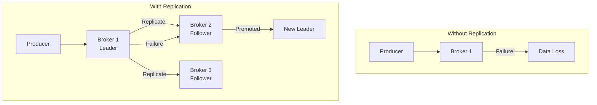
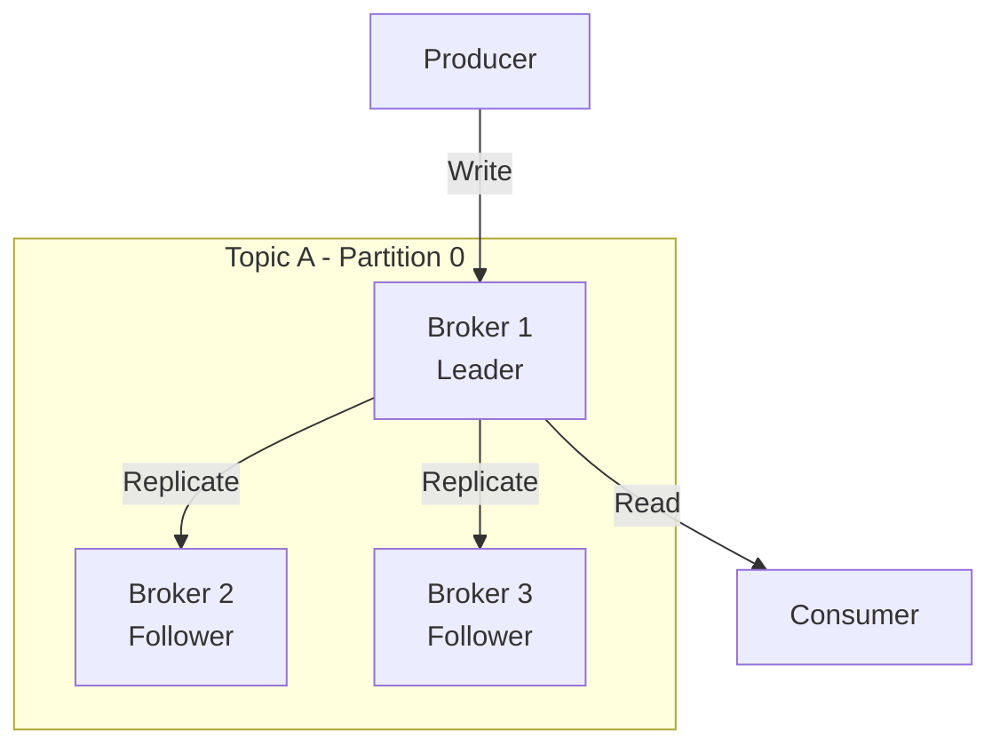
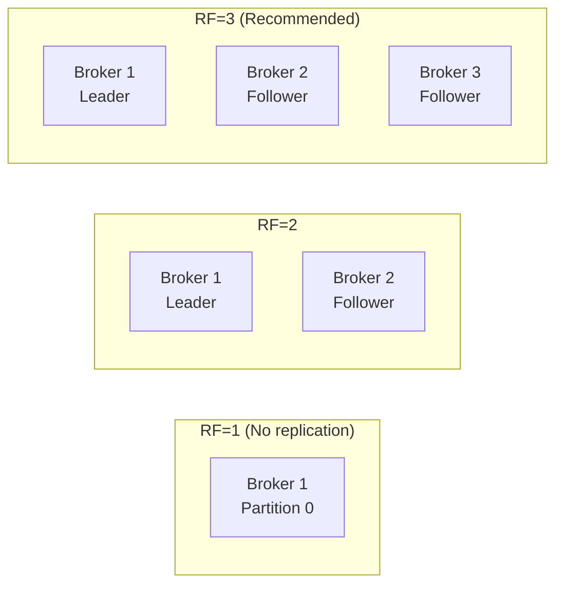
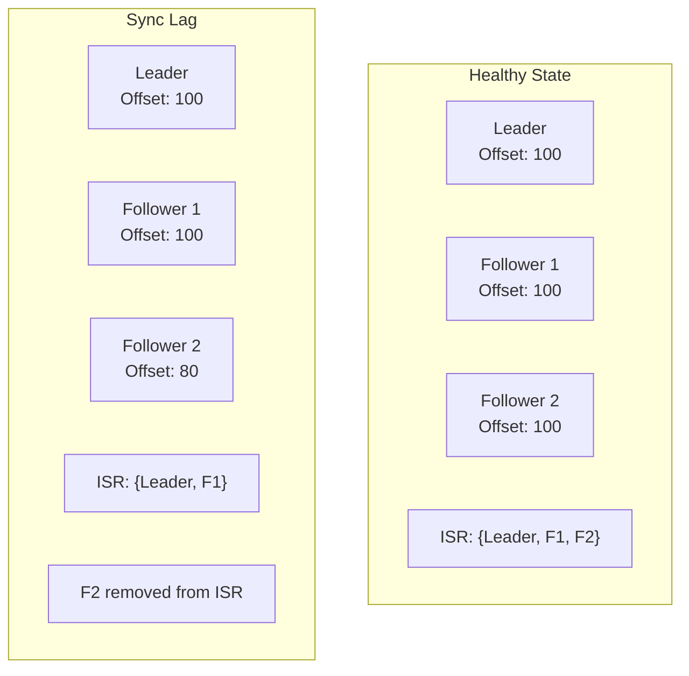
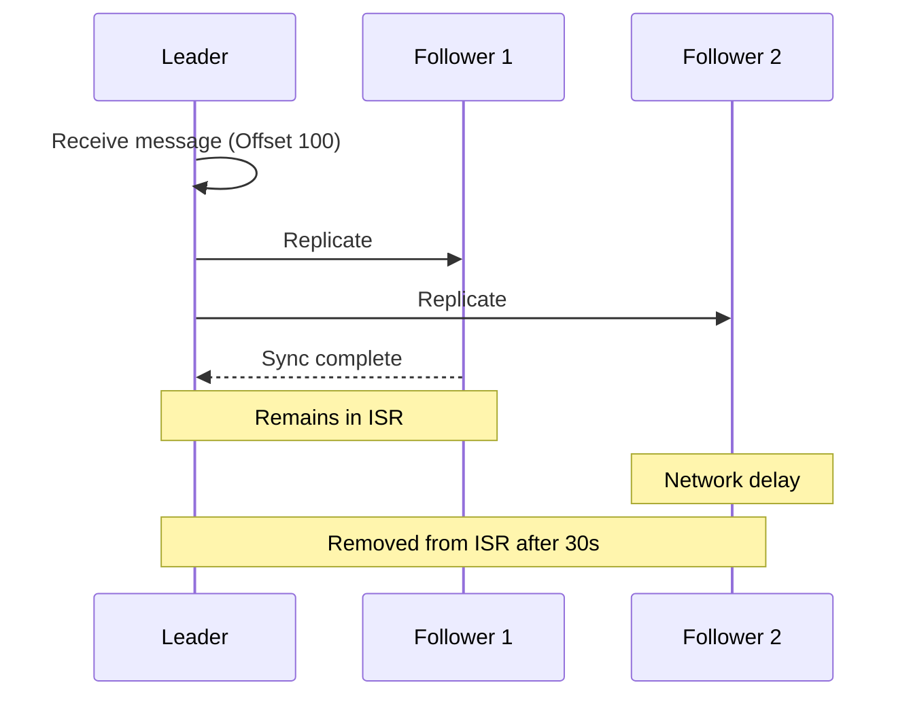
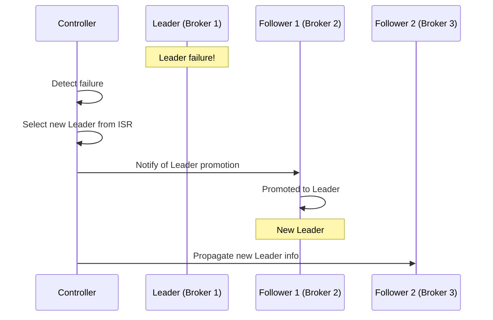
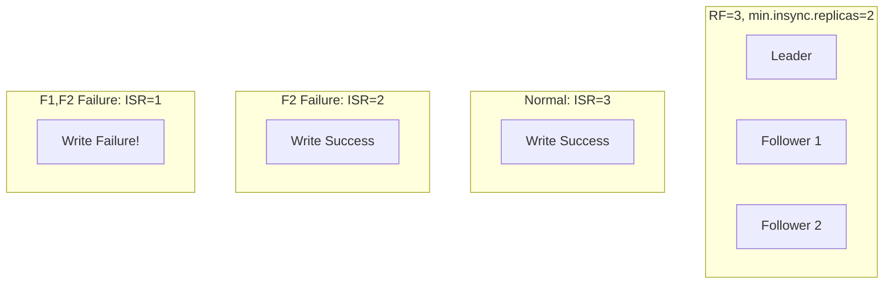
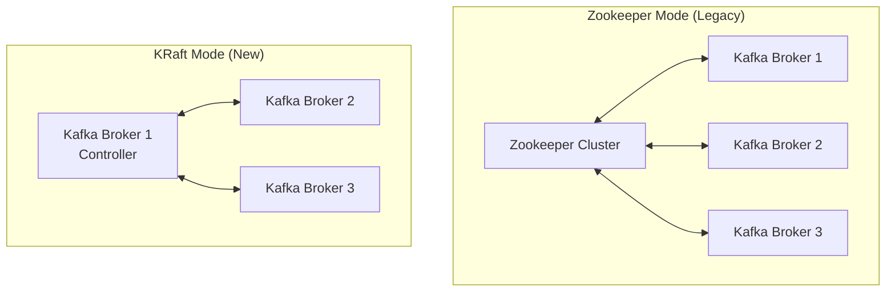
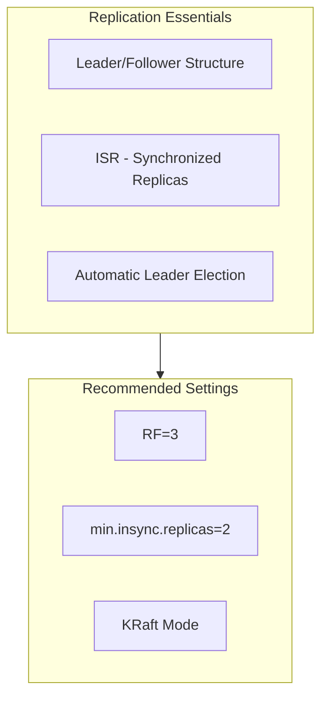

# Replication

Understanding data replication and high availability mechanisms.

## Why is Replication Needed?

Storing data on a single Broker results in data loss during failures.



## Leader and Follower

Each Partition consists of one **Leader** and multiple **Followers**.



### Role Distribution

| Role | Responsibility |
|------|----------------|
| **Leader** | Handles all reads/writes, replicates data to Followers |
| **Follower** | Replicates Leader data, waits for promotion on Leader failure |

> **Important:** Producers and Consumers connect **only to the Leader**.

## Replication Factor

**Replication Factor** is the number of replicas for each Partition.



### Characteristics by RF

| RF | Fault Tolerance | Storage Cost | Recommended Use |
|----|-----------------|--------------|-----------------|
| 1 | None | 1x | Development/Testing |
| 2 | 1 Broker failure | 2x | General |
| 3 | 2 Broker failures | 3x | **Production recommended** |

## ISR (In-Sync Replicas)

**ISR** is the set of replicas synchronized with the Leader.



### ISR Conditions

For a Follower to be included in ISR:
- Must sync with Leader within `replica.lag.time.max.ms`
- Default: 30 seconds



## Leader Election

The process of electing a new Leader when the current one fails.



### Election Rules

1. **ISR Priority**: Elected from Followers within ISR
2. **Unclean Leader Election**: Elect out-of-sync Follower when ISR is empty (may cause data loss)

```yaml
# Topic configuration
unclean.leader.election.enable: false  # Recommended: prevent data loss
```

## min.insync.replicas

Minimum number of ISR members required for message writes.



### Recommended Settings

| Environment | RF | min.insync.replicas |
|-------------|----|--------------------|
| Development | 1 | 1 |
| Production | 3 | 2 |

## Zookeeper vs KRaft

Comparison of Kafka's metadata management approaches:



### Comparison

| Aspect | Zookeeper | KRaft |
|--------|-----------|-------|
| **External Dependency** | Required | Not needed |
| **Operational Complexity** | High | Low |
| **Partition Scalability** | Limited | Improved |
| **Recovery Time** | Slow | Fast |
| **Kafka Version** | 2.x and below | 3.3+ recommended |

> **Recommendation:** Use **KRaft mode** for new projects.

### KRaft Configuration Example

```yaml
# docker-compose.yml
environment:
  KAFKA_PROCESS_ROLES: broker,controller
  KAFKA_CONTROLLER_QUORUM_VOTERS: 1@kafka:9093
```

## Summary



| Concept | Role |
|---------|------|
| **Replication Factor** | Number of data copies |
| **ISR** | Set of synchronized replicas |
| **Leader Election** | Automatic failure recovery |
| **KRaft** | Simplified cluster management |

## Next Steps

- [Advanced Concepts](../advanced-concepts/) - acks, Message Key, Retention
