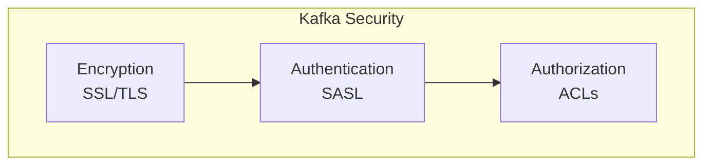
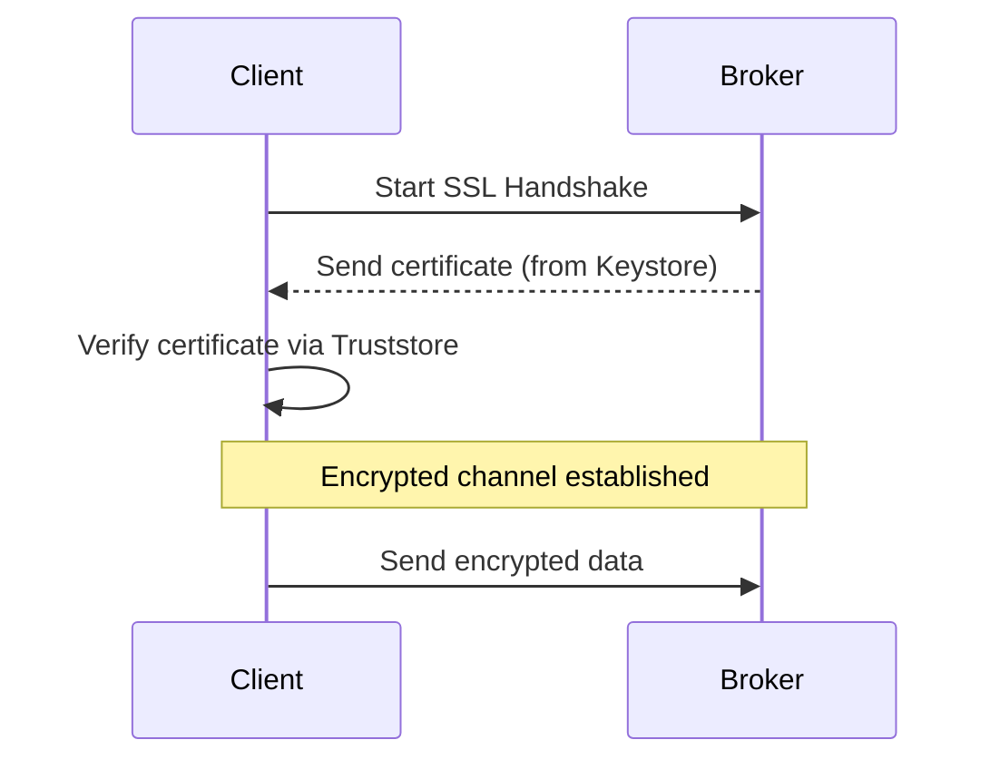
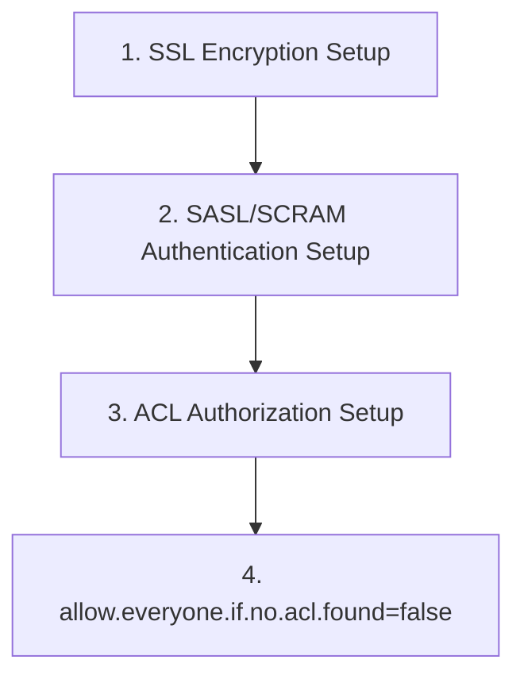

# Kafka Security Basics

Understanding the core security elements—encryption, authentication, and authorization—for operating Kafka safely in production environments.

## Three Pillars of Kafka Security



| Element | Role | Problem It Solves |
|---------|------|-------------------|
| **Encryption** | Prevent data interception | "Who is eavesdropping on my data?" |
| **Authentication** | Identity verification | "Who are you?" |
| **Authorization** | Access control | "Are you allowed to do this?" |

---

## 1. Encryption: SSL/TLS

Encrypts data transmitted over the network (Producer ↔ Broker, Broker ↔ Consumer, Broker ↔ Broker).

### How It Works

Uses Java's SSL/TLS functionality to encrypt communication channels. This requires a **Java Keystore** and **Truststore**.

- **Keystore**: Stores the server's private key and certificate.
- **Truststore**: Stores certificates or CAs (Certificate Authorities) that the client trusts.



### Configuration Example (Broker)

```properties
# server.properties
listeners=SSL://:9093
advertised.listeners=SSL://<hostname>:9093

ssl.keystore.location=/var/private/kafka/server.keystore.jks
ssl.keystore.password=test1234
ssl.key.password=test1234
ssl.truststore.location=/var/private/kafka/server.truststore.jks
ssl.truststore.password=test1234
```

### Configuration Example (Client)

```yaml
# application.yml (Spring Boot)
spring:
  kafka:
    properties:
      security.protocol: SSL
    ssl:
      trust-store-location: file:/path/to/client.truststore.jks
      trust-store-password: password
      key-store-location: file:/path/to/client.keystore.jks
      key-store-password: password
```

---

## 2. Authentication: SASL

Mechanism for verifying identity when clients (Producer/Consumer) connect to Brokers.

### SASL Mechanisms

| Mechanism | Description | Use Case |
|-----------|-------------|----------|
| **PLAIN** | Username/password based. Must use with SSL. | Simplest authentication |
| **SCRAM** | Challenge-Response method. Prevents password exposure. | **Recommended**. Safer than PLAIN |
| **GSSAPI** | Kerberos-based authentication. | Enterprise environments |

### Configuration Example (Broker - SASL/SCRAM)

```properties
# server.properties
listeners=SASL_SSL://:9093
sasl.mechanism.inter.broker.protocol=SCRAM-SHA-256
sasl.enabled.mechanisms=SCRAM-SHA-256

# JAAS configuration file (kafka_server_jaas.conf)
KafkaServer {
    org.apache.kafka.common.security.scram.ScramLoginModule required
    username="admin"
    password="admin-secret"
    ...
};
```

### Configuration Example (Client - SASL/SCRAM)

```yaml
# application.yml
spring:
  kafka:
    properties:
      security.protocol: SASL_SSL
      sasl.mechanism: SCRAM-SHA-256
      sasl.jaas.config: 'org.apache.kafka.common.security.scram.ScramLoginModule required username="user" password="user-secret";'
```

---

## 3. Authorization: ACLs

Controls what operations authenticated users can perform on specific resources (Topics, Groups, etc.).

### ACL (Access Control List) Structure

`Principal P is [Allowed/Denied] Operation O From Host H On Resource R`

- **Principal**: User or group (e.g., `User:benji`)
- **Operation**: Action (e.g., `Read`, `Write`, `Create`)
- **Host**: Client IP address (e.g., `192.168.1.100`)
- **Resource**: Target (e.g., `Topic:orders`)

### ACL Command Examples

```bash
# Grant write permission to 'benji' user on 'orders' topic
kafka-acls.sh --bootstrap-server localhost:9093 \
  --add --allow-principal User:benji \
  --producer --topic orders

# Grant read permission to 'data-team' group on 'logs' topic
kafka-acls.sh --bootstrap-server localhost:9093 \
  --add --allow-principal Group:data-team \
  --consumer --group analytics-group --topic logs
```

### Configuration Example (Broker)

```properties
# server.properties
authorizer.class.name=kafka.security.authorizer.AclAuthorizer
allow.everyone.if.no.acl.found=false # Recommended: deny all if no ACL
```

## Recommended Security Configuration



1. Encrypt all communication with **SSL/TLS**.
2. Securely authenticate users with **SASL/SCRAM**.
3. Control access using **ACLs** following the Principle of Least Privilege.

All three must be configured together to build a secure Kafka environment.
