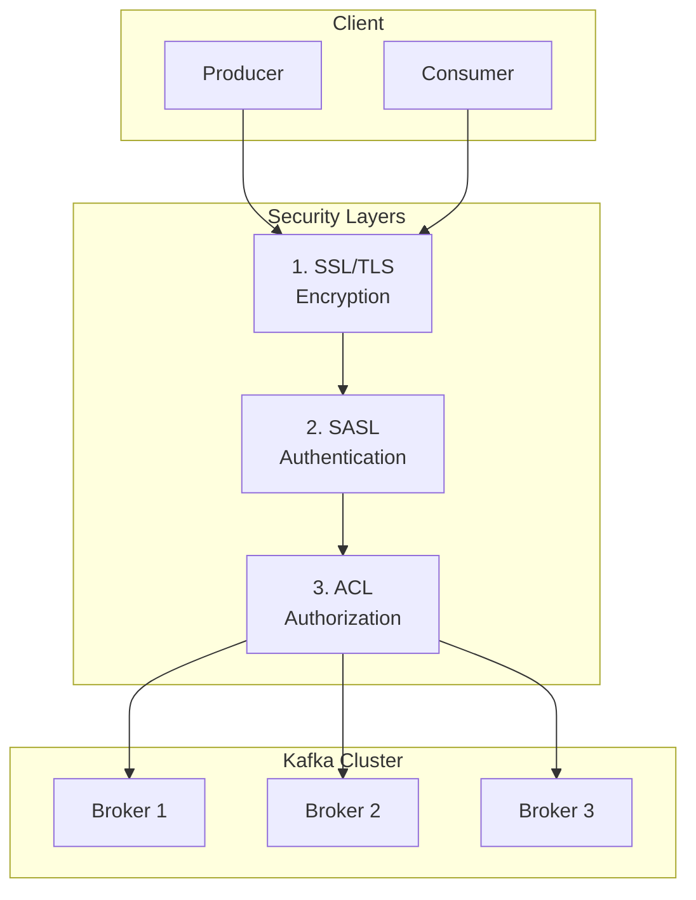


- Kafka security has 3 layers: SSL/TLS (encryption) -> SASL (authentication) -> ACL (authorization)
- SSL/TLS encrypts data in transit, mutual TLS for client authentication
- SASL mechanisms: SCRAM-SHA-256 recommended (production), PLAIN only with SSL
- ACL provides fine-grained Topic/Group access control per Principal
- Set allow.everyone.if.no.acl.found=false for default deny policy


**Target Audience**: Operators and security administrators configuring Kafka cluster security

**Prerequisites**: Understanding of Broker, Producer, Consumer concepts from [Core Components](core-components/), basic security concepts (encryption, authentication, authorization)

---

Understanding encryption, authentication, and authorization for securely operating Kafka in production environments.

#### Why Kafka Security is Important

Operating Kafka without security can cause serious problems. First, there's a risk of data leakage. Payment information or personal data can be stolen through network sniffing, and plaintext transmission is vulnerable to man-in-the-middle (MITM) attacks. Next, there's the issue of unauthorized access. Without authentication, anyone can publish messages to Topics, and malicious data injection can cause system malfunctions. Finally, privilege abuse can occur. Without authorization management, developers can accidentally delete production Topics or have unlimited access to sensitive data.

Looking at Kafka security from the perspective of the three security elements: Confidentiality is achieved through SSL/TLS encryption to prevent data theft. Integrity is ensured through SSL/TLS and message signing to prevent data tampering. Availability is protected through ACL and authentication to prevent failures caused by unauthorized access.

#### Kafka Security Architecture

Kafka security consists of three layers. The first layer, SSL/TLS, encrypts all communication between clients and Brokers. The second layer, SASL, handles authentication by verifying the client's identity. The third layer, ACL, manages authorization to control what operations authenticated clients can perform. Client requests must pass through all three layers to reach the Broker.



*This diagram shows Kafka's three-layer security architecture, where client requests pass through SSL/TLS encryption, SASL authentication, and ACL authorization checks in sequence before reaching the Broker.*

#### Encryption: SSL/TLS

SSL/TLS encrypts network communication to prevent data exposure during transmission. To configure SSL in Kafka, you need to generate certificates and configure both Broker and Client.

**Certificate Generation Process**

First, create a CA (Certificate Authority). The CA acts as a trusted authority that signs other certificates.

```bash
# Generate CA private key
openssl genrsa -out ca-key.pem 2048

# Generate CA certificate (10-year validity)
openssl req -new -x509 -key ca-key.pem -out ca-cert.pem -days 3650 \
    -subj "/CN=KafkaCA/O=MyCompany/C=KR"
```

Next, generate the Broker certificate. The Broker stores its private key and certificate in its own Keystore, and this certificate must be signed by the CA.

```bash
# Generate Broker Keystore
keytool -genkeypair -alias kafka-broker \
    -keyalg RSA -keysize 2048 \
    -keystore kafka.broker.keystore.jks \
    -validity 365 \
    -storepass broker-secret \
    -keypass broker-secret \
    -dname "CN=kafka-broker,O=MyCompany,C=KR"

# Generate CSR (Certificate Signing Request)
keytool -certreq -alias kafka-broker \
    -keystore kafka.broker.keystore.jks \
    -file broker.csr \
    -storepass broker-secret

# Sign with CA
openssl x509 -req -in broker.csr \
    -CA ca-cert.pem -CAkey ca-key.pem -CAcreateserial \
    -out broker-signed.pem -days 365

# Add CA certificate to Keystore
keytool -importcert -alias ca-root \
    -file ca-cert.pem \
    -keystore kafka.broker.keystore.jks \
    -storepass broker-secret -noprompt

# Add signed certificate to Keystore
keytool -importcert -alias kafka-broker \
    -file broker-signed.pem \
    -keystore kafka.broker.keystore.jks \
    -storepass broker-secret -noprompt
```

Finally, create the Truststore. The Truststore stores trusted CA certificates and is used to verify that the counterpart's certificate was signed by this CA.

```bash
# Broker Truststore (includes CA certificate)
keytool -importcert -alias ca-root \
    -file ca-cert.pem \
    -keystore kafka.broker.truststore.jks \
    -storepass truststore-secret -noprompt

# Client Truststore
keytool -importcert -alias ca-root \
    -file ca-cert.pem \
    -keystore kafka.client.truststore.jks \
    -storepass client-secret -noprompt
```

**Broker SSL Configuration**

After generating certificates, apply SSL configuration to the Broker. listeners specifies the port using SSL protocol, and ssl.client.auth=required enables mutual TLS to also verify client certificates.

```properties
# server.properties
listeners=SSL://:9093
advertised.listeners=SSL://kafka-broker:9093
security.inter.broker.protocol=SSL

# SSL configuration
ssl.keystore.location=/etc/kafka/secrets/kafka.broker.keystore.jks
ssl.keystore.password=broker-secret
ssl.key.password=broker-secret
ssl.truststore.location=/etc/kafka/secrets/kafka.broker.truststore.jks
ssl.truststore.password=truststore-secret

# Client authentication (mutual TLS)
ssl.client.auth=required  # none, requested, required
```

**Spring Boot Client Configuration**

To use SSL in a Spring Boot application, set security.protocol to SSL and specify the Truststore and Keystore locations.

```yaml
# application.yml
spring:
  kafka:
    bootstrap-servers: kafka-broker:9093
    properties:
      security.protocol: SSL
    ssl:
      trust-store-location: classpath:kafka.client.truststore.jks
      trust-store-password: client-secret
      key-store-location: classpath:kafka.client.keystore.jks
      key-store-password: client-secret
      key-password: client-secret
```

Configuring SSL programmatically allows for finer control.

```java
@Configuration
public class KafkaSslConfig {

    @Bean
    public ProducerFactory<String, String> producerFactory() {
        Map<String, Object> props = new HashMap<>();
        props.put(ProducerConfig.BOOTSTRAP_SERVERS_CONFIG, "kafka-broker:9093");
        props.put(ProducerConfig.KEY_SERIALIZER_CLASS_CONFIG, StringSerializer.class);
        props.put(ProducerConfig.VALUE_SERIALIZER_CLASS_CONFIG, StringSerializer.class);

        // SSL configuration
        props.put("security.protocol", "SSL");
        props.put(SslConfigs.SSL_TRUSTSTORE_LOCATION_CONFIG, "/path/to/truststore.jks");
        props.put(SslConfigs.SSL_TRUSTSTORE_PASSWORD_CONFIG, "truststore-secret");
        props.put(SslConfigs.SSL_KEYSTORE_LOCATION_CONFIG, "/path/to/keystore.jks");
        props.put(SslConfigs.SSL_KEYSTORE_PASSWORD_CONFIG, "client-secret");
        props.put(SslConfigs.SSL_KEY_PASSWORD_CONFIG, "client-secret");

        return new DefaultKafkaProducerFactory<>(props);
    }

    @Bean
    public KafkaTemplate<String, String> kafkaTemplate() {
        return new KafkaTemplate<>(producerFactory());
    }
}
```

#### Authentication: SASL

SASL (Simple Authentication and Security Layer) is an authentication framework that verifies client identity. Kafka supports several SASL mechanisms, each with different security levels and configuration complexity.

PLAIN transmits username and password in plaintext, has low security, and must be used with SSL. SCRAM-SHA-256 uses the Challenge-Response method to safely verify passwords and is recommended for production. SCRAM-SHA-512 uses stronger hashing and is suitable for high-security environments. GSSAPI is Kerberos-based authentication used by organizations with existing Kerberos infrastructure. OAUTHBEARER is OAuth 2.0 token-based authentication used when integrating with modern authentication systems.

**Creating SCRAM Users**

To use SCRAM, you must first register users on the Broker. In KRaft mode, create users with the kafka-configs.sh command.

```bash
# Create SCRAM-SHA-256 user (KRaft mode)
kafka-configs.sh --bootstrap-server localhost:9092 \
    --alter --add-config 'SCRAM-SHA-256=[iterations=8192,password=user-secret]' \
    --entity-type users --entity-name order-service

# Verify user
kafka-configs.sh --bootstrap-server localhost:9092 \
    --describe --entity-type users --entity-name order-service
```

**Broker SASL Configuration**

To enable SASL on the Broker, change the listener protocol to SASL_SSL and specify the mechanism to use.

```properties
# server.properties
listeners=SASL_SSL://:9093
advertised.listeners=SASL_SSL://kafka-broker:9093
security.inter.broker.protocol=SASL_SSL

# SASL configuration
sasl.mechanism.inter.broker.protocol=SCRAM-SHA-256
sasl.enabled.mechanisms=SCRAM-SHA-256

# SSL configuration (see previous section)
ssl.keystore.location=...
```

The JAAS (Java Authentication and Authorization Service) configuration file defines the credentials the Broker uses for authentication.

```
KafkaServer {
    org.apache.kafka.common.security.scram.ScramLoginModule required
    username="admin"
    password="admin-secret";
};
```

Specify the JAAS configuration file when starting the Broker.

```bash
KAFKA_OPTS="-Djava.security.auth.login.config=/path/to/kafka_server_jaas.conf" \
    ./bin/kafka-server-start.sh config/server.properties
```

**Spring Boot SASL Client**

In a Spring Boot client, add SASL configuration to application.yml. You can directly specify username and password in sasl.jaas.config.

```yaml
# application.yml
spring:
  kafka:
    bootstrap-servers: kafka-broker:9093
    properties:
      security.protocol: SASL_SSL
      sasl.mechanism: SCRAM-SHA-256
      sasl.jaas.config: >
        org.apache.kafka.common.security.scram.ScramLoginModule required
        username="order-service"
        password="user-secret";
    ssl:
      trust-store-location: classpath:kafka.client.truststore.jks
      trust-store-password: client-secret
```

#### Authorization: ACLs

ACL (Access Control List) defines what operations authenticated users can perform on what resources. The format of ACL rules is "Principal P is [Allowed/Denied] Operation O From Host H On Resource R". For example, "User:order-service is Allowed Write From * On Topic:orders" means the order-service user can write to the orders Topic from all hosts.

Kafka has four main resources. Topic supports Read, Write, Create, Delete, and Describe operations. Group supports Read, Describe, and Delete operations for Consumer Groups. Cluster supports Create, Alter, and Describe operations for cluster management. TransactionalId supports Write and Describe operations for transactions.

**ACL Configuration Examples**

To grant write permission to a Producer for a specific Topic, use the --producer option.

```bash
# Producer permission: write to orders topic
kafka-acls.sh --bootstrap-server localhost:9093 \
    --command-config admin.properties \
    --add --allow-principal User:order-service \
    --producer --topic orders

# Consumer permission: read from orders topic + Consumer Group
kafka-acls.sh --bootstrap-server localhost:9093 \
    --command-config admin.properties \
    --add --allow-principal User:payment-service \
    --consumer --topic orders --group payment-group

# Allow access only from specific IP
kafka-acls.sh --bootstrap-server localhost:9093 \
    --command-config admin.properties \
    --add --allow-principal User:analytics-service \
    --allow-host 10.0.0.0/24 \
    --operation Read --topic orders

# List ACLs
kafka-acls.sh --bootstrap-server localhost:9093 \
    --command-config admin.properties \
    --list --topic orders

# Delete ACL
kafka-acls.sh --bootstrap-server localhost:9093 \
    --command-config admin.properties \
    --remove --allow-principal User:old-service \
    --producer --topic orders
```

The admin.properties file contains authentication information needed to execute administrative commands.

```properties
security.protocol=SASL_SSL
sasl.mechanism=SCRAM-SHA-256
sasl.jaas.config=org.apache.kafka.common.security.scram.ScramLoginModule required \
    username="admin" password="admin-secret";
ssl.truststore.location=/path/to/truststore.jks
ssl.truststore.password=truststore-secret
```

**Broker ACL Configuration**

To enable ACL on the Broker, configure authorizer.class.name. In KRaft mode, use StandardAuthorizer. super.users specifies administrators with all permissions, and allow.everyone.if.no.acl.found=false denies access by default when no ACL exists. This setting is recommended for security.

```properties
# server.properties
authorizer.class.name=org.apache.kafka.metadata.authorizer.StandardAuthorizer

# Super users in KRaft mode
super.users=User:admin

# Deny if no ACL (security recommended)
allow.everyone.if.no.acl.found=false
```

#### Docker Compose Secure Cluster Example

A Kafka cluster with security can be configured with Docker Compose. This example includes SASL_SSL listener, SCRAM authentication, and ACL.

```yaml
# docker-compose-secure.yml
version: '3.8'
services:
  kafka:
    image: confluentinc/cp-kafka:7.5.0
    hostname: kafka
    ports:
      - "9093:9093"
    environment:
      KAFKA_NODE_ID: 1
      KAFKA_PROCESS_ROLES: broker,controller
      KAFKA_CONTROLLER_QUORUM_VOTERS: 1@kafka:9094

      # Listener configuration
      KAFKA_LISTENERS: SASL_SSL://:9093,CONTROLLER://:9094
      KAFKA_ADVERTISED_LISTENERS: SASL_SSL://localhost:9093
      KAFKA_LISTENER_SECURITY_PROTOCOL_MAP: SASL_SSL:SASL_SSL,CONTROLLER:PLAINTEXT
      KAFKA_INTER_BROKER_LISTENER_NAME: SASL_SSL
      KAFKA_CONTROLLER_LISTENER_NAMES: CONTROLLER

      # SASL configuration
      KAFKA_SASL_ENABLED_MECHANISMS: SCRAM-SHA-256
      KAFKA_SASL_MECHANISM_INTER_BROKER_PROTOCOL: SCRAM-SHA-256

      # SSL configuration
      KAFKA_SSL_KEYSTORE_FILENAME: kafka.broker.keystore.jks
      KAFKA_SSL_KEYSTORE_CREDENTIALS: keystore_creds
      KAFKA_SSL_KEY_CREDENTIALS: key_creds
      KAFKA_SSL_TRUSTSTORE_FILENAME: kafka.broker.truststore.jks
      KAFKA_SSL_TRUSTSTORE_CREDENTIALS: truststore_creds
      KAFKA_SSL_CLIENT_AUTH: required

      # ACL configuration
      KAFKA_AUTHORIZER_CLASS_NAME: org.apache.kafka.metadata.authorizer.StandardAuthorizer
      KAFKA_SUPER_USERS: User:admin
      KAFKA_ALLOW_EVERYONE_IF_NO_ACL_FOUND: "false"

      # JAAS
      KAFKA_OPTS: "-Djava.security.auth.login.config=/etc/kafka/secrets/kafka_server_jaas.conf"
    volumes:
      - ./secrets:/etc/kafka/secrets
```

#### Troubleshooting Guide

**SSL Handshake Failure**

The `org.apache.kafka.common.errors.SslAuthenticationException: SSL handshake failed` error can have several causes.

The certificate may have expired, so check the validity period with `keytool -list -v -keystore keystore.jks`. The CA may not match, so verify that the correct CA certificate is included in the Client Truststore. The certificate's CN (Common Name) and Bootstrap server hostname may not match. For TLS protocol version mismatch, check `ssl.enabled.protocols=TLSv1.2,TLSv1.3`.

```bash
# Check certificate
openssl s_client -connect kafka-broker:9093 -showcerts

# Certificate details
keytool -list -v -keystore kafka.broker.keystore.jks -storepass broker-secret
```

**SASL Authentication Failure**

The `org.apache.kafka.common.errors.SaslAuthenticationException: Authentication failed: credentials invalid` error indicates credential issues.

First, verify that the user exists. If the password is wrong, reset it. In JAAS configuration, usernames or passwords with special characters should be enclosed in quotes.

```bash
# 1. Verify user exists
kafka-configs.sh --bootstrap-server localhost:9092 \
    --describe --entity-type users --entity-name order-service

# 2. Reset password
kafka-configs.sh --bootstrap-server localhost:9092 \
    --alter --add-config 'SCRAM-SHA-256=[password=new-password]' \
    --entity-type users --entity-name order-service
```

**ACL Permission Denied**

The `org.apache.kafka.common.errors.TopicAuthorizationException: Not authorized to access topics: [orders]` error means required permissions are missing. Check current ACLs and add necessary permissions.

```bash
# 1. Check current ACLs
kafka-acls.sh --bootstrap-server localhost:9093 \
    --command-config admin.properties \
    --list --topic orders

# 2. Add required permission
kafka-acls.sh --bootstrap-server localhost:9093 \
    --command-config admin.properties \
    --add --allow-principal User:order-service \
    --operation Write --topic orders
```

**Enable Debug Logging**

To diagnose issues, enable Kafka security-related logging at DEBUG level.

```yaml
# application.yml
logging:
  level:
    org.apache.kafka.common.security: DEBUG
    org.apache.kafka.clients: DEBUG
```

#### Production Security Checklist

The following items should be verified before production deployment.

For encryption: verify SSL/TLS is applied to all communication (security.protocol=SASL_SSL), certificate validity is sufficient (minimum 1 year), strong cipher suites are used (TLS 1.2+), and mutual TLS is enabled (ssl.client.auth=required).

For authentication: verify SCRAM-SHA-256 or SCRAM-SHA-512 is used, default passwords are changed, separate users are created per service, and passwords are sufficiently complex (16+ characters recommended).

For authorization: verify allow.everyone.if.no.acl.found=false is set, least privilege principle is applied, super.users is minimized, and regular ACL audit plans are in place.

For monitoring: verify authentication failure alerts are configured, ACL denial logging is enabled, and certificate expiration alerts are set for 30 days before expiry.

**Certificate Renewal Automation**

Certificate expiration can cause serious failures, so automatic renewal or advance alerting systems should be implemented.

```bash
#!/bin/bash
# cert-renewal.sh

CERT_DIR="/etc/kafka/secrets"
DAYS_BEFORE_EXPIRY=30

# Check expiration
EXPIRY=$(keytool -list -v -keystore $CERT_DIR/kafka.broker.keystore.jks \
    -storepass broker-secret | grep "Valid from" | head -1)

# Alert or auto-renewal logic
if [ $(days_until_expiry "$EXPIRY") -lt $DAYS_BEFORE_EXPIRY ]; then
    echo "Certificate expires soon. Renewal needed."
    # Call renewal script
fi
```

#### Frequently Asked Questions

**Can I use only SSL or only SASL?**

Both should be used for complete security. SSL handles communication encryption and SASL handles user authentication. Using SASL_PLAINTEXT transmits passwords in plaintext, which is very dangerous. Always use SASL_SSL.

**Should I choose SCRAM or Kerberos?**

If you already have Kerberos infrastructure, use GSSAPI (Kerberos). Otherwise, SCRAM-SHA-256 is recommended. SCRAM has simpler configuration and doesn't require separate infrastructure.

**Must ACLs be set only at the Topic level?**

No. Prefix-based permissions can also be set. Using the `--resource-pattern-type=prefixed` option allows granting permissions to all Topics starting with a specific prefix. For example, you can grant write permission to all Topics starting with order-.

```bash
kafka-acls.sh --add --allow-principal User:order-service \
    --operation Write --topic order- --resource-pattern-type prefixed
```

**What happens when a certificate expires?**

New connections will fail. Existing connections are maintained, but after a restart, connections cannot be established. It's essential to configure systems to automatically renew certificates before expiration.

**Should security be applied in development environments too?**

Applying the same security configuration as production is recommended. Applying security settings in development environments allows discovering security-related issues before production deployment. It also helps developers become familiar with security settings.

#### Next Steps

- [Monitoring](monitoring/) - Monitoring security events
- [Ecosystem](ecosystem/) - Schema Registry security configuration
