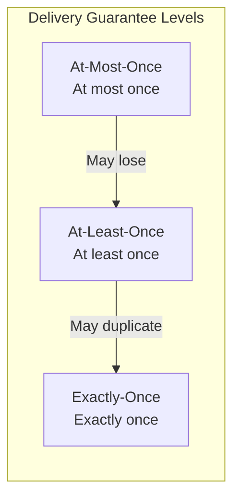
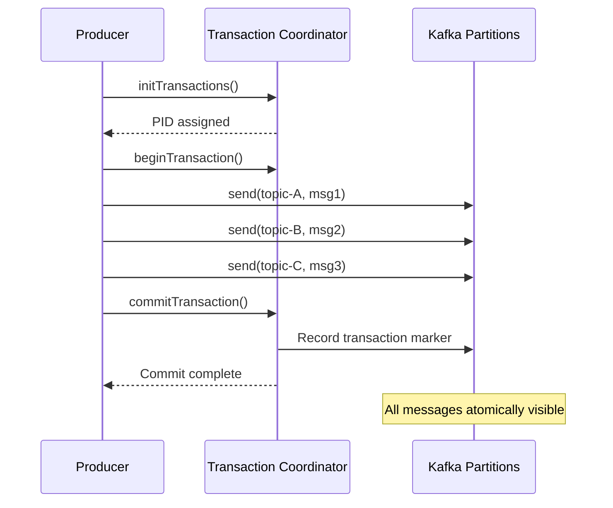


- At-Most-Once: may lose/no duplicates, At-Least-Once: no loss/may duplicate
- Exactly-Once: requires Idempotent Producer + Transactional API + read_committed
- Idempotent Producer is enabled by default in Kafka 3.0+, prevents duplicates for single Partition
- Kafka transactions guarantee atomic writes across multiple Partitions
- Use Outbox pattern when DB + Kafka atomic processing is needed


**Target Audience**: Developers building systems where message delivery guarantees are critical

**Prerequisites**: acks and Idempotent Producer concepts from [Advanced Concepts](advanced-concepts/)

---

Understand message delivery guarantee levels and Kafka transactions. This document is written for Kafka 3.6.x, with code examples verified on Spring Boot 3.2.x, Spring Kafka 3.1.x, and Java 17 environments.

#### Why Message Guarantee Levels Matter

In distributed systems, message delivery is not simple due to network failures, process crashes, and timing issues.

Here are problems that actually occur. First, payment event loss. During delivery from order service through Kafka to payment service, momentary network disconnection causes message loss: "Payment didn't happen but the order went through?" Second, duplicate point accumulation. When order completion event is delivered to point service, ACK loss causes retransmission: "It should be 1000 points, why did 2000 come in?" Third, inventory inconsistency. When order event is delivered to inventory service, duplicate processing deducts inventory twice: "Inventory is -10?"

The practical meaning of each guarantee level: At-Most-Once means "it's okay to miss" and is used for log collection or click analytics. At-Least-Once means "can't miss but duplicates are handleable" and is used for most events. Exactly-Once means "both missing and duplicates are critical" and is used for financial transactions, points, and inventory.

#### Message Delivery Guarantee Levels



*Diagram: Message delivery guarantee levels - Safety increases from At-Most-Once (may lose) → At-Least-Once (may duplicate) → Exactly-Once (exactly once).*

At-Most-Once may lose but no duplicates, with highest performance and low implementation complexity. At-Least-Once has no loss but may duplicate, with high performance and medium complexity. Exactly-Once has no loss or duplicates, with medium performance and high complexity.


- At-Most-Once: may lose/no duplicates (logs, metrics)
- At-Least-Once: no loss/may duplicate (most events)
- Exactly-Once: no loss or duplicates (financial, points, inventory)


#### At-Most-Once

Delivers messages at most once. May lose. ACK loss doesn't trigger retransmission, so messages may not arrive. Consumer commits before processing, so failures during processing don't trigger reprocessing.

```yaml
spring:
  kafka:
    producer:
      acks: 0  # Don't wait for response
      retries: 0  # No retries
```

Use cases: Logs, metrics, and data where loss is acceptable.

#### At-Least-Once

Delivers messages at least once. May duplicate. ACK loss triggers retransmission, so the same message may be stored twice.

```yaml
spring:
  kafka:
    producer:
      acks: all
      retries: 3  # Enable retries
    consumer:
      enable-auto-commit: false  # Manual commit
```

Use cases: General event processing. Application idempotency handling required.

#### Exactly-Once Semantics (EOS)

Delivers messages exactly once. No loss or duplicates. To achieve EOS, Idempotent Producer, Transactional API, and read_committed isolation level are all required.

Idempotent Producer prevents duplicates from Producer to Broker. Transactional API processes multiple messages atomically. read_committed reads only committed messages.

#### Idempotent Producer Review

Covered in [Advanced Concepts](advanced-concepts/#idempotent-producer-멱등성-프로듀서), but reviewed here as the foundation of EOS.

```java
// Producer settings
enable.idempotence = true  // Kafka 3.0+ default

// Automatically set
acks = all
retries = Integer.MAX_VALUE
max.in.flight.requests.per.connection = 5  // default value, order guaranteed when ≤ 5
```

Scope: Prevents duplicates for single Producer to single Partition.

#### Kafka Transactions

Guarantees atomic writes across multiple Partitions. All messages succeed or all fail.



*Diagram: Kafka transaction flow - initTransactions() → beginTransaction() → send() to multiple Partitions → commitTransaction() or abortTransaction().*

If an error occurs during transaction, call abortTransaction() to invalidate all messages.


- Kafka transactions: Guarantee atomic writes across multiple Partitions
- All messages succeed or all fail (All or Nothing)
- Transaction Coordinator manages transaction state


#### Spring Kafka Transactions

**Configuration**

```yaml
spring:
  kafka:
    producer:
      transaction-id-prefix: tx-order-  # Enable transactions
      acks: all
      properties:
        enable.idempotence: true
```

**Implementation Method 1: @Transactional**

```java
@Service
public class OrderService {

    private final KafkaTemplate<String, OrderEvent> kafkaTemplate;

    @Transactional  // Kafka transaction
    public void processOrder(Order order) {
        // Multiple messages sent atomically
        kafkaTemplate.send("order-events", order.getId(),
            new OrderEvent(order, "CREATED"));

        kafkaTemplate.send("inventory-events", order.getId(),
            new InventoryEvent(order.getItems(), "RESERVE"));

        kafkaTemplate.send("notification-events", order.getId(),
            new NotificationEvent(order.getCustomerId(), "ORDER_RECEIVED"));

        // All rollback if any fails
    }
}
```

**Implementation Method 2: executeInTransaction**

```java
@Service
public class OrderService {

    private final KafkaTemplate<String, OrderEvent> kafkaTemplate;

    public void processOrder(Order order) {
        kafkaTemplate.executeInTransaction(operations -> {
            operations.send("order-events", order.getId(),
                new OrderEvent(order, "CREATED"));

            operations.send("inventory-events", order.getId(),
                new InventoryEvent(order.getItems(), "RESERVE"));

            // Auto rollback on exception
            if (order.getTotalAmount().compareTo(BigDecimal.ZERO) <= 0) {
                throw new IllegalStateException("Invalid order amount");
            }

            return true;
        });
    }
}
```

#### Consumer's Exactly-Once

**read_committed Isolation Level**

```yaml
spring:
  kafka:
    consumer:
      isolation-level: read_committed  # Default: read_uncommitted
```

read_uncommitted reads all messages (including uncommitted). read_committed reads only committed messages. It skips and waits on uncommitted messages.

**Consume-Transform-Produce Pattern**

Applies EOS to patterns that read input, transform, and output.

```java
@Component
public class OrderProcessor {

    @KafkaListener(
        topics = "raw-orders",
        groupId = "order-processor"
    )
    @Transactional
    public void process(
            ConsumerRecord<String, RawOrder> record,
            @Header(KafkaHeaders.RECEIVED_PARTITION) int partition,
            Acknowledgment ack) {

        // 1. Process message
        ProcessedOrder processed = transform(record.value());

        // 2. Send result (within transaction)
        kafkaTemplate.send("processed-orders",
            record.key(), processed);

        // 3. Commit (within transaction)
        ack.acknowledge();

        // All committed atomically
    }
}
```

#### Transactions vs Idempotency

Idempotent Producer prevents duplicates for single Partition, auto-enabled (Kafka 3.0+), no additional settings needed. Does not guarantee atomicity and provides no Consumer isolation. Performance impact is negligible.

Transactional API guarantees atomic writes across multiple Partitions, requires transaction-id-prefix setting. Provides Consumer isolation with read_committed. Has some performance overhead.


- Idempotent Producer: Single Partition duplicate prevention, default enabled in Kafka 3.0+
- Transactional API: Atomic writes across multiple Partitions, needs transaction-id-prefix
- read_committed: Reads only committed messages for transaction isolation


#### Usage Guide

Use At-Most-Once (acks=0) when message loss is acceptable. Use At-Least-Once with idempotency handling when loss is not acceptable but duplicates are. Use Transactions when duplicates are also not acceptable and atomic writes across multiple Topics/Partitions are needed. Idempotent Producer (default) is sufficient when only single Partition duplicate prevention is needed.

```yaml
# Recommended for most cases (At-Least-Once + idempotency)
spring:
  kafka:
    producer:
      acks: all
      properties:
        enable.idempotence: true  # Kafka 3.0+ default

# When atomic multi-partition writes are needed
spring:
  kafka:
    producer:
      transaction-id-prefix: tx-${spring.application.name}-
      acks: all
    consumer:
      isolation-level: read_committed
```

#### Cautions

**Transaction Timeout**

```yaml
spring:
  kafka:
    producer:
      properties:
        transaction.timeout.ms: 60000  # Default 60 seconds
```

Transaction is automatically aborted on timeout.

**Performance Considerations**

Transactions have additional overhead. Communication with Transaction Coordinator, recording transaction markers, Consumer filtering processing are required. Expect about 20-30% throughput reduction compared to acks=all.

#### Comparing Distributed Transaction Approaches

Kafka transactions are not the only option. 2PC (Two-Phase Commit) provides strong consistency across multiple DBs but is slow and depends on coordinator. Kafka Transactions provide strong consistency within Kafka with auto-recovery but can't handle outside Kafka. Saga provides eventual consistency across multiple services with high scalability but requires compensation transactions.

**Limitations of Kafka Transactions**

What Kafka transactions can do: atomic writes across multiple Kafka Topics, Consume-Transform-Produce atomicity, Exactly-Once within Kafka. What they can't do: DB + Kafka atomic processing, external API + Kafka atomic processing, distributed transactions across services.


- Kafka transaction limitations: Only handles within Kafka, can't integrate external systems
- For DB + Kafka atomic processing: Use Outbox pattern
- Saga pattern: Eventual consistency across multiple services (requires compensation transactions)


**When You Need to Handle DB + Kafka Together**

To process DB and Kafka atomically, use the Outbox pattern. Within a DB transaction, save data and events to the Outbox table together, then a separate process sends from Outbox to Kafka.

```java
// Outbox pattern
@Transactional  // DB transaction only
public void process(OrderEvent event) {
    orderRepository.save(order);
    outboxRepository.save(new OutboxEvent("results", result));
    // Atomicity guaranteed by DB transaction
}
// Separate process sends from Outbox to Kafka
```

#### Transaction Debugging Guide

**ProducerFencedException**

Another Producer with the same transactional.id has started. Each instance needs a unique transactional.id.

```yaml
spring:
  kafka:
    producer:
      transaction-id-prefix: tx-${spring.application.name}-${random.uuid}-
```

**InvalidTxnStateException**

Transaction state inconsistency (timeout, abnormal termination, etc.). Producer needs to be recreated.

**Debugging Checklist**

Verify transaction.id is unique per instance, Broker version supports transactions (0.11+), all Consumers have isolation.level=read_committed, transaction timeout exceeds processing time, and network latency is not abnormal.

#### Practical Decision Guide

**Recommended approach for most cases: At-Least-Once + Business Idempotency**

```java
// Idempotency handling in Consumer
@KafkaListener(topics = "orders")
@Transactional
public void handleOrder(OrderEvent event) {
    // 1. Check if already processed
    if (processedEventRepository.existsById(event.getEventId())) {
        return;
    }

    // 2. Business logic
    orderService.process(event);

    // 3. Record processing completion (same DB transaction)
    processedEventRepository.save(new ProcessedEvent(event.getEventId()));
}
```

**When Kafka Transactions Are Truly Needed**

Use Kafka transactions only when all conditions are met: must write atomically to multiple Topics (all succeed or all fail), using Kafka Streams or Consume-Transform-Produce pattern, and can accept performance overhead.

#### Summary

Idempotent Producer prevents duplicates for single Partition, enabled by default since Kafka 3.0. Transactions write atomically to multiple Partitions, require transaction-id-prefix. read_committed reads only committed messages for transaction isolation.

#### Next Steps

- [Producer Tuning](producer-tuning/) - Performance optimization settings
