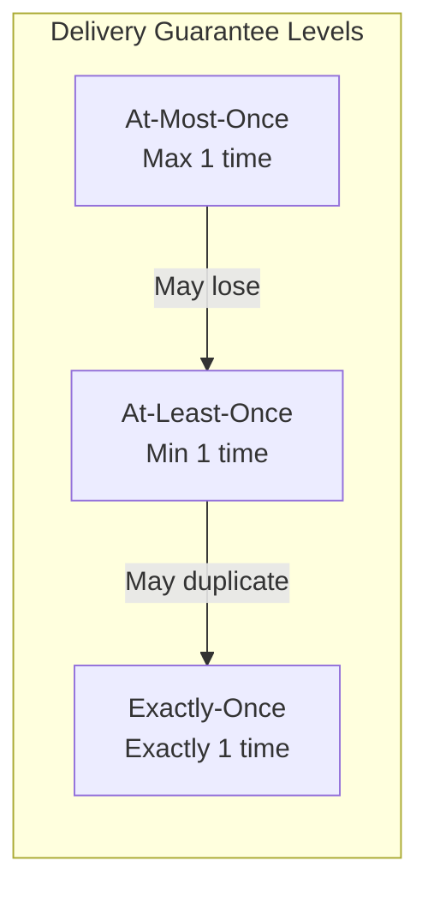
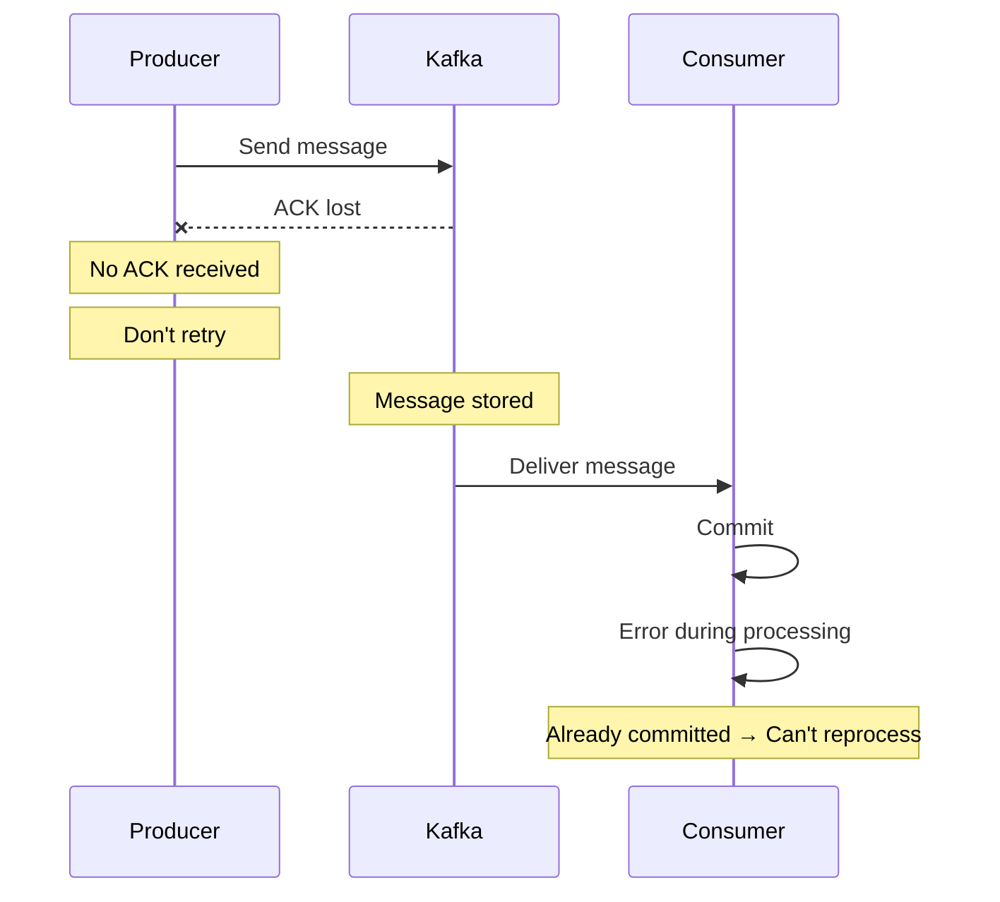
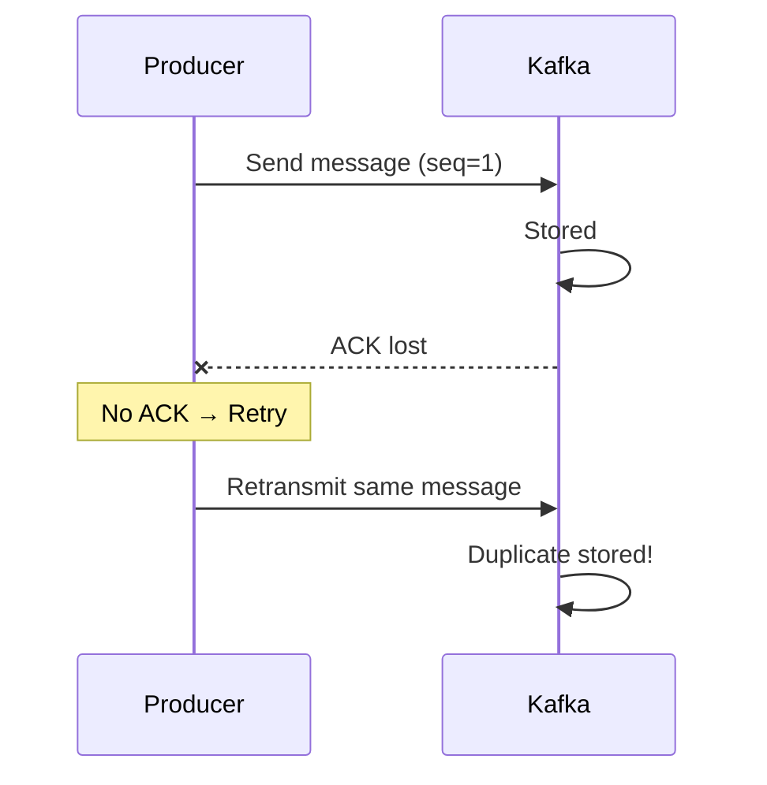
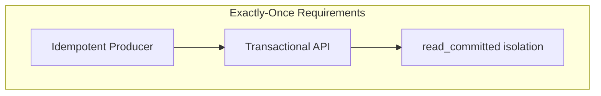
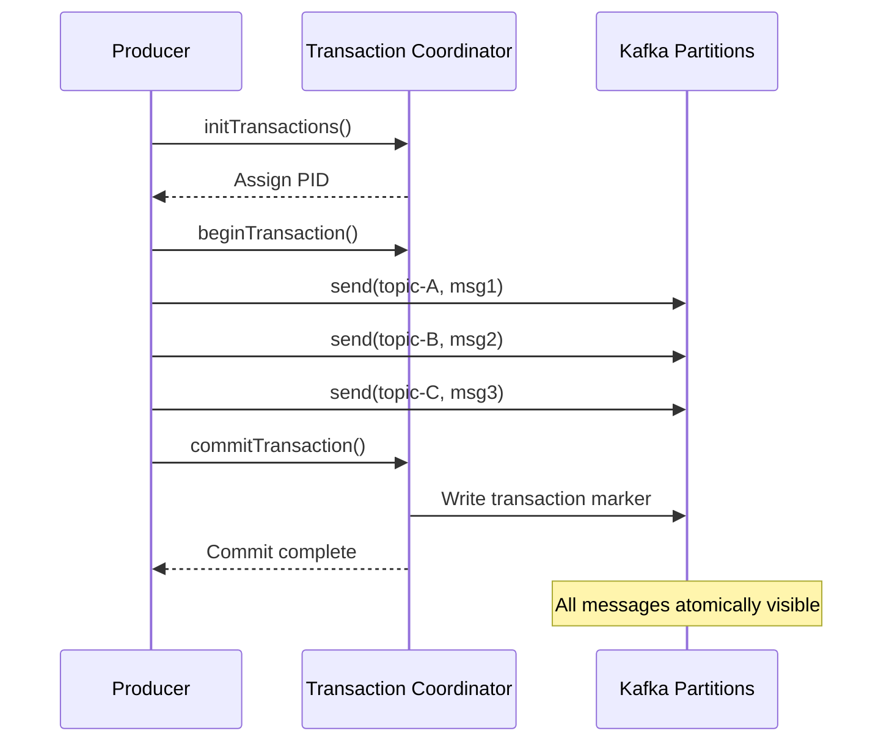
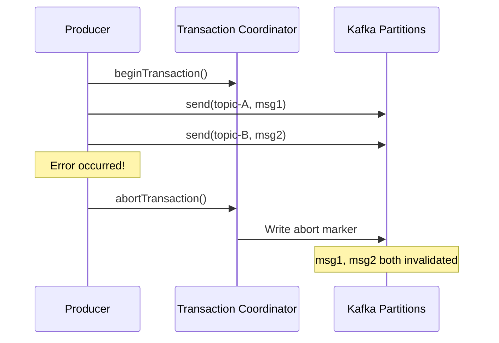
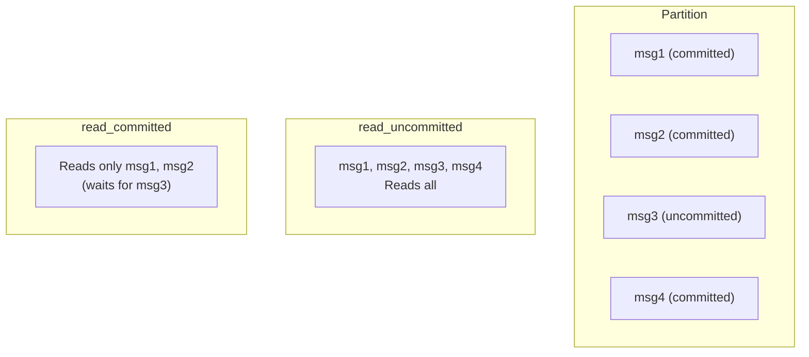
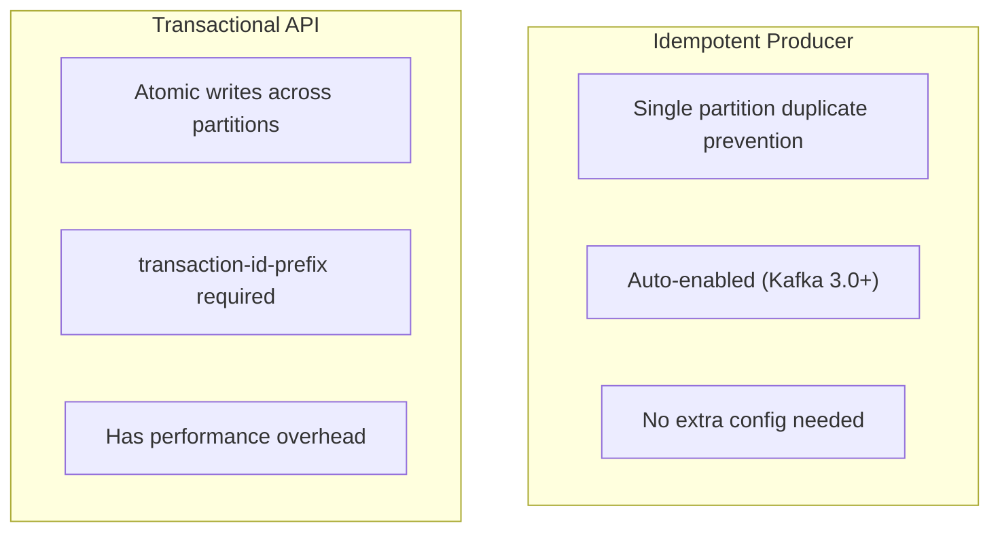
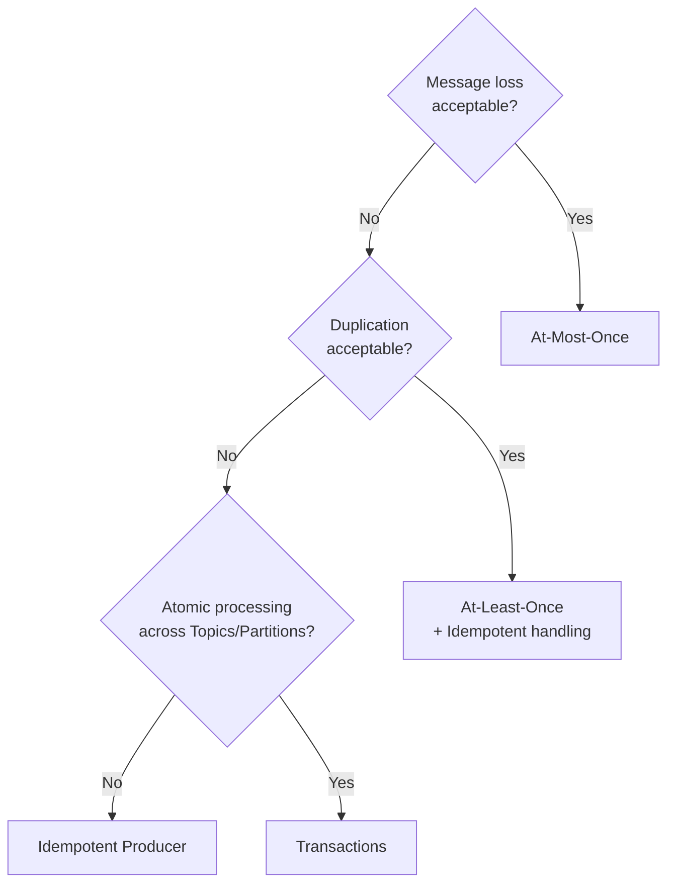
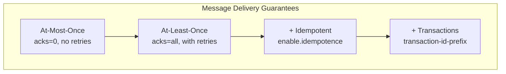

# Transactions & Exactly-Once Semantics

Understanding message delivery guarantees and Kafka transactions.

## Message Delivery Guarantee Levels



### Comparison

| Level | Loss | Duplication | Performance | Implementation Complexity |
|-------|------|-------------|-------------|--------------------------|
| **At-Most-Once** | O | X | Highest | Low |
| **At-Least-Once** | X | O | High | Medium |
| **Exactly-Once** | X | X | Medium | High |

## At-Most-Once

Delivers message **at most once**. May be lost.



### Implementation

```yaml
spring:
  kafka:
    producer:
      acks: 0  # No response wait
      retries: 0  # No retries
```

**Use Case:** Logs, metrics - data that's okay to lose

## At-Least-Once

Delivers message **at least once**. May duplicate.



### Implementation

```yaml
spring:
  kafka:
    producer:
      acks: all
      retries: 3  # Enable retries
    consumer:
      enable-auto-commit: false  # Manual commit
```

**Use Case:** General event processing (requires idempotent handling)

## Exactly-Once Semantics (EOS)

Delivers message **exactly once**. No loss or duplication.

### EOS Requirements



| Component | Role |
|-----------|------|
| **Idempotent Producer** | Prevent duplicates from Producer → Broker |
| **Transactional API** | Process multiple messages atomically |
| **read_committed** | Read only committed messages |

## Idempotent Producer Review

> Already covered in [Advanced Concepts](../advanced-concepts/#idempotent-producer), but revisited as the foundation of EOS.

```java
// Producer configuration
enable.idempotence = true  // Kafka 3.0+ default

// Automatically configured
acks = all
retries = Integer.MAX_VALUE
max.in.flight.requests.per.connection = 5
```

**Scope:** Duplicate prevention for single Producer → single Partition

## Kafka Transactions

Guarantees **atomic writes** across multiple Partitions.

### Transaction Flow



### On Transaction Failure



## Spring Kafka Transactions

### Configuration

```yaml
spring:
  kafka:
    producer:
      transaction-id-prefix: tx-order-  # Enable transactions
      acks: all
      properties:
        enable.idempotence: true
```

### Implementation Method 1: @Transactional

```java
@Service
public class OrderService {

    private final KafkaTemplate<String, OrderEvent> kafkaTemplate;

    @Transactional  // Kafka transaction
    public void processOrder(Order order) {
        // Multiple messages sent atomically
        kafkaTemplate.send("order-events", order.getId(),
            new OrderEvent(order, "CREATED"));

        kafkaTemplate.send("inventory-events", order.getId(),
            new InventoryEvent(order.getItems(), "RESERVE"));

        kafkaTemplate.send("notification-events", order.getId(),
            new NotificationEvent(order.getCustomerId(), "ORDER_RECEIVED"));

        // All rolled back if any fails
    }
}
```

### Implementation Method 2: executeInTransaction

```java
@Service
public class OrderService {

    private final KafkaTemplate<String, OrderEvent> kafkaTemplate;

    public void processOrder(Order order) {
        kafkaTemplate.executeInTransaction(operations -> {
            operations.send("order-events", order.getId(),
                new OrderEvent(order, "CREATED"));

            operations.send("inventory-events", order.getId(),
                new InventoryEvent(order.getItems(), "RESERVE"));

            // Auto rollback on exception
            if (order.getTotalAmount().compareTo(BigDecimal.ZERO) <= 0) {
                throw new IllegalStateException("Invalid order amount");
            }

            return true;
        });
    }
}
```

## Consumer Exactly-Once

### read_committed Isolation Level

```yaml
spring:
  kafka:
    consumer:
      isolation-level: read_committed  # Default: read_uncommitted
```



### Consume-Transform-Produce Pattern

Applying EOS in patterns that read input, transform, and output.

```java
@Component
public class OrderProcessor {

    @KafkaListener(
        topics = "raw-orders",
        groupId = "order-processor"
    )
    @Transactional
    public void process(
            ConsumerRecord<String, RawOrder> record,
            @Header(KafkaHeaders.RECEIVED_PARTITION) int partition,
            Acknowledgment ack) {

        // 1. Process message
        ProcessedOrder processed = transform(record.value());

        // 2. Send result (within transaction)
        kafkaTemplate.send("processed-orders",
            record.key(), processed);

        // 3. Commit (within transaction)
        ack.acknowledge();

        // All committed atomically
    }
}
```

## Transaction vs Idempotence



| Feature | Idempotent | Transactional |
|---------|------------|---------------|
| **Scope** | Single Partition | Multiple Partitions |
| **Duplicate Prevention** | O | O |
| **Atomicity** | X | O |
| **Consumer Isolation** | X | O (read_committed) |
| **Performance Impact** | Almost none | Some overhead |

## Usage Guide

### When to Use What?



### Recommended Configuration

```yaml
# Recommended for most cases (At-Least-Once + Idempotence)
spring:
  kafka:
    producer:
      acks: all
      properties:
        enable.idempotence: true  # Kafka 3.0+ default

# When atomic multi-partition writes are needed
spring:
  kafka:
    producer:
      transaction-id-prefix: tx-${spring.application.name}-
      acks: all
    consumer:
      isolation-level: read_committed
```

## Cautions

### Transaction Timeout

```yaml
spring:
  kafka:
    producer:
      properties:
        transaction.timeout.ms: 60000  # Default 60 seconds
```

Transactions are automatically aborted on timeout.

### Performance Considerations

Transactions have additional overhead:
- Communication with Transaction Coordinator
- Writing transaction markers
- Consumer filtering

**Alternative:** Guarantee idempotence in business logic

```java
// Idempotence via DB unique constraint
@Transactional
public void handleOrder(OrderEvent event) {
    if (orderRepository.existsByEventId(event.getEventId())) {
        log.info("Already processed event: {}", event.getEventId());
        return;
    }
    // Processing logic
    orderRepository.save(order);
}
```

## Summary



| Concept | Key Point |
|---------|-----------|
| **Idempotent Producer** | Single Partition duplicate prevention |
| **Transactions** | Atomic writes across Partitions |
| **read_committed** | Read only committed messages |

## Next Steps

- [Producer Tuning](../producer-tuning/) - Performance optimization settings
