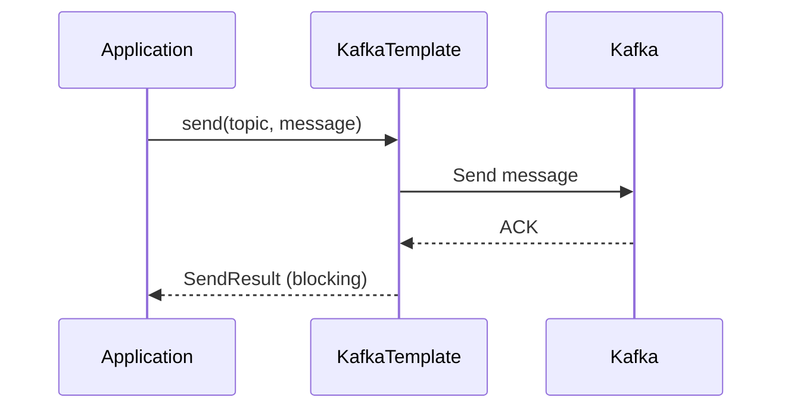
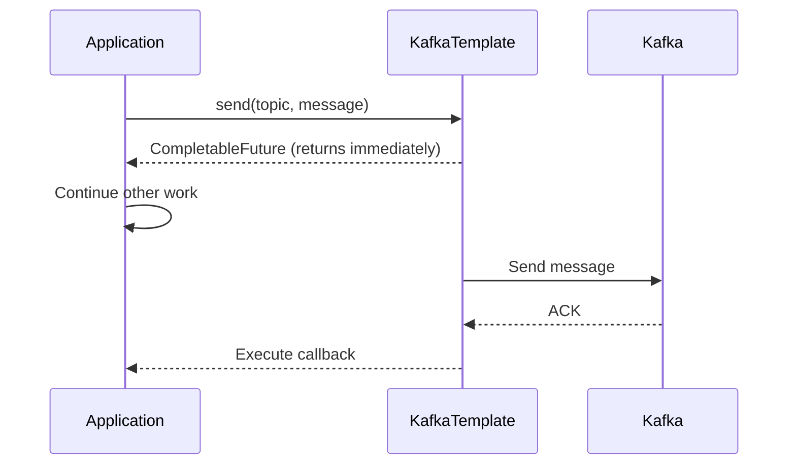
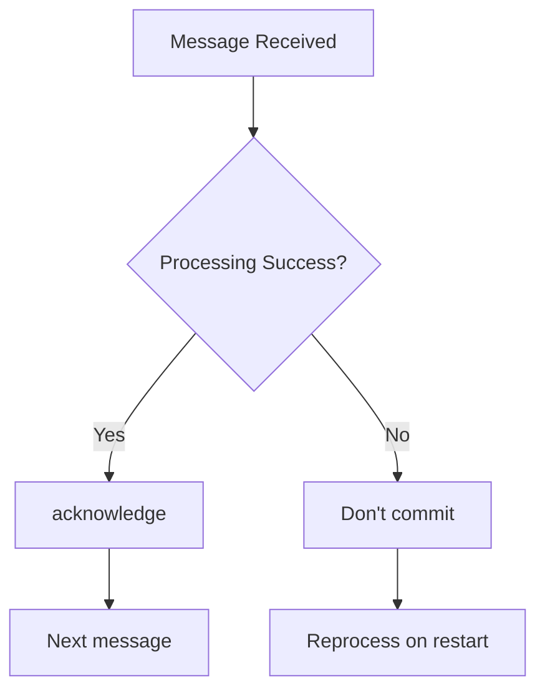
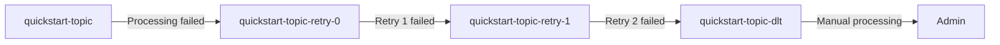

This document provides a step-by-step guide to sending and receiving messages using Spring Kafka.


- **Producer**: Synchronous/asynchronous message sending with `KafkaTemplate`, Partition assignment using Key
- **Consumer**: Message reception with `@KafkaListener`, batch processing and pattern subscription support
- **Manual Commit**: Explicit commit after processing completion with `Acknowledgment`
- **Error Handling**: Retry and Dead Letter Topic configuration with `@RetryableTopic`


## Before You Begin

| Item | Requirement |
|------|-------------|
| **Target Audience** | Backend developers who want to use Kafka in Spring Boot applications |
| **Prerequisites** | Basic Java syntax, Spring Boot fundamentals, Kafka basic concepts |
| **Prior Completion** | [Quick Start](../quick-start/) example completed, [Environment Setup](setup/) configuration done |
| **Estimated Time** | About 30 minutes |


**Windows Users**: Use `gradlew.bat` instead of `./gradlew` in commands.

**macOS/Linux Users**: If Gradle Wrapper doesn't have execute permission, run `chmod +x gradlew` first.


Completing the Quick Start first will make this document easier to understand. This document extends the simple Quick Start example to learn patterns used in production.

---

## Step 1: Implementing the Producer

The Producer is responsible for sending messages to Kafka. In Spring Kafka, you use `KafkaTemplate` to publish messages.

### 1.1 KafkaTemplate Injection

Spring Boot automatically creates and injects `KafkaTemplate`. Use dependency injection without separate Bean configuration.

```java
@Service
public class MessageProducer {

    private final KafkaTemplate<String, String> kafkaTemplate;

    public MessageProducer(KafkaTemplate<String, String> kafkaTemplate) {
        this.kafkaTemplate = kafkaTemplate;
    }
}
```

### 1.2 Synchronous Send

In Quick Start, we didn't check the result of the `send()` method. In production, you often need to verify send results. Calling the `get()` method blocks until the send completes, allowing you to check the result.

```java
public void sendSync(String topic, String message) {
    try {
        SendResult<String, String> result = kafkaTemplate.send(topic, message).get();

        RecordMetadata metadata = result.getRecordMetadata();
        log.info("Send complete - Topic: {}, Partition: {}, Offset: {}",
                metadata.topic(),
                metadata.partition(),
                metadata.offset());
    } catch (Exception e) {
        log.error("Send failed", e);
        throw new RuntimeException("Message send failed", e);
    }
}
```

**Expected Output:**
```
INFO  c.e.producer.MessageProducer : Send complete - Topic: quickstart-topic, Partition: 0, Offset: 42
```



*[Diagram Description: When the Application calls KafkaTemplate's send method, KafkaTemplate sends the message to Kafka. When Kafka returns an ACK, KafkaTemplate returns SendResult to the Application, and the Application is blocked during this process.]*

### 1.3 Asynchronous Send

Asynchronous send returns immediately after the send request, and the result is processed via callback. This approach offers high throughput but handling send failures can be more complex.

```java
public void sendAsync(String topic, String message) {
    CompletableFuture<SendResult<String, String>> future =
            kafkaTemplate.send(topic, message);

    future.whenComplete((result, ex) -> {
        if (ex == null) {
            log.info("Send success: {}", result.getRecordMetadata().offset());
        } else {
            log.error("Send failed", ex);
        }
    });
}
```

**Expected Output:**
```
INFO  c.e.producer.MessageProducer : Send success: 43
```



*[Diagram Description: When the Application calls KafkaTemplate's send method, a CompletableFuture is immediately returned so the Application can continue with other work. Later, when KafkaTemplate sends the message to Kafka and receives an ACK, the callback is executed.]*

### 1.4 Send with Key

Using a Message Key ensures that messages with the same Key are always sent to the same Partition. Use this approach when you need to guarantee ordering for specific data.

```java
public void sendWithKey(String topic, String key, String message) {
    kafkaTemplate.send(topic, key, message);
}
```

### 1.5 Send to Specific Partition

If needed, you can also send to a specific Partition directly.

```java
public void sendToPartition(String topic, int partition, String key, String message) {
    kafkaTemplate.send(topic, partition, key, message);
}
```


- **Synchronous Send**: Block until send completes with `get()` method to verify result
- **Asynchronous Send**: Process result with `whenComplete()` callback, achieve high throughput
- **Using Key**: Same Key sends to same Partition, guaranteeing order
- **Partition Specification**: Directly send to specific Partition when needed


---

## Step 2: Implementing the Consumer

The Consumer receives and processes messages from Kafka. In Spring Kafka, you use the `@KafkaListener` annotation.

### 2.1 Basic @KafkaListener

This is the most basic form used in Quick Start. Using the `@KafkaListener` annotation automatically receives messages from the specified Topic.

```java
@Component
public class MessageConsumer {

    @KafkaListener(topics = "quickstart-topic", groupId = "quickstart-group")
    public void consume(String message) {
        log.info("Message received: {}", message);
    }
}
```

**Expected Output:**
```
INFO  c.e.consumer.MessageConsumer : Message received: Hello Kafka!
```

### 2.2 Receive with ConsumerRecord

Use `ConsumerRecord` when you need metadata such as partition, offset, key, and timestamp in addition to the message content.

```java
@KafkaListener(topics = "quickstart-topic")
public void consume(ConsumerRecord<String, String> record) {
    log.info("Topic: {}", record.topic());
    log.info("Partition: {}", record.partition());
    log.info("Offset: {}", record.offset());
    log.info("Key: {}", record.key());
    log.info("Value: {}", record.value());
    log.info("Timestamp: {}", record.timestamp());
}
```

**Expected Output:**
```
INFO  c.e.consumer.MessageConsumer : Topic: quickstart-topic
INFO  c.e.consumer.MessageConsumer : Partition: 0
INFO  c.e.consumer.MessageConsumer : Offset: 42
INFO  c.e.consumer.MessageConsumer : Key: user-123
INFO  c.e.consumer.MessageConsumer : Value: Hello Kafka!
INFO  c.e.consumer.MessageConsumer : Timestamp: 1704873600000
```

### 2.3 Subscribe to Multiple Topics

A single Listener can subscribe to multiple Topics.

```java
@KafkaListener(topics = {"topic-a", "topic-b", "topic-c"})
public void consumeMultiple(String message) {
    log.info("Message received: {}", message);
}
```

### 2.4 Subscribe with Pattern

Using regex patterns, you can subscribe to all Topics matching a specific pattern. For example, subscribe to `order-created`, `order-paid`, `order-shipped`, etc. all at once.

```java
@KafkaListener(topicPattern = "order-.*")
public void consumePattern(String message) {
    log.info("Order event: {}", message);
}
```

### 2.5 Batch Receive

Setting the `batch` option to `true` allows you to receive and process multiple messages at once. Use this approach for bulk data processing.

```java
@KafkaListener(topics = "quickstart-topic", batch = "true")
public void consumeBatch(List<String> messages) {
    log.info("Batch received: {} messages", messages.size());
    for (String message : messages) {
        process(message);
    }
}
```

**Expected Output:**
```
INFO  c.e.consumer.MessageConsumer : Batch received: 10 messages
```


- **Basic Listener**: Specify Topic with `@KafkaListener`, automatic message reception
- **ConsumerRecord**: Receive with metadata (Partition, Offset, Key, Timestamp)
- **Multiple Topic Subscription**: Specify multiple Topics with array or use regex pattern
- **Batch Processing**: Set `batch = "true"` to process multiple messages at once


---

## Step 3: Implementing Manual Offset Commit

Quick Start used auto-commit. If you need to reprocess messages when processing fails, use manual commit. Manual commit only commits the Offset after successful message processing, allowing you to reprocess the message on failure.

### 3.1 Configuration

Add the following settings to `application.yml`:

```yaml
spring:
  kafka:
    consumer:
      enable-auto-commit: false
    listener:
      ack-mode: manual
```

### 3.2 Implementation

The Offset is only committed when you call the `acknowledge()` method of the `Acknowledgment` object. If you don't commit on processing failure, the message will be re-delivered when the Consumer starts next time.

```java
@KafkaListener(topics = "quickstart-topic")
public void consume(String message, Acknowledgment ack) {
    try {
        // Business logic processing
        processMessage(message);

        // Commit on success
        ack.acknowledge();
    } catch (Exception e) {
        // Don't commit on failure -> will be reprocessed
        log.error("Processing failed", e);
    }
}
```

**Expected Output (on success):**
```
INFO  c.e.consumer.MessageConsumer : Message processing complete: Hello Kafka!
```

**Expected Output (on failure):**
```
ERROR c.e.consumer.MessageConsumer : Processing failed
```



*[Diagram Description: After receiving a message, if processing succeeds, acknowledge is called to commit the Offset and proceed to the next message. If processing fails, no commit occurs, so the message is reprocessed when the Consumer restarts.]*


- **Configuration**: Enable manual commit with `enable-auto-commit: false`, `ack-mode: manual`
- **Commit Timing**: Call `ack.acknowledge()` after successful business logic
- **Reprocessing Guarantee**: On failure before commit, reprocessed on next Consumer start


---

## Step 4: Implementing Error Handling

Proper error handling for message processing failures is essential in production environments.

### 4.1 ErrorHandler Configuration

Registering `DefaultErrorHandler` as a Bean automatically retries when exceptions occur in the Consumer. `FixedBackOff` retries at fixed intervals for a specified number of times.

```java
@Configuration
public class KafkaConfig {

    @Bean
    public DefaultErrorHandler errorHandler() {
        return new DefaultErrorHandler(
            new FixedBackOff(1000L, 3L)  // 1 second interval, 3 retries
        );
    }
}
```

### 4.2 Using @RetryableTopic

The `@RetryableTopic` annotation allows you to declaratively define retry policies. When all retries fail, the message is moved to a Dead Letter Topic (DLT).

```java
@RetryableTopic(
    attempts = "3",
    backoff = @Backoff(delay = 1000, multiplier = 2)
)
@KafkaListener(topics = "quickstart-topic")
public void consume(String message) {
    // Auto retry on failure
    // After 3 failures, moves to quickstart-topic-dlt
    processMessage(message);
}
```

**Expected Output (on retry):**
```
WARN  o.s.k.r.RetryTopicConfigurer : Retry 1/3 - quickstart-topic-retry-0
WARN  o.s.k.r.RetryTopicConfigurer : Retry 2/3 - quickstart-topic-retry-1
ERROR o.s.k.r.RetryTopicConfigurer : Moving to DLT - quickstart-topic-dlt
```

### 4.3 Dead Letter Topic (DLT)

Messages that cannot be processed after retries are moved to the DLT. Monitor DLT messages separately and process them manually.



*[Diagram Description: When message processing fails, it moves to a retry Topic for retry. If all retries fail, it moves to the Dead Letter Topic (DLT), where an administrator processes it manually.]*


- **DefaultErrorHandler**: Auto retry with Bean registration, set retry interval/count with `FixedBackOff`
- **@RetryableTopic**: Declarative retry policy, automatic DLT movement on failure
- **Dead Letter Topic**: Separate storage for unprocessable messages, requires monitoring and manual handling


---

## Step 5: Running the Complete Example Code

Let's run the extended version of the Quick Start example.

### 5.1 Producer (Extended REST API)

In Quick Start, we only sent simple strings. In production, you often send JSON objects with keys.

```java
@RestController
@RequestMapping("/api/messages")
public class MessageController {

    private final KafkaTemplate<String, String> kafkaTemplate;

    public MessageController(KafkaTemplate<String, String> kafkaTemplate) {
        this.kafkaTemplate = kafkaTemplate;
    }

    // Same simple send as Quick Start
    @PostMapping("/simple")
    public ResponseEntity<String> sendSimple(@RequestBody String message) {
        kafkaTemplate.send("quickstart-topic", message);
        return ResponseEntity.ok("Message sent: " + message);
    }

    // Extended: Send with Key and Topic specified
    @PostMapping("/advanced")
    public ResponseEntity<String> sendAdvanced(@RequestBody MessageRequest request) {
        kafkaTemplate.send(request.topic(), request.key(), request.message());
        return ResponseEntity.ok("Message sent");
    }
}

record MessageRequest(String topic, String key, String message) {}
```

### 5.2 API Testing

Test the APIs with the following commands:

```bash
# Same approach as Quick Start
curl -X POST http://localhost:8080/api/messages/simple \
  -H "Content-Type: text/plain" \
  -d "Hello Kafka!"
```

**Expected Output:**
```
Message sent: Hello Kafka!
```

```bash
# Extended approach (specify Key and Topic)
curl -X POST http://localhost:8080/api/messages/advanced \
  -H "Content-Type: application/json" \
  -d '{"topic": "quickstart-topic", "key": "user-123", "message": "Hello!"}'
```

**Expected Output:**
```
Message sent
```

### 5.3 Consumer (Manual Commit)

This is a Consumer implementation using manual commit. It only calls `acknowledge()` on successful processing.

```java
@Component
@Slf4j
public class MessageConsumer {

    @KafkaListener(
        topics = "quickstart-topic",
        groupId = "quickstart-group"
    )
    public void consume(
            ConsumerRecord<String, String> record,
            Acknowledgment ack) {

        log.info("Received - Partition: {}, Offset: {}, Key: {}, Value: {}",
                record.partition(),
                record.offset(),
                record.key(),
                record.value());

        try {
            processMessage(record.value());
            ack.acknowledge();
        } catch (Exception e) {
            log.error("Processing failed: {}", record.value(), e);
            // Retry logic or send to DLT
        }
    }

    private void processMessage(String message) {
        // Business logic
    }
}
```

**Expected Output:**
```
INFO  c.e.consumer.MessageConsumer : Received - Partition: 0, Offset: 42, Key: user-123, Value: Hello!
```

---

## Step 6: Writing Tests

### 6.1 Embedded Kafka

Using the `@EmbeddedKafka` annotation allows you to run integration tests without a separate Kafka installation.

```java
@SpringBootTest
@EmbeddedKafka(partitions = 1, topics = {"quickstart-topic"})
class KafkaIntegrationTest {

    @Autowired
    private KafkaTemplate<String, String> kafkaTemplate;

    @Test
    void testSendAndReceive() throws Exception {
        kafkaTemplate.send("quickstart-topic", "test-message").get();

        // Consumer verification logic
    }
}
```

Run the tests:

```bash
./gradlew test
```


Use `gradlew.bat test` instead of `./gradlew test`.


**Expected Output:**
```
BUILD SUCCESSFUL in 15s
3 actionable tasks: 3 executed
```

---

## Congratulations!

You have successfully implemented Producer/Consumer using Spring Kafka. Summary of what you learned in this document:

| Item | Quick Start | What You Learned Here |
|------|-------------|----------------------|
| **Send Method** | Fire-and-forget | Choose synchronous/asynchronous |
| **Commit Method** | Auto commit | Manual commit support |
| **Error Handling** | None | Retry + DLT |
| **Key Usage** | None | Order guarantee with Key |

---

## Troubleshooting

### ClassNotFoundException: KafkaTemplate

**Symptom**: `ClassNotFoundException` or `NoClassDefFoundError` when starting the application

**Cause**: Missing spring-kafka dependency

**Solution**:
```groovy
// build.gradle.kts
dependencies {
    implementation("org.springframework.kafka:spring-kafka")
}
```

### Connection Timeout

**Symptom**: `org.apache.kafka.common.errors.TimeoutException`

**Cause**: Cannot connect to Kafka broker

**Solution**:
1. Check if Kafka is running: `docker-compose ps`
2. Verify `bootstrap-servers` setting is correct
3. Check that firewall is not blocking port 9092

```bash
# Check Kafka status
docker-compose ps

# Restart Kafka
docker-compose restart kafka
```

### Consumer Not Receiving Messages

**Symptom**: Producer sends messages but Consumer log is not appearing

**Cause**: Consumer Group ID mismatch or auto-offset-reset setting issue

**Solution**:
1. Check the `groupId` setting
2. Set `auto-offset-reset: earliest` to read messages from the beginning

```yaml
spring:
  kafka:
    consumer:
      auto-offset-reset: earliest
```

### Serialization Error

**Symptom**: `SerializationException`

**Cause**: Mismatch between Producer and Consumer serialization/deserialization settings

**Solution**:
```yaml
spring:
  kafka:
    producer:
      key-serializer: org.apache.kafka.common.serialization.StringSerializer
      value-serializer: org.apache.kafka.common.serialization.StringSerializer
    consumer:
      key-deserializer: org.apache.kafka.common.serialization.StringDeserializer
      value-deserializer: org.apache.kafka.common.serialization.StringDeserializer
```

---

## Next Steps

- [Order System](order-system/) - Real-world example applying domain-driven design
- [Consumer Advanced Settings](../concepts/consumer-tuning/) - Performance optimization methods
- [Error Handling Patterns](../concepts/error-handling/) - Production error handling strategies
