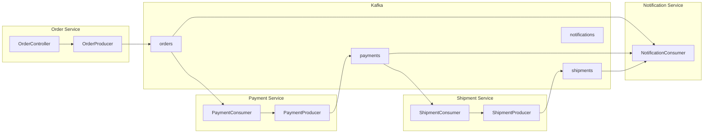

Implement event-driven communication using Kafka in a microservices environment.

## Scenario: Order Processing System



---

## Common Event Definition

### Event Schema

```java
// common-events/src/main/java/events/BaseEvent.java
public abstract class BaseEvent {
    private String eventId;
    private String eventType;
    private LocalDateTime occurredAt;
    private String correlationId;  // Tracing ID
}

// OrderCreatedEvent.java
public class OrderCreatedEvent extends BaseEvent {
    private String orderId;
    private String customerId;
    private List<OrderItem> items;
    private BigDecimal totalAmount;
    private String shippingAddress;
}

// PaymentCompletedEvent.java
public class PaymentCompletedEvent extends BaseEvent {
    private String paymentId;
    private String orderId;
    private BigDecimal amount;
    private PaymentMethod method;
    private PaymentStatus status;
}

// ShipmentCreatedEvent.java
public class ShipmentCreatedEvent extends BaseEvent {
    private String shipmentId;
    private String orderId;
    private String trackingNumber;
    private String carrier;
    private LocalDateTime estimatedDelivery;
}
```

---

## Order Service

### application.yml

```yaml
spring:
  application:
    name: order-service
  kafka:
    bootstrap-servers: localhost:9092
    producer:
      key-serializer: org.apache.kafka.common.serialization.StringSerializer
      value-serializer: org.springframework.kafka.support.serializer.JsonSerializer
      acks: all
      properties:
        enable.idempotence: true

kafka:
  topics:
    orders: orders
```

### OrderProducer

```java
@Service
@RequiredArgsConstructor
@Slf4j
public class OrderProducer {
    private final KafkaTemplate<String, Object> kafkaTemplate;

    @Value("${kafka.topics.orders}")
    private String ordersTopic;

    public CompletableFuture<SendResult<String, Object>> publishOrderCreated(Order order) {
        OrderCreatedEvent event = OrderCreatedEvent.builder()
            .eventId(UUID.randomUUID().toString())
            .eventType("ORDER_CREATED")
            .occurredAt(LocalDateTime.now())
            .correlationId(order.getCorrelationId())
            .orderId(order.getId())
            .customerId(order.getCustomerId())
            .items(order.getItems())
            .totalAmount(order.getTotalAmount())
            .shippingAddress(order.getShippingAddress())
            .build();

        // Use orderId as Key so same orders go to same Partition
        return kafkaTemplate.send(ordersTopic, order.getId(), event)
            .whenComplete((result, ex) -> {
                if (ex != null) {
                    log.error("Order event publish failed: orderId={}", order.getId(), ex);
                } else {
                    log.info("Order event published: orderId={}, partition={}, offset={}",
                        order.getId(),
                        result.getRecordMetadata().partition(),
                        result.getRecordMetadata().offset());
                }
            });
    }
}
```

---

## Payment Service

### PaymentConsumer

```java
@Service
@RequiredArgsConstructor
@Slf4j
public class PaymentConsumer {
    private final PaymentService paymentService;
    private final PaymentProducer paymentProducer;

    @KafkaListener(
        topics = "${kafka.topics.orders}",
        groupId = "payment-service-group",
        containerFactory = "kafkaListenerContainerFactory"
    )
    public void handleOrderCreated(
        @Payload OrderCreatedEvent event,
        @Header(KafkaHeaders.RECEIVED_KEY) String key,
        @Header(KafkaHeaders.RECEIVED_PARTITION) int partition,
        Acknowledgment ack
    ) {
        log.info("Order event received: orderId={}, partition={}", event.getOrderId(), partition);

        try {
            // Idempotency check
            if (paymentService.isAlreadyProcessed(event.getOrderId())) {
                log.warn("Already processed order: orderId={}", event.getOrderId());
                ack.acknowledge();
                return;
            }

            // Process payment
            Payment payment = paymentService.processPayment(
                event.getOrderId(),
                event.getCustomerId(),
                event.getTotalAmount(),
                event.getCorrelationId()
            );

            // Publish payment completed event
            paymentProducer.publishPaymentCompleted(payment, event.getCorrelationId());

            ack.acknowledge();
            log.info("Payment completed: orderId={}, paymentId={}", event.getOrderId(), payment.getId());

        } catch (PaymentFailedException e) {
            log.error("Payment failed: orderId={}", event.getOrderId(), e);
            paymentProducer.publishPaymentFailed(event.getOrderId(), e.getMessage(), event.getCorrelationId());
            ack.acknowledge();

        } catch (Exception e) {
            log.error("Payment processing error: orderId={}", event.getOrderId(), e);
            throw e;  // nack - retry
        }
    }
}
```

---

## Shipment Service

### ShipmentConsumer

```java
@Service
@RequiredArgsConstructor
@Slf4j
public class ShipmentConsumer {
    private final ShipmentService shipmentService;
    private final ShipmentProducer shipmentProducer;

    @KafkaListener(
        topics = "${kafka.topics.payments}",
        groupId = "shipment-service-group"
    )
    public void handlePaymentCompleted(
        @Payload PaymentCompletedEvent event,
        Acknowledgment ack
    ) {
        // Only process completed payment events
        if (event.getStatus() != PaymentStatus.COMPLETED) {
            ack.acknowledge();
            return;
        }

        log.info("Payment completed event received: orderId={}", event.getOrderId());

        try {
            // Create shipment
            Shipment shipment = shipmentService.createShipment(
                event.getOrderId(),
                event.getCorrelationId()
            );

            // Publish shipment created event
            shipmentProducer.publishShipmentCreated(shipment, event.getCorrelationId());

            ack.acknowledge();
            log.info("Shipment created: orderId={}, shipmentId={}", event.getOrderId(), shipment.getId());

        } catch (Exception e) {
            log.error("Shipment creation failed: orderId={}", event.getOrderId(), e);
            throw e;
        }
    }
}
```

---

## Notification Service

### NotificationConsumer

```java
@Service
@RequiredArgsConstructor
@Slf4j
public class NotificationConsumer {
    private final NotificationService notificationService;

    // Subscribe to multiple topics simultaneously
    @KafkaListener(
        topics = {"${kafka.topics.orders}", "${kafka.topics.payments}", "${kafka.topics.shipments}"},
        groupId = "notification-service-group"
    )
    public void handleEvent(
        @Payload String payload,
        @Header(KafkaHeaders.RECEIVED_TOPIC) String topic,
        @Header("eventType") String eventType,
        Acknowledgment ack
    ) {
        log.info("Event received: topic={}, type={}", topic, eventType);

        try {
            NotificationRequest notification = switch (eventType) {
                case "ORDER_CREATED" -> createOrderNotification(payload);
                case "PAYMENT_COMPLETED" -> createPaymentNotification(payload);
                case "PAYMENT_FAILED" -> createPaymentFailedNotification(payload);
                case "SHIPMENT_CREATED" -> createShipmentNotification(payload);
                default -> {
                    log.warn("Unknown event type: {}", eventType);
                    yield null;
                }
            };

            if (notification != null) {
                notificationService.send(notification);
            }

            ack.acknowledge();

        } catch (Exception e) {
            log.error("Notification processing failed: topic={}, type={}", topic, eventType, e);
            ack.acknowledge();  // Don't retry notification failures
        }
    }
}
```

---

## Saga Pattern: Distributed Transactions

### Compensation Transaction Implementation

```java
@Service
@RequiredArgsConstructor
@Slf4j
public class OrderSagaOrchestrator {
    private final OrderRepository orderRepository;
    private final KafkaTemplate<String, Object> kafkaTemplate;

    // Cancel order on payment failure
    @KafkaListener(topics = "${kafka.topics.payments}", groupId = "order-saga-group")
    public void handlePaymentEvent(@Payload String payload, @Header("eventType") String eventType) {
        if ("PAYMENT_FAILED".equals(eventType)) {
            PaymentFailedEvent event = parseEvent(payload, PaymentFailedEvent.class);
            compensateOrder(event.getOrderId(), event.getReason());
        }
    }

    // Cancel order + request refund on shipment failure
    @KafkaListener(topics = "${kafka.topics.shipments}", groupId = "order-saga-group")
    public void handleShipmentEvent(@Payload String payload, @Header("eventType") String eventType) {
        if ("SHIPMENT_FAILED".equals(eventType)) {
            ShipmentFailedEvent event = parseEvent(payload, ShipmentFailedEvent.class);
            compensateOrderAndPayment(event.getOrderId(), event.getReason());
        }
    }

    private void compensateOrder(String orderId, String reason) {
        log.info("Order compensation transaction: orderId={}, reason={}", orderId, reason);

        Order order = orderRepository.findById(orderId).orElseThrow();
        order.cancel(reason);
        orderRepository.save(order);

        // Publish order cancelled event
        kafkaTemplate.send("orders", orderId, OrderCancelledEvent.builder()
            .orderId(orderId)
            .reason(reason)
            .build());
    }

    private void compensateOrderAndPayment(String orderId, String reason) {
        compensateOrder(orderId, reason);

        // Publish refund request event
        kafkaTemplate.send("refunds", orderId, RefundRequestedEvent.builder()
            .orderId(orderId)
            .reason(reason)
            .build());
    }
}
```

---

## Tests

### Integration Tests (Testcontainers)

```java
@SpringBootTest
@Testcontainers
class OrderServiceIntegrationTest {

    @Container
    static KafkaContainer kafka = new KafkaContainer(
        DockerImageName.parse("confluentinc/cp-kafka:7.5.0")
    );

    @DynamicPropertySource
    static void kafkaProperties(DynamicPropertyRegistry registry) {
        registry.add("spring.kafka.bootstrap-servers", kafka::getBootstrapServers);
    }

    @Autowired
    private OrderController orderController;

    @Test
    void order_creation_publishes_event() throws Exception {
        // Given
        CreateOrderRequest request = new CreateOrderRequest(
            "customer-1",
            List.of(new OrderItem("product-1", 2, BigDecimal.valueOf(10000))),
            "123 Main St"
        );

        // When
        ResponseEntity<OrderResponse> response = orderController.createOrder(request);

        // Then
        assertThat(response.getStatusCode()).isEqualTo(HttpStatus.CREATED);

        // Verify event receipt
        ConsumerRecords<String, String> records = consumeRecords("orders", 5000);
        assertThat(records.count()).isEqualTo(1);

        ConsumerRecord<String, String> record = records.iterator().next();
        assertThat(record.key()).isEqualTo(response.getBody().orderId());
    }
}
```

---

## Checklist

- [ ] All events include correlationId
- [ ] Idempotency handling in Consumers
- [ ] Dead Letter Topic configured
- [ ] Saga compensation transactions implemented
- [ ] Consumer Lag monitoring
- [ ] Retry policy configured
- [ ] Event schema versioning

---

## Next Steps

- [Error Handling]() - DLT, retry strategies
- [Monitoring]() - Metrics collection and alerts
- [DDD Integration]() - Domain event design
