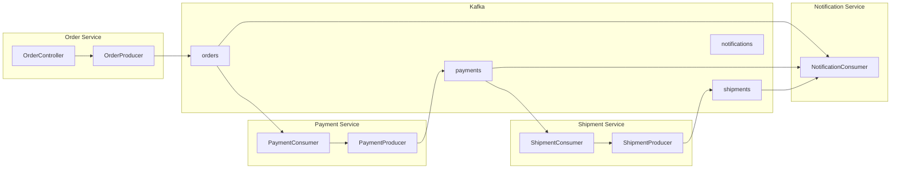

Implement event-driven communication using Kafka in a microservices environment.


- **Event Chaining**: Event propagation in order: Order -> Payment -> Shipment -> Notification
- **Correlation ID**: Propagate correlation ID for distributed tracing
- **Saga Pattern**: Handle distributed transactions with compensation transactions
- **Idempotency**: Safely handle duplicate messages


#### Target Audience and Prerequisites

| Item | Description |
|------|-------------|
| **Target Audience** | Developers building event-driven communication in microservices architecture |
| **Prerequisites** | Kafka basics, Spring Boot, understanding of [Order System](order-system/) example |
| **Required Environment** | Docker, JDK 17+, environment capable of running multiple services |
| **Estimated Time** | About 60 minutes |

#### Scenario: Order Processing System

In this example, the Order Service, Payment Service, Shipment Service, and Notification Service exchange events through Kafka. When the Order Service creates an order, it publishes an event to the orders Topic. The Payment Service receives this and processes payment, publishing results to the payments Topic. The Shipment Service receives payment completed events and creates shipments. The Notification Service subscribes to all Topics and sends notifications to customers.



*[Diagram Description: When the Order Service publishes an event to the orders Topic, the Payment Service receives it. The Payment Service publishes results to the payments Topic, and the Shipment Service receives this to publish to the shipments Topic. The Notification Service subscribes to all Topics.]*

#### Common Event Definition

**Event Schema**

All events inherit from BaseEvent. eventId is the unique event identifier, eventType is the event type, occurredAt is the time of occurrence, and correlationId is the correlation ID for distributed tracing.

```java
public abstract class BaseEvent {
    private String eventId;
    private String eventType;
    private LocalDateTime occurredAt;
    private String correlationId;  // Tracing ID
}

public class OrderCreatedEvent extends BaseEvent {
    private String orderId;
    private String customerId;
    private List<OrderItem> items;
    private BigDecimal totalAmount;
    private String shippingAddress;
}

public class PaymentCompletedEvent extends BaseEvent {
    private String paymentId;
    private String orderId;
    private BigDecimal amount;
    private PaymentMethod method;
    private PaymentStatus status;
}

public class ShipmentCreatedEvent extends BaseEvent {
    private String shipmentId;
    private String orderId;
    private String trackingNumber;
    private String carrier;
    private LocalDateTime estimatedDelivery;
}
```


- **BaseEvent Inheritance**: Common fields eventId, eventType, occurredAt, correlationId
- **correlationId**: Propagated to all events for distributed tracing
- **Domain Events**: OrderCreatedEvent, PaymentCompletedEvent, ShipmentCreatedEvent, etc.


#### Order Service

**application.yml**

The Order Service is configured with acks=all and enable.idempotence=true to increase message delivery reliability. spring.json.type.mapping defines event class mappings.

```yaml
spring:
  application:
    name: order-service
  kafka:
    bootstrap-servers: localhost:9092
    producer:
      key-serializer: org.apache.kafka.common.serialization.StringSerializer
      value-serializer: org.springframework.kafka.support.serializer.JsonSerializer
      acks: all
      properties:
        enable.idempotence: true
    properties:
      spring.json.type.mapping: >
        orderCreated:com.example.events.OrderCreatedEvent

kafka:
  topics:
    orders: orders
```

**OrderProducer**

OrderProducer publishes OrderCreatedEvent when an order is created. Using orderId as the Key ensures events for the same order are processed in order.

```java
@Service
@RequiredArgsConstructor
@Slf4j
public class OrderProducer {
    private final KafkaTemplate<String, Object> kafkaTemplate;

    @Value("${kafka.topics.orders}")
    private String ordersTopic;

    public CompletableFuture<SendResult<String, Object>> publishOrderCreated(Order order) {
        OrderCreatedEvent event = OrderCreatedEvent.builder()
            .eventId(UUID.randomUUID().toString())
            .eventType("ORDER_CREATED")
            .occurredAt(LocalDateTime.now())
            .correlationId(order.getCorrelationId())
            .orderId(order.getId())
            .customerId(order.getCustomerId())
            .items(order.getItems())
            .totalAmount(order.getTotalAmount())
            .shippingAddress(order.getShippingAddress())
            .build();

        return kafkaTemplate.send(ordersTopic, order.getId(), event)
            .whenComplete((result, ex) -> {
                if (ex != null) {
                    log.error("Order event publish failed: orderId={}", order.getId(), ex);
                } else {
                    log.info("Order event published: orderId={}, partition={}, offset={}",
                        order.getId(),
                        result.getRecordMetadata().partition(),
                        result.getRecordMetadata().offset());
                }
            });
    }
}
```

**OrderController**

OrderController receives orders via REST API, saves to local DB, publishes events asynchronously, and returns a response immediately.

```java
@RestController
@RequestMapping("/api/orders")
@RequiredArgsConstructor
public class OrderController {
    private final OrderService orderService;
    private final OrderProducer orderProducer;

    @PostMapping
    public ResponseEntity<OrderResponse> createOrder(@RequestBody CreateOrderRequest request) {
        // 1. Create order (save to local DB)
        Order order = orderService.createOrder(request);

        // 2. Publish event (async)
        orderProducer.publishOrderCreated(order);

        // 3. Return response
        return ResponseEntity.status(HttpStatus.CREATED)
            .body(OrderResponse.from(order));
    }
}
```


- **Reliability Settings**: Ensure message stability with `acks: all`, `enable.idempotence: true`
- **Async Publishing**: Save to local DB first, then publish event and return response immediately
- **orderId Key**: Guarantees order of events for the same order


#### Payment Service

**PaymentConsumer**

PaymentConsumer subscribes to the orders Topic to receive order events. It prevents duplicate processing with idempotency checks, and publishes PaymentCompletedEvent on success or PaymentFailedEvent on failure.

```java
@Service
@RequiredArgsConstructor
@Slf4j
public class PaymentConsumer {
    private final PaymentService paymentService;
    private final PaymentProducer paymentProducer;

    @KafkaListener(
        topics = "${kafka.topics.orders}",
        groupId = "payment-service-group",
        containerFactory = "kafkaListenerContainerFactory"
    )
    public void handleOrderCreated(
        @Payload OrderCreatedEvent event,
        @Header(KafkaHeaders.RECEIVED_KEY) String key,
        @Header(KafkaHeaders.RECEIVED_PARTITION) int partition,
        Acknowledgment ack
    ) {
        log.info("Order event received: orderId={}, partition={}", event.getOrderId(), partition);

        try {
            // Idempotency check
            if (paymentService.isAlreadyProcessed(event.getOrderId())) {
                log.warn("Already processed order: orderId={}", event.getOrderId());
                ack.acknowledge();
                return;
            }

            // Process payment
            Payment payment = paymentService.processPayment(
                event.getOrderId(),
                event.getCustomerId(),
                event.getTotalAmount(),
                event.getCorrelationId()
            );

            // Publish payment completed event
            paymentProducer.publishPaymentCompleted(payment, event.getCorrelationId());

            ack.acknowledge();
            log.info("Payment completed: orderId={}, paymentId={}", event.getOrderId(), payment.getId());

        } catch (PaymentFailedException e) {
            log.error("Payment failed: orderId={}", event.getOrderId(), e);
            paymentProducer.publishPaymentFailed(event.getOrderId(), e.getMessage(), event.getCorrelationId());
            ack.acknowledge();

        } catch (Exception e) {
            log.error("Payment processing error: orderId={}", event.getOrderId(), e);
            throw e;  // Retry
        }
    }
}
```

**PaymentProducer**

PaymentProducer publishes PaymentCompletedEvent or PaymentFailedEvent depending on the payment result.

```java
@Service
@RequiredArgsConstructor
@Slf4j
public class PaymentProducer {
    private final KafkaTemplate<String, Object> kafkaTemplate;

    @Value("${kafka.topics.payments}")
    private String paymentsTopic;

    public void publishPaymentCompleted(Payment payment, String correlationId) {
        PaymentCompletedEvent event = PaymentCompletedEvent.builder()
            .eventId(UUID.randomUUID().toString())
            .eventType("PAYMENT_COMPLETED")
            .occurredAt(LocalDateTime.now())
            .correlationId(correlationId)
            .paymentId(payment.getId())
            .orderId(payment.getOrderId())
            .amount(payment.getAmount())
            .method(payment.getMethod())
            .status(PaymentStatus.COMPLETED)
            .build();

        kafkaTemplate.send(paymentsTopic, payment.getOrderId(), event);
    }

    public void publishPaymentFailed(String orderId, String reason, String correlationId) {
        PaymentFailedEvent event = PaymentFailedEvent.builder()
            .eventId(UUID.randomUUID().toString())
            .eventType("PAYMENT_FAILED")
            .occurredAt(LocalDateTime.now())
            .correlationId(correlationId)
            .orderId(orderId)
            .reason(reason)
            .build();

        kafkaTemplate.send(paymentsTopic, orderId, event);
    }
}
```


- **Idempotency Check**: Prevent duplicate processing with `isAlreadyProcessed()`
- **Success/Failure Branching**: Publish PaymentCompleted or PaymentFailed event based on result
- **correlationId Propagation**: Include original event's correlationId in new event


#### Shipment Service

**ShipmentConsumer**

ShipmentConsumer subscribes to the payments Topic and processes only payment completed events. Payment failed events are ignored.

```java
@Service
@RequiredArgsConstructor
@Slf4j
public class ShipmentConsumer {
    private final ShipmentService shipmentService;
    private final ShipmentProducer shipmentProducer;

    @KafkaListener(
        topics = "${kafka.topics.payments}",
        groupId = "shipment-service-group"
    )
    public void handlePaymentCompleted(
        @Payload PaymentCompletedEvent event,
        Acknowledgment ack
    ) {
        // Only process completed payment events
        if (event.getStatus() != PaymentStatus.COMPLETED) {
            ack.acknowledge();
            return;
        }

        log.info("Payment completed event received: orderId={}", event.getOrderId());

        try {
            // Create shipment
            Shipment shipment = shipmentService.createShipment(
                event.getOrderId(),
                event.getCorrelationId()
            );

            // Publish shipment created event
            shipmentProducer.publishShipmentCreated(shipment, event.getCorrelationId());

            ack.acknowledge();
            log.info("Shipment created: orderId={}, shipmentId={}", event.getOrderId(), shipment.getId());

        } catch (Exception e) {
            log.error("Shipment creation failed: orderId={}", event.getOrderId(), e);
            throw e;
        }
    }
}
```


- **Event Filtering**: Process only when PaymentStatus.COMPLETED
- **Chaining**: Receive payment completed event -> Create shipment -> Publish shipment event
- **Error Propagation**: Throw exceptions to trigger retry


#### Notification Service

**NotificationConsumer**

The Notification Service subscribes to multiple Topics simultaneously and sends customer notifications for all events. It distinguishes event types using the eventType header.

```java
@Service
@RequiredArgsConstructor
@Slf4j
public class NotificationConsumer {
    private final NotificationService notificationService;

    @KafkaListener(
        topics = {"${kafka.topics.orders}", "${kafka.topics.payments}", "${kafka.topics.shipments}"},
        groupId = "notification-service-group"
    )
    public void handleEvent(
        @Payload String payload,
        @Header(KafkaHeaders.RECEIVED_TOPIC) String topic,
        @Header("eventType") String eventType,
        Acknowledgment ack
    ) {
        log.info("Event received: topic={}, type={}", topic, eventType);

        try {
            NotificationRequest notification = switch (eventType) {
                case "ORDER_CREATED" -> createOrderNotification(payload);
                case "PAYMENT_COMPLETED" -> createPaymentNotification(payload);
                case "PAYMENT_FAILED" -> createPaymentFailedNotification(payload);
                case "SHIPMENT_CREATED" -> createShipmentNotification(payload);
                default -> {
                    log.warn("Unknown event type: {}", eventType);
                    yield null;
                }
            };

            if (notification != null) {
                notificationService.send(notification);
            }

            ack.acknowledge();

        } catch (Exception e) {
            log.error("Notification processing failed: topic={}, type={}", topic, eventType, e);
            ack.acknowledge();  // Don't retry notification failures
        }
    }
}
```


- **Multiple Topic Subscription**: Subscribe to orders, payments, shipments Topics simultaneously
- **eventType Header**: Branch notification content by event type
- **Failure Tolerance**: Acknowledge after notification failure without retry (non-critical feature)


#### Saga Pattern: Distributed Transactions

In a microservices environment, you need to handle transactions across multiple services. The Saga pattern maintains consistency by having each service manage its own transaction and executing compensation transactions on failure.

**Compensation Transaction Implementation**

OrderSagaOrchestrator receives payment failed or shipment failed events to cancel orders and request refunds when necessary.

```java
@Service
@RequiredArgsConstructor
@Slf4j
public class OrderSagaOrchestrator {
    private final OrderRepository orderRepository;
    private final KafkaTemplate<String, Object> kafkaTemplate;

    @KafkaListener(topics = "${kafka.topics.payments}", groupId = "order-saga-group")
    public void handlePaymentEvent(@Payload String payload, @Header("eventType") String eventType) {
        if ("PAYMENT_FAILED".equals(eventType)) {
            PaymentFailedEvent event = parseEvent(payload, PaymentFailedEvent.class);
            compensateOrder(event.getOrderId(), event.getReason());
        }
    }

    @KafkaListener(topics = "${kafka.topics.shipments}", groupId = "order-saga-group")
    public void handleShipmentEvent(@Payload String payload, @Header("eventType") String eventType) {
        if ("SHIPMENT_FAILED".equals(eventType)) {
            ShipmentFailedEvent event = parseEvent(payload, ShipmentFailedEvent.class);
            compensateOrderAndPayment(event.getOrderId(), event.getReason());
        }
    }

    private void compensateOrder(String orderId, String reason) {
        log.info("Order compensation transaction: orderId={}, reason={}", orderId, reason);

        Order order = orderRepository.findById(orderId).orElseThrow();
        order.cancel(reason);
        orderRepository.save(order);

        kafkaTemplate.send("orders", orderId, OrderCancelledEvent.builder()
            .orderId(orderId)
            .reason(reason)
            .build());
    }

    private void compensateOrderAndPayment(String orderId, String reason) {
        compensateOrder(orderId, reason);

        kafkaTemplate.send("refunds", orderId, RefundRequestedEvent.builder()
            .orderId(orderId)
            .reason(reason)
            .build());
    }
}
```


- **Compensation Transaction**: Cancel previous work on failure event (order cancellation, refund request)
- **Event Listening**: Subscribe to payment failed, shipment failed events for compensation processing
- **Data Consistency**: Maintain eventual consistency in distributed environment


#### Monitoring: Distributed Tracing

**Correlation ID Propagation**

To trace requests in a distributed environment, you must propagate the Correlation ID to all events. Using ProducerInterceptor, you can automatically add tracing headers to all messages.

```java
public class TracingProducerInterceptor implements ProducerInterceptor<String, Object> {

    @Override
    public ProducerRecord<String, Object> onSend(ProducerRecord<String, Object> record) {
        String correlationId = MDC.get("correlationId");
        if (correlationId == null) {
            correlationId = UUID.randomUUID().toString();
        }

        record.headers().add("correlationId", correlationId.getBytes(StandardCharsets.UTF_8));
        record.headers().add("serviceName", "order-service".getBytes(StandardCharsets.UTF_8));
        record.headers().add("timestamp", Instant.now().toString().getBytes(StandardCharsets.UTF_8));

        return record;
    }
}
```

**Consumer Lag Monitoring**

Consumer Lag is an important metric for understanding microservice health. When Lag increases, it means Consumers are not processing messages in time.

```java
@Component
@RequiredArgsConstructor
@Slf4j
public class ConsumerLagMonitor {
    private final KafkaAdmin kafkaAdmin;
    private final MeterRegistry meterRegistry;

    @Scheduled(fixedRate = 30000)
    public void checkConsumerLag() {
        try (AdminClient adminClient = AdminClient.create(kafkaAdmin.getConfigurationProperties())) {
            ListConsumerGroupOffsetsResult offsetsResult =
                adminClient.listConsumerGroupOffsets("payment-service-group");

            Map<TopicPartition, OffsetAndMetadata> offsets =
                offsetsResult.partitionsToOffsetAndMetadata().get();

            offsets.forEach((tp, offset) -> {
                long currentOffset = offset.offset();
                long endOffset = getEndOffset(adminClient, tp);
                long lag = endOffset - currentOffset;

                meterRegistry.gauge("kafka.consumer.lag",
                    Tags.of("topic", tp.topic(), "partition", String.valueOf(tp.partition())),
                    lag);

                if (lag > 1000) {
                    log.warn("Consumer lag warning: topic={}, partition={}, lag={}",
                        tp.topic(), tp.partition(), lag);
                }
            });
        } catch (Exception e) {
            log.error("Consumer lag query failed", e);
        }
    }
}
```


- **Correlation ID**: Auto-add tracing ID to all messages with ProducerInterceptor
- **Consumer Lag**: Processing delay metric, warning when over 1000
- **Micrometer Integration**: Expose metrics to Prometheus etc. with `meterRegistry.gauge()`


#### Testing

**Integration Tests (Testcontainers)**

Using Testcontainers, you can run integration tests with a real Kafka container.

```java
@SpringBootTest
@Testcontainers
class OrderServiceIntegrationTest {

    @Container
    static KafkaContainer kafka = new KafkaContainer(
        DockerImageName.parse("confluentinc/cp-kafka:7.5.0")
    );

    @DynamicPropertySource
    static void kafkaProperties(DynamicPropertyRegistry registry) {
        registry.add("spring.kafka.bootstrap-servers", kafka::getBootstrapServers);
    }

    @Autowired
    private OrderController orderController;

    @Autowired
    private KafkaTemplate<String, Object> kafkaTemplate;

    @Test
    void order_creation_publishes_event() throws Exception {
        CreateOrderRequest request = new CreateOrderRequest(
            "customer-1",
            List.of(new OrderItem("product-1", 2, BigDecimal.valueOf(10000))),
            "123 Main St"
        );

        ResponseEntity<OrderResponse> response = orderController.createOrder(request);

        assertThat(response.getStatusCode()).isEqualTo(HttpStatus.CREATED);

        ConsumerRecords<String, String> records = consumeRecords("orders", 5000);
        assertThat(records.count()).isEqualTo(1);

        ConsumerRecord<String, String> record = records.iterator().next();
        assertThat(record.key()).isEqualTo(response.getBody().orderId());
    }
}
```


- **Testcontainers**: Integration testing with real Kafka container
- **DynamicPropertySource**: Dynamically set test bootstrap-servers
- **Message Verification**: Consume from Topic to verify Key, Value


#### Checklist

Items to verify when integrating Kafka with microservices. Include correlationId in all events for distributed tracing. Implement idempotency handling in Consumers to safely handle duplicate messages. Configure Dead Letter Topics to manage failed messages. Implement compensation transactions with the Saga pattern. Monitor Consumer Lag to detect processing delays. Configure retry policies to handle transient errors. Manage event schema versions to maintain backward compatibility.

#### Next Steps

- [Error Handling]() - DLT, retry strategies
- [Monitoring]() - Metrics collection and alerts
