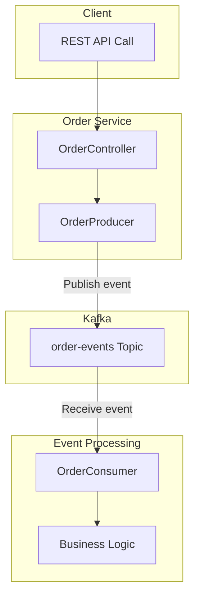
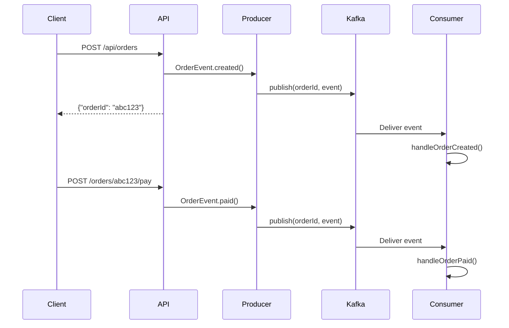
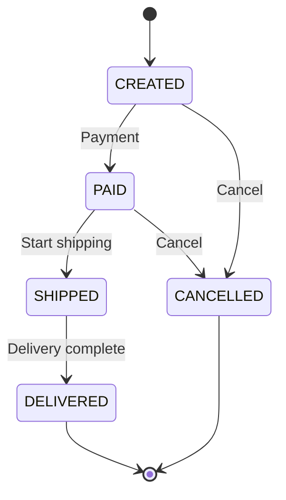
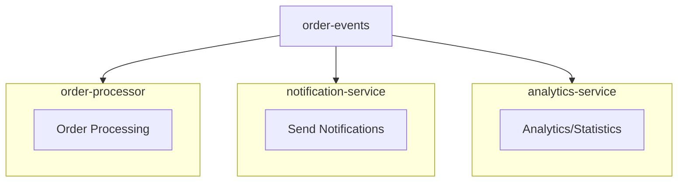

Implement an event-driven order system closer to real-world applications. In this example, we process the entire flow from order creation to delivery completion using Kafka events, and learn about order guarantee using Message Keys and extension patterns utilizing multiple Consumer Groups.


- **Event-driven Architecture**: Convert REST API requests to Kafka events for asynchronous processing
- **Message Key**: Use orderId as Key to guarantee ordering of events for the same order
- **State Machine**: State transitions in order: CREATED -> PAID -> SHIPPED -> DELIVERED
- **Extension Pattern**: Multiple Consumer Groups independently subscribe to the same Topic


#### Target Audience and Prerequisites

| Item | Description |
|------|-------------|
| **Target Audience** | Backend developers looking to build event-driven systems |
| **Prerequisites** | Spring Boot fundamentals, Kafka basic concepts, [Basic Examples](basic/) completed |
| **Required Environment** | Kafka running via Docker, JDK 17+, Gradle |
| **Estimated Time** | About 45 minutes |

All code examples on this page use the following common imports. The implementation centers around Spring Kafka's KafkaTemplate and @KafkaListener, with JSON serialization handled through Jackson ObjectMapper.

```java
import org.springframework.kafka.core.KafkaTemplate;
import org.springframework.kafka.annotation.KafkaListener;
import org.springframework.kafka.support.KafkaHeaders;
import org.apache.kafka.clients.consumer.ConsumerRecord;
import com.fasterxml.jackson.databind.ObjectMapper;
```

#### System Architecture

The order system receives client requests via REST API and converts them to Kafka events for asynchronous processing. When a client calls the REST API, OrderController receives the request and passes it to OrderProducer, which publishes events to the order-events Topic. OrderConsumer subscribes to this Topic to receive events and execute business logic.



*[Diagram Description: When a client calls the REST API, OrderController receives the request and passes it to OrderProducer. Producer publishes events to the order-events Topic, and OrderConsumer receives them to execute business logic.]*

The key to this architecture is separating synchronous HTTP requests from asynchronous event processing. Clients receive immediate responses to order creation requests, while actual order processing proceeds asynchronously through Kafka. This speeds up response times and reduces coupling between systems.

#### Event Flow

Looking at the event flow from order creation to payment, when a client sends a POST /api/orders request, the API layer creates an OrderEvent.created() event. Producer uses orderId as Key to publish the event to Kafka, and the API returns a response including the orderId to the client. Consumer then receives the event and processes it via the handleOrderCreated() method.



*[Diagram Description: When a client sends a POST /api/orders request, the API creates an event and Producer publishes it to Kafka. The API immediately returns the orderId, and Consumer processes the event asynchronously. Payment requests follow the same pattern.]*

Payment requests follow the same pattern. When a POST /orders/{orderId}/pay request comes in, an OrderEvent.paid() event is created and published to Kafka with the same orderId Key. Since the same Key is used, this event is sent to the same Partition as the order creation event, guaranteeing order.

#### Event Types

**OrderEvent**

OrderEvent is a record that represents all order-related events. orderId is the unique identifier for the order and is also used as the Kafka Message Key. customerId is the customer identifier, status is the current order status, description explains the status change, and timestamp is the event occurrence time.

```java
public record OrderEvent(
    String orderId,
    String customerId,
    OrderStatus status,
    String description,
    LocalDateTime timestamp
) {}
```

**OrderStatus**

Order status is defined as five states. CREATED is the initial state when an order is created, which can transition to PAID when payment is completed or CANCELLED when cancelled. From PAID state, it can transition to SHIPPED when shipping starts or be cancelled. When delivery completes from SHIPPED state, it becomes the final DELIVERED state. DELIVERED and CANCELLED are terminal states with no further transitions.



*[Diagram Description: Orders start in CREATED state. On payment, they transition to PAID; on cancellation, to CANCELLED. From PAID, shipping starts transition to SHIPPED, and delivery completion transitions to DELIVERED. DELIVERED and CANCELLED are terminal states.]*

This state machine forms the foundation of the event sourcing pattern. Since each state transition is recorded as a separate event, you can track the complete history of an order.


- **OrderEvent**: Contains order information including orderId, customerId, status, timestamp
- **State Transitions**: CREATED -> PAID -> SHIPPED -> DELIVERED (or CANCELLED)
- **Event Sourcing**: Each state transition recorded as event for history tracking


#### Message Key Usage

**Why use orderId as Key?**

In Kafka, when you specify a Message Key, messages with the same Key are always sent to the same Partition. The reason for using orderId as Key in the order system is to guarantee the order of events for the same order.

```java
kafkaTemplate.send(TOPIC, event.orderId(), event);
//                 topic  key           value
```

When using a Key, CREATED, PAID, and SHIPPED events for order "abc123" are all sent to the same Partition and processed in order by a single Consumer. Without a Key, each event would be distributed to multiple Partitions in round-robin fashion and could be processed by different Consumers. In this case, a PAID event could be processed before a CREATED event, causing problems with business logic.

**Event Order for Same Order**

When using the same orderId as Key, all events for that order are stored sequentially in a single Partition. The Consumer reads events from this Partition and processes them in order. For example, for order "abc123", CREATED, PAID, SHIPPED, DELIVERED are stored in order on Partition 2, and the Consumer processes them sequentially as Process 1, Process 2, Process 3, Process 4 with guaranteed ordering.


- **With Key**: Same Key always goes to same Partition -> Order guaranteed
- **Without Key**: Distributed round-robin -> Order not guaranteed
- **Order System**: Use orderId as Key to guarantee order of events for the same order


#### Producer Implementation

OrderProducer is responsible for publishing order events to Kafka. In the publish method, it specifies event.orderId() as Key so that events for the same order are sent to the same Partition. The whenComplete callback verifies publishing success and logs results. On success, it outputs Partition and Offset information; on failure, it logs an error.

```java
@Component
public class OrderProducer {

    private static final String TOPIC = "order-events";
    private final KafkaTemplate<String, OrderEvent> kafkaTemplate;

    public void publish(OrderEvent event) {
        // Use orderId as Key for ordering
        kafkaTemplate.send(TOPIC, event.orderId(), event)
                .whenComplete((result, ex) -> {
                    if (ex == null) {
                        log.info("Publish success - Partition: {}, Offset: {}",
                                result.getRecordMetadata().partition(),
                                result.getRecordMetadata().offset());
                    } else {
                        log.error("Publish failed", ex);
                    }
                });
    }
}
```

In production, you should implement retry logic or compensation transactions on publish failure. This example simply logs, but in a production environment, you should record failed events to a separate store or send notifications.


- **Key Setting**: Use orderId as Key with `kafkaTemplate.send(TOPIC, event.orderId(), event)`
- **Async Processing**: Handle publish results with `whenComplete()` callback
- **Failure Handling**: In production, implement retry or record to separate store


#### Consumer Implementation

OrderConsumer subscribes to the order-events Topic to receive and process events. The @KafkaListener annotation specifies the Topic and Consumer Group, and ConsumerRecord receives both Key (orderId) and Value (OrderEvent) together. A switch expression calls the appropriate handler method based on the event status.

```java
@Component
public class OrderConsumer {

    @KafkaListener(topics = "order-events", groupId = "order-processor")
    public void consume(ConsumerRecord<String, OrderEvent> record) {
        OrderEvent event = record.value();

        // Same order events arrive in order via Key(orderId)
        log.info("Received - OrderId: {}, Status: {}",
                record.key(), event.status());

        switch (event.status()) {
            case CREATED -> handleOrderCreated(event);
            case PAID -> handleOrderPaid(event);
            case SHIPPED -> handleOrderShipped(event);
            case DELIVERED -> handleOrderDelivered(event);
            case CANCELLED -> handleOrderCancelled(event);
        }
    }
}
```

Each handler method performs business logic appropriate for that status. handleOrderCreated handles inventory check and payment waiting, handleOrderPaid starts shipping preparation, handleOrderShipped initiates delivery tracking, handleOrderDelivered completes the order, and handleOrderCancelled handles inventory restoration and refund processing.


- **Topic/Group Specification**: Configure subscription with `@KafkaListener(topics, groupId)`
- **ConsumerRecord**: Receive Key and Value together to verify orderId
- **Status-based Processing**: Branch to handlers by status using switch expression


#### Running the Example

**1. Start Kafka**

First, start Kafka using Docker Compose from the docker directory. A single Broker configured in KRaft mode will run.

```bash
cd docker
docker-compose up -d
```

**2. Run Application**

Run the Spring Boot application from the example project directory. Gradle Wrapper handles dependency download, build, and execution in one step.

```bash
cd examples/order-system
./gradlew bootRun
```

**3. Create Order**

In a new terminal, call the order creation API using curl. Sending a JSON request with customerId generates and returns a new orderId.

```bash
curl -X POST http://localhost:8080/api/orders \
  -H "Content-Type: application/json" \
  -d '{"customerId": "customer-123"}'
```

A response with the created order ID and confirmation message is returned.

```json
{"orderId": "abc12345", "message": "Order has been created"}
```

**4. Process Order**

Using the generated order ID, proceed with payment, shipping start, and delivery completion sequentially. Each API call publishes a new event to Kafka and the Consumer processes it.

```bash
# Payment
curl -X POST "http://localhost:8080/api/orders/abc12345/pay?customerId=customer-123"

# Ship
curl -X POST "http://localhost:8080/api/orders/abc12345/ship?customerId=customer-123"

# Deliver
curl -X POST "http://localhost:8080/api/orders/abc12345/deliver?customerId=customer-123"
```

**5. Check Logs**

In the terminal where the Spring Boot application is running, you can see logs of the Consumer receiving and processing events. Each event's Partition, Offset, Key, Status information and processing results are output.

```
========================================
Event Received
  Partition: 0, Offset: 0
  Key (OrderId): abc12345
  Status: CREATED
========================================
[Processing] Order created - Checking inventory and awaiting payment

========================================
Event Received
  Partition: 0, Offset: 1
  Key (OrderId): abc12345
  Status: PAID
========================================
[Processing] Payment complete - Starting shipping preparation
```

Because the same orderId was used as Key, you can confirm that all events are stored and processed sequentially on the same Partition 0.

#### Extension Points

**Multiple Consumer Groups**

Multiple Consumer Groups can independently subscribe to a single Topic. The order-events Topic is subscribed to by the order-processor group for order processing, the notification-service group for notification delivery, and the analytics-service group for analysis and statistics. Each group independently receives the same events and performs its own business logic.



*[Diagram Description: Three Consumer Groups independently subscribe to the order-events Topic. order-processor handles order processing, notification-service handles notification delivery, and analytics-service handles analysis/statistics.]*

Using this pattern, when adding new features, you only need to add a new Consumer Group without modifying existing systems. For example, to add a recommendation system using order events, simply create a recommendation-service group to subscribe to the same Topic.

**Adding Error Handling**

In production, use the @RetryableTopic annotation to implement retry and Dead Letter Topic processing. The attempts attribute specifies the maximum retry count, and when all retries fail, the message is automatically moved to the DLT.

```java
@RetryableTopic(attempts = "3")
@KafkaListener(topics = "order-events")
public void consume(OrderEvent event) {
    // After 3 retry failures, moves to DLT
}
```


- **Multiple Consumer Groups**: Multiple services independently subscribe to the same Topic
- **Loose Coupling**: No need to modify existing systems when adding new features
- **@RetryableTopic**: Automatic DLT movement on retry failure


#### Summary

In this example, we used KafkaTemplate with JSON Serializer for event publishing, and @KafkaListener with JSON Deserializer for event consumption. For order guarantee, we utilized orderId as Message Key, and implemented state transitions with an event-based state machine. These patterns are fundamental when building event-driven systems in production.

#### Full Source Code

The complete source code for this example is available at the link below. Check out the full implementation of Producer, Consumer, Controller, and domain objects.

- [**`examples/order-system`**](https://github.com/advanced-beginner/advanced-beginner.github.io/tree/main/examples/order-system)

#### Next Steps

- [Appendix](../appendix/) - Glossary and references
