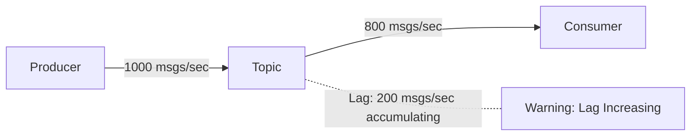

A step-by-step guide to diagnosing and resolving Consumer Lag issues.


- **Consumer Lag**: Number of unread messages (Producer rate > Consumer processing rate)
- **Diagnosis**: Check Lag with `kafka-consumer-groups.sh`, analyze trends with monitoring tools
- **Resolution**: Increase Consumer count, optimize processing logic, adjust Partition count, tune batch settings


## What is Consumer Lag?

Consumer Lag is the number of messages that the Consumer has not yet read from those published by the Producer. If Lag continuously increases, message processing delays occur, and in the worst case, messages may be deleted after exceeding the retention period.



*Diagram: If the Producer publishes 1000 messages per second but the Consumer only processes 800, Lag accumulates at 200 messages per second.*

---

## Step 1: Check Current Lag Status

### 1.1 Using kafka-consumer-groups.sh

Check the current Lag of your Consumer Group using the Kafka CLI tool:

```bash
kafka-consumer-groups.sh --bootstrap-server localhost:9092 \
  --describe --group order-service-group
```

**Expected output:**
```
GROUP              TOPIC           PARTITION  CURRENT-OFFSET  LOG-END-OFFSET  LAG
order-service-group orders         0          1000            1500            500
order-service-group orders         1          950             1480            530
order-service-group orders         2          980             1490            510
```

| Column | Description |
|--------|-------------|
| `CURRENT-OFFSET` | Last position read by the Consumer |
| `LOG-END-OFFSET` | Last message position written to the Partition |
| `LAG` | Number of unread messages (LOG-END-OFFSET - CURRENT-OFFSET) |

### 1.2 Assessing Lag Severity

| Lag Status | Criteria | Action |
|------------|----------|--------|
| Normal | Lag < 100, temporary | Continue monitoring |
| Caution | Lag 100-1000, persistent | Begin root cause analysis |
| Warning | Lag > 1000, increasing trend | Immediate action required |
| Critical | Lag spiking, unable to process | Emergency response |


Don't judge by the Lag number alone. **The trend** is more important. If Lag is 1000 but decreasing, it's fine. But if Lag is 100 and continuously increasing, that's a problem.


### 1.3 Checking Lag in Spring Boot

You can check Lag within your application using `AdminClient` from the `kafka-clients` library:

```java
@Service
@RequiredArgsConstructor
public class LagMonitorService {

    private final AdminClient adminClient;

    public Map<TopicPartition, Long> getConsumerLag(String groupId) {
        Map<TopicPartition, Long> lagMap = new HashMap<>();

        try {
            // Get current offsets for Consumer Group
            Map<TopicPartition, OffsetAndMetadata> offsets =
                adminClient.listConsumerGroupOffsets(groupId)
                    .partitionsToOffsetAndMetadata()
                    .get();

            // Get end offsets for Topics
            Map<TopicPartition, ListOffsetsResult.ListOffsetsResultInfo> endOffsets =
                adminClient.listOffsets(offsets.keySet().stream()
                    .collect(Collectors.toMap(tp -> tp, tp -> OffsetSpec.latest())))
                    .all()
                    .get();

            // Calculate Lag
            offsets.forEach((tp, offsetMeta) -> {
                long endOffset = endOffsets.get(tp).offset();
                long currentOffset = offsetMeta.offset();
                lagMap.put(tp, endOffset - currentOffset);
            });

        } catch (Exception e) {
            log.error("Failed to retrieve Lag", e);
        }

        return lagMap;
    }
}
```

---

## Step 2: Diagnose the Cause

Lag can be categorized into four main causes. Systematically check each one.

### 2.1 Insufficient Consumer Processing Speed

**Symptoms:**
- Lag increases uniformly across all Partitions
- Consumer CPU usage is high

**Diagnostic command:**
```bash
# Check Consumer process CPU (Linux)
top -p $(pgrep -f "your-consumer-app")
```

**Check points:**
- Is there a bottleneck in business logic?
- Are external API calls slow?
- Are database queries slow?

### 2.2 Insufficient Consumer Count

**Symptoms:**
- Consumer count is less than Partition count
- Only some Consumers are overloaded

**Diagnosis:**
```bash
# Check Consumer Group members
kafka-consumer-groups.sh --bootstrap-server localhost:9092 \
  --describe --group order-service-group --members

# Example output
GROUP              CONSUMER-ID                          HOST          CLIENT-ID  #PARTITIONS
order-service-group consumer-1-abc123                  /192.168.1.10 consumer-1 3
order-service-group consumer-2-def456                  /192.168.1.11 consumer-2 3
```


Consumer count = Partition count is most efficient. Having more Consumers than Partitions results in idle Consumers.


### 2.3 Partition Imbalance

**Symptoms:**
- Lag concentrated on specific Partitions
- Uneven key distribution

**Diagnosis:**
```bash
# Check message count per Partition
kafka-run-class.sh kafka.tools.GetOffsetShell \
  --broker-list localhost:9092 \
  --topic orders \
  --time -1
```

**Cause:** If messages are concentrated on a specific key, load occurs only on the Partition to which that key is assigned.

### 2.4 Frequent Rebalancing

**Symptoms:**
- Consumer Lag spikes periodically then decreases
- Many Rebalancing messages in Consumer logs

**Diagnosis:**
Check for Rebalancing-related messages in Consumer logs:
```
INFO  o.a.k.c.c.i.ConsumerCoordinator : [Consumer clientId=consumer-1] Revoke partitions
INFO  o.a.k.c.c.i.ConsumerCoordinator : [Consumer clientId=consumer-1] Assigned partitions
```

**Causes:**
- Exceeding `session.timeout.ms` (Consumer fails to send heartbeat)
- Exceeding `max.poll.interval.ms` (poll() call interval too long)

---

## Step 3: Apply Solutions

### 3.1 Increase Consumer Count (Fastest Solution)

Increase the number of Consumer threads in Spring Boot:

```java
@KafkaListener(
    topics = "orders",
    groupId = "order-service-group",
    concurrency = "6"  // Increased from 3 to 6
)
public void consume(String message) {
    processMessage(message);
}
```

Or deploy additional application instances:
```bash
# Increase replicas in Kubernetes
kubectl scale deployment order-consumer --replicas=6
```


Increasing Consumer count beyond the Partition count has no effect. If you need more Consumers than Partitions, increase Partitions first.


### 3.2 Optimize Processing Logic

**Apply asynchronous processing:**
```java
@KafkaListener(topics = "orders")
public void consume(String message) {
    // Synchronous processing (slow)
    // processMessage(message);

    // Asynchronous processing (fast)
    CompletableFuture.runAsync(() -> processMessage(message), executor);
    ack.acknowledge();
}
```

**Apply batch processing:**
```java
@KafkaListener(topics = "orders", batch = "true")
public void consumeBatch(List<String> messages) {
    // Batch processing instead of individual processing
    batchProcessor.processAll(messages);
}
```

### 3.3 Tune Consumer Settings

Optimize `application.yml` settings:

```yaml
spring:
  kafka:
    consumer:
      # Increase max records fetched at once
      max-poll-records: 500  # Default: 500

      # Increase poll interval limit (for long-running processing)
      properties:
        max.poll.interval.ms: 300000  # 5 minutes

        # Increase fetch data size
        fetch.min.bytes: 1048576  # 1MB
        fetch.max.wait.ms: 500

        # Adjust session timeout (prevent Rebalancing)
        session.timeout.ms: 30000
        heartbeat.interval.ms: 10000
```

| Setting | Default | Recommended | Description |
|---------|---------|-------------|-------------|
| `max.poll.records` | 500 | 500-1000 | Improve throughput with larger batches |
| `fetch.min.bytes` | 1 | 1MB | Reduce frequency of small requests |
| `max.poll.interval.ms` | 5 min | Processing time + buffer | Prevent Rebalancing |

### 3.4 Increase Partition Count

If Partition count is insufficient, parallel processing is limited:

```bash
# Check current Partition count
kafka-topics.sh --bootstrap-server localhost:9092 \
  --describe --topic orders

# Increase Partition count (6 to 12)
kafka-topics.sh --bootstrap-server localhost:9092 \
  --alter --topic orders \
  --partitions 12
```


Increasing Partition count changes existing key-based routing. Make this decision carefully if message ordering is important.


---

## Step 4: Set Up Monitoring

### 4.1 Prometheus + Grafana Setup

Use Spring Boot Actuator and Micrometer to collect Lag metrics:

```yaml
# application.yml
management:
  endpoints:
    web:
      exposure:
        include: prometheus, health
  metrics:
    tags:
      application: order-consumer
```

```groovy
// build.gradle.kts
dependencies {
    implementation("org.springframework.boot:spring-boot-starter-actuator")
    implementation("io.micrometer:micrometer-registry-prometheus")
}
```

### 4.2 Alert Configuration

Set up Prometheus AlertManager or Grafana Alert:

```yaml
# Prometheus alert rule example
groups:
  - name: kafka-consumer-alerts
    rules:
      - alert: HighConsumerLag
        expr: kafka_consumer_lag > 1000
        for: 5m
        labels:
          severity: warning
        annotations:
          summary: "Consumer Lag exceeds 1000"
          description: "Lag for {{ $labels.group }} group's {{ $labels.topic }}: {{ $value }}"
```

---

## Checklist

Follow this order when troubleshooting Lag issues:

- [ ] **1. Check Lag status**: `kafka-consumer-groups.sh --describe`
- [ ] **2. Analyze trends**: Check if Lag is increasing or stable
- [ ] **3. Check Consumer status**: Member count, CPU usage
- [ ] **4. Diagnose cause**: Processing speed, Consumer count, Partition balance, Rebalancing
- [ ] **5. Apply solution**: Increase Consumers, optimize logic, tune settings
- [ ] **6. Set up monitoring**: Continuous Lag tracking

---

## Related Documentation

- [Advanced Consumer Settings](../concepts/consumer-tuning/) - Detailed Consumer tuning guide
- [Core Components](../concepts/core-components/) - Understanding Consumer Groups and Partitions
- [Producer Performance Tuning](producer-performance-tuning/) - Producer-side optimization
