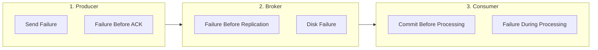
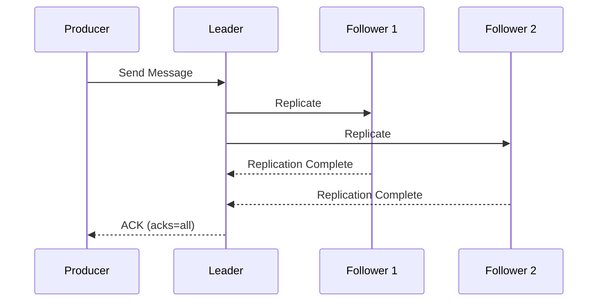
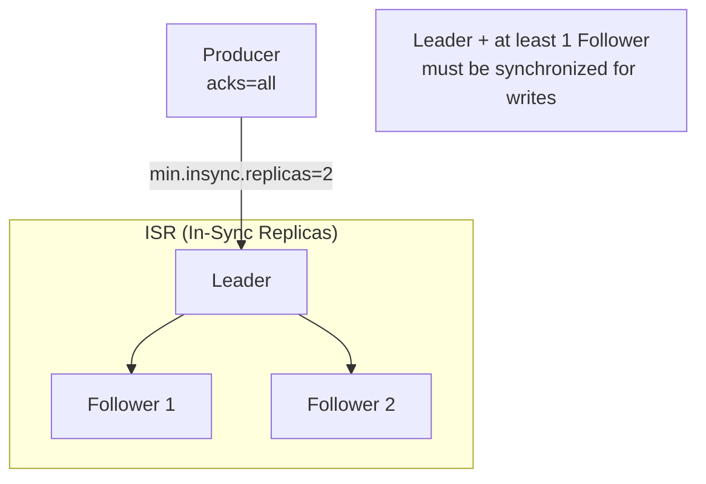
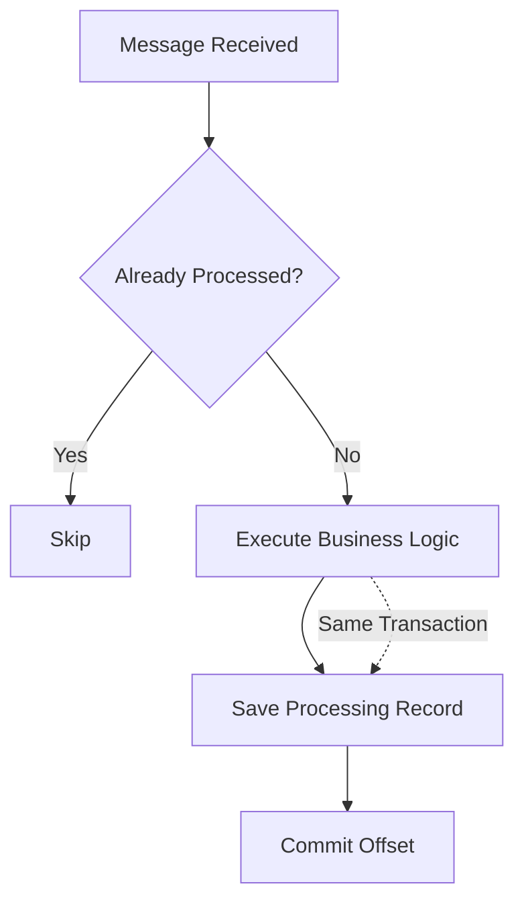

A step-by-step guide on how to prevent message loss and ensure reliable messaging in Kafka.

**Time Required**: Approximately 30 minutes (for configuration application)


- **Producer side**: `acks=all`, `enable.idempotence=true`, proper retry settings
- **Broker side**: `min.insync.replicas=2`, `unclean.leader.election.enable=false`
- **Consumer side**: Manual commit, commit after processing, retry mechanism
- **End-to-End**: Message trace ID, monitoring and alerting setup


---

## Before You Begin

You need the following environment to follow this guide.

### Prerequisites

| Item | Minimum Version | Verification Command |
|------|----------------|---------------------|
| Apache Kafka | 2.8+ | `kafka-topics.sh --version` |
| Java | 17+ | `java -version` |
| Spring Boot | 3.0+ | `./gradlew dependencies \| grep spring-boot` |
| Spring Kafka | 3.0+ | `./gradlew dependencies \| grep spring-kafka` |

### Environment Verification

Verify that you can access the Kafka cluster:

```bash
# Test Kafka connection
kafka-broker-api-versions.sh --bootstrap-server localhost:9092
```

**Expected output on success:**
```
localhost:9092 (id: 0 rack: null) -> (
  ...API versions...
)
```

### What This Guide Does NOT Cover

- Kafka Streams transactions (see separate documentation)
- Schema Registry configuration
- Multi-cluster replication (MirrorMaker)

---

## Where Message Loss Occurs

Message loss can occur at three points in the Kafka pipeline:



*Diagram: Message loss can occur at each stage - Producer, Broker, and Consumer.*

| Stage | Cause of Loss | Solution |
|-------|--------------|----------|
| Producer | Network error, ACK not received | `acks=all`, retry settings |
| Broker | Leader failure, replication delay | ISR settings, replication factor |
| Consumer | Commit before processing, failure | Manual commit, retry logic |

---

## Step 1: Strengthen Producer Settings

### 1.1 Configure acks=all

Set the producer to require all ISR (In-Sync Replicas) to receive the message before returning ACK:

```yaml
spring:
  kafka:
    producer:
      acks: all  # All ISR must confirm message receipt
```



*Diagram: acks=all returns ACK only after all ISR have replicated the message.*

### 1.2 Enable Idempotent Producer

Prevent duplicates from network retries while safely retransmitting:

```yaml
spring:
  kafka:
    producer:
      properties:
        enable.idempotence: true
        max.in.flight.requests.per.connection: 5  # Max 5 when using idempotence
```

**What Idempotent Producer guarantees:**
- Message ordering within the same partition
- Automatic duplicate message removal
- Exactly-Once semantics even with retries

### 1.3 Optimize Retry Settings

Add retry settings to handle transient errors:

```yaml
spring:
  kafka:
    producer:
      retries: 2147483647          # Infinite retries (up to delivery.timeout.ms)
      properties:
        retry.backoff.ms: 100      # Retry interval
        delivery.timeout.ms: 120000 # Total send timeout (2 minutes)
        request.timeout.ms: 30000   # Single request timeout
```


`delivery.timeout.ms` must be >= `linger.ms` + `request.timeout.ms`.
Retries are only performed within `delivery.timeout.ms`.


### 1.4 Handle Send Failures

Implement appropriate fallback logic for send failures:

```java
@Component
@RequiredArgsConstructor
@Slf4j
public class ReliableProducer {

    private final KafkaTemplate<String, String> kafkaTemplate;
    private final FailedMessageRepository failedMessageRepository;

    public void send(String topic, String key, String message) {
        kafkaTemplate.send(topic, key, message)
            .whenComplete((result, ex) -> {
                if (ex != null) {
                    handleSendFailure(topic, key, message, ex);
                } else {
                    log.debug("Send success: topic={}, partition={}, offset={}",
                        topic,
                        result.getRecordMetadata().partition(),
                        result.getRecordMetadata().offset());
                }
            });
    }

    private void handleSendFailure(String topic, String key, String message, Throwable ex) {
        log.error("Send failed: topic={}, key={}", topic, key, ex);

        // Save failed message to DB (for later reprocessing)
        FailedMessage failedMessage = FailedMessage.builder()
            .topic(topic)
            .messageKey(key)
            .payload(message)
            .errorMessage(ex.getMessage())
            .createdAt(Instant.now())
            .build();

        failedMessageRepository.save(failedMessage);

        // Send alert (optional)
        alertService.sendAlert("Kafka send failed: " + topic);
    }
}
```

---

## Step 2: Strengthen Broker Settings

### 2.1 Configure Replication Factor

Set sufficient replication factor when creating topics:

```bash
kafka-topics.sh --bootstrap-server localhost:9092 \
  --create --topic orders \
  --partitions 6 \
  --replication-factor 3
```

| Replication Factor | Tolerable Failures | Recommended Environment |
|-------------------|-------------------|------------------------|
| 1 | 0 (no failures allowed) | Development |
| 2 | 1 Broker failure | Testing |
| 3 | 2 Broker failures | **Production recommended** |

### 2.2 Configure min.insync.replicas

Require at least N replicas to be synchronized before allowing writes:

```bash
# Topic-level setting
kafka-configs.sh --bootstrap-server localhost:9092 \
  --entity-type topics --entity-name orders \
  --alter --add-config min.insync.replicas=2
```

Or set globally in `server.properties`:

```properties
# Broker global setting
min.insync.replicas=2
```



*Diagram: min.insync.replicas=2 requires at least 2 replicas to be synchronized before accepting messages.*


If `min.insync.replicas` > `replication.factor`, writes will be impossible.
Recommended: `replication.factor=3`, `min.insync.replicas=2`


### 2.3 Disable Unclean Leader Election

Prevent data loss from unsynchronized replicas becoming Leader:

```properties
# server.properties
unclean.leader.election.enable=false  # Default: false (Kafka 0.11+)
```

| Setting | Behavior | Impact |
|---------|----------|--------|
| `true` | Unsynchronized Follower can become Leader | Data loss possible, availability first |
| `false` | Only ISR Follower can become Leader | **Data safe, recommended** |

---

## Step 3: Strengthen Consumer Settings

### 3.1 Use Manual Commit

Use manual commit instead of auto-commit to commit offset only after processing:

```yaml
spring:
  kafka:
    consumer:
      enable-auto-commit: false  # Disable auto commit
    listener:
      ack-mode: manual          # Manual ACK mode
```

```java
@KafkaListener(topics = "orders", groupId = "order-processor-group")
public void consume(ConsumerRecord<String, String> record, Acknowledgment ack) {
    try {
        // 1. Process message
        processOrder(record.value());

        // 2. Commit only after successful processing
        ack.acknowledge();

    } catch (Exception e) {
        log.error("Processing failed: key={}", record.key(), e);
        // Don't commit → will be reprocessed
    }
}
```

### 3.2 Implement Retry Logic for Processing Failures

Use Spring Kafka's `DefaultErrorHandler` to implement retries:

```java
@Configuration
public class KafkaConsumerConfig {

    @Bean
    public DefaultErrorHandler errorHandler(DeadLetterPublishingRecoverer recoverer) {
        // Max 3 retries, 1 second interval
        BackOff backOff = new FixedBackOff(1000L, 3);

        DefaultErrorHandler errorHandler = new DefaultErrorHandler(recoverer, backOff);

        // Specify non-retryable exceptions
        errorHandler.addNotRetryableExceptions(
            IllegalArgumentException.class,
            JsonParseException.class
        );

        return errorHandler;
    }

    @Bean
    public DeadLetterPublishingRecoverer recoverer(KafkaTemplate<String, String> template) {
        // Send to DLT (Dead Letter Topic) on retry failure
        return new DeadLetterPublishingRecoverer(template,
            (record, ex) -> new TopicPartition(record.topic() + ".DLT", record.partition())
        );
    }
}
```

### 3.3 Exactly-Once Processing Pattern

Implement Exactly-Once by wrapping business logic and commit in a transaction:

```java
@Service
@RequiredArgsConstructor
@Slf4j
public class IdempotentOrderProcessor {

    private final OrderRepository orderRepository;
    private final ProcessedMessageRepository processedMessageRepository;

    @Transactional
    public void process(String messageId, OrderEvent event) {
        // 1. Check if message already processed (idempotency check)
        if (processedMessageRepository.existsById(messageId)) {
            log.info("Message already processed, skipping: messageId={}", messageId);
            return;
        }

        // 2. Execute business logic
        Order order = Order.from(event);
        orderRepository.save(order);

        // 3. Record processing completion (same transaction)
        processedMessageRepository.save(new ProcessedMessage(messageId, Instant.now()));

        log.info("Order processing complete: orderId={}", order.getId());
    }
}
```



*Diagram: Idempotency pattern safely handles duplicate messages.*

---

## Step 4: End-to-End Tracking Setup

### 4.1 Use Message Trace ID

Assign unique IDs to messages to track the entire pipeline:

```java
// Producer
public void sendWithTraceId(String orderId, OrderEvent event) {
    String traceId = UUID.randomUUID().toString();

    ProducerRecord<String, String> record = new ProducerRecord<>("orders", orderId, toJson(event));
    record.headers().add("X-Trace-Id", traceId.getBytes(StandardCharsets.UTF_8));
    record.headers().add("X-Timestamp", String.valueOf(System.currentTimeMillis()).getBytes());

    kafkaTemplate.send(record);
    log.info("Message sent: traceId={}, orderId={}", traceId, orderId);
}

// Consumer
@KafkaListener(topics = "orders")
public void consume(ConsumerRecord<String, String> record, Acknowledgment ack) {
    String traceId = new String(record.headers().lastHeader("X-Trace-Id").value());
    log.info("Message received: traceId={}", traceId);

    MDC.put("traceId", traceId);
    try {
        process(record.value());
        ack.acknowledge();
        log.info("Message processing complete: traceId={}", traceId);
    } finally {
        MDC.remove("traceId");
    }
}
```

### 4.2 Configure Monitoring Alerts

Set up alerts to detect signs of message loss:

```yaml
# Prometheus Alert Rules
groups:
  - name: kafka-data-loss-alerts
    rules:
      # Producer send failure rate
      - alert: HighProducerErrorRate
        expr: rate(kafka_producer_record_error_total[5m]) > 0.01
        for: 5m
        labels:
          severity: critical
        annotations:
          summary: "Producer send failure rate exceeded 1%"

      # Insufficient ISR
      - alert: InsufficientISR
        expr: kafka_topic_partition_under_replicated > 0
        for: 5m
        labels:
          severity: warning
        annotations:
          summary: "Partitions with insufficient replication detected"

      # Consumer Lag spike
      - alert: ConsumerLagSpike
        expr: delta(kafka_consumer_lag[5m]) > 10000
        for: 5m
        labels:
          severity: warning
        annotations:
          summary: "Consumer Lag is spiking"
```

---

## Common Errors

### NotEnoughReplicasException

**Error message:**
```
org.apache.kafka.common.errors.NotEnoughReplicasException:
Messages are rejected since there are fewer in-sync replicas than required.
```

**Cause:** Fewer synchronized replicas than `min.insync.replicas` setting

**Solution:**
1. Check Broker status:
   ```bash
   kafka-metadata.sh --snapshot /var/kafka-logs/__cluster_metadata-0/00000000000000000000.log --command "broker"
   ```
2. Check ISR status:
   ```bash
   kafka-topics.sh --bootstrap-server localhost:9092 --describe --topic orders
   ```
3. Recover problematic Broker or temporarily lower `min.insync.replicas` (not recommended)

### TimeoutException (Producer)

**Error message:**
```
org.apache.kafka.common.errors.TimeoutException:
Expiring 1 record(s) for orders-0:120000 ms has passed since batch creation
```

**Cause:** Failed to complete send within `delivery.timeout.ms`

**Solution:**
1. Check network connection
2. Check Broker load
3. Increase `delivery.timeout.ms` (temporary measure)
4. Reduce `batch.size` to decrease batch size

### CommitFailedException (Consumer)

**Error message:**
```
org.apache.kafka.clients.consumer.CommitFailedException:
Commit cannot be completed since the group has already rebalanced
```

**Cause:** Processing time exceeded `max.poll.interval.ms`, triggering rebalancing

**Solution:**
```yaml
spring:
  kafka:
    consumer:
      properties:
        max.poll.interval.ms: 600000  # Increase to 10 minutes
        max.poll.records: 100         # Reduce records fetched at once
```

### RecordTooLargeException

**Error message:**
```
org.apache.kafka.common.errors.RecordTooLargeException:
The message is 1048577 bytes when serialized which is larger than 1048576
```

**Cause:** Message size exceeds `max.request.size` (default 1MB)

**Solution:**
```yaml
spring:
  kafka:
    producer:
      properties:
        max.request.size: 5242880  # Increase to 5MB
```

Broker-side configuration also required:
```properties
# server.properties
message.max.bytes=5242880
```

---

## Checklist

Verify your message loss prevention settings:

### Producer
- [ ] `acks=all` configured
- [ ] `enable.idempotence=true` configured
- [ ] Appropriate `retries` and `delivery.timeout.ms` configured
- [ ] Fallback logic implemented for send failures

### Broker
- [ ] `replication.factor=3` (production)
- [ ] `min.insync.replicas=2` configured
- [ ] `unclean.leader.election.enable=false` confirmed

### Consumer
- [ ] `enable-auto-commit=false` configured
- [ ] Manual commit (commit after processing) implemented
- [ ] Retry and DLT configured
- [ ] Idempotent processing implemented

### Monitoring
- [ ] Send failure rate alert configured
- [ ] ISR shortage alert configured
- [ ] Consumer Lag alert configured

---

## Configuration Summary

| Category | Setting | Recommended Value | Purpose |
|----------|---------|-------------------|---------|
| **Producer** | `acks` | `all` | Confirm all replicas |
| | `enable.idempotence` | `true` | Prevent duplicates |
| | `retries` | Infinite | Handle transient errors |
| **Broker** | `replication.factor` | `3` | Ensure replication headroom |
| | `min.insync.replicas` | `2` | Guarantee minimum replication |
| | `unclean.leader.election` | `false` | Protect data |
| **Consumer** | `enable-auto-commit` | `false` | Commit after processing |
| | `ack-mode` | `manual` | Explicit ACK |

---

## Related Documentation

- [Producer Performance Tuning]() - Balancing reliability and performance
- [Consumer Lag Troubleshooting]() - Consumer-side problem solving
- [Transactions]() - Exactly-Once semantics details
- [Error Handling Patterns]() - Production error handling strategies
