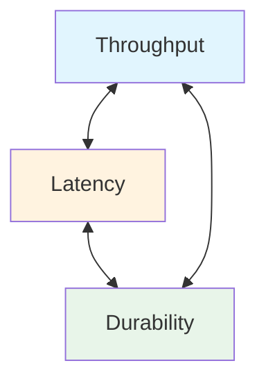
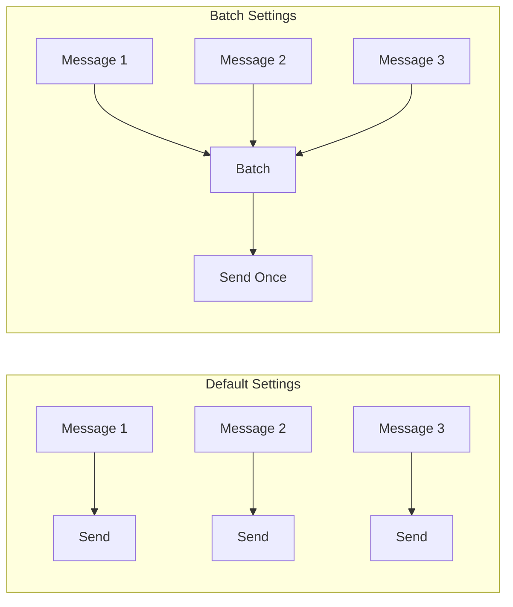
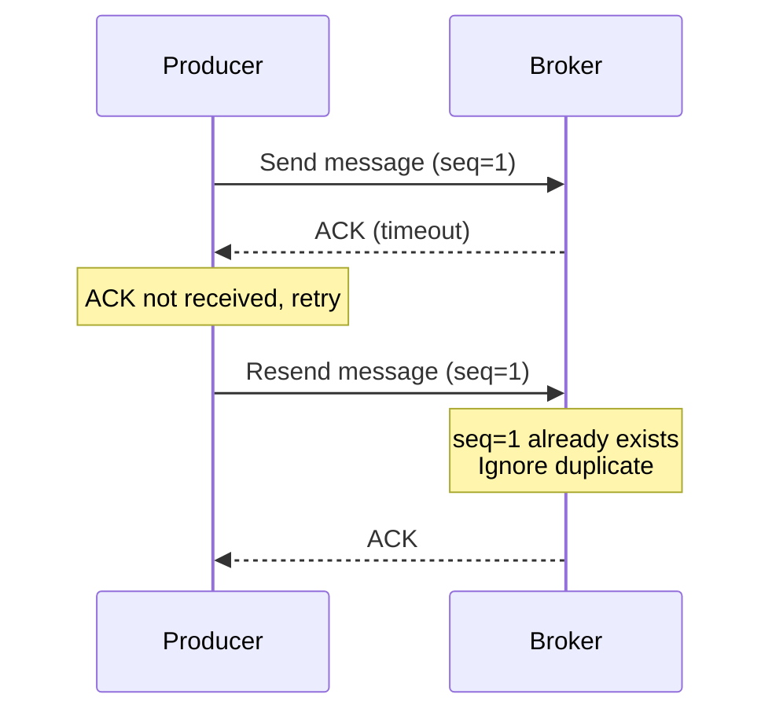

A step-by-step guide to increasing Producer throughput and reducing latency.


- **Throughput priority**: Increase `batch.size`, set `linger.ms`, enable compression
- **Latency priority**: `linger.ms=0`, `acks=1`, small batch size
- **Durability priority**: `acks=all`, `enable.idempotence=true`, retry settings
- **Trade-offs**: Throughput, latency, and durability are competing concerns


## Three Axes of Performance Optimization

Producer performance optimization is about balancing three factors:



*This diagram shows the three axes of Producer performance optimization — throughput, latency, and durability — and their trade-off relationships.*

| Factor | Description | Optimization Direction |
|--------|-------------|------------------------|
| **Throughput** | Messages sent per second | Increase batch size, enable compression |
| **Latency** | Time from send to acknowledgment | Reduce batch wait time |
| **Durability** | Message loss prevention | acks=all, wait for replication |

---

## Step 1: Measure Current Performance

Measure current performance before optimizing. Without a baseline, you cannot know the improvement effect.

### 1.1 Using kafka-producer-perf-test.sh

Measure baseline performance using Kafka's built-in performance test tool:

```bash
kafka-producer-perf-test.sh \
  --topic perf-test \
  --num-records 100000 \
  --record-size 1024 \
  --throughput -1 \
  --producer-props bootstrap.servers=localhost:9092
```

**Expected output:**
```
100000 records sent, 45678.9 records/sec (44.61 MB/sec), 12.34 ms avg latency, 89.12 ms max latency
```

| Metric | Description | Good Baseline (Reference) |
|--------|-------------|---------------------------|
| `records/sec` | Records sent per second | Depends on requirements |
| `MB/sec` | Data volume sent per second | 10MB/sec or higher |
| `avg latency` | Average latency | 50ms or less |
| `max latency` | Maximum latency | 200ms or less |

### 1.2 Checking Spring Boot Metrics

Check Producer metrics using Spring Boot Actuator:

```bash
curl http://localhost:8080/actuator/metrics/kafka.producer.record.send.total
```

**Key metrics:**
- `kafka.producer.record.send.total` - Total records sent
- `kafka.producer.record.error.total` - Failed record count
- `kafka.producer.request.latency.avg` - Average request latency

---

## Step 2: Optimize Throughput

### 2.1 Increase Batch Size

Producers don't send messages immediately but batch them together. Increasing batch size improves network efficiency.

```yaml
spring:
  kafka:
    producer:
      properties:
        # Batch size (default: 16KB, recommended: 64KB-128KB)
        batch.size: 65536

        # Time to wait for batch to fill (default: 0ms, recommended: 5-20ms)
        linger.ms: 10
```



*This diagram shows the difference between default settings (sending each message individually) and batch settings (collecting multiple messages and sending them at once).*

| Setting | Default | Recommended | Effect |
|---------|---------|-------------|--------|
| `batch.size` | 16KB | 64-128KB | Reduce network overhead |
| `linger.ms` | 0ms | 5-20ms | Allow time for batch to fill |


Increasing `linger.ms` improves throughput but also increases latency. Set it low for real-time requirements, high for throughput requirements.


### 2.2 Enable Compression

Using compression saves network bandwidth and increases throughput:

```yaml
spring:
  kafka:
    producer:
      properties:
        compression.type: lz4  # or snappy, gzip, zstd
```

| Compression | Compression Ratio | CPU Usage | Recommended Use |
|-------------|-------------------|-----------|-----------------|
| `none` | None | Low | CPU-constrained environments |
| `lz4` | Medium | Low | **General recommendation** |
| `snappy` | Medium | Low | General purpose |
| `gzip` | High | High | Bandwidth-constrained environments |
| `zstd` | Very High | Medium | Kafka 2.1+ |

### 2.3 Increase Buffer Memory

If the Producer's internal buffer is full, `send()` calls will block:

```yaml
spring:
  kafka:
    producer:
      properties:
        # Buffer memory (default: 32MB, recommended: 64-128MB)
        buffer.memory: 67108864

        # Max wait time for buffer (default: 60 seconds)
        max.block.ms: 60000
```

---

## Step 3: Optimize Latency

### 3.1 Remove Batch Wait Time

If real-time delivery is important, set `linger.ms` to 0:

```yaml
spring:
  kafka:
    producer:
      properties:
        linger.ms: 0
        batch.size: 16384  # Small batch
```

### 3.2 Adjust acks Setting

Lowering `acks` reduces response wait time:

```yaml
spring:
  kafka:
    producer:
      acks: 1  # Leader only (default: all)
```

| acks Value | Behavior | Latency | Durability |
|------------|----------|---------|------------|
| `0` | Send without confirmation | Minimum | Low (possible loss) |
| `1` | Leader confirmation only | Low | Medium |
| `all` | All ISR confirmation | High | **High (recommended)** |


`acks=0` or `acks=1` have potential for message loss. `acks=all` is recommended for production.


### 3.3 Use Asynchronous Sending

Using asynchronous sends instead of synchronous improves application response time:

```java
// Synchronous send (slow)
public void sendSync(String message) {
    kafkaTemplate.send(TOPIC, message).get();  // Blocking
}

// Asynchronous send (fast)
public void sendAsync(String message) {
    kafkaTemplate.send(TOPIC, message)
        .whenComplete((result, ex) -> {
            if (ex != null) {
                log.error("Send failed", ex);
            }
        });
}
```

---

## Step 4: Optimize Durability

### 4.1 Enable Idempotent Producer

Prevent duplicate sends due to network errors:

```yaml
spring:
  kafka:
    producer:
      properties:
        enable.idempotence: true  # Enabled by default in Kafka 3.0+
        acks: all                 # Required when using idempotence
        max.in.flight.requests.per.connection: 5  # Maximum 5
```



*Diagram: Idempotent Producer detects duplicates using sequence numbers and stores messages only once.*

### 4.2 Retry Settings

Configure retries for transient errors:

```yaml
spring:
  kafka:
    producer:
      retries: 3                    # Retry count
      properties:
        retry.backoff.ms: 100       # Retry interval
        delivery.timeout.ms: 120000 # Total send timeout (2 minutes)
```

### 4.3 Error Handling

Implement proper error handling for send failures:

```java
@Component
@RequiredArgsConstructor
public class OrderProducer {

    private final KafkaTemplate<String, String> kafkaTemplate;

    public void send(String orderId, String message) {
        kafkaTemplate.send("orders", orderId, message)
            .whenComplete((result, ex) -> {
                if (ex != null) {
                    handleFailure(orderId, message, ex);
                } else {
                    handleSuccess(result);
                }
            });
    }

    private void handleFailure(String orderId, String message, Throwable ex) {
        log.error("Send failed: orderId={}", orderId, ex);

        // Store in retry queue or send alert
        retryQueue.add(new RetryMessage(orderId, message));
    }

    private void handleSuccess(SendResult<String, String> result) {
        log.debug("Send successful: partition={}, offset={}",
            result.getRecordMetadata().partition(),
            result.getRecordMetadata().offset());
    }
}
```

---

## Step 5: Complete Configuration Examples

### 5.1 Throughput Priority Configuration

Suitable for high-volume log collection, event streaming:

```yaml
spring:
  kafka:
    producer:
      acks: all
      properties:
        batch.size: 131072        # 128KB
        linger.ms: 20             # 20ms wait
        compression.type: lz4
        buffer.memory: 134217728  # 128MB
        enable.idempotence: true
```

**Expected performance:** 50,000+ records/sec, average latency 30-50ms

### 5.2 Latency Priority Configuration

Suitable for real-time notifications, payment processing:

```yaml
spring:
  kafka:
    producer:
      acks: 1
      properties:
        batch.size: 16384   # 16KB (default)
        linger.ms: 0        # Send immediately
        buffer.memory: 33554432  # 32MB
```

**Expected performance:** 10,000-20,000 records/sec, average latency 5-10ms

### 5.3 Durability Priority Configuration

Suitable for financial transactions, order processing:

```yaml
spring:
  kafka:
    producer:
      acks: all
      properties:
        batch.size: 65536         # 64KB
        linger.ms: 5
        enable.idempotence: true
        max.in.flight.requests.per.connection: 1  # Guarantee ordering
        retries: 2147483647       # Unlimited retries
        delivery.timeout.ms: 300000  # 5 minutes
```

**Expected performance:** 20,000-30,000 records/sec, average latency 20-30ms

---

## Configuration Summary Table

| Setting | Default | Throughput Priority | Latency Priority | Durability Priority |
|---------|---------|---------------------|------------------|---------------------|
| `batch.size` | 16KB | 128KB | 16KB | 64KB |
| `linger.ms` | 0 | 20 | 0 | 5 |
| `acks` | all | all | 1 | all |
| `compression.type` | none | lz4 | none | lz4 |
| `enable.idempotence` | true | true | - | true |
| `buffer.memory` | 32MB | 128MB | 32MB | 64MB |

---

## Checklist

Follow this order when optimizing performance:

- [ ] **1. Measure current performance**: Run kafka-producer-perf-test.sh
- [ ] **2. Set goals**: Determine throughput, latency, durability priorities
- [ ] **3. Adjust batch settings**: batch.size, linger.ms
- [ ] **4. Test compression**: Apply lz4 or snappy
- [ ] **5. Review acks setting**: Choose appropriate value for requirements
- [ ] **6. Configure retries**: retries, delivery.timeout.ms
- [ ] **7. Re-measure performance**: Verify improvement effect
- [ ] **8. Set up monitoring**: Continuous performance tracking

---

## Related Documentation

- [Core Components - Producer](../concepts/core-components/#producer의-역할과-동작-원리) - Producer operation principles
- [Consumer Lag Troubleshooting](consumer-lag-troubleshooting/) - Consumer-side optimization
- [Error Handling Patterns](../concepts/error-handling/) - Production error handling strategies
