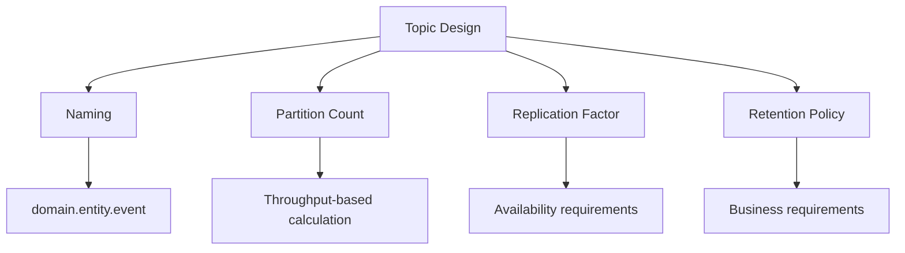
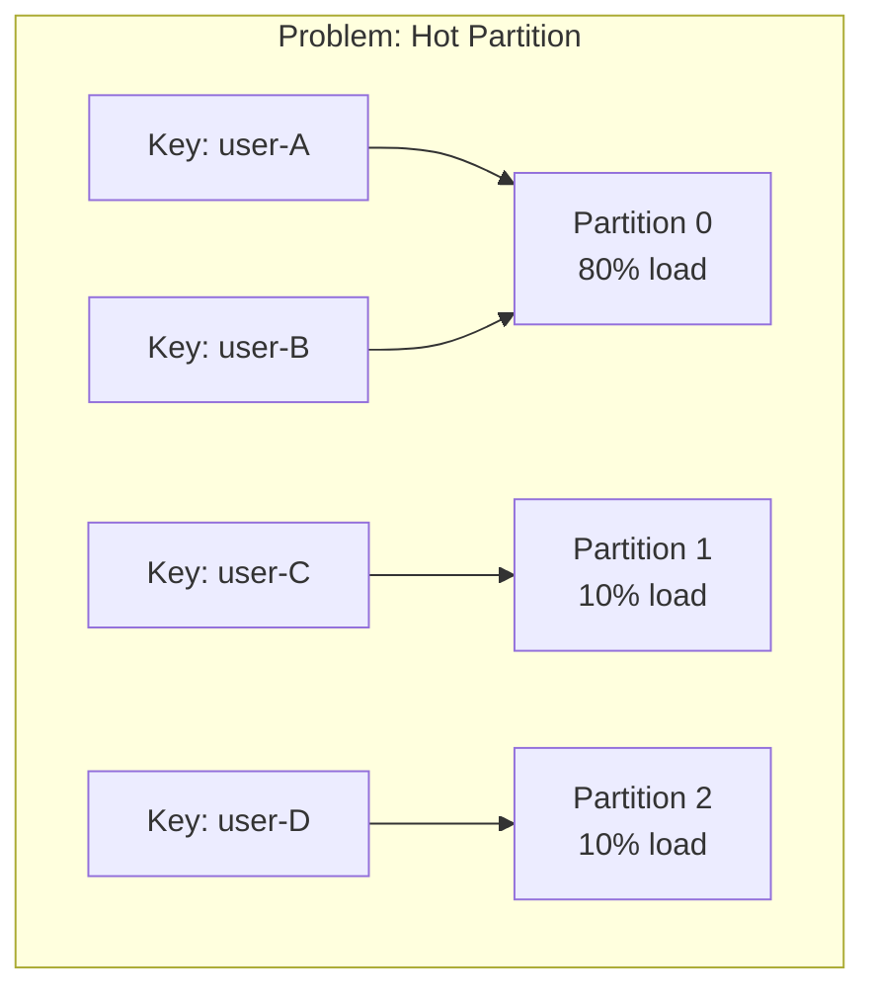
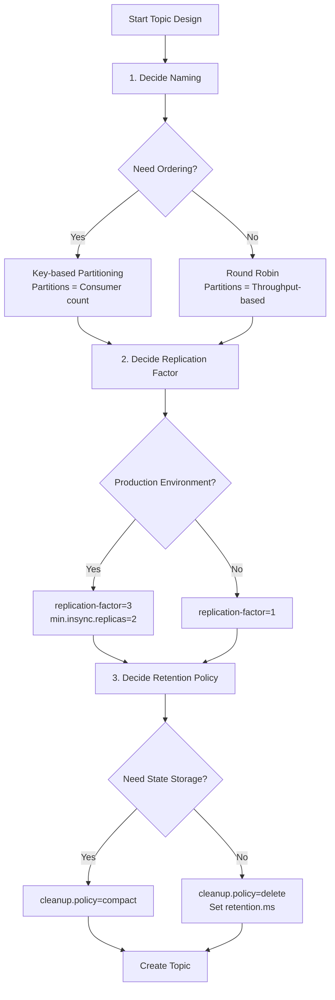

A guide on how to determine the appropriate partition count, replication factor, and retention policy when creating new Kafka topics.

**Time Required**: Approximately 15 minutes


- **Partition count**: Target throughput / Per-consumer throughput, minimum 6 recommended
- **Replication factor**: 3 for production, 1 for development
- **Retention period**: Business requirements + reprocessing buffer time
- **Naming**: Use `{domain}.{entity}.{event-type}` pattern


---

## Before You Begin

### Prerequisites

| Item | Requirement | Verification Command |
|------|------------|---------------------|
| Kafka CLI | Installed and in PATH | `kafka-topics.sh --version` |
| Broker Access | Admin privileges | `kafka-acls.sh --list` |
| Cluster Info | Know Broker count | `kafka-broker-api-versions.sh` |

### Environment Verification

Verify topic creation permissions and cluster status:

```bash
# Check cluster Broker count
kafka-metadata.sh --snapshot /var/kafka-logs/__cluster_metadata-0/00000000000000000000.log --command "broker" | wc -l

# Or estimate Broker count from existing topic
kafka-topics.sh --bootstrap-server localhost:9092 --describe --topic __consumer_offsets | head -5
```

### Docker/Kubernetes Environment

In containerized environments, execute commands as follows:

```bash
# Docker
docker exec -it kafka kafka-topics.sh --bootstrap-server localhost:9092 --list

# Kubernetes
kubectl exec -it kafka-0 -- kafka-topics.sh --bootstrap-server localhost:9092 --list
```

---

## Key Elements of Topic Design

Four key elements to decide when designing topics:



---

## Step 1: Establish Topic Naming Rules

### 1.1 Recommended Naming Pattern

Consistent naming rules facilitate management and monitoring:

```
{domain}.{entity}.{event-type}
```

**Examples:**
| Topic Name | Description |
|-----------|-------------|
| `order.order.created` | Order domain, order entity, created event |
| `order.payment.completed` | Order domain, payment entity, completed event |
| `inventory.stock.updated` | Inventory domain, stock entity, updated event |
| `user.profile.changed` | User domain, profile entity, changed event |

### 1.2 Things to Avoid When Naming

- Spaces, special characters (only underscore `_` and hyphen `-` allowed)
- Too generic names (`events`, `messages`, `data`)
- Including version in name (use schema versioning instead of `orders-v2`)

```bash
# Good examples
kafka-topics.sh --create --topic order.order.created

# Examples to avoid
kafka-topics.sh --create --topic orders        # Too generic
kafka-topics.sh --create --topic orders_v2     # Version included
kafka-topics.sh --create --topic order-events  # Event type unclear
```

---

## Step 2: Determine Partition Count

### 2.1 Basic Formula

Partition count is based on expected throughput and Consumer processing capacity:

```
Partition count = Target throughput (msg/sec) / Per-consumer throughput (msg/sec)
```

**Calculation example:**
- Target throughput: 10,000 msg/sec
- Per-consumer throughput: 2,000 msg/sec
- Required partitions: 10,000 / 2,000 = **5** → **6 recommended** with buffer

### 2.2 Partition Count Decision Checklist

| Consideration | Question | Impact |
|--------------|----------|--------|
| **Throughput** | Peak messages per second? | Need more partitions |
| **Parallelism** | Concurrent Consumer count? | Partitions ≥ Consumer count |
| **Ordering** | Need key-based ordering? | Consider hot partitions |
| **Scaling** | Future expansion plans? | Reserve buffer upfront |

### 2.3 Recommended Partition Count

| Environment | Recommended Count | Reason |
|------------|------------------|--------|
| Development/Test | 3 | Minimum for parallel testing |
| Small Production | 6 | Basic scalability |
| Medium Production | 12-24 | Adequate parallel processing |
| Large Production | 50-100+ | Based on requirements |


Partition count for an existing topic can **only be increased**. To reduce, you must recreate the topic.
Increasing partitions changes key-based routing, potentially breaking ordering guarantees.


### 2.4 Avoiding Hot Partition Problems

When messages concentrate on specific keys, only that partition becomes overloaded:



**Solutions:**

1. **Use composite keys**: Add evenly distributed field
   ```java
   String key = userId + "-" + orderId;
   ```

2. **Add random suffix**: When ordering is not required
   ```java
   String key = userId + "-" + (System.currentTimeMillis() % 10);
   ```

3. **Custom partitioner**: Distribution based on business logic
   ```java
   public class BalancedPartitioner implements Partitioner {
       @Override
       public int partition(String topic, Object key, byte[] keyBytes,
                           Object value, byte[] valueBytes, Cluster cluster) {
           // Custom partition logic
           return customHash(key) % cluster.partitionCountForTopic(topic);
       }
   }
   ```

---

## Step 3: Determine Replication Factor

### 3.1 Replication Factor Selection Criteria

| Replication Factor | Tolerable Failures | Recommended Environment | Disk Usage |
|-------------------|-------------------|------------------------|------------|
| 1 | 0 Brokers | Development, Test | 1x |
| 2 | 1 Broker | Non-critical services | 2x |
| 3 | 2 Brokers | **Production recommended** | 3x |

### 3.2 Replication Factor and min.insync.replicas Combination

Safe setting combinations:

```bash
# Production recommended settings
kafka-topics.sh --bootstrap-server localhost:9092 \
  --create --topic order.order.created \
  --partitions 12 \
  --replication-factor 3 \
  --config min.insync.replicas=2
```

| Replication Factor | min.insync.replicas | Meaning |
|-------------------|---------------------|---------|
| 3 | 2 | Writes possible with 1 Broker failure |
| 3 | 3 | All Brokers required (not recommended) |
| 2 | 1 | No fault tolerance |

---

## Step 4: Configure Retention Policy

### 4.1 Retention Policy Types

| Policy | Setting | Description |
|--------|---------|-------------|
| **Time-based** | `retention.ms` | Delete after specified time |
| **Size-based** | `retention.bytes` | Delete when size exceeded |
| **Compaction** | `cleanup.policy=compact` | Keep only latest value per key |

### 4.2 Retention Period Decision Criteria

```
Retention period = Business requirements + Reprocessing buffer + Incident response time
```

| Use Case | Recommended Retention | Reason |
|----------|---------------------|--------|
| Real-time logs | 1-3 days | Debugging and monitoring |
| Event sourcing | 7-30 days | Reprocessing and analysis |
| Audit logs | 90 days - 1 year | Compliance |
| CDC (Change Data Capture) | Permanent (compact) | Maintain current state |

### 4.3 Retention Policy Configuration Commands

```bash
# Time-based: 7 days retention
kafka-configs.sh --bootstrap-server localhost:9092 \
  --entity-type topics --entity-name order.order.created \
  --alter --add-config retention.ms=604800000

# Size-based: 10GB per partition
kafka-configs.sh --bootstrap-server localhost:9092 \
  --entity-type topics --entity-name order.order.created \
  --alter --add-config retention.bytes=10737418240

# Compaction policy (keep only latest value per key)
kafka-configs.sh --bootstrap-server localhost:9092 \
  --entity-type topics --entity-name user.profile.current \
  --alter --add-config cleanup.policy=compact
```

---

## Step 5: Create and Verify Topics

### 5.1 Topic Creation Script

Production topic creation example:

```bash
#!/bin/bash

BOOTSTRAP_SERVER="localhost:9092"

# Order event topic
kafka-topics.sh --bootstrap-server $BOOTSTRAP_SERVER \
  --create --if-not-exists \
  --topic order.order.created \
  --partitions 12 \
  --replication-factor 3 \
  --config min.insync.replicas=2 \
  --config retention.ms=604800000 \
  --config cleanup.policy=delete

# User profile topic (compacted)
kafka-topics.sh --bootstrap-server $BOOTSTRAP_SERVER \
  --create --if-not-exists \
  --topic user.profile.current \
  --partitions 6 \
  --replication-factor 3 \
  --config min.insync.replicas=2 \
  --config cleanup.policy=compact \
  --config min.cleanable.dirty.ratio=0.5
```

### 5.2 Verify Topic Configuration

Verify the created topic's settings:

```bash
# Check topic details
kafka-topics.sh --bootstrap-server localhost:9092 \
  --describe --topic order.order.created
```

**Expected output:**
```
Topic: order.order.created  PartitionCount: 12  ReplicationFactor: 3  Configs: min.insync.replicas=2,retention.ms=604800000
    Topic: order.order.created  Partition: 0   Leader: 1   Replicas: 1,2,3   Isr: 1,2,3
    Topic: order.order.created  Partition: 1   Leader: 2   Replicas: 2,3,1   Isr: 2,3,1
    ...
```

Points to verify:
- [ ] Is PartitionCount as expected?
- [ ] Is ReplicationFactor as expected?
- [ ] Is ISR equal to ReplicationFactor for all partitions?
- [ ] Is min.insync.replicas configured?

---

## Design Decision Flowchart

Follow this sequence when designing a new topic:



---

## Common Errors

### TopicExistsException

**Error message:**
```
org.apache.kafka.common.errors.TopicExistsException:
Topic 'orders' already exists.
```

**Solution:**
```bash
# Use --if-not-exists flag
kafka-topics.sh --bootstrap-server localhost:9092 \
  --create --if-not-exists --topic orders
```

### InvalidReplicationFactorException

**Error message:**
```
org.apache.kafka.common.errors.InvalidReplicationFactorException:
Replication factor: 3 larger than available brokers: 1.
```

**Cause:** Replication factor exceeds Broker count

**Solution:**
1. Check Broker count:
   ```bash
   kafka-broker-api-versions.sh --bootstrap-server localhost:9092 | grep "id:" | wc -l
   ```
2. Adjust replication factor to Broker count or lower

### InvalidPartitionsException

**Error message:**
```
org.apache.kafka.common.errors.InvalidPartitionsException:
Number of partitions must be at least 1.
```

**Cause:** Partition count is 0 or negative

**Solution:** Specify at least 1 partition

### TopicDeletionDisabledException

**Error message:**
```
org.apache.kafka.common.errors.TopicDeletionDisabledException:
Topic deletion is disabled.
```

**Solution:**
Enable topic deletion in `server.properties`:
```properties
delete.topic.enable=true
```

---

## Checklist

Verify these before creating a topic:

### Naming
- [ ] Follows `{domain}.{entity}.{event-type}` format?
- [ ] Uses lowercase with no special characters?
- [ ] Does not conflict with other topics?

### Partitions
- [ ] Calculated based on expected throughput?
- [ ] Includes buffer for future scaling?
- [ ] Verified key distribution is even?

### Replication
- [ ] Set appropriate replication factor for environment?
- [ ] Configured min.insync.replicas?
- [ ] Broker count is >= replication factor?

### Retention
- [ ] Set retention period based on business requirements?
- [ ] Considered disk capacity?
- [ ] Using compact policy for state storage topics?

---

## Related Documentation

- [Core Components - Topic and Partition]() - Topic and partition concepts
- [Replication and Fault Tolerance]() - Replication mechanism details
- [Message Loss Prevention](message-loss-prevention/) - Reliable messaging configuration
