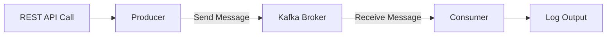
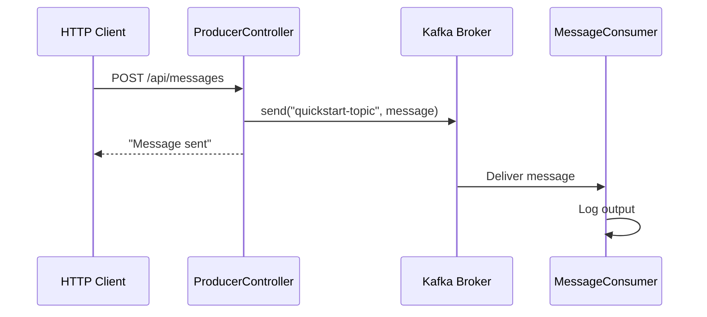

> **Target Audience**: Backend developers new to Kafka
> **Prerequisites**: Basic Java syntax, REST API concepts, Docker basics
> **After reading this document**: You will be able to execute the entire process of sending and receiving messages with Kafka in Spring Boot


- Run Kafka with Docker and test message sending/receiving with a Spring Boot example
- Publish messages with `KafkaTemplate.send()` and receive them with `@KafkaListener`
- The entire process takes about 5 minutes


Experience Kafka message sending and receiving in just 5 minutes.

## Overall Flow

In Quick Start, we implement receiving a REST API request, sending a message to Kafka, and having a Consumer receive and log it.



## Before You Begin

Make sure the following tools are installed before starting.

| Item | Verification Command | Expected Result |
|------|---------------------|-----------------|
| Docker | `docker --version` | `Docker version 24.x.x` or higher |
| Java | `java -version` | `openjdk version "17.x.x"` or higher |
| Git | `git --version` | `git version 2.x.x` |



```bash
# Install with Homebrew
brew install --cask docker
brew install openjdk@17
brew install git
```


```bash
# Install Docker
curl -fsSL https://get.docker.com -o get-docker.sh
sudo sh get-docker.sh

# Install Java 17
sudo apt update
sudo apt install openjdk-17-jdk

# Install Git
sudo apt install git
```


```powershell
# Install with Chocolatey (Administrator PowerShell)
choco install docker-desktop
choco install openjdk17
choco install git

# Or manual installation
# - Docker Desktop: https://www.docker.com/products/docker-desktop
# - Java 17: https://adoptium.net/
# - Git: https://git-scm.com/download/win
```

**Additional Windows Setup:**
- Enable WSL 2 backend after installing Docker Desktop
- Use PowerShell or Git Bash



---

## Step 1/4: Starting Kafka (~1 min)

Run Kafka with Docker Compose from the root directory of this repository.



```bash
# Navigate to the docker directory at repository root
cd docker
docker-compose up -d
```


```powershell
# Navigate to the docker directory at repository root
cd docker
docker-compose up -d
```


```bash
# Navigate to the docker directory at repository root
cd docker
docker-compose up -d
```



If the `docker-compose.yml` file doesn't exist, check the [Environment Setup Guide](../examples/setup/) for the content and save it as `docker/docker-compose.yml`.

### Verify Execution

Verify that it's running correctly:

```bash
docker-compose ps
```

**Expected output:**
```
NAME      COMMAND                  STATUS
kafka     "/etc/kafka/docker..."   Up
```


Kafka may take 10-20 seconds to fully start. Wait until `STATUS` shows `Up`.


---

## Step 2/4: Running the Example Project (~2 min)

Run the Quick Start example in a new terminal.



```bash
# Navigate to the example directory from repository root
cd examples/quick-start

# Grant execution permission to Gradle Wrapper (first time only)
chmod +x gradlew

# Run Spring Boot application
./gradlew bootRun
```


```powershell
# Navigate to the example directory from repository root
cd examples\quick-start

# Run Spring Boot application
.\gradlew.bat bootRun
```


```bash
# Navigate to the example directory from repository root
cd examples/quick-start

# Run Spring Boot application
./gradlew.bat bootRun
```



**Expected output:**
```
Started QuickStartApplication in X.XXX seconds
```


If `./gradlew` doesn't work, use `gradlew.bat bootRun`.


---

## Step 3/4: Sending a Message (~1 min)

Send a message via REST API in a new terminal.



```bash
curl -X POST http://localhost:8080/api/messages \
  -H "Content-Type: text/plain" \
  -d "Hello Kafka!"
```


```powershell
Invoke-WebRequest -Uri "http://localhost:8080/api/messages" `
  -Method POST `
  -ContentType "text/plain" `
  -Body "Hello Kafka!"
```

Or if curl is installed:
```powershell
curl.exe -X POST http://localhost:8080/api/messages -H "Content-Type: text/plain" -d "Hello Kafka!"
```


```bash
curl -X POST http://localhost:8080/api/messages \
  -H "Content-Type: text/plain" \
  -d "Hello Kafka!"
```



**Expected output:**
```
Message sent: Hello Kafka!
```

---

## Step 4/4: Verifying Message Reception (~1 min)

Check the Consumer log in the terminal where the Spring Boot application is running.

**Expected output:**
```
INFO  c.e.quickstart.MessageConsumer : Message received: Hello Kafka!
```

---

## Congratulations!

You have successfully sent and received messages through Kafka.


- [ ] Kafka container is running (verify with `docker-compose ps`)
- [ ] Spring Boot application has started
- [ ] curl request returned `Message sent: Hello Kafka!`
- [ ] Consumer log shows `Message received: Hello Kafka!`


---

## Shutdown

Stop the running application and Kafka.



```bash
# Spring Boot application: Ctrl+C

# Stop Kafka (in docker directory)
cd docker
docker-compose down
```


```powershell
# Spring Boot application: Ctrl+C

# Stop Kafka (in docker directory)
cd docker
docker-compose down
```



---

## What Just Happened?

Let's walk through what you just executed step by step.



| Order | Component | Action |
|-------|-----------|--------|
| 1 | HTTP Client | Sends HTTP request with curl |
| 2 | ProducerController | Receives request and publishes message to Kafka |
| 3 | Kafka Broker | Stores message in `quickstart-topic` |
| 4 | MessageConsumer | Subscribes to Topic, receives message, and logs output |


Kafka automatically creates a Topic when you send a message to a non-existent Topic by default. This is due to the `auto.create.topics.enable=true` setting.


---

## Exploring the Code

Let's look at how the Quick Start example is structured.

### Producer (Message Sending)

`ProducerController` receives REST requests and sends messages to Kafka.

```java
// ProducerController.java
@RestController
@RequestMapping("/api/messages")
public class ProducerController {

    private static final String TOPIC = "quickstart-topic";
    private final KafkaTemplate<String, String> kafkaTemplate;

    public ProducerController(KafkaTemplate<String, String> kafkaTemplate) {
        this.kafkaTemplate = kafkaTemplate;
    }

    @PostMapping
    public String sendMessage(@RequestBody String message) {
        kafkaTemplate.send(TOPIC, message);
        return "Message sent: " + message;
    }
}
```

- `KafkaTemplate`: Message sending class provided by Spring Kafka
- `send(topic, message)`: Sends a message to the specified Topic

### Consumer (Message Receiving)

`MessageConsumer` automatically receives messages from a specific Topic using the `@KafkaListener` annotation.

```java
// MessageConsumer.java
@Component
public class MessageConsumer {

    private static final Logger log = LoggerFactory.getLogger(MessageConsumer.class);

    @KafkaListener(topics = "quickstart-topic", groupId = "quickstart-group")
    public void consume(String message) {
        log.info("Message received: {}", message);
    }
}
```

- `@KafkaListener`: Annotation that automatically receives messages from the specified Topic
- `groupId`: Consumer Group ID - Consumers in the same group distribute and process messages

### Configuration (application.yml)

```yaml
spring:
  kafka:
    bootstrap-servers: localhost:9092
    consumer:
      group-id: quickstart-group
      auto-offset-reset: earliest
    producer:
      key-serializer: org.apache.kafka.common.serialization.StringSerializer
      value-serializer: org.apache.kafka.common.serialization.StringSerializer
```

| Setting | Description |
|---------|-------------|
| `bootstrap-servers` | Kafka broker address |
| `auto-offset-reset: earliest` | Read from the oldest message when Consumer starts |
| `key-serializer` / `value-serializer` | Message serialization method |

---

## Troubleshooting

### Kafka Connection Failed

If you see the `Connection to node -1 could not be established` error:

1. Verify Docker is running:
   ```bash
   docker ps
   ```

2. Check Kafka container status:
   ```bash
   docker-compose ps
   ```

3. Wait up to 30 seconds for Kafka to fully start

4. If the problem persists, restart Kafka:
   ```bash
   docker-compose restart
   ```

### Port Conflict

If you see the `Port 9092 is already in use` error:

1. Check if an existing Kafka process is running:
   ```bash
   lsof -i :9092    # macOS/Linux
   netstat -ano | findstr :9092    # Windows
   ```

2. Terminate the existing process or change the port in `docker-compose.yml`

### Gradle Build Failed

If you see the `Could not resolve dependencies` error:

1. Verify Java 17 or higher is installed:
   ```bash
   java -version
   ```

2. Clean the Gradle cache:
   
   
   ```bash
   ./gradlew clean
   ```
   
   
   ```powershell
   .\gradlew.bat clean
   ```
   
   

### Consumer Log Not Showing

If you sent a message but don't see the Consumer log:

1. Check the terminal where Spring Boot is running (not the terminal where you ran curl)

2. Look for `KafkaMessageListenerContainer` related logs in the application startup output. If not present, there may be a Kafka connection issue

3. Verify the Kafka broker is working properly:
   ```bash
   docker-compose logs kafka
   ```

---

## Next Steps

After completing Quick Start, proceed to the following:

| Goal | Recommended Document |
|------|---------------------|
| Understand Kafka concepts | [Core Components](../concepts/core-components/) |
| Practice more complex examples | [Implementing Producer/Consumer with Spring Kafka](../examples/basic/) |
| Learn production settings | [Environment Setup](../examples/setup/) |
