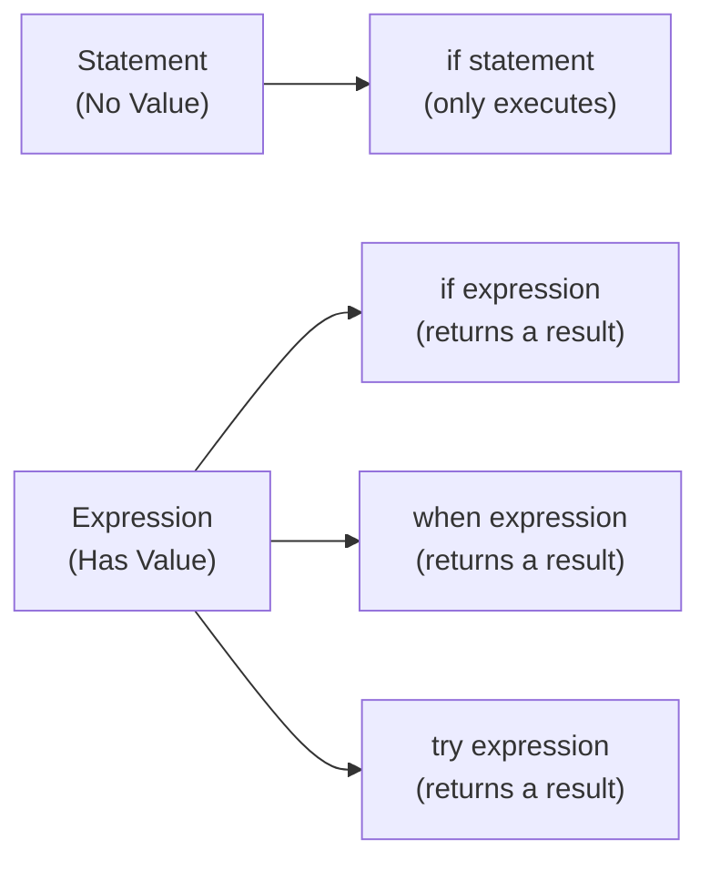

## Overall Analogy: Sheet Music and Performance

Kotlin's basic syntax is easier to understand if you compare it to **sheet music and performance**. Sheet music has rules, but good sheet music boldly omits unnecessary symbols. Kotlin is the same: it omits semicolons, returns results directly with a single expression, and brings the intent of the code to the forefront.

| Sheet Music Analogy | Kotlin Concept | Role |
|-----------|------------|------|
| Opening symbol of sheet music | `package` declaration | Defines the namespace the file belongs to |
| Instrument arrangement chart | `import` | Brings in external symbols to be used |
| Direction to start performance | `fun main` | Program entry point |
| Omitted bar lines | Omitted semicolons | A line break means end of statement |
| Musical expression (a melody in a single note) | Expression body | Return a result with a single expression |

---

> **Target Audience**: Learners who know basic programming concepts (variables, functions)
> **Prerequisites**: Basic understanding of variables and functions
> **Time Required**: About 20 minutes
> **After Reading**: You will understand the structure of Kotlin source files, write code without semicolons, and start programs with `fun main`.


- **No semicolons needed** — Line breaks serve as the end of statements
- **Expression-based** — `if`, `when`, and `try` all return values
- **Entry point is `fun main`** — Written as a top-level function without classes
- **`package` and `import`** — Can be declared independently of the directory structure


#### Why Start with Basic Syntax?

When you first encounter Kotlin, you might think, "Isn't this similar to Java?" The syntax may look familiar, but Kotlin differs in a few key philosophies. The most important one is that it is an **expression-based language**.

An expression is **code that produces a value**. Unlike a statement, an expression can be used as a value anywhere.



*Figure: Difference between Statement and Expression — In Kotlin, if/when/try are used as expressions that return values.*

In Kotlin, `if`, `when`, and `try` are all expressions. This difference affects the entire code style.

---

#### Packages and import

**Package Declaration**

Every Kotlin source file can begin with a `package` declaration. It is placed at the top of the file, and all classes and functions in that file belong to this package.

```kotlin
package com.example.myapp

// All declarations in this file belong to the com.example.myapp package
fun greet(name: String) = "Hello, $name!"
```


A Kotlin package declaration **does not need to match the directory structure.** No matter which directory you place the file in, the `package` declaration determines the actual package. However, by convention, it is good practice to align the declaration with the directory structure.


**import Declaration**

To use classes or functions from another package, bring them in with `import`.

```kotlin
package com.example.myapp

import java.time.LocalDate           // Import a specific class
import java.time.format.DateTimeFormatter
import kotlin.math.*                  // Wildcard import

fun today(): String {
    val formatter = DateTimeFormatter.ofPattern("yyyy-MM-dd")
    return LocalDate.now().format(formatter)
}
```

| Import Form | Example | Description |
|-------------|------|------|
| Specific class | `import java.util.Date` | Imports only that class |
| Wildcard | `import kotlin.math.*` | Imports the entire package |
| Alias (as) | `import java.util.Date as JDate` | Uses an alias when names conflict |
| Top-level function | `import com.example.greet` | Top-level functions can also be imported |

---

#### Comments

Kotlin supports three comment formats.

```kotlin
// Single-line comment — to the end of the line

/* 
   Multi-line comment — C-style
   Can span multiple lines
*/

/**
 * KDoc comment — for documentation
 * @param name The name to greet
 * @return The greeting string
 */
fun greet(name: String): String = "Hello, $name!"
```


Kotlin's block comments (`/* */`) **can be nested.** You can write things like `/* This is a /* nested */ comment */`. Even if there are already comments inside commented-out code, they are handled safely.


---

#### Entry Point: fun main

Kotlin programs start from the `main` function. It is declared as a top-level function without being placed inside a class.

```kotlin
// Simplest form — no arguments
fun main() {
    println("Hello, Kotlin!")
}

// Form that receives command-line arguments
fun main(args: Array<String>) {
    if (args.isNotEmpty()) {
        println("First argument: ${args[0]}")
    } else {
        println("No arguments.")
    }
}
```

`println` is a function provided by the Kotlin standard library. You can use it directly without `import`.

**Standard Input/Output Functions**

| Function | Description | Example |
|------|------|------|
| `println(value)` | Print value followed by a newline | `println("Hello")` |
| `print(value)` | Print value (no newline) | `print("Hello")` |
| `readLine()` | Read one line from standard input | `val line = readLine()` |
| `readln()` | Read one line from standard input (non-null) | `val line = readln()` |

---

#### Semicolon Omission Rules

In Kotlin, semicolons (`;`) are **optional**. Since a line break indicates the end of a statement, you write code without semicolons in most cases.

```kotlin
// No semicolons — Kotlin style
val name = "Kotlin"
val version = 2
println("$name $version")

// Using semicolons is not an error, but is not idiomatic
val name = "Kotlin"; val version = 2; println("$name $version")
```

**When are semicolons needed?**

They are needed only when writing multiple statements on a single line. However, this style hurts readability and is not recommended.

```kotlin
// Not recommended — low readability
val x = 1; val y = 2; val z = x + y

// Recommended — one per line
val x = 1
val y = 2
val z = x + y
```

---

#### Expression-Based Syntax

In Kotlin, `if`, `when`, and `try` are **expressions**, so they return values directly.

**if Expression**

```kotlin
// Used as an expression — returns a value
val max = if (a > b) a else b

// A block is also an expression — the last value is the result
val description = if (score >= 90) {
    println("Excellent")
    "Grade A"        // This value is returned
} else {
    println("Average")
    "Grade B"        // This value is returned
}
```

**when Expression**

`when` is Kotlin's powerful branching expression. Since it returns a value, you can assign it directly to a variable.

```kotlin
val dayName = when (dayOfWeek) {
    1 -> "Monday"
    2 -> "Tuesday"
    3 -> "Wednesday"
    4 -> "Thursday"
    5 -> "Friday"
    6 -> "Saturday"
    7 -> "Sunday"
    else -> "Unknown"
}

// Condition-based when — handle multiple conditions at once
val grade = when {
    score >= 90 -> "A"
    score >= 80 -> "B"
    score >= 70 -> "C"
    else        -> "F"
}
```

**try Expression**

`try-catch` also returns a value.

```kotlin
val number: Int = try {
    "42".toInt()      // This value is returned on success
} catch (e: NumberFormatException) {
    -1                // This value is returned on failure
}
```

---

#### Code Example: Putting It All Together

The example below is an executable Kotlin file that includes a package declaration, imports, comments, `fun main`, and expression syntax.

```kotlin
package com.example.basics

import kotlin.math.abs

/**
 * Returns the integer with the larger absolute value.
 * @param a The first integer
 * @param b The second integer
 * @return The integer with the larger absolute value
 */
fun largerAbsolute(a: Int, b: Int): Int =
    if (abs(a) > abs(b)) a else b

fun main() {
    // Variable declarations
    val x = -10
    val y = 7

    // Calculate value with an if expression
    val result = largerAbsolute(x, y)
    println("Number with larger absolute value: $result")

    // Categorize with a when expression
    val category = when {
        abs(result) >= 10 -> "Large number"
        abs(result) >= 5  -> "Medium number"
        else              -> "Small number"
    }
    println("Category: $category")

    // Safe parsing with a try expression
    val parsed: Int = try {
        "123".toInt()
    } catch (e: NumberFormatException) {
        0
    }
    println("Parsed value: $parsed")
}
```

---

#### Key Points


- **Package declarations** are independent of the directory structure and are placed at the top of the file
- **Import aliases** (`as`) can be used to resolve name conflicts
- **No semicolons needed** — Line breaks mark the end of statements
- **`fun main`** is the program entry point declared at the top level without a class
- **`if`, `when`, `try`** are all expressions that return values


#### Next Steps

- [Variables and Types](../variables-types/) - Learn `val`/`var`, basic types, and type inference
- [Functions](../functions/) - Learn the basics of function definitions and lambdas
