## Overall Analogy: Warehouse, List, and Map

Kotlin collections are easier to understand if you compare them to a **warehouse, a list, and a map**. `List` is an ordered list (a numbered waiting line), `Set` is a warehouse without duplicates (a unique guest list), and `Map` is a labeled storage box (key-to-value map). Read-only (immutable) warehouses can only be browsed, while mutable warehouses allow items to be added and removed.

| Analogy | Kotlin Concept | Role |
|------|------------|------|
| Numbered waiting line | `List` | Ordered, duplicates allowed |
| Unique guest list | `Set` | Unordered, no duplicates |
| Labeled storage box | `Map` | Stores key-value pairs |
| Browse-only warehouse | read-only collection | Cannot be modified, default choice |
| Warehouse for adding/removing items | mutable collection | Can be modified |
| Cook when an order comes in | `Sequence` | Lazy evaluation |

---

> **Target Audience**: Learners who have read [Data/Sealed Class](../data-sealed-classes/)
> **Prerequisites**: Kotlin basic types, lambdas, and higher-order functions
> **Time Required**: About 30 minutes
> **After Reading**: You will be able to create and transform Kotlin collections, use core operations like map/filter/fold, and efficiently process large data with Sequence.


- **Read-only** collections are the default (`listOf`, `setOf`, `mapOf`)
- Use `mutableListOf`, `mutableMapOf`, etc. when **mutability** is needed
- **`map`/`filter`/`fold`** for functional transformations, **`groupBy`** for grouping
- **`Sequence`** processes elements one by one without intermediate collections, making it efficient for large datasets


#### Why Distinguish Between Read-only and Mutable?

Tracking where a collection was modified is one of the hardest things to debug. Kotlin defaults to **read-only views** to prevent unintended modifications. Mutable collections are explicitly chosen only when modification is required.

---

#### List

A collection that is ordered and allows duplicates.

```kotlin
// read-only List — cannot be modified
val fruits = listOf("apple", "pear", "persimmon", "apple")
println(fruits.size)      // 4
println(fruits[0])        // apple
println(fruits.first())   // apple
println(fruits.last())    // apple
println(fruits.contains("pear"))   // true
println(fruits.count { it == "apple" })  // 2

// mutable List — can be modified
val mutableFruits = mutableListOf("apple", "pear")
mutableFruits.add("persimmon")
mutableFruits.remove("pear")
mutableFruits[0] = "grape"
println(mutableFruits)   // [grape, persimmon]

// buildList — create a read-only list with a builder pattern
val numbers = buildList {
    add(1)
    addAll(listOf(2, 3, 4))
    add(5)
}
println(numbers)   // [1, 2, 3, 4, 5]
```

---

#### Set

A collection that does not allow duplicates. Order is not guaranteed (except `LinkedHashSet`, which preserves insertion order).

```kotlin
// read-only Set
val tags = setOf("kotlin", "jvm", "backend", "kotlin")
println(tags.size)   // 3 (kotlin duplicate removed)
println("jvm" in tags)   // true

// mutable Set
val mutableTags = mutableSetOf("kotlin", "jvm")
mutableTags.add("backend")
mutableTags.add("kotlin")   // Adding a duplicate — ignored
println(mutableTags.size)   // 3

// Set operations
val a = setOf(1, 2, 3, 4)
val b = setOf(3, 4, 5, 6)
println(a union b)        // [1, 2, 3, 4, 5, 6] — union
println(a intersect b)    // [3, 4] — intersection
println(a subtract b)     // [1, 2] — difference
```

---

#### Map

A collection that stores key-value pairs. Keys are unique.

```kotlin
// read-only Map
val capitals = mapOf(
    "Korea" to "Seoul",
    "Japan" to "Tokyo",
    "China" to "Beijing"
)

println(capitals["Korea"])         // Seoul
println(capitals.getValue("Japan")) // Tokyo (throws exception if key is missing)
println(capitals.getOrDefault("USA", "Unknown"))  // Unknown
println(capitals.containsKey("China"))   // true

// mutable Map
val scores = mutableMapOf("Alice" to 85, "Bob" to 92)
scores["Charlie"] = 78
scores["Alice"] = 90   // Update existing value
println(scores)   // {Alice=90, Bob=92, Charlie=78}

// Iterating over a Map
for ((country, capital) in capitals) {
    println("The capital of $country is $capital")
}
```

---

#### Creation Function Summary

| Function | Result | Characteristics |
|------|------|------|
| `listOf(...)` | `List<T>` | read-only |
| `mutableListOf(...)` | `MutableList<T>` | mutable |
| `arrayListOf(...)` | `ArrayList<T>` | ArrayList implementation |
| `emptyList()` | `List<T>` | empty read-only list |
| `setOf(...)` | `Set<T>` | read-only, deduplicated |
| `mutableSetOf(...)` | `MutableSet<T>` | mutable |
| `linkedSetOf(...)` | `LinkedHashSet<T>` | preserves insertion order |
| `mapOf(...)` | `Map<K, V>` | read-only |
| `mutableMapOf(...)` | `MutableMap<K, V>` | mutable |
| `hashMapOf(...)` | `HashMap<K, V>` | HashMap implementation |

---

#### Core Transformation Operations

**map — Transform each element**

```kotlin
val numbers = listOf(1, 2, 3, 4, 5)

val doubled = numbers.map { it * 2 }
println(doubled)   // [2, 4, 6, 8, 10]

val strings = numbers.map { "item$it" }
println(strings)   // [item1, item2, item3, item4, item5]

// mapNotNull — remove nulls from transformation results
val parsed = listOf("1", "abc", "3", "xyz").mapNotNull { it.toIntOrNull() }
println(parsed)   // [1, 3]

// flatMap — flatten nested collections
val nested = listOf(listOf(1, 2), listOf(3, 4), listOf(5))
val flat = nested.flatMap { it }
println(flat)   // [1, 2, 3, 4, 5]
```

**filter — Select elements that match a condition**

```kotlin
val numbers = listOf(1, 2, 3, 4, 5, 6, 7, 8, 9, 10)

val evens = numbers.filter { it % 2 == 0 }
println(evens)   // [2, 4, 6, 8, 10]

val largeOdds = numbers.filter { it % 2 != 0 && it > 5 }
println(largeOdds)   // [7, 9]

// filterNot — elements that do not match the condition
val odds = numbers.filterNot { it % 2 == 0 }
println(odds)   // [1, 3, 5, 7, 9]

// filterIsInstance — filter by type
val mixed: List<Any> = listOf(1, "hello", 2.0, "world", 3)
val strings = mixed.filterIsInstance<String>()
println(strings)   // [hello, world]
```

**reduce and fold — Aggregation**

```kotlin
val numbers = listOf(1, 2, 3, 4, 5)

// reduce — start from the first element without an initial value
val sum = numbers.reduce { acc, n -> acc + n }
println(sum)   // 15

// fold — specify an initial value
val sumFrom10 = numbers.fold(10) { acc, n -> acc + n }
println(sumFrom10)   // 25

val product = numbers.fold(1) { acc, n -> acc * n }
println(product)   // 120

// Useful aggregation functions
println(numbers.sum())          // 15
println(numbers.average())      // 3.0
println(numbers.minOrNull())    // 1  (Kotlin 1.7+: min/max replaced by minOrNull/maxOrNull)
println(numbers.maxOrNull())    // 5
println(numbers.count { it > 3 })   // 2
```

**groupBy — Grouping**

```kotlin
data class Student(val name: String, val grade: String, val score: Int)

val students = listOf(
    Student("Alice", "A", 95),
    Student("Bob", "B", 82),
    Student("Charlie", "A", 91),
    Student("Diana", "C", 65),
    Student("Eve", "B", 78)
)

// Group by grade
val byGrade: Map<String, List<Student>> = students.groupBy { it.grade }
byGrade.forEach { (grade, students) ->
    println("Grade $grade: ${students.map { it.name }}")
}
// Grade A: [Alice, Charlie]
// Grade B: [Bob, Eve]
// Grade C: [Diana]

// groupingBy + eachCount — counts
val gradeCount = students.groupingBy { it.grade }.eachCount()
println(gradeCount)   // {A=2, B=2, C=1}
```

**associateBy — Convert to a key-based Map**

```kotlin
data class Product(val id: String, val name: String, val price: Int)

val products = listOf(
    Product("P001", "Apple", 1000),
    Product("P002", "Pear", 2000),
    Product("P003", "Persimmon", 1500)
)

// Create a Map keyed by ID
val productById: Map<String, Product> = products.associateBy { it.id }
println(productById["P002"]?.name)   // Pear

// associate — specify key-value pairs directly
val priceByName = products.associate { it.name to it.price }
println(priceByName)   // {Apple=1000, Pear=2000, Persimmon=1500}
```

---

#### Other Useful Operations

```kotlin
val numbers = listOf(3, 1, 4, 1, 5, 9, 2, 6)

// Sorting
println(numbers.sorted())           // [1, 1, 2, 3, 4, 5, 6, 9]
println(numbers.sortedDescending()) // [9, 6, 5, 4, 3, 2, 1, 1]

// Slicing
println(numbers.take(3))     // [3, 1, 4]
println(numbers.drop(5))     // [9, 2, 6]
println(numbers.takeLast(2)) // [2, 6]
println(numbers.slice(1..3)) // [1, 4, 1]

// Existence checks
println(numbers.any { it > 8 })    // true
println(numbers.all { it > 0 })    // true
println(numbers.none { it > 10 })  // true
println(numbers.find { it > 4 })   // 5 (first match)

// Flattening
println(numbers.distinct())   // [3, 1, 4, 5, 9, 2, 6] (duplicates removed)
println(numbers.chunked(3))   // [[3, 1, 4], [1, 5, 9], [2, 6]]
println(numbers.windowed(3))  // [[3,1,4], [1,4,1], [4,1,5], ...]
```

---

#### Sequence — Lazy Evaluation

A `Sequence` **does not execute operations immediately**. It defers them until a terminal operation is invoked. Without creating intermediate collections, it is efficient for large data processing.

**Sequence vs Regular Collection Comparison**

```kotlin
val numbers = (1..1_000_000).toList()

// Regular collection — creates an entire collection at each step
val result1 = numbers
    .filter { it % 2 == 0 }     // 500_000 intermediate collection
    .map { it * 3 }             // 500_000 intermediate collection
    .take(5)                    // final 5 elements
println(result1)

// Sequence — elements flow through the pipeline one by one
val result2 = numbers.asSequence()
    .filter { it % 2 == 0 }    // lazy
    .map { it * 3 }            // lazy
    .take(5)                   // lazy
    .toList()                  // actually executed here — only 10 elements processed
println(result2)
// [6, 12, 18, 24, 30]
```

**Sequence Processing Flow**

```mermaid
graph LR
    A["1, 2, 3, 4, 5, ..."]
    B["filter {even}"]
    C["map {*3}"]
    D["take(3)"]
    E["Result: &#91;6, 12, 18&#93;"]

    A -->|"2"| B
    B -->|"pass"| C
    C -->|"6"| D
    D -->|"1 of 3"| E

    A -->|"4"| B
    B -->|"pass"| C
    C -->|"12"| D
    D -->|"2 of 3"| E
```



*Figure: Kotlin Sequence lazy processing flow — shows how a single element passes through filter, map, and take operations in turn, with the final result accumulating through the lazy evaluation approach.*

**When to Use Sequence?**

| Situation | Recommendation |
|------|------|
| Few elements and few operation steps | Regular collection |
| Many elements with `take`/`find` in between | `Sequence` |
| File lines, infinite sequences | `Sequence` |
| Multiple operation steps with full result needed | Regular collection (can be parallelized step-by-step) |

```kotlin
// generateSequence — infinite Sequence
val fibonacci = generateSequence(Pair(0, 1)) { (a, b) -> Pair(b, a + b) }
    .map { it.first }
    .take(10)
    .toList()
println(fibonacci)   // [0, 1, 1, 2, 3, 5, 8, 13, 21, 34]
```

---

#### Code Example: Real-world Collection Usage

```kotlin
package com.example.collections

data class Order(
    val id: String,
    val customerId: String,
    val amount: Double,
    val status: String
)

fun main() {
    val orders = listOf(
        Order("O001", "C001", 15000.0, "completed"),
        Order("O002", "C002", 8000.0, "cancelled"),
        Order("O003", "C001", 22000.0, "completed"),
        Order("O004", "C003", 5000.0, "in_progress"),
        Order("O005", "C002", 12000.0, "completed"),
        Order("O006", "C001", 3000.0, "cancelled")
    )

    // Filter only completed orders
    val completed = orders.filter { it.status == "completed" }
    println("Number of completed orders: ${completed.size}")

    // Total per customer
    val totalByCustomer = completed
        .groupBy { it.customerId }
        .mapValues { (_, orders) -> orders.sumOf { it.amount } }
    println("Total per customer: $totalByCustomer")

    // Top 2 orders
    val top2 = orders
        .filter { it.status == "completed" }
        .sortedByDescending { it.amount }
        .take(2)
    println("Top 2 orders: ${top2.map { it.id }}")

    // Quick lookup by ID
    val orderById = orders.associateBy { it.id }
    println("O003 status: ${orderById["O003"]?.status}")

    // Total revenue (completed only)
    val totalRevenue = orders
        .asSequence()
        .filter { it.status == "completed" }
        .sumOf { it.amount }
    println("Total revenue: $totalRevenue KRW")
}
```

---

#### Key Points


- **Read-only collections** (`listOf`, etc.) are the default; use `mutableListOf` etc. when modifications are needed
- Use **`map`/`filter`** for transformations/filtering and **`fold`/`reduce`** for aggregation
- Use **`groupBy`** for grouping and **`associateBy`** to quickly create a Map
- Use **`Sequence`** for large datasets or when early termination occurs in the middle
- Use **`any`/`all`/`none`/`find`** for concise condition checks and searches


#### Next Steps

- [Extension Functions](../extension-functions/) - Learn how to add custom operations to collections
- [Scope Functions](../scope-functions/) - Learn let, apply, and also which are frequently used with collections
