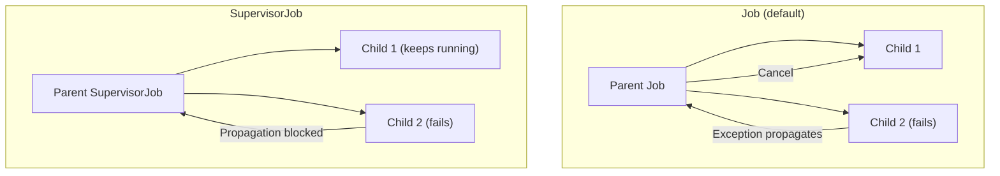
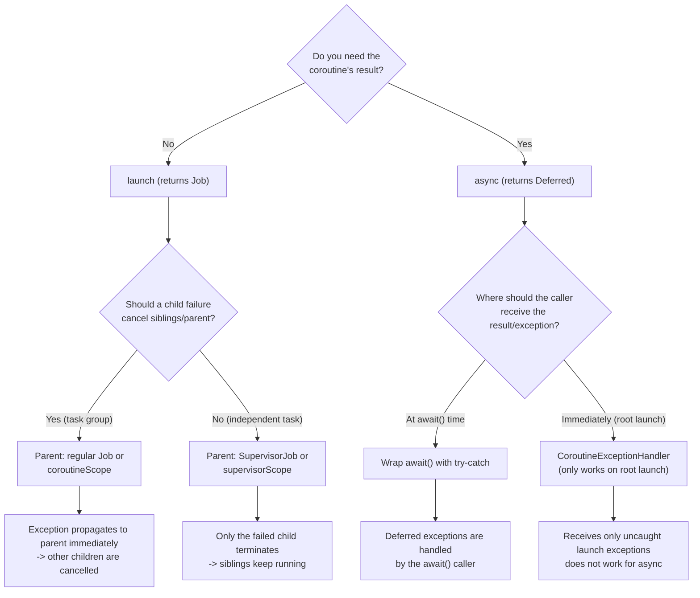

## Overall Analogy: Airline Flight Operations

In an airline flight operations system, a single flight delay can affect the entire schedule. However, by managing each route independently like a `SupervisorJob`, a cancellation of one flight does not affect the others.

| Airline Analogy | Kotlin Coroutine | Role |
|------------|-------------|------|
| Air traffic control data | `CoroutineContext` | Bundle of coroutine execution info |
| Flight identifier | `CoroutineName` | Naming a coroutine |
| Independent schedule per route | `SupervisorJob` | Failure of a child does not affect siblings |
| Boarding gate channel | `Channel<T>` | Safe data delivery between coroutines |
| Process the first flight to arrive | `select { }` | Process whichever channel arrives first |

---

> **Target Audience**: Developers who understand coroutine basics and Flow
> **Prerequisites**: [Coroutines Basics](../coroutines-basics/), [Flow and Async Streams](../flow-async-streams/)
> **Time Required**: About 45-55 minutes
> **After Reading**: You will be able to compose CoroutineContext yourself, control exception propagation structures, and design complex asynchronous communication with Channel and select.


- `CoroutineContext` combines elements like Dispatcher, Job, and CoroutineName using `+`.
- Using `SupervisorJob`/`supervisorScope`, child coroutine failures do not propagate to other children.
- `CoroutineExceptionHandler` handles uncaught exceptions from `launch`.
- `Channel` is a safe queue between coroutines, with three modes: Rendezvous/Buffered/Unlimited.
- `select { }` selects whichever of multiple channels is ready first.


---

#### CoroutineContext — The Coroutine's DNA

`CoroutineContext` is an immutable container that holds the information needed to run a coroutine. Combine elements using the `+` operator.

```kotlin
import kotlinx.coroutines.*

fun main() = runBlocking {
    // Combine multiple context elements with +
    val context = Dispatchers.IO +
                  CoroutineName("DataLoader") +
                  CoroutineExceptionHandler { _, e -> println("Exception: $e") }

    launch(context) {
        println("Running thread: ${Thread.currentThread().name}")
        println("Coroutine name: ${coroutineContext[CoroutineName]?.name}")
    }
}
// Running thread: DefaultDispatcher-worker-1
// Coroutine name: DataLoader
```

**Key CoroutineContext Elements:**

| Element | Type | Role |
|------|------|------|
| `Dispatchers.IO` | `CoroutineDispatcher` | Specifies execution thread pool |
| `Job()` | `Job` | Lifecycle management, cancellation propagation |
| `CoroutineName("name")` | `CoroutineName` | Name for debugging |
| `CoroutineExceptionHandler` | `CoroutineExceptionHandler` | Handler for unhandled exceptions |

---

#### CoroutineScope — Heart of Lifecycle Management

`CoroutineScope` wraps a `CoroutineContext` and manages the lifecycle of all coroutines within that scope.

```kotlin
import kotlinx.coroutines.*

class UserRepository {
    // Scope that shares the lifecycle of this Repository
    private val scope = CoroutineScope(Dispatchers.IO + SupervisorJob())

    fun loadUser(id: Int) {
        scope.launch {
            // DB query
            delay(100)
            println("Loaded user $id")
        }
    }

    fun close() {
        scope.cancel()  // Cancel all child coroutines
    }
}

fun main() = runBlocking {
    val repo = UserRepository()
    repo.loadUser(1)
    repo.loadUser(2)
    delay(200)
    repo.close()
}
```

**Creating a Custom Scope:**

```kotlin
import kotlinx.coroutines.*

// Passing Job() directly lets you control cancellation through that Job
val myScope = CoroutineScope(Dispatchers.Default + Job())

// supervisorScope isolates child failures
val supervisorScopeExample = CoroutineScope(Dispatchers.Default + SupervisorJob())
```

---

#### Exception Propagation Structure

Coroutine exception propagation behaves differently for `launch` and `async`.

**Exceptions in launch:**

When an exception occurs in a coroutine started with `launch`, the exception is propagated **immediately** to the parent Job. The parent is cancelled, and all other children are also cancelled.

```kotlin
import kotlinx.coroutines.*

fun main() = runBlocking {
    try {
        coroutineScope {
            launch {
                delay(100)
                println("Child 1: completed normally")
            }
            launch {
                delay(50)
                throw RuntimeException("Child 2 failed!")
            }
        }
    } catch (e: Exception) {
        println("Exception received by parent: ${e.message}")
    }
    // When child 2 fails, child 1 is also cancelled
}
// Exception received by parent: Child 2 failed!
```

**Exceptions in async:**

Exceptions from `async` propagate at the moment `await()` is called.

```kotlin
import kotlinx.coroutines.*

fun main() = runBlocking {
    val deferred = async {
        delay(100)
        throw RuntimeException("async failed!")
    }

    try {
        deferred.await()  // Exception thrown here
    } catch (e: Exception) {
        println("Exception caught at await: ${e.message}")
    }
}
```

---

#### SupervisorJob and supervisorScope

When using `SupervisorJob`, a child coroutine's failure **does not propagate to siblings or the parent**. It is suitable for independent tasks (e.g., loading multiple users' data, parallel calls to several APIs).

```kotlin
import kotlinx.coroutines.*

fun main() = runBlocking {
    // supervisorScope: child failures do not affect other children
    supervisorScope {
        val child1 = launch {
            delay(100)
            println("Child 1: completed normally")
        }

        val child2 = launch {
            delay(50)
            throw RuntimeException("Child 2 failed!")
            // Child 1 continues unaffected
        }

        // Handle child2 failure individually
        child2.join()
        println("child2 status: ${child2.isCancelled}")
    }
    println("supervisorScope ended")
}
// Child 2 failed!
// Child 1: completed normally
// child2 status: true  (a launch coroutine that ended with an exception has isCancelled = true)
// supervisorScope ended
```

**Job vs SupervisorJob Comparison:**



*Figure: Exception propagation comparison between Job and SupervisorJob — a default Job cancels the parent and siblings on child failure, while SupervisorJob only terminates the failed child independently.*

---

#### CoroutineExceptionHandler

The last resort for handling uncaught exceptions in `launch` coroutines. It does not work for `async`. The `CoroutineExceptionHandler` is a handler that receives only **uncaught exceptions of root coroutines** in structured concurrency; because `async` exceptions are encapsulated in `Deferred` and exposed only through `await()`, the caller that holds the `Deferred` must handle them with `try-catch`.

```kotlin
import kotlinx.coroutines.*

fun main() = runBlocking {
    val handler = CoroutineExceptionHandler { context, exception ->
        val name = context[CoroutineName]?.name ?: "unnamed"
        println("[$name] Handling exception: ${exception.message}")
    }

    val scope = CoroutineScope(
        Dispatchers.Default + SupervisorJob() + handler
    )

    scope.launch(CoroutineName("TaskA")) {
        delay(100)
        throw IllegalStateException("TaskA failed")
    }

    scope.launch(CoroutineName("TaskB")) {
        delay(200)
        println("TaskB: completed normally")
    }

    delay(300)
    scope.cancel()
}
// [TaskA] Handling exception: TaskA failed
// TaskB: completed normally
```


`CoroutineExceptionHandler` only works on **root coroutines**. Attaching a handler to a child coroutine has no effect, because the exception is first propagated to the parent and the handler is never invoked. Also, `async` exceptions are encapsulated in `Deferred` and exposed only via `await()`, so the caller must handle them with `try-catch`.

In addition, if a child `async` fails inside a `coroutineScope`, the entire scope is cancelled and the exception propagates to the parent even before any other child's `await()` is called. To isolate child failures, use `supervisorScope` or `SupervisorJob`.


---

#### Exception Handling Decision Tree

Let's consolidate the choices we've seen so far — `launch`/`async`, `Job`/`SupervisorJob`, and `try-catch`/`CoroutineExceptionHandler` — at a glance. When writing new code, decide following this flow.



*Figure: A decision tree for selecting the coroutine builder, Job type, and exception handling tool step by step. It asks in order: whether a result is needed, whether child isolation is required, and where the exception should be received.*

The three common scenarios map as follows.

| Scenario | Builder | Parent Job | Exception Handling |
|---------|------|---------|---------|
| Background task group (cancel all on one failure) | `launch` | regular Job / `coroutineScope` | `CoroutineExceptionHandler` at the root |
| Parallel API calls and combine results | `async` + `awaitAll` | `coroutineScope` | Wrap `awaitAll()` with `try-catch` |
| Per-user notifications (failure for one user doesn't affect others) | `launch` | `SupervisorJob` / `supervisorScope` | `try-catch` inside each child |


- **Group vs Independent**: Job if they must fail together, SupervisorJob if they need isolation.
- **Result vs Notification**: For results use `async + try-catch(await)`; without results use `launch + CoroutineExceptionHandler`.
- `CoroutineExceptionHandler` only works on **root `launch`**. It doesn't work on children or `async`.


---

#### Channel — Communication Between Coroutines

`Channel` is a **safe queue** for passing data between coroutines. It can be used to implement various producer-consumer patterns.

**Channel Types:**

| Type | How to Create | Characteristics |
|------|---------|------|
| Rendezvous | `Channel()` | No buffer. Sender and receiver must be ready simultaneously |
| Buffered | `Channel(capacity)` | Buffer of specified size. When full, send suspends |
| Unlimited | `Channel(UNLIMITED)` | Infinite buffer. Delivers immediately even without a receiver |
| Conflated | `Channel(CONFLATED)` | Keeps only the latest value. Buffer size 1 + overwrite |

**Basic Usage:**

```kotlin
import kotlinx.coroutines.*
import kotlinx.coroutines.channels.*

fun main() = runBlocking {
    val channel = Channel<Int>()

    // Producer
    launch {
        for (i in 1..5) {
            println("Send: $i")
            channel.send(i)
        }
        channel.close()  // Signal completion
    }

    // Consumer
    for (value in channel) {  // Loop ends on channel.close()
        println("Receive: $value")
    }
    println("Channel consumption complete")
}
```

**Buffered Channel:**

```kotlin
import kotlinx.coroutines.*
import kotlinx.coroutines.channels.*

fun main() = runBlocking {
    val channel = Channel<Int>(capacity = 3)  // Buffer of 3

    launch {
        for (i in 1..5) {
            channel.send(i)
            println("Sent: $i")  // Suspends at #3 when buffer is full
        }
        channel.close()
    }

    delay(100)  // Give producer time to fill the buffer
    for (value in channel) {
        delay(50)  // Slow consumption
        println("Receive: $value")
    }
}
```

---

#### produce and consumeEach

A channel producer/consumer pattern using a coroutine scope.

```kotlin
import kotlinx.coroutines.*
import kotlinx.coroutines.channels.*

// produce: define a channel producer within a CoroutineScope
fun CoroutineScope.numbersProducer(from: Int, to: Int): ReceiveChannel<Int> = produce {
    for (i in from..to) {
        delay(100)
        send(i)
    }
}

fun main() = runBlocking {
    val channel = numbersProducer(1, 5)

    channel.consumeEach { value ->
        println("Process: $value")
    }
}
```

---

#### Fan-out and Fan-in Patterns

```kotlin
import kotlinx.coroutines.*
import kotlinx.coroutines.channels.*

// Fan-out: multiple consumers share work from a single channel
fun main() = runBlocking {
    val channel = Channel<Int>(capacity = 10)

    // Producer
    launch {
        for (i in 1..10) {
            channel.send(i)
        }
        channel.close()
    }

    // 3 consumers (fan-out)
    repeat(3) { workerId ->
        launch {
            for (value in channel) {
                delay(100)
                println("Worker $workerId: processed $value")
            }
        }
    }

    delay(2000)
}
```

---

#### select Expression

`select` picks **whichever is ready first** among multiple channels to process.

```kotlin
import kotlinx.coroutines.*
import kotlinx.coroutines.channels.*
import kotlinx.coroutines.selects.*

fun CoroutineScope.fastChannel(): ReceiveChannel<String> = produce {
    delay(50)
    send("Fast server response")
}

fun CoroutineScope.slowChannel(): ReceiveChannel<String> = produce {
    delay(200)
    send("Slow server response")
}

fun main() = runBlocking {
    val fast = fastChannel()
    val slow = slowChannel()

    repeat(2) {
        val result = select<String> {
            fast.onReceive { it }
            slow.onReceive { it }
        }
        println("Selected: $result")
    }

    fast.cancel()
    slow.cancel()
}
// Selected: Fast server response
// Selected: Slow server response
```

**select with onSend:**

```kotlin
import kotlinx.coroutines.*
import kotlinx.coroutines.channels.*
import kotlinx.coroutines.selects.*

fun main() = runBlocking {
    val ch1 = Channel<String>(1)
    val ch2 = Channel<String>(1)

    launch {
        // Send to whichever channel can receive first
        select<Unit> {
            ch1.onSend("Send to channel 1") { println("Sent to ch1") }
            ch2.onSend("Send to channel 2") { println("Sent to ch2") }
        }
    }

    delay(100)
    println(ch1.tryReceive().getOrNull() ?: ch2.tryReceive().getOrNull())
}
```

---

#### Coroutine Leak Prevention Patterns

A coroutine leak is a state where a coroutine that has not been cancelled keeps running.

**Pattern That Causes Leaks:**

```kotlin
import kotlinx.coroutines.*

// Wrong example: using GlobalScope
// GlobalScope is tied to the entire app's lifecycle -> cannot be cancelled
fun badPattern() {
    GlobalScope.launch {   // Never use this!
        delay(10_000)
        println("When will this coroutine end?")
    }
}
```

**Correct Pattern:**

```kotlin
import kotlinx.coroutines.*

class MyService {
    // SupervisorJob: a child failure doesn't cancel the entire scope
    private val serviceScope = CoroutineScope(
        Dispatchers.IO + SupervisorJob() + CoroutineName("MyService")
    )

    fun start() {
        serviceScope.launch {
            // Service work
        }
    }

    fun stop() {
        serviceScope.cancel()  // Cancel all work + release resources
    }
}
```

**Kotlin's Official Recommendation: Passing `currentCoroutineContext()`:**

```kotlin
import kotlinx.coroutines.*

// When wrapping a callback-based API as a coroutine
suspend fun <T> awaitCallback(block: (callback: (T) -> Unit) -> Unit): T =
    suspendCancellableCoroutine { continuation ->
        block { result ->
            continuation.resume(result)
        }
        // Clean up resources on cancellation
        continuation.invokeOnCancellation {
            println("Coroutine cancelled -> callback cleanup")
        }
    }
```

---

#### suspendCancellableCoroutine — Callback Wrapping

Use this when converting an existing callback-based API into a suspend function.

```kotlin
import kotlinx.coroutines.*

// Example: wrapping a callback-based library
interface NetworkCallback {
    fun onSuccess(data: String)
    fun onError(error: Exception)
}

fun fetchDataWithCallback(url: String, callback: NetworkCallback) {
    Thread {
        Thread.sleep(200)
        callback.onSuccess("Data: $url")
    }.start()
}

// Convert to a suspend function
suspend fun fetchData(url: String): String = suspendCancellableCoroutine { cont ->
    fetchDataWithCallback(url, object : NetworkCallback {
        override fun onSuccess(data: String) {
            if (cont.isActive) cont.resume(data)
        }

        override fun onError(error: Exception) {
            if (cont.isActive) cont.resumeWithException(error)
        }
    })

    cont.invokeOnCancellation {
        println("Request cancelled: $url")
    }
}

fun main() = runBlocking {
    val result = fetchData("https://example.com/api")
    println(result)
}
```

---

#### Key Points


- `CoroutineContext` combines Dispatcher, Job, Name, and Handler using `+`.
- The default `Job` propagates: child failure -> parent cancellation -> sibling cancellation.
- `SupervisorJob`/`supervisorScope` isolates child failures.
- `CoroutineExceptionHandler` handles uncaught exceptions of root `launch` coroutines.
- Choose `Channel` mode by type: Rendezvous/Buffered/Unlimited.
- Use `select { }` to handle whichever of several channels is ready first.
- Avoid `GlobalScope` and use explicit scopes to prevent leaks.


---

#### Next Steps

- [Coroutine Debugging](../../howto/coroutine-debugging/) — Debugging tools, leak diagnosis
- [DSL Builders](../dsl-builders/) — DSL design using coroutine scopes
- [Flow and Async Streams](../flow-async-streams/) — Comparison of Channel and SharedFlow

> **See also**: When coroutines propagate context across services, the [distributed tracing]() perspective is needed. Combining `CoroutineContext` with trace IDs lets you observe asynchronous call flows without interruption.
