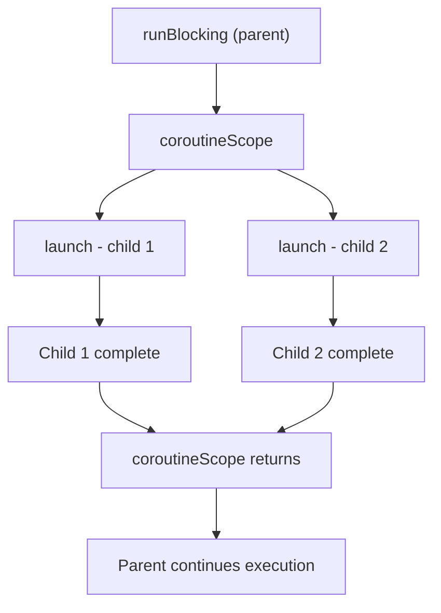

## Overall Analogy: The Cafe Cashier and Order Numbers

This can be likened to a cafe employee who takes a drink order: instead of leaving the register idle until the drink is finished, the cashier hands out an order number and serves the next customer.

| Cafe Analogy | Kotlin Coroutine | Role |
|----------|--------------|------|
| Request to make a drink | `launch { }` | Start an asynchronous task (no result needed) |
| Pick up the drink once ready | `async { }.await()` | Asynchronous task + receive result |
| The cashier (pause/resume) | `suspend` function | Waits without occupying a thread |
| Making area | `Dispatcher` | Thread pool that processes tasks |
| Cafe manager | `CoroutineScope` | Manages the lifecycle of all coroutines |

Just as a single cashier can handle multiple orders at once, coroutines efficiently process many asynchronous tasks with few threads.

---

> **Target Audience**: Intermediate or higher Kotlin developers who have encountered asynchronous programming concepts
> **Prerequisites**: Kotlin functions, lambdas, basic OOP
> **Time Required**: About 35-45 minutes
> **After Reading**: You will be able to write `launch`, `async`, and `suspend` functions yourself and choose Dispatchers correctly.


- `suspend` functions pause/resume without blocking threads.
- Use `launch` for parallel tasks where no result is needed, and `async`/`await` for tasks where results are needed.
- `Dispatchers.IO` is suitable for I/O tasks, and `Dispatchers.Default` is suitable for CPU-intensive tasks.
- Through `CoroutineScope` (structured concurrency), child coroutines are cancelled together with their parent.


---

#### Why Are Coroutines Needed?

Traditional thread-based asynchronous programming has two problems.

First, **thread cost**. A single thread typically occupies around 1MB of stack. If threads are held while waiting on DB queries or HTTP requests, even just a few thousand concurrent users can overwhelm the server.

Second, **callback hell**. Connecting asynchronous tasks with callbacks results in nested code, and error handling is scattered across many places.

Coroutines are called **lightweight threads**. Even when running hundreds of thousands of coroutines concurrently, the thread pool remains at the CPU core count or a small size for I/O. They also allow asynchronous code to read like sequential code, improving readability.

**Phone-call hold analogy**: Suppose a call center agent handling a customer inquiry needs to briefly look up some data. The agent puts the call on hold — the line stays open, but in the meantime the agent can handle other work. When the data is ready, the agent returns to the line and responds. `suspend` functions work the same way. While the function is paused, the "line" (the coroutine state) is preserved, but the thread is freed up to handle other tasks. When the result is ready, the function resumes exactly where it stopped.

**Comparison of resource usage for 10,000 threads vs 10,000 coroutines**:

| Category | 10,000 Threads | 10,000 Coroutines |
|------|--------------|---------------|
| Stack memory | About 10GB (1MB × 10,000) | Less than 1MB (tens to hundreds of bytes × 10,000) |
| Context switching | Kernel mode transition cost | Function call level (user mode) |
| OS resources | 10,000 kernel threads (practically impossible) | Only uses the JVM thread pool's core count |
| Feasibility | Practically impossible due to OS limits | Comfortable even on a typical laptop |

`Thread.sleep(1000)` holds the thread completely for 1 second. In contrast, `delay(1000)` only pauses the coroutine, and the thread is immediately reallocated to other tasks.

**How `suspend` functions work internally**: The compiler converts a `suspend` function into a **resumable state object** (state machine). This is called CPS (Continuation-Passing Style): whenever the function is paused, a `Continuation` object containing "where to resume next" is created and preserved. As a result, the function continues exactly from where it left off.

---

#### suspend Functions

The `suspend` keyword declares that a function is **pausable**. A suspend function can only be called inside a coroutine.

```kotlin
import kotlinx.coroutines.*

// suspend functions do not hold a thread while waiting
suspend fun fetchUserName(userId: Int): String {
    delay(500)  // Use delay instead of Thread.sleep (non-blocking)
    return "User_$userId"
}

suspend fun fetchUserScore(userId: Int): Int {
    delay(300)
    return userId * 10
}
```

Unlike `Thread.sleep()`, `delay()` does not block the thread. It resumes the coroutine after the specified time.

---

#### runBlocking — Entry Point into Coroutines

`runBlocking` enters the coroutine world while blocking the current thread. Use it when starting coroutines in tests or `main()` functions. Do not use it in production service code.


`runBlocking` is a builder that blocks the main thread and runs a coroutine. Use it only in tests and `main` functions; for real asynchronous processing, use `launch`/`async`. Because it literally "blocks" as the name suggests, calling it inside a server request handler will freeze the entire thread.


```kotlin
import kotlinx.coroutines.*

fun main() = runBlocking {
    // From here, we're in the coroutine context
    val name = fetchUserName(1)
    println("Name: $name")
}
```

---

#### launch — Asynchronous Tasks Without Results

`launch` starts a new coroutine without blocking the current coroutine. The return value is a `Job`, a handle that manages the task's lifecycle.

```kotlin
import kotlinx.coroutines.*

fun main() = runBlocking {
    val job: Job = launch {
        delay(1000)
        println("Background task complete")
    }

    println("Executed immediately after launch")
    job.join()  // Wait until the job completes (optional)
    println("All tasks complete")
}
// Output:
// Executed immediately after launch
// Background task complete
// All tasks complete
```

**Running multiple tasks concurrently:**

```kotlin
import kotlinx.coroutines.*

fun main() = runBlocking {
    val startTime = System.currentTimeMillis()

    val job1 = launch { delay(1000); println("Task 1 complete") }
    val job2 = launch { delay(800); println("Task 2 complete") }
    val job3 = launch { delay(600); println("Task 3 complete") }

    job1.join()
    job2.join()
    job3.join()

    val elapsed = System.currentTimeMillis() - startTime
    println("Total elapsed time: ${elapsed}ms")
    // About 1000ms (would be 2400ms if sequential)
}
```

---

#### async / await — Asynchronous Tasks with Results

`async` starts a coroutine and returns a `Deferred<T>`. Calling `.await()` suspends until the result is ready.

```kotlin
import kotlinx.coroutines.*

fun main() = runBlocking {
    val startTime = System.currentTimeMillis()

    // Start two tasks simultaneously
    val deferred1: Deferred<String> = async { fetchUserName(1) }
    val deferred2: Deferred<Int>    = async { fetchUserScore(1) }

    // Wait for each to complete and receive the result
    val name  = deferred1.await()
    val score = deferred2.await()

    val elapsed = System.currentTimeMillis() - startTime
    println("Name: $name, Score: $score (${elapsed}ms)")
    // About 500ms (would be 800ms if sequential)
}
```

The coroutine starts as soon as `async` is called. `await()` simply waits for the result.


```kotlin
// Wrong example: calling await() immediately becomes equivalent to sequential execution
val name  = async { fetchUserName(1) }.await()   // Wait 500ms here
val score = async { fetchUserScore(1) }.await()  // Wait 300ms here
// Total 800ms — no parallelism benefit
```
Start all `async` blocks first, then call `await()` at the end.


---

#### Dispatchers — Which Thread to Run On?

A `Dispatcher` determines which thread pool a coroutine runs on.

| Dispatcher | Thread Pool | Suitable Work |
|-----------|----------|------------|
| `Dispatchers.Default` | Number of CPU cores | Computation, JSON parsing, sorting |
| `Dispatchers.IO` | Up to 64 (expandable) | DB queries, HTTP calls, file I/O |
| `Dispatchers.Main` | 1 UI thread | Android/JavaFX UI updates |
| `Dispatchers.Unconfined` | Caller's thread | Tests, special purposes |

```kotlin
import kotlinx.coroutines.*

fun main() = runBlocking {
    // CPU-intensive task -> Default
    val result = withContext(Dispatchers.Default) {
        (1..1_000_000).sum()
    }
    println("Sum: $result")

    // I/O task -> IO
    val data = withContext(Dispatchers.IO) {
        delay(100) // DB query simulation
        "DB data"
    }
    println("Data: $data")
}
```

---

#### withContext — Switching Dispatchers

`withContext` switches to a specified context (Dispatcher) to execute a block and return its result. Internally it `suspend`s, so it does not block the current thread.

```kotlin
import kotlinx.coroutines.*

suspend fun loadFromDatabase(id: Int): String = withContext(Dispatchers.IO) {
    delay(200)  // DB query simulation
    "Record_$id"
}

suspend fun processData(raw: String): String = withContext(Dispatchers.Default) {
    // CPU-intensive processing
    raw.uppercase().reversed()
}

fun main() = runBlocking {
    val raw = loadFromDatabase(42)
    val processed = processData(raw)
    println(processed)  // 42_DROCER
}
```

---

#### Structured Concurrency

Structured concurrency is the core principle of coroutine management. When a parent coroutine is cancelled, all its child coroutines are cancelled together. A parent does not complete until all of its children do.

`coroutineScope` is a region that waits until all child coroutines finish. If an exception occurs inside the region, all children are cancelled together.

```kotlin
import kotlinx.coroutines.*

fun main() = runBlocking {
    // coroutineScope waits until all children are complete
    coroutineScope {
        val job1 = launch {
            delay(1000)
            println("Child 1 complete")
        }
        val job2 = launch {
            delay(500)
            println("Child 2 complete")
        }
        // This block returns only after both job1 and job2 complete
    }
    println("This line runs after all children are complete")
}
```



*Figure: Coroutine structured concurrency — shows the parent-child lifecycle relationship where the parent resumes after both child launches under coroutineScope (under runBlocking) complete.*

---

#### Cooperative Cancellation — isActive / yield

Coroutines are cancelled **cooperatively**. Once a cancellation signal is received, a `CancellationException` is thrown at the next `suspend` point. For CPU-intensive loops without a suspend point, you must explicitly check for cancellation.

```kotlin
import kotlinx.coroutines.*

fun main() = runBlocking {
    val job = launch(Dispatchers.Default) {
        var count = 0
        while (isActive) {  // Check cancellation signal
            count++
            if (count % 100_000 == 0) {
                yield()  // Give other coroutines a chance to run, and check for cancellation
            }
        }
        println("Loop ended (count=$count)")
    }

    delay(50)   // Cancel after 50ms
    job.cancel()
    job.join()
    println("Complete")
}
```

`isActive`: Checks whether the current coroutine is still active.
`yield()`: Yields execution to other coroutines and processes cancellation signals.

---

#### Cancellation and Resource Cleanup

When cancelled, `finally` blocks are always executed. This allows resources such as files and DB connections to be safely closed.

```kotlin
import kotlinx.coroutines.*

fun main() = runBlocking {
    val job = launch {
        try {
            println("Task started")
            delay(5000)
            println("Task complete (this line is not executed if cancelled)")
        } finally {
            println("Cleaning up (runs even on cancellation)")
            // withContext(NonCancellable) { ... }  <- if additional suspend is needed during cleanup
        }
    }

    delay(200)
    println("Cancellation requested")
    job.cancelAndJoin()  // cancel() + join()
    println("Complete")
}
// Output:
// Task started
// Cancellation requested
// Cleaning up (runs even on cancellation)
// Complete
```

---

#### launch vs async Comparison

```kotlin
import kotlinx.coroutines.*

fun main() = runBlocking {
    // launch: side effect, no result needed
    launch {
        delay(100)
        println("Log recorded")  // No need to return a result
    }

    // async: result needed
    val price: Deferred<Double> = async {
        delay(200)
        9900.0
    }

    val totalPrice = price.await() * 1.1
    println("Final price: $totalPrice")
}
```

| Category | `launch` | `async` |
|------|---------|---------|
| Return type | `Job` | `Deferred<T>` |
| Receive result | Not possible | Receive via `.await()` |
| Primary use | Side effects, logging | Asynchronous computation needing a result |
| Exception behavior | Propagated to parent immediately | Propagated when `await()` is called or scope ends |

---

#### Real-world Example: Parallel API Calls

```kotlin
import kotlinx.coroutines.*

data class UserProfile(
    val name: String,
    val score: Int,
    val badges: List<String>
)

suspend fun fetchName(id: Int): String = withContext(Dispatchers.IO) {
    delay(300)
    "Alice"
}

suspend fun fetchScore(id: Int): Int = withContext(Dispatchers.IO) {
    delay(200)
    1500
}

suspend fun fetchBadges(id: Int): List<String> = withContext(Dispatchers.IO) {
    delay(250)
    listOf("New Sign-up", "First Payment", "VIP")
}

suspend fun buildUserProfile(userId: Int): UserProfile = coroutineScope {
    val nameDeferred   = async { fetchName(userId) }
    val scoreDeferred  = async { fetchScore(userId) }
    val badgesDeferred = async { fetchBadges(userId) }

    UserProfile(
        name   = nameDeferred.await(),
        score  = scoreDeferred.await(),
        badges = badgesDeferred.await()
    )
    // Total ~300ms (would be 750ms if sequential)
}

fun main() = runBlocking {
    val profile = buildUserProfile(1)
    println(profile)
}
```

---

#### Key Points


- `suspend` functions can only be called inside coroutines and do not block threads.
- `launch` -> `Job` (no result), `async` -> `Deferred<T>` (with result).
- `Dispatchers.IO` for I/O blocking tasks, `Dispatchers.Default` for CPU tasks.
- `withContext` is a suspend function that switches to a specified dispatcher to execute a block and return its result.
- Structured concurrency: when the parent is cancelled, the children are cancelled too.
- Use `isActive` / `yield()` to implement cooperative cancellation in CPU-intensive code.


---

#### Next Steps

- [Flow and Async Streams](../flow-async-streams/) — Coroutine-based reactive streams
- [Coroutines Advanced](../coroutines-advanced/) — CoroutineContext, Channel, SupervisorJob
- [Coroutine Debugging](../../howto/coroutine-debugging/) — Debugging tools and leak diagnosis
