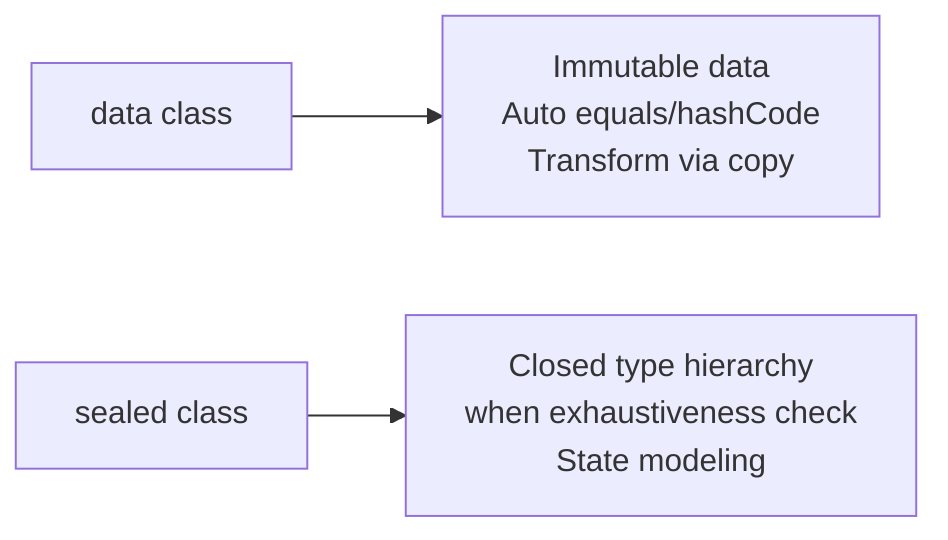

## Overall Analogy: Stamped Documents and a Fixed Menu

A `data class` is like a **stamped official document**, and a `sealed class` is like a **menu with fixed items**. An official document is treated as identical when its contents match (equals), and it has a hash code attached for quick classification (hashCode). A fixed menu only allows registered items to be ordered, so the compiler verifies that "all cases have been handled".

| Analogy | Kotlin Concept | Role |
|------|------------|------|
| Official document (identity by content) | `data class` | Auto-generates equals/hashCode |
| Issuing a copy | `copy()` | Creates a new instance with partial changes |
| Splitting document fields for separate processing | Destructuring | Decomposed via `componentN()` |
| Fixed menu | `sealed class` | Restricts subtypes to a single file |
| Guarantee of complete menu processing | `when` + sealed | Compiler warns about missing branches |

---

> **Target Audience**: Learners who have read [Classes and Objects](../classes-objects/)
> **Prerequisites**: Kotlin classes, primary constructors, when expressions
> **Time Required**: About 25 minutes
> **After Reading**: You will be able to define immutable data models with `data class`, create closed type hierarchies with `sealed class`, and process them exhaustively with `when`.


- **`data class`** automatically generates equals/hashCode/toString/copy/componentN
- **`copy()`** creates a new instance with some fields changed
- **`sealed class`** restricts subtypes to enable exhaustiveness checking by `when`
- **Destructuring** separates a `data class` instance into multiple variables at once


#### Why Are data class and sealed class Important?

A large part of modern application code is about **representing data and processing states**. `data class` makes immutable data representation concise, and `sealed class` lets you model a finite set of states in a type-safe way.



*Figure: Role comparison between data class and sealed class — data class handles immutable data representation, while sealed class handles closed type hierarchies and state modeling.*

---

#### data class — Auto-generated Methods

Declaring a `data class` automatically generates the following methods based on the primary constructor's properties.

| Method | Description |
|--------|------|
| `equals()` | Equality comparison by property values |
| `hashCode()` | Hash code based on property values |
| `toString()` | `ClassName(prop1=val1, ...)` format |
| `copy()` | New instance with some properties changed |
| `componentN()` | Functions for destructuring |

```kotlin
data class Point(val x: Int, val y: Int)

val p1 = Point(3, 4)
val p2 = Point(3, 4)
val p3 = Point(1, 2)

// equals — value-based comparison
println(p1 == p2)   // true (equal if contents match)
println(p1 == p3)   // false

// hashCode — value-based hash
println(p1.hashCode() == p2.hashCode())   // true

// toString — readable format
println(p1)   // Point(x=3, y=4)
```

---

#### copy() — Immutable Transformation

`copy()` returns a new instance with only some fields changed. This is the main pattern for "changing" immutable data.

```kotlin
data class User(
    val name: String,
    val age: Int,
    val email: String,
    val isActive: Boolean = true
)

val original = User("John Doe", 30, "john@example.com")

// New instance with only email changed
val updated = original.copy(email = "newjohn@example.com")
println(updated)
// User(name=John Doe, age=30, email=newjohn@example.com, isActive=true)

// Change multiple fields
val deactivated = original.copy(age = 31, isActive = false)
println(deactivated)
// User(name=John Doe, age=31, email=john@example.com, isActive=false)

// Original is unchanged
println(original)
// User(name=John Doe, age=30, email=john@example.com, isActive=true)
```

---

#### Destructuring

A `data class` automatically generates `component1()`, `component2()`, etc., functions, enabling destructuring.

```kotlin
data class Coordinate(val lat: Double, val lng: Double)

val seoul = Coordinate(37.5665, 126.9780)

// Destructuring declaration
val (latitude, longitude) = seoul
println("Latitude: $latitude, Longitude: $longitude")

// Ignore unneeded values with _
val (lat, _) = seoul
println("Latitude only: $lat")
```

**Destructuring in Loops**

```kotlin
data class Product(val name: String, val price: Int, val stock: Int)

val products = listOf(
    Product("Apple", 1000, 50),
    Product("Pear", 2000, 30),
    Product("Persimmon", 1500, 20)
)

for ((name, price, stock) in products) {
    println("$name: $price KRW (stock $stock)")
}

// Map.Entry can also be destructured
val prices = mapOf("Apple" to 1000, "Pear" to 2000)
for ((item, price) in prices) {
    println("$item: ${price} KRW")
}
```

---

#### data class Caveats

```kotlin
data class Config(
    val host: String,
    val port: Int,
    val tags: List<String>   // Consider defensive copying if a mutable list
)

// Properties outside the primary constructor are not included in equals/hashCode
data class Event(val id: Int, val name: String) {
    var processed: Boolean = false   // This field is NOT included in equals!
}

val e1 = Event(1, "click")
e1.processed = true
val e2 = Event(1, "click")
println(e1 == e2)   // true — processed is not compared
```


Using `data class` for JPA entities requires caution. JPA requires a no-argument constructor, and the equals/hashCode implementation can conflict with proxy objects. A common recommendation is to use a regular `class` for JPA entities and use `data class` for DTOs/value objects.


---

#### sealed class — Closed Type Hierarchy

A `sealed class` restricts subtype definitions to **within the same module/same package** (Kotlin 1.5+; prior versions were more strict, requiring the same file). Thanks to this restriction, the compiler knows all subtypes, enabling exhaustiveness checking for `when` expressions.

```kotlin
sealed class Result<out T> {
    data class Success<T>(val value: T) : Result<T>()
    data class Failure(val error: Throwable) : Result<Nothing>()
    object Loading : Result<Nothing>()
}

// when expression — must handle all cases
fun <T> handleResult(result: Result<T>): String = when (result) {
    is Result.Success -> "Success: ${result.value}"
    is Result.Failure -> "Failure: ${result.error.message}"
    is Result.Loading -> "Loading..."
    // else not needed — the compiler knows all cases
}
```

---

#### sealed interface

Starting from Kotlin 1.5, `sealed interface` is also available. Unlike classes, a `sealed interface` can be implemented by multiple types.

```kotlin
sealed interface Shape {
    fun area(): Double
}

data class Circle(val radius: Double) : Shape {
    override fun area() = Math.PI * radius * radius
}

data class Rectangle(val width: Double, val height: Double) : Shape {
    override fun area() = width * height
}

data class Triangle(val base: Double, val height: Double) : Shape {
    override fun area() = 0.5 * base * height
}

fun describeShape(shape: Shape): String = when (shape) {
    is Circle    -> "Circle (radius: ${shape.radius}, area: ${"%.2f".format(shape.area())})"
    is Rectangle -> "Rectangle (${shape.width} x ${shape.height}, area: ${shape.area()})"
    is Triangle  -> "Triangle (base: ${shape.base}, height: ${shape.height})"
}
```

---

#### State Modeling with sealed class

`sealed class` excels at expressing a **finite set of states**. It is frequently used for UI states, API responses, and domain events.

```kotlin
// UI state modeling
sealed class UiState<out T> {
    object Idle : UiState<Nothing>()
    object Loading : UiState<Nothing>()
    data class Success<T>(val data: T) : UiState<T>()
    data class Error(val message: String, val cause: Throwable? = null) : UiState<Nothing>()
}

// Domain events
sealed class OrderEvent {
    data class OrderPlaced(val orderId: String, val amount: Double) : OrderEvent()
    data class OrderShipped(val orderId: String, val trackingNumber: String) : OrderEvent()
    data class OrderDelivered(val orderId: String) : OrderEvent()
    data class OrderCancelled(val orderId: String, val reason: String) : OrderEvent()
}

fun processOrderEvent(event: OrderEvent): String = when (event) {
    is OrderEvent.OrderPlaced    -> "Order placed: ${event.orderId} (${event.amount} KRW)"
    is OrderEvent.OrderShipped   -> "Shipping started: ${event.orderId} (tracking: ${event.trackingNumber})"
    is OrderEvent.OrderDelivered -> "Delivered: ${event.orderId}"
    is OrderEvent.OrderCancelled -> "Order cancelled: ${event.orderId} (reason: ${event.reason})"
}
```

---

#### Code Example: Putting It All Together

```kotlin
package com.example.dataclasses

// data class — immutable domain model
data class Money(val amount: Long, val currency: String = "KRW") {
    operator fun plus(other: Money): Money {
        require(currency == other.currency) { "Currencies differ" }
        return copy(amount = amount + other.amount)
    }

    override fun toString() = "%,d %s".format(amount, currency)
}

// sealed class — payment result state
sealed class PaymentResult {
    data class Approved(val transactionId: String, val amount: Money) : PaymentResult()
    data class Declined(val reason: String) : PaymentResult()
    data class Pending(val referenceId: String) : PaymentResult()
}

fun handlePayment(result: PaymentResult): String = when (result) {
    is PaymentResult.Approved -> "Payment approved: ${result.transactionId} (${result.amount})"
    is PaymentResult.Declined -> "Payment declined: ${result.reason}"
    is PaymentResult.Pending  -> "Payment pending: ${result.referenceId}"
}

fun main() {
    // Using data class
    val price = Money(10000)
    val tax = Money(1000)
    val total = price + tax
    println("Total: $total")   // Total: 11,000 KRW

    // copy
    val discounted = price.copy(amount = 8000)
    println("Discounted: $discounted")   // Discounted: 8,000 KRW

    // Destructuring
    val (amount, currency) = total
    println("Amount=$amount, Currency=$currency")

    // sealed class + when
    val results = listOf(
        PaymentResult.Approved("TXN-001", Money(11000)),
        PaymentResult.Declined("Insufficient balance"),
        PaymentResult.Pending("REF-123")
    )

    results.forEach { result ->
        println(handlePayment(result))
    }
}
```

---

#### Key Points


- **`data class`** automatically generates equals/hashCode/toString/copy/componentN
- **`copy()`** creates a new instance with only some changes, preserving immutability
- **Destructuring** `val (a, b) = obj` extracts properties in one step
- **`sealed class`** restricts subtypes, enabling `when` exhaustiveness checking
- **`sealed class`** is well-suited for UI states, API responses, and domain event modeling


#### Next Steps

- [Collections](../collections/) - Learn how to process data class instances with collections
