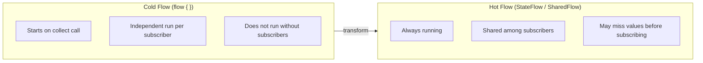

## Overall Analogy: Water Pipes and Faucets

`Flow` can be compared to a water pipe. Water doesn't flow through the pipe (Flow) until you turn on the faucet (`collect`); once you turn it on, data flows out one piece at a time.

| Plumbing Analogy | Kotlin Flow | Role |
|------------------|-------------|------|
| Water pipe | `Flow<T>` | Defines the data stream |
| Turning on the faucet | `collect { }` | Starts collection (Cold flow) |
| Filter / purifier | `filter`, `map`, `transform` | Transforms / filters data |
| Reservoir (always latest level) | `StateFlow` | Always holds the latest value (Hot) |
| Broadcast speaker | `SharedFlow` | Delivers to multiple subscribers simultaneously (Hot) |
| Anti-clogging valve | `buffer`, `conflate` | Controls backpressure |

---

> **Target Audience**: Developers who understand coroutine basics (launch/async/suspend)
> **Prerequisites**: Completion of [Coroutine Basics](../coroutines-basics/)
> **Estimated Time**: About 40–50 minutes
> **What You'll Learn**: You'll be able to create and collect Flows, combine operators, and use StateFlow/SharedFlow on Android or backend systems.


- `Flow<T>` is a Cold stream that emits values sequentially and asynchronously.
- A Flow runs only when `collect` is called.
- `StateFlow` is a Hot stream that always holds the latest value; `SharedFlow` is a Hot stream supporting multiple subscribers.
- Use `buffer` / `conflate` to manage producer–consumer speed differences.
- Use `catch` / `onCompletion` to handle exceptions and completion safely.


---

#### Why Do We Need Flow?

A `suspend` function returns a single value. But in real-world scenarios, you often need to receive **multiple values over time**.

- Processing DB query result rows one by one
- Receiving WebSocket messages in real time
- Continuously processing sensor data or event logs

`Flow<T>` is an asynchronous stream for these situations. It plays a similar role to RxJava's `Observable` or Reactor's `Flux`, but integrates naturally with Kotlin coroutines.

---

#### Defining and Collecting a Flow

**Basic builder: `flow { }`**

```kotlin
import kotlinx.coroutines.*
import kotlinx.coroutines.flow.*

fun numbersFlow(): Flow<Int> = flow {
    for (i in 1..5) {
        delay(100)     // Simulate async work
        emit(i)        // Emit value
    }
}

fun main() = runBlocking {
    numbersFlow().collect { value ->
        println("Received: $value")
    }
}
// Received: 1
// Received: 2
// ...
// Received: 5
```

`emit()` is a `suspend` function. It can only be called inside a `flow { }` block.

**Other builders:**

```kotlin
import kotlinx.coroutines.flow.*

// Fixed list of values
val fixed: Flow<Int> = flowOf(1, 2, 3, 4, 5)

// Convert a collection to a Flow
val fromList: Flow<String> = listOf("A", "B", "C").asFlow()

// Convert a range to a Flow
val range: Flow<Int> = (1..10).asFlow()
```

---

#### Cold Flow: collect is Key

Flow is a **Cold** stream. The flow block runs only when `collect` is called. Collecting twice runs the block twice.

```kotlin
import kotlinx.coroutines.*
import kotlinx.coroutines.flow.*

fun main() = runBlocking {
    val flow = flow {
        println("Flow block started")
        emit(1)
        emit(2)
    }

    println("First collect:")
    flow.collect { println(it) }

    println("Second collect:")
    flow.collect { println(it) }
}
// First collect:
// Flow block started
// 1
// 2
// Second collect:
// Flow block started
// 1
// 2
```

---

#### Key Operators

**map — Transform**

```kotlin
import kotlinx.coroutines.*
import kotlinx.coroutines.flow.*

fun main() = runBlocking {
    (1..5).asFlow()
        .map { it * it }           // Square
        .collect { print("$it ") }
    // 1 4 9 16 25
}
```

**filter — Filtering**

```kotlin
import kotlinx.coroutines.*
import kotlinx.coroutines.flow.*

fun main() = runBlocking {
    (1..10).asFlow()
        .filter { it % 2 == 0 }   // Even numbers only
        .collect { print("$it ") }
    // 2 4 6 8 10
}
```

**transform — Flexible Transformation**

`transform` is more flexible than `map`: it can emit multiple values or emit conditionally.

```kotlin
import kotlinx.coroutines.*
import kotlinx.coroutines.flow.*

fun main() = runBlocking {
    (1..3).asFlow()
        .transform { value ->
            emit("Request: $value")
            delay(100)
            emit("Response: ${value * 10}")
        }
        .collect { println(it) }
}
// Request: 1
// Response: 10
// Request: 2
// Response: 20
// Request: 3
// Response: 30
```

**take / drop — Limit Count**

```kotlin
import kotlinx.coroutines.*
import kotlinx.coroutines.flow.*

fun main() = runBlocking {
    (1..100).asFlow()
        .drop(3)      // Skip the first 3
        .take(5)      // Collect only 5
        .collect { print("$it ") }
    // 4 5 6 7 8
}
```

**flatMapConcat / flatMapMerge**

```kotlin
import kotlinx.coroutines.*
import kotlinx.coroutines.flow.*

fun requestFlow(id: Int): Flow<String> = flow {
    emit("Request $id started")
    delay(200)
    emit("Request $id completed")
}

fun main() = runBlocking {
    // flatMapConcat: order guaranteed (next starts after previous finishes)
    (1..3).asFlow()
        .flatMapConcat { requestFlow(it) }
        .collect { println(it) }
}
```

---

#### Terminal Operators

These operators start the Flow and collect values.

```kotlin
import kotlinx.coroutines.*
import kotlinx.coroutines.flow.*

fun main() = runBlocking {
    val flow = (1..5).asFlow()

    // collect: basic collection
    flow.collect { println(it) }

    // toList: convert to a list
    val list: List<Int> = flow.toList()

    // first: first value
    val first: Int = flow.first()

    // single: exactly one value (otherwise throws)
    val single: Int = flowOf(42).single()

    // reduce: accumulate
    val sum: Int = flow.reduce { acc, value -> acc + value }
    println("Sum: $sum")  // 15

    // fold: accumulate with an initial value
    val result: String = flow.fold("Values:") { acc, v -> "$acc $v" }
    println(result)  // Values: 1 2 3 4 5
}
```

---

#### Backpressure: buffer and conflate

When the producer (emit) is faster than the consumer (collect), these operators manage the speed difference.

**buffer — Buffering**

```kotlin
import kotlinx.coroutines.*
import kotlinx.coroutines.flow.*
import kotlin.system.measureTimeMillis

fun producer(): Flow<Int> = flow {
    for (i in 1..5) {
        delay(100)   // Produce: 100ms
        emit(i)
    }
}

fun main() = runBlocking {
    val timeWithoutBuffer = measureTimeMillis {
        producer().collect {
            delay(300)   // Consume: 300ms
        }
    }
    println("Without buffer: ${timeWithoutBuffer}ms")  // ~2000ms

    val timeWithBuffer = measureTimeMillis {
        producer()
            .buffer()    // Run producer in a separate coroutine
            .collect {
                delay(300)
            }
    }
    println("With buffer: ${timeWithBuffer}ms")    // ~1600ms
}
```

**conflate — Keep Only the Latest Value**

While the consumer is processing, incoming values are dropped and only the latest one is processed. Suitable for cases like UI updates where only the latest state matters.

```kotlin
import kotlinx.coroutines.*
import kotlinx.coroutines.flow.*

fun main() = runBlocking {
    (1..10).asFlow()
        .onEach { delay(100) }    // Produce every 100ms
        .conflate()               // Drop values that pile up during consumption
        .collect { value ->
            delay(300)            // Consume: 300ms
            println("Processed: $value")
        }
    // 1, 4, 7, 10 (intermediate values skipped)
}
```

---

#### Cold Flow vs Hot Flow



*Figure: Cold Flow vs Hot Flow comparison — Cold Flow runs independently per subscription, while Hot Flows (StateFlow/SharedFlow) are always running and share values across subscribers.*

---

#### StateFlow — Hot Stream that Holds State

`StateFlow` always holds the latest value (state). It runs even without subscribers. Commonly used for UI state management in Android ViewModel.

```kotlin
import kotlinx.coroutines.*
import kotlinx.coroutines.flow.*

fun main() = runBlocking {
    // MutableStateFlow: mutable value
    val stateFlow = MutableStateFlow(0)

    // Subscriber 1
    val job = launch {
        stateFlow.collect { value ->
            println("Subscriber received: $value")
        }
    }

    delay(100)
    stateFlow.value = 1
    delay(100)
    stateFlow.value = 2
    delay(100)
    stateFlow.value = 2  // Same value isn't re-emitted (deduplicated)
    delay(100)
    stateFlow.value = 3

    delay(100)
    job.cancel()
}
// Subscriber received: 0  (initial value)
// Subscriber received: 1
// Subscriber received: 2
// Subscriber received: 3  (2 is a duplicate and skipped)
```

**Key characteristics of StateFlow:**

- Initial value is required
- Same value emitted consecutively is not delivered to subscribers (based on equals)
- Current value can be read synchronously via `.value`

---

#### SharedFlow — Hot Stream for Multiple Subscribers

`SharedFlow` emits values to multiple subscribers simultaneously. Suitable for delivering **events**, like an event bus or chat messages.

```kotlin
import kotlinx.coroutines.*
import kotlinx.coroutines.flow.*

fun main() = runBlocking {
    val sharedFlow = MutableSharedFlow<String>()

    // Two subscribers subscribe at the same time
    val job1 = launch {
        sharedFlow.collect { println("Subscriber A: $it") }
    }
    val job2 = launch {
        sharedFlow.collect { println("Subscriber B: $it") }
    }

    delay(100)
    sharedFlow.emit("First event")
    delay(100)
    sharedFlow.emit("Second event")
    delay(100)

    job1.cancel()
    job2.cancel()
}
// Subscriber A: First event
// Subscriber B: First event
// Subscriber A: Second event
// Subscriber B: Second event
```

**The replay parameter:**

```kotlin
// Replay the 3 most recent events to new subscribers
val replayFlow = MutableSharedFlow<Int>(replay = 3)
```

---

#### StateFlow vs SharedFlow Comparison

| Property | `StateFlow` | `SharedFlow` |
|----------|-------------|--------------|
| Initial value | Required | None |
| Current value | Synchronous access via `.value` | None |
| Duplicate emissions | Same value ignored | Always emitted |
| Default replay | 1 (always the latest one) | 0 (configurable) |
| Primary use | UI state, single value | Events, multiple values |

---

#### Exception Handling: catch and onCompletion

**catch — Catch Upstream Exceptions**

```kotlin
import kotlinx.coroutines.*
import kotlinx.coroutines.flow.*

fun riskyFlow(): Flow<Int> = flow {
    emit(1)
    emit(2)
    throw RuntimeException("Stream error!")
    emit(3)  // Unreachable
}

fun main() = runBlocking {
    riskyFlow()
        .catch { e ->
            println("Exception handled: ${e.message}")
            emit(-1)  // Emit a fallback value
        }
        .collect { println("Received: $it") }
}
// Received: 1
// Received: 2
// Exception handled: Stream error!
// Received: -1
```


`catch` only catches **upstream** exceptions. It does not catch exceptions thrown inside the `collect { }` block. To handle downstream exceptions, use one of the following two approaches:

1. Wrap the collect lambda body directly with `try-catch`, like `collect { try { ... } catch (e: Exception) { ... } }`.
2. Move the receiving logic to an upstream operator such as `onEach { ... }`, then chain it as `.catch { ... }.collect()`. In this case, exceptions inside `onEach` become upstream exceptions and can be caught by `catch`.


**onCompletion — Handle Completion/Cancellation/Exception**

```kotlin
import kotlinx.coroutines.*
import kotlinx.coroutines.flow.*

fun main() = runBlocking {
    (1..3).asFlow()
        .onCompletion { cause ->
            if (cause != null) println("Abnormal termination: $cause")
            else println("Completed normally")
        }
        .collect { println("Received: $it") }
}
// Received: 1
// Received: 2
// Received: 3
// Completed normally
```

**onEach — Side Effects per Value**

```kotlin
import kotlinx.coroutines.*
import kotlinx.coroutines.flow.*

fun main() = runBlocking {
    (1..3).asFlow()
        .onEach { println("Pre-emit log: $it") }
        .map { it * 2 }
        .collect { println("Received: $it") }
}
```

---

#### Real-World Example: Search Autocomplete Flow

```kotlin
import kotlinx.coroutines.*
import kotlinx.coroutines.flow.*

// Pattern that takes user input and runs a search
fun searchQuery(queries: Flow<String>): Flow<List<String>> = queries
    .debounce(300)           // Wait 300ms of no input before firing (avoids requests while typing)
    .distinctUntilChanged()  // Ignore consecutive identical queries
    .filter { it.isNotBlank() }
    .flatMapLatest { query ->  // Cancel the previous search when a new query arrives
        flow {
            emit(performSearch(query))
        }
    }
    .catch { e ->
        println("Search error: ${e.message}")
        emit(emptyList())
    }

suspend fun performSearch(query: String): List<String> {
    delay(200)  // Simulate network request
    return listOf("$query result1", "$query result2")
}

fun main() = runBlocking {
    val queryFlow = flow {
        emit("k")
        delay(100)
        emit("ko")
        delay(100)
        emit("kot")
        delay(400)   // Search runs only after more than 300ms passes
        emit("kotlin")
        delay(500)
    }

    searchQuery(queryFlow).collect { results ->
        println("Results: $results")
    }
}
```

---

#### Key Points


- `Flow<T>` is a Cold stream: it only runs when `collect` is called.
- Use the three main builders `flowOf`, `asFlow`, `flow { }` depending on the situation.
- Use `map`/`filter`/`transform` to transform data, and `buffer`/`conflate` to manage speed differences.
- `StateFlow` is suitable for state holding (initial value required); `SharedFlow` is suitable for event delivery (multiple subscribers).
- `catch` only catches upstream exceptions; use `onCompletion` to handle completion/cancellation.


---

#### Next Steps

- [Coroutines Advanced](../coroutines-advanced/) — Deep dive into Channel, SupervisorJob, CoroutineContext
- [Coroutine Debugging](../../howto/coroutine-debugging/) — Debugging Flow and diagnosing leaks
- [Performance Profiling](../../howto/performance-profiling/) — Choosing Flow operators and measuring performance
