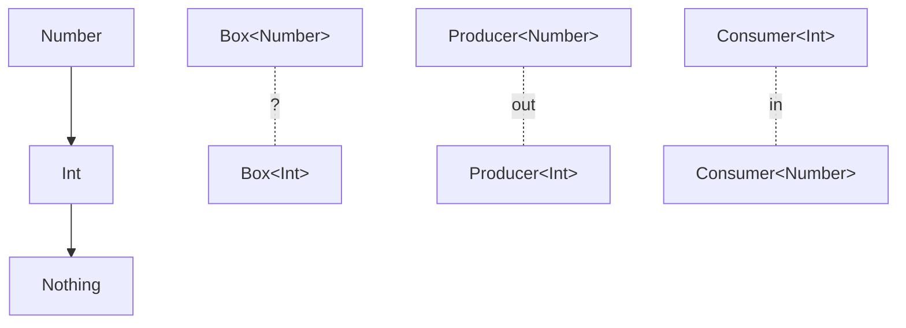

## Overall Analogy: Dedicated Boxes and Sorting Rules

Generics are easy to understand by analogy to **dedicated boxes by purpose**.

| Box Analogy | Kotlin Concept | Role |
|-------------|----------------|------|
| Fruit-only box | `Box<Fruit>` | Container holding only a specific type |
| "Apples are OK in the fruit box" rule | Covariance (`out`) | Allows substitution with a subtype |
| "Must accept any fruit" rule | Contravariance (`in`) | Allows substitution with a supertype |
| "Any fruit is fine" | Star projection (`*`) | Type unspecified, read-only |
| "At least it must be fruit" rule | Type bound (`<T : Fruit>`) | Restricts the allowed type range |

---

> **Target Audience**: Developers familiar with Kotlin basic syntax
> **Prerequisites**: Classes, interfaces, basic inheritance
> **Estimated Time**: About 35 minutes
> **What You'll Learn**: You'll be able to write generic classes and functions yourself, and understand `in`/`out` variance to use collection APIs correctly.


- `class Box<T>` — Defines a reusable container with a type parameter
- `<T : Comparable<T>>` — Restricts T with a type bound
- `out T` — Covariant (read-only, can be assigned to a supertype variable)
- `in T` — Contravariant (write-only, can be assigned to a subtype variable)
- `*` — Star projection (safe read when the type is unknown)


#### Why Do We Need Generics?

Writing the same structural class repeatedly for each type is inefficient.

```kotlin
// Without generics — a class per type
class IntBox(val value: Int)
class StringBox(val value: String)

// With generics — solved with one
class Box<T>(val value: T)

val intBox = Box(42)
val stringBox = Box("hello")
```

#### Generic Classes

Declare a type parameter by adding `<T>` after the class name. `T` is conventional; you can also use a meaningful name.

```kotlin
class Stack<T> {
    private val elements = mutableListOf<T>()

    fun push(element: T) {
        elements.add(element)
    }

    fun pop(): T? {
        return if (elements.isEmpty()) null
        else elements.removeLast()
    }

    fun peek(): T? = elements.lastOrNull()

    val size: Int get() = elements.size
    val isEmpty: Boolean get() = elements.isEmpty()
}

// Usage
val stack = Stack<Int>()
stack.push(1)
stack.push(2)
stack.push(3)
println(stack.pop())    // 3
println(stack.peek())   // 2
```

#### Generic Functions

Declare a generic function by adding `<T>` before the function name.

```kotlin
// Generic function
fun <T> singletonList(element: T): List<T> = listOf(element)

fun <T> swap(list: MutableList<T>, i: Int, j: Int) {
    val temp = list[i]
    list[i] = list[j]
    list[j] = temp
}

// Type inference — no need to specify
val list = singletonList(1)         // List<Int>
val strList = singletonList("hi")   // List<String>

// Multiple type parameters
fun <K, V> mapOf(key: K, value: V): Map<K, V> = kotlin.collections.mapOf(key to value)
```

#### Type Bounds

`<T : SuperType>` restricts the range of T. This declaration means "T must be a subtype of SuperType".

```kotlin
// Only types that implement Comparable are allowed
fun <T : Comparable<T>> max(a: T, b: T): T {
    return if (a > b) a else b
}

println(max(3, 5))          // 5
println(max("apple", "banana"))  // banana
// max(listOf(1), listOf(2))  // Compile error — List does not implement Comparable

// Multiple constraints — using the where keyword
fun <T> copyIfBothValid(source: T, dest: T): Boolean
        where T : Cloneable, T : Comparable<T> {
    return source <= dest
}

// Access members via supertype constraint
abstract class Animal(val name: String)
class Dog(name: String) : Animal(name)

fun <T : Animal> greet(animal: T): String {
    return "Hello, ${animal.name}!"   // Can access Animal's name
}
```

#### Variance: in and out

Variance determines **how the subtype/supertype relationship of type parameters propagates to the generic type**.



*Figure: Comparison of generic variance — shows how invariant Box, covariant Producer (out), and contravariant Consumer (in) propagate type inheritance, using the Number-Int hierarchy.*

**Default: Invariant**

Without any annotation, it's invariant. `Box<Int>` and `Box<Number>` are not assignable to each other.

```kotlin
class Box<T>(var value: T)

val intBox: Box<Int> = Box(1)
// val numBox: Box<Number> = intBox  // Compile error
```

**Covariance (out) — Read-Only Producer**

`out T` means "T is only produced (returned) and never consumed (as a parameter)". You can assign `Producer<Int>` to a `Producer<Number>` variable.

```kotlin
// out T — T can only be returned
interface Producer<out T> {
    fun produce(): T
}

class IntProducer : Producer<Int> {
    override fun produce(): Int = 42
}

// Possible thanks to covariance
val producer: Producer<Number> = IntProducer()
println(producer.produce())   // 42

// Kotlin List is declared as out T
val ints: List<Int> = listOf(1, 2, 3)
val numbers: List<Number> = ints   // OK!
```

**Contravariance (in) — Write-Only Consumer**

`in T` means "T can only be consumed (as a parameter) and never produced (returned)". You can assign `Consumer<Number>` to a `Consumer<Int>` variable.

```kotlin
// in T — T can only appear as a parameter
interface Consumer<in T> {
    fun consume(item: T)
}

class NumberConsumer : Consumer<Number> {
    override fun consume(item: Number) {
        println("Consumed: $item")
    }
}

// Possible thanks to contravariance
val consumer: Consumer<Int> = NumberConsumer()
consumer.consume(42)    // OK

// Kotlin Comparator is declared as in T
val numberComp: Comparator<Number> = compareBy { it.toDouble() }
val intComp: Comparator<Int> = numberComp   // OK!
```

#### Use-Site Variance

Placing variance on a class declaration is **declaration-site variance**; specifying variance at the usage point is **use-site variance**.

```kotlin
// MutableList is invariant — cannot use in/out at the declaration site
// But variance can be specified at the use site

fun copyFrom(source: MutableList<out Number>, dest: MutableList<Number>) {
    dest.addAll(source)   // Only reading from source — OK with MutableList<Int> thanks to out
}

fun addNumbers(list: MutableList<in Int>) {
    list.add(1)
    list.add(2)           // Only writing to list — OK with MutableList<Number> thanks to in
}
```

#### Star Projection (*)

Use `*` when you don't know or don't care about the type parameter. It behaves like `out Any?`, allowing reads but not writes.

```kotlin
fun printAll(list: List<*>) {
    for (element in list) {
        println(element)    // Read as Any? type
    }
}

printAll(listOf(1, 2, 3))
printAll(listOf("a", "b"))

// Used together with type checks
fun processAnything(container: Box<*>) {
    val value = container.value   // Any? type
    if (value is String) {
        println(value.uppercase())
    }
}
```

#### Practical Pattern: Generic Repository

```kotlin
// Generic repository interface
interface Repository<T, ID> {
    fun findById(id: ID): T?
    fun findAll(): List<T>
    fun save(entity: T): T
    fun delete(id: ID)
}

data class User(val id: Long, val name: String)
data class Product(val id: Long, val name: String, val price: Long)

// Implementation — a separate repository per entity
class UserRepository : Repository<User, Long> {
    private val store = mutableMapOf<Long, User>()

    override fun findById(id: Long): User? = store[id]
    override fun findAll(): List<User> = store.values.toList()
    override fun save(entity: User) = entity.also { store[it.id] = it }
    override fun delete(id: Long) { store.remove(id) }
}

// Generic service — using type bounds
abstract class CrudService<T, ID>(private val repository: Repository<T, ID>) {
    fun getOrThrow(id: ID): T {
        return repository.findById(id)
            ?: throw NoSuchElementException("No item for ID $id")
    }

    fun saveAll(entities: List<T>): List<T> {
        return entities.map { repository.save(it) }
    }
}
```


Using `reified T` in an `inline` function lets you access the actual runtime type information of T. `filterIsInstance<String>()` is a representative example. For details, see the [Inline/Reified](inline-reified/) document.



- Declaration `<T>` makes classes and functions reusable
- `<T : SuperType>` restricts the range of allowed types
- `out T` — covariant, producer, read-only like List
- `in T` — contravariant, consumer, write-only like Comparator
- `*` — star projection, safe read when the type is unknown


#### Next Steps

- [Delegation](delegation/) — Delegation pattern using the `by` keyword
- [Inline/Reified](inline-reified/) — Generics and `reified` type parameters
